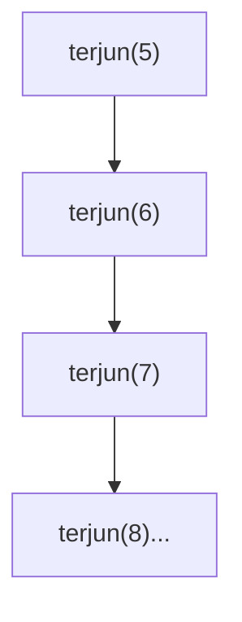
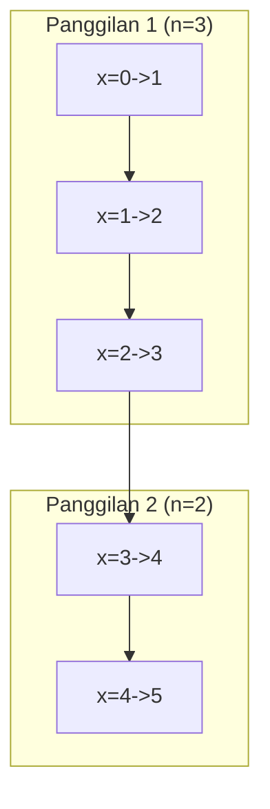
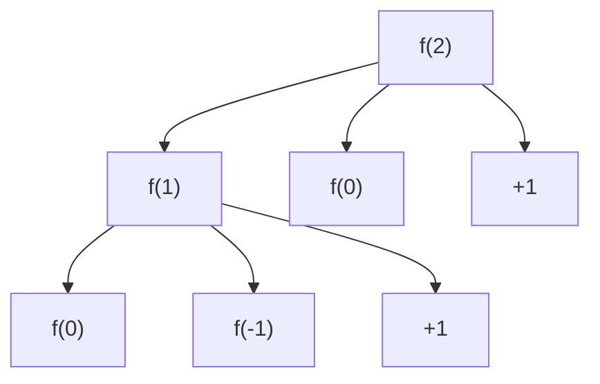
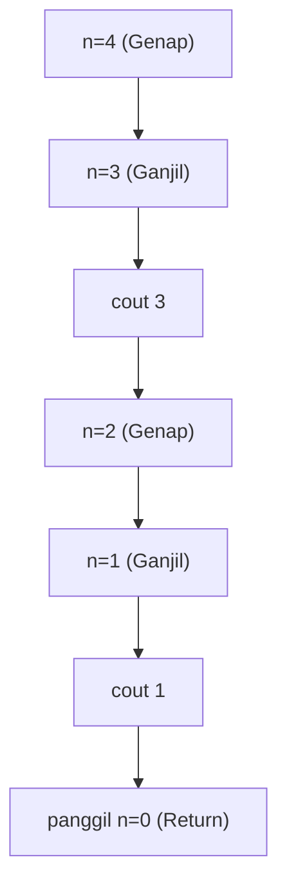
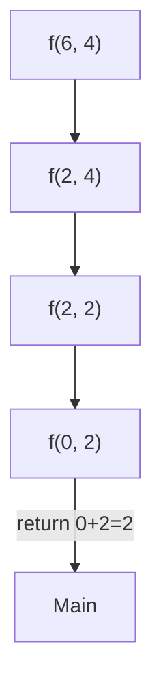

		🔙 **[Kembali ke Daftar Soal](./README.md)**

---

# Latihan Soal Part C - Modul 05 - Set 05 (Premium Edition)

---

### Soal 41: ⚠️ Bahaya Laten (Infinite Recursion)
```cpp
int terjun(int n) {
    if (n == 0) return 0;
    return n + terjun(n + 1); // Perhatikan tanda +
}

int main() {
    terjun(5);
}
```
**Pertanyaan:**
1. Apa yang akan terjadi jika program ini dijalankan?
2. Mengapa Base Case `n == 0` tidak pernah tersentuh?

<details>
<summary><b>Klik untuk Lihat Jawaban & Diagnosis</b></summary>

**Mermaid Trace (The Upwards Spiral):**


**Jawaban:**
1. **Stack Overflow / Crash.**
2. Karena `n` dimulai dari 5 dan terus bertambah (`n + 1`). Nilai `n` akan menjauh dari 0 dan tidak akan pernah menjadi 0 untuk mengaktifkan Base Case.
</details>

---

### Soal 42: Pintu Tak Berhenti
```cpp
void halo() {
    halo();
}

int main() {
    halo();
}
```
**Pertanyaan:**
1. Apa kesalahan fatal dari fungsi `halo`?
2. Secara teknis, apa yang habis di memori komputer sehingga program ini crash?

<details>
<summary><b>Klik untuk Lihat Jawaban & Diagnosis</b></summary>

**Jawaban:**
1. **Tidak memiliki Base Case.**
2. **Stack Memory.** Setiap panggilan fungsi memakan ruang di stack. Karena tidak pernah berhenti, stack akan penuh.
</details>

---

### Soal 43: ⚠️ Static dalam Rekursi (The Trap)
```cpp
int hitung(int n) {
    static int x = 0;
    if (n == 0) return x;
    x++;
    return hitung(n - 1);
}

int main() {
    hitung(3);
    int hasil = hitung(2);
}
```
**Pertanyaan:**
1. Berapakah nilai `hasil`?
2. Mengapa nilainya bukan 2?

<details>
<summary><b>Klik untuk Lihat Jawaban & Diagnosis</b></summary>

**Mermaid Trace:**


**Jawaban:**
1. **5**
2. Karena variabel `x` dideklarasikan sebagai `static`. Sifat `static` adalah tidak dihancurkan saat fungsi selesai. Jadi, nilai `x` dari panggilan `hitung(3)` terbawa ke panggilan `hitung(2)`.
</details>

---

### Soal 44: Referensi Rekursif (Reference Trap)
```cpp
void ganti(int &n) {
    if (n <= 0) return;
    n--;
    ganti(n);
}

int main() {
    int angka = 5;
    ganti(angka);
}
```
**Pertanyaan:**
1. Berapakah nilai `angka` di akhir `main`?
2. Apa perbedaan jika parameter `n` tidak menggunakan simbol `&`?

<details>
<summary><b>Klik untuk Lihat Jawaban & Diagnosis</b></summary>

**Jawaban:**
1. **0**
2. Jika tidak pakai `&` (Pass-by-value), maka `angka` di `main` tetap 5, karena fungsi hanya merubah salinan lokalnya sendiri di stack.
</details>

---

### Soal 45: ⚠️ Shortcut Logic (Boolean Recursion)
```cpp
bool cek(int n) {
    if (n == 1) return true;
    if (n % 2 == 0) return cek(n / 2);
    return false;
}

int main() {
    bool r1 = cek(8);
    bool r2 = cek(6);
}
```
**Pertanyaan:**
1. Berapakah nilai `r1`?
2. Berapakah nilai `r2`?
3. Apa tujuan fungsi `cek` sebenarnya?

<details>
<summary><b>Klik untuk Lihat Jawaban & Diagnosis</b></summary>

**Jawaban:**
1. **true** (8 -> 4 -> 2 -> 1)
2. **false** (6 -> 3 -> False)
3. Mengecek apakah sebuah bilangan adalah **pangkat dari 2** ($2^n$).
</details>

---

### Soal 46: Double Nested (Deep Trace)
```cpp
int f(int n) {
    if (n <= 0) return 0;
    return f(n - 1) + f(n - 2) + 1;
}

int main() {
    int x = f(2);
}
```
**Pertanyaan:**
1. Berapakah nilai `x`?
2. Berapa jumlah total simpul (node) jika dibuat pohon rekursinya?

<details>
<summary><b>Klik untuk Lihat Jawaban & Diagnosis</b></summary>

**Mermaid Tree:**


**Jawaban:**
1. **3**
   - f(2) = f(1) + f(0) + 1
   - f(1) = f(0) + f(-1) + 1 = 0 + 0 + 1 = 1
   - f(2) = 1 + 0 + 1 = 2 (Tunggu, mari kita hitung ulang: f(1)=1, f(0)=0. f(2) = 1 + 0 + 1 = 2).
   **Koreksi**: f(2) = 2.
2. **5 simpul f** (f(2), f(1), f(0), f(0), f(-1)).
</details>

---

### Soal 47: ⚠️ Parameter Bayangan (Shadowing)
```cpp
int x = 10;
void gila(int x) {
    if (x <= 0) return;
    x--;
    gila(x);
}

int main() {
    gila(5);
}
```
**Pertanyaan:**
1. Berapakah nilai `x` global di akhir?
2. Apakah fungsi `gila` merubah variabel `x` yang bernilai 10?

<details>
<summary><b>Klik untuk Lihat Jawaban & Diagnosis</b></summary>

**Jawaban:**
1. **10**
2. **Tidak.** Karena fungsi memiliki parameter bernama `x`, maka di dalam fungsi tersebut, `x` merujuk pada parameter lokal, bukan variabel global (variable shadowing).
</details>

---

### Soal 48: Return Tersembunyi (Void Logic)
```cpp
void rahasia(int n) {
    if (n == 0) return;
    if (n % 2 == 0) {
        rahasia(n - 1);
        return;
    }
    cout << n;
    rahasia(n - 1);
}

int main() {
    rahasia(4);
}
```
**Pertanyaan:**
1. Apa output program tersebut?
2. Apa yang terjadi saat `n = 4`?

<details>
<summary><b>Klik untuk Lihat Jawaban & Diagnosis</b></summary>

**Mermaid Trace:**


**Jawaban:**
1. **31**
2. Fungsi memanggil `rahasia(3)` lalu **langsung return** (selesai), sehingga baris `cout << n` di level n=4 tidak pernah dieksekusi.
</details>

---

### Soal 49: Stack Depth vs Iteration
```cpp
int loop(int n) {
    int res = 1;
    for(int i=1; i<=n; i++) res *= i;
    return res;
}

int rec(int n) {
    if (n <= 1) return 1;
    return n * rec(n - 1);
}
```
**Pertanyaan:**
1. Jika `n = 1.000.000`, fungsi mana yang lebih mungkin menyebabkan program error?
2. Apa nama error tersebut?

<details>
<summary><b>Klik untuk Lihat Jawaban & Diagnosis</b></summary>

**Jawaban:**
1. **Fungsi `rec` (Rekursif).**
2. **Stack Overflow.** Karena rekursi sejuta kali akan memakan memori stack yang sangat besar, sedangkan loop hanya menggunakan memori yang tetap (*constant space*).
</details>

---

### Soal 50: Grand Finale (Complex Mix)
```cpp
int f(int a, int b) {
    if (a <= 0 || b <= 0) return a + b;
    if (a > b) return f(a - b, b);
    return f(a, b - a);
}

int main() {
    int res = f(6, 4);
}
```
**Pertanyaan:**
1. Berapakah nilai `res`?
2. Berapa kali fungsi `f` dipanggil secara total?

<details>
<summary><b>Klik untuk Lihat Jawaban & Diagnosis</b></summary>

**Mermaid Trace:**


**Jawaban:**
1. **2**
2. **4 kali** (6,4 -> 2,4 -> 2,2 -> 0,2).
</details>
