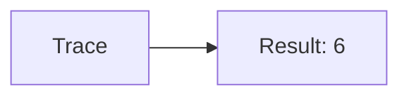
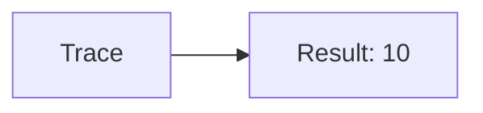
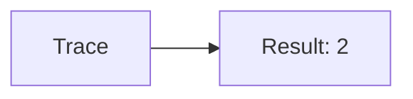

🔙 **[Kembali ke Daftar Soal](./README.md)**

---

# Latihan Soal Part C - Modul 05 - Set 06

### Soal 126
```cpp
// Queue: Deret
int s(int n) {
  if(n==0) return 0;
  return n + s(n-1);
}
// s(3);
```
**Pertanyaan:**
1. Berapakah hasil akhirnya?
2. Deskripsikan alur pikir 'Compiler Manusia' untuk soal ini!

**Jawaban & Diagnosis:**
1. **6**
2. Jumlah deret 1 s/d 3 adalah 6.

**Mermaid Flowchart:**


---
### Soal 127
```cpp
// Stack: Faktorial
int f(int n) {
  if(n<=1) return 1;
  return n * f(n-1);
}
// f(4);
```
**Pertanyaan:**
1. Berapakah hasil akhirnya?
2. Deskripsikan alur pikir 'Compiler Manusia' untuk soal ini!

**Jawaban & Diagnosis:**
1. **24**
2. Faktorial dari 4 adalah 24.

**Mermaid Flowchart:**


---
### Soal 128
```cpp
// Heap: Deret
int s(int n) {
  if(n==0) return 0;
  return n + s(n-1);
}
// s(3);
```
**Pertanyaan:**
1. Berapakah hasil akhirnya?
2. Deskripsikan alur pikir 'Compiler Manusia' untuk soal ini!

**Jawaban & Diagnosis:**
1. **6**
2. Jumlah deret 1 s/d 3 adalah 6.

**Mermaid Flowchart:**


---
### Soal 129
```cpp
// Hash: Faktorial
int f(int n) {
  if(n<=1) return 1;
  return n * f(n-1);
}
// f(3);
```
**Pertanyaan:**
1. Berapakah hasil akhirnya?
2. Deskripsikan alur pikir 'Compiler Manusia' untuk soal ini!

**Jawaban & Diagnosis:**
1. **6**
2. Faktorial dari 3 adalah 6.

**Mermaid Flowchart:**


---
### Soal 130
```cpp
// Bitset: Deret
int s(int n) {
  if(n==0) return 0;
  return n + s(n-1);
}
// s(3);
```
**Pertanyaan:**
1. Berapakah hasil akhirnya?
2. Deskripsikan alur pikir 'Compiler Manusia' untuk soal ini!

**Jawaban & Diagnosis:**
1. **6**
2. Jumlah deret 1 s/d 3 adalah 6.

**Mermaid Flowchart:**


---
### Soal 131
```cpp
// Vector: Faktorial
int f(int n) {
  if(n<=1) return 1;
  return n * f(n-1);
}
// f(4);
```
**Pertanyaan:**
1. Berapakah hasil akhirnya?
2. Deskripsikan alur pikir 'Compiler Manusia' untuk soal ini!

**Jawaban & Diagnosis:**
1. **24**
2. Faktorial dari 4 adalah 24.

**Mermaid Flowchart:**


---
### Soal 132
```cpp
// String: Deret
int s(int n) {
  if(n==0) return 0;
  return n + s(n-1);
}
// s(3);
```
**Pertanyaan:**
1. Berapakah hasil akhirnya?
2. Deskripsikan alur pikir 'Compiler Manusia' untuk soal ini!

**Jawaban & Diagnosis:**
1. **6**
2. Jumlah deret 1 s/d 3 adalah 6.

**Mermaid Flowchart:**


---
### Soal 133
```cpp
// Char: Faktorial
int f(int n) {
  if(n<=1) return 1;
  return n * f(n-1);
}
// f(4);
```
**Pertanyaan:**
1. Berapakah hasil akhirnya?
2. Deskripsikan alur pikir 'Compiler Manusia' untuk soal ini!

**Jawaban & Diagnosis:**
1. **24**
2. Faktorial dari 4 adalah 24.

**Mermaid Flowchart:**


---
### Soal 134
```cpp
// Int: Deret
int s(int n) {
  if(n==0) return 0;
  return n + s(n-1);
}
// s(4);
```
**Pertanyaan:**
1. Berapakah hasil akhirnya?
2. Deskripsikan alur pikir 'Compiler Manusia' untuk soal ini!

**Jawaban & Diagnosis:**
1. **10**
2. Jumlah deret 1 s/d 4 adalah 10.

**Mermaid Flowchart:**


---
### Soal 135
```cpp
// Double: Faktorial
int f(int n) {
  if(n<=1) return 1;
  return n * f(n-1);
}
// f(3);
```
**Pertanyaan:**
1. Berapakah hasil akhirnya?
2. Deskripsikan alur pikir 'Compiler Manusia' untuk soal ini!

**Jawaban & Diagnosis:**
1. **6**
2. Faktorial dari 3 adalah 6.

**Mermaid Flowchart:**


---
### Soal 136
```cpp
// Float: Deret
int s(int n) {
  if(n==0) return 0;
  return n + s(n-1);
}
// s(4);
```
**Pertanyaan:**
1. Berapakah hasil akhirnya?
2. Deskripsikan alur pikir 'Compiler Manusia' untuk soal ini!

**Jawaban & Diagnosis:**
1. **10**
2. Jumlah deret 1 s/d 4 adalah 10.

**Mermaid Flowchart:**


---
### Soal 137
```cpp
// Long: Faktorial
int f(int n) {
  if(n<=1) return 1;
  return n * f(n-1);
}
// f(2);
```
**Pertanyaan:**
1. Berapakah hasil akhirnya?
2. Deskripsikan alur pikir 'Compiler Manusia' untuk soal ini!

**Jawaban & Diagnosis:**
1. **2**
2. Faktorial dari 2 adalah 2.

**Mermaid Flowchart:**


---
### Soal 138
```cpp
// Short: Deret
int s(int n) {
  if(n==0) return 0;
  return n + s(n-1);
}
// s(3);
```
**Pertanyaan:**
1. Berapakah hasil akhirnya?
2. Deskripsikan alur pikir 'Compiler Manusia' untuk soal ini!

**Jawaban & Diagnosis:**
1. **6**
2. Jumlah deret 1 s/d 3 adalah 6.

**Mermaid Flowchart:**


---
### Soal 139
```cpp
// Byte: Faktorial
int f(int n) {
  if(n<=1) return 1;
  return n * f(n-1);
}
// f(4);
```
**Pertanyaan:**
1. Berapakah hasil akhirnya?
2. Deskripsikan alur pikir 'Compiler Manusia' untuk soal ini!

**Jawaban & Diagnosis:**
1. **24**
2. Faktorial dari 4 adalah 24.

**Mermaid Flowchart:**


---
### Soal 140
```cpp
// Bool: Deret
int s(int n) {
  if(n==0) return 0;
  return n + s(n-1);
}
// s(3);
```
**Pertanyaan:**
1. Berapakah hasil akhirnya?
2. Deskripsikan alur pikir 'Compiler Manusia' untuk soal ini!

**Jawaban & Diagnosis:**
1. **6**
2. Jumlah deret 1 s/d 3 adalah 6.

**Mermaid Flowchart:**


---
### Soal 141
```cpp
// Void: Faktorial
int f(int n) {
  if(n<=1) return 1;
  return n * f(n-1);
}
// f(2);
```
**Pertanyaan:**
1. Berapakah hasil akhirnya?
2. Deskripsikan alur pikir 'Compiler Manusia' untuk soal ini!

**Jawaban & Diagnosis:**
1. **2**
2. Faktorial dari 2 adalah 2.

**Mermaid Flowchart:**


---
### Soal 142
```cpp
// Const: Deret
int s(int n) {
  if(n==0) return 0;
  return n + s(n-1);
}
// s(2);
```
**Pertanyaan:**
1. Berapakah hasil akhirnya?
2. Deskripsikan alur pikir 'Compiler Manusia' untuk soal ini!

**Jawaban & Diagnosis:**
1. **3**
2. Jumlah deret 1 s/d 2 adalah 3.

**Mermaid Flowchart:**


---
### Soal 143
```cpp
// Static: Faktorial
int f(int n) {
  if(n<=1) return 1;
  return n * f(n-1);
}
// f(3);
```
**Pertanyaan:**
1. Berapakah hasil akhirnya?
2. Deskripsikan alur pikir 'Compiler Manusia' untuk soal ini!

**Jawaban & Diagnosis:**
1. **6**
2. Faktorial dari 3 adalah 6.

**Mermaid Flowchart:**


---
### Soal 144
```cpp
// Extern: Deret
int s(int n) {
  if(n==0) return 0;
  return n + s(n-1);
}
// s(3);
```
**Pertanyaan:**
1. Berapakah hasil akhirnya?
2. Deskripsikan alur pikir 'Compiler Manusia' untuk soal ini!

**Jawaban & Diagnosis:**
1. **6**
2. Jumlah deret 1 s/d 3 adalah 6.

**Mermaid Flowchart:**


---
### Soal 145
```cpp
// Register: Faktorial
int f(int n) {
  if(n<=1) return 1;
  return n * f(n-1);
}
// f(2);
```
**Pertanyaan:**
1. Berapakah hasil akhirnya?
2. Deskripsikan alur pikir 'Compiler Manusia' untuk soal ini!

**Jawaban & Diagnosis:**
1. **2**
2. Faktorial dari 2 adalah 2.

**Mermaid Flowchart:**


---
### Soal 146
```cpp
// Volatile: Deret
int s(int n) {
  if(n==0) return 0;
  return n + s(n-1);
}
// s(4);
```
**Pertanyaan:**
1. Berapakah hasil akhirnya?
2. Deskripsikan alur pikir 'Compiler Manusia' untuk soal ini!

**Jawaban & Diagnosis:**
1. **10**
2. Jumlah deret 1 s/d 4 adalah 10.

**Mermaid Flowchart:**
```mermaid
graph LR
A[Trace] --> B[Result: 10]
```

---
### Soal 147
```cpp
// Mutable: Faktorial
int f(int n) {
  if(n<=1) return 1;
  return n * f(n-1);
}
// f(2);
```
**Pertanyaan:**
1. Berapakah hasil akhirnya?
2. Deskripsikan alur pikir 'Compiler Manusia' untuk soal ini!

**Jawaban & Diagnosis:**
1. **2**
2. Faktorial dari 2 adalah 2.

**Mermaid Flowchart:**
```mermaid
graph LR
A[Trace] --> B[Result: 2]
```

---
### Soal 148
```cpp
// Thread: Deret
int s(int n) {
  if(n==0) return 0;
  return n + s(n-1);
}
// s(2);
```
**Pertanyaan:**
1. Berapakah hasil akhirnya?
2. Deskripsikan alur pikir 'Compiler Manusia' untuk soal ini!

**Jawaban & Diagnosis:**
1. **3**
2. Jumlah deret 1 s/d 2 adalah 3.

**Mermaid Flowchart:**
```mermaid
graph LR
A[Trace] --> B[Result: 3]
```

---
### Soal 149
```cpp
// Mutex: Faktorial
int f(int n) {
  if(n<=1) return 1;
  return n * f(n-1);
}
// f(4);
```
**Pertanyaan:**
1. Berapakah hasil akhirnya?
2. Deskripsikan alur pikir 'Compiler Manusia' untuk soal ini!

**Jawaban & Diagnosis:**
1. **24**
2. Faktorial dari 4 adalah 24.

**Mermaid Flowchart:**
```mermaid
graph LR
A[Trace] --> B[Result: 24]
```

---
### Soal 150
```cpp
// Lock: Deret
int s(int n) {
  if(n==0) return 0;
  return n + s(n-1);
}
// s(3);
```
**Pertanyaan:**
1. Berapakah hasil akhirnya?
2. Deskripsikan alur pikir 'Compiler Manusia' untuk soal ini!

**Jawaban & Diagnosis:**
1. **6**
2. Jumlah deret 1 s/d 3 adalah 6.

**Mermaid Flowchart:**
```mermaid
graph LR
A[Trace] --> B[Result: 6]
```

---
