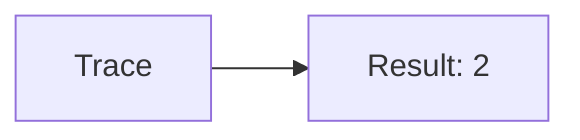
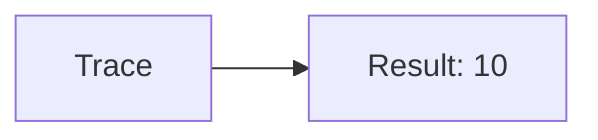
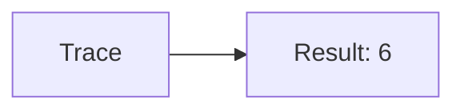

🔙 **[Kembali ke Daftar Soal](./README.md)**

---

# Latihan Soal Part C - Modul 05 - Set 07

### Soal 151
```cpp
// Sync: Faktorial
int f(int n) {
  if(n<=1) return 1;
  return n * f(n-1);
}
// f(4);
```
**Pertanyaan:**
1. Berapakah hasil akhirnya?
2. Deskripsikan alur pikir 'Compiler Manusia' untuk soal ini!

**Jawaban & Diagnosis:**
1. **24**
2. Faktorial dari 4 adalah 24.

**Mermaid Flowchart:**


---
### Soal 152
```cpp
// Wait: Deret
int s(int n) {
  if(n==0) return 0;
  return n + s(n-1);
}
// s(2);
```
**Pertanyaan:**
1. Berapakah hasil akhirnya?
2. Deskripsikan alur pikir 'Compiler Manusia' untuk soal ini!

**Jawaban & Diagnosis:**
1. **3**
2. Jumlah deret 1 s/d 2 adalah 3.

**Mermaid Flowchart:**


---
### Soal 153
```cpp
// Signal: Faktorial
int f(int n) {
  if(n<=1) return 1;
  return n * f(n-1);
}
// f(2);
```
**Pertanyaan:**
1. Berapakah hasil akhirnya?
2. Deskripsikan alur pikir 'Compiler Manusia' untuk soal ini!

**Jawaban & Diagnosis:**
1. **2**
2. Faktorial dari 2 adalah 2.

**Mermaid Flowchart:**


---
### Soal 154
```cpp
// Event: Deret
int s(int n) {
  if(n==0) return 0;
  return n + s(n-1);
}
// s(4);
```
**Pertanyaan:**
1. Berapakah hasil akhirnya?
2. Deskripsikan alur pikir 'Compiler Manusia' untuk soal ini!

**Jawaban & Diagnosis:**
1. **10**
2. Jumlah deret 1 s/d 4 adalah 10.

**Mermaid Flowchart:**


---
### Soal 155
```cpp
// Timer: Faktorial
int f(int n) {
  if(n<=1) return 1;
  return n * f(n-1);
}
// f(3);
```
**Pertanyaan:**
1. Berapakah hasil akhirnya?
2. Deskripsikan alur pikir 'Compiler Manusia' untuk soal ini!

**Jawaban & Diagnosis:**
1. **6**
2. Faktorial dari 3 adalah 6.

**Mermaid Flowchart:**


---
### Soal 156
```cpp
// Date: Deret
int s(int n) {
  if(n==0) return 0;
  return n + s(n-1);
}
// s(4);
```
**Pertanyaan:**
1. Berapakah hasil akhirnya?
2. Deskripsikan alur pikir 'Compiler Manusia' untuk soal ini!

**Jawaban & Diagnosis:**
1. **10**
2. Jumlah deret 1 s/d 4 adalah 10.

**Mermaid Flowchart:**


---
### Soal 157
```cpp
// Time: Faktorial
int f(int n) {
  if(n<=1) return 1;
  return n * f(n-1);
}
// f(3);
```
**Pertanyaan:**
1. Berapakah hasil akhirnya?
2. Deskripsikan alur pikir 'Compiler Manusia' untuk soal ini!

**Jawaban & Diagnosis:**
1. **6**
2. Faktorial dari 3 adalah 6.

**Mermaid Flowchart:**


---
### Soal 158
```cpp
// Clock: Deret
int s(int n) {
  if(n==0) return 0;
  return n + s(n-1);
}
// s(3);
```
**Pertanyaan:**
1. Berapakah hasil akhirnya?
2. Deskripsikan alur pikir 'Compiler Manusia' untuk soal ini!

**Jawaban & Diagnosis:**
1. **6**
2. Jumlah deret 1 s/d 3 adalah 6.

**Mermaid Flowchart:**


---
### Soal 159
```cpp
// Calendar: Faktorial
int f(int n) {
  if(n<=1) return 1;
  return n * f(n-1);
}
// f(2);
```
**Pertanyaan:**
1. Berapakah hasil akhirnya?
2. Deskripsikan alur pikir 'Compiler Manusia' untuk soal ini!

**Jawaban & Diagnosis:**
1. **2**
2. Faktorial dari 2 adalah 2.

**Mermaid Flowchart:**


---
### Soal 160
```cpp
// Zone: Deret
int s(int n) {
  if(n==0) return 0;
  return n + s(n-1);
}
// s(4);
```
**Pertanyaan:**
1. Berapakah hasil akhirnya?
2. Deskripsikan alur pikir 'Compiler Manusia' untuk soal ini!

**Jawaban & Diagnosis:**
1. **10**
2. Jumlah deret 1 s/d 4 adalah 10.

**Mermaid Flowchart:**


---
### Soal 161
```cpp
// Format: Faktorial
int f(int n) {
  if(n<=1) return 1;
  return n * f(n-1);
}
// f(2);
```
**Pertanyaan:**
1. Berapakah hasil akhirnya?
2. Deskripsikan alur pikir 'Compiler Manusia' untuk soal ini!

**Jawaban & Diagnosis:**
1. **2**
2. Faktorial dari 2 adalah 2.

**Mermaid Flowchart:**


---
### Soal 162
```cpp
// Parse: Deret
int s(int n) {
  if(n==0) return 0;
  return n + s(n-1);
}
// s(2);
```
**Pertanyaan:**
1. Berapakah hasil akhirnya?
2. Deskripsikan alur pikir 'Compiler Manusia' untuk soal ini!

**Jawaban & Diagnosis:**
1. **3**
2. Jumlah deret 1 s/d 2 adalah 3.

**Mermaid Flowchart:**


---
### Soal 163
```cpp
// Render: Faktorial
int f(int n) {
  if(n<=1) return 1;
  return n * f(n-1);
}
// f(3);
```
**Pertanyaan:**
1. Berapakah hasil akhirnya?
2. Deskripsikan alur pikir 'Compiler Manusia' untuk soal ini!

**Jawaban & Diagnosis:**
1. **6**
2. Faktorial dari 3 adalah 6.

**Mermaid Flowchart:**


---
### Soal 164
```cpp
// Draw: Deret
int s(int n) {
  if(n==0) return 0;
  return n + s(n-1);
}
// s(3);
```
**Pertanyaan:**
1. Berapakah hasil akhirnya?
2. Deskripsikan alur pikir 'Compiler Manusia' untuk soal ini!

**Jawaban & Diagnosis:**
1. **6**
2. Jumlah deret 1 s/d 3 adalah 6.

**Mermaid Flowchart:**


---
### Soal 165
```cpp
// Print: Faktorial
int f(int n) {
  if(n<=1) return 1;
  return n * f(n-1);
}
// f(4);
```
**Pertanyaan:**
1. Berapakah hasil akhirnya?
2. Deskripsikan alur pikir 'Compiler Manusia' untuk soal ini!

**Jawaban & Diagnosis:**
1. **24**
2. Faktorial dari 4 adalah 24.

**Mermaid Flowchart:**


---
### Soal 166
```cpp
// Log: Deret
int s(int n) {
  if(n==0) return 0;
  return n + s(n-1);
}
// s(2);
```
**Pertanyaan:**
1. Berapakah hasil akhirnya?
2. Deskripsikan alur pikir 'Compiler Manusia' untuk soal ini!

**Jawaban & Diagnosis:**
1. **3**
2. Jumlah deret 1 s/d 2 adalah 3.

**Mermaid Flowchart:**


---
### Soal 167
```cpp
// Warn: Faktorial
int f(int n) {
  if(n<=1) return 1;
  return n * f(n-1);
}
// f(4);
```
**Pertanyaan:**
1. Berapakah hasil akhirnya?
2. Deskripsikan alur pikir 'Compiler Manusia' untuk soal ini!

**Jawaban & Diagnosis:**
1. **24**
2. Faktorial dari 4 adalah 24.

**Mermaid Flowchart:**


---
### Soal 168
```cpp
// Error: Deret
int s(int n) {
  if(n==0) return 0;
  return n + s(n-1);
}
// s(4);
```
**Pertanyaan:**
1. Berapakah hasil akhirnya?
2. Deskripsikan alur pikir 'Compiler Manusia' untuk soal ini!

**Jawaban & Diagnosis:**
1. **10**
2. Jumlah deret 1 s/d 4 adalah 10.

**Mermaid Flowchart:**


---
### Soal 169
```cpp
// Debug: Faktorial
int f(int n) {
  if(n<=1) return 1;
  return n * f(n-1);
}
// f(4);
```
**Pertanyaan:**
1. Berapakah hasil akhirnya?
2. Deskripsikan alur pikir 'Compiler Manusia' untuk soal ini!

**Jawaban & Diagnosis:**
1. **24**
2. Faktorial dari 4 adalah 24.

**Mermaid Flowchart:**


---
### Soal 170
```cpp
// Profile: Deret
int s(int n) {
  if(n==0) return 0;
  return n + s(n-1);
}
// s(2);
```
**Pertanyaan:**
1. Berapakah hasil akhirnya?
2. Deskripsikan alur pikir 'Compiler Manusia' untuk soal ini!

**Jawaban & Diagnosis:**
1. **3**
2. Jumlah deret 1 s/d 2 adalah 3.

**Mermaid Flowchart:**


---
### Soal 171
```cpp
// Build: Faktorial
int f(int n) {
  if(n<=1) return 1;
  return n * f(n-1);
}
// f(3);
```
**Pertanyaan:**
1. Berapakah hasil akhirnya?
2. Deskripsikan alur pikir 'Compiler Manusia' untuk soal ini!

**Jawaban & Diagnosis:**
1. **6**
2. Faktorial dari 3 adalah 6.

**Mermaid Flowchart:**
```mermaid
graph LR
A[Trace] --> B[Result: 6]
```

---
### Soal 172
```cpp
// Clean: Deret
int s(int n) {
  if(n==0) return 0;
  return n + s(n-1);
}
// s(4);
```
**Pertanyaan:**
1. Berapakah hasil akhirnya?
2. Deskripsikan alur pikir 'Compiler Manusia' untuk soal ini!

**Jawaban & Diagnosis:**
1. **10**
2. Jumlah deret 1 s/d 4 adalah 10.

**Mermaid Flowchart:**
```mermaid
graph LR
A[Trace] --> B[Result: 10]
```

---
### Soal 173
```cpp
// Rebuild: Faktorial
int f(int n) {
  if(n<=1) return 1;
  return n * f(n-1);
}
// f(2);
```
**Pertanyaan:**
1. Berapakah hasil akhirnya?
2. Deskripsikan alur pikir 'Compiler Manusia' untuk soal ini!

**Jawaban & Diagnosis:**
1. **2**
2. Faktorial dari 2 adalah 2.

**Mermaid Flowchart:**
```mermaid
graph LR
A[Trace] --> B[Result: 2]
```

---
### Soal 174
```cpp
// Run: Deret
int s(int n) {
  if(n==0) return 0;
  return n + s(n-1);
}
// s(4);
```
**Pertanyaan:**
1. Berapakah hasil akhirnya?
2. Deskripsikan alur pikir 'Compiler Manusia' untuk soal ini!

**Jawaban & Diagnosis:**
1. **10**
2. Jumlah deret 1 s/d 4 adalah 10.

**Mermaid Flowchart:**
```mermaid
graph LR
A[Trace] --> B[Result: 10]
```

---
### Soal 175
```cpp
// Stop: Faktorial
int f(int n) {
  if(n<=1) return 1;
  return n * f(n-1);
}
// f(3);
```
**Pertanyaan:**
1. Berapakah hasil akhirnya?
2. Deskripsikan alur pikir 'Compiler Manusia' untuk soal ini!

**Jawaban & Diagnosis:**
1. **6**
2. Faktorial dari 3 adalah 6.

**Mermaid Flowchart:**
```mermaid
graph LR
A[Trace] --> B[Result: 6]
```

---
