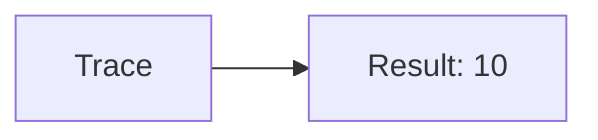
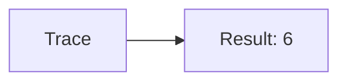
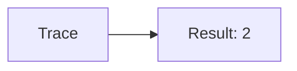

🔙 **[Kembali ke Daftar Soal](./README.md)**

---

# Latihan Soal Part C - Modul 05 - Set 08

### Soal 176
```cpp
// Pause: Deret
int s(int n) {
  if(n==0) return 0;
  return n + s(n-1);
}
// s(4);
```
**Pertanyaan:**
1. Berapakah hasil akhirnya?
2. Deskripsikan alur pikir 'Compiler Manusia' untuk soal ini!

**Jawaban & Diagnosis:**
1. **10**
2. Jumlah deret 1 s/d 4 adalah 10.

**Mermaid Flowchart:**


---
### Soal 177
```cpp
// Resume: Faktorial
int f(int n) {
  if(n<=1) return 1;
  return n * f(n-1);
}
// f(4);
```
**Pertanyaan:**
1. Berapakah hasil akhirnya?
2. Deskripsikan alur pikir 'Compiler Manusia' untuk soal ini!

**Jawaban & Diagnosis:**
1. **24**
2. Faktorial dari 4 adalah 24.

**Mermaid Flowchart:**


---
### Soal 178
```cpp
// Next: Deret
int s(int n) {
  if(n==0) return 0;
  return n + s(n-1);
}
// s(3);
```
**Pertanyaan:**
1. Berapakah hasil akhirnya?
2. Deskripsikan alur pikir 'Compiler Manusia' untuk soal ini!

**Jawaban & Diagnosis:**
1. **6**
2. Jumlah deret 1 s/d 3 adalah 6.

**Mermaid Flowchart:**


---
### Soal 179
```cpp
// Prev: Faktorial
int f(int n) {
  if(n<=1) return 1;
  return n * f(n-1);
}
// f(4);
```
**Pertanyaan:**
1. Berapakah hasil akhirnya?
2. Deskripsikan alur pikir 'Compiler Manusia' untuk soal ini!

**Jawaban & Diagnosis:**
1. **24**
2. Faktorial dari 4 adalah 24.

**Mermaid Flowchart:**


---
### Soal 180
```cpp
// Start: Deret
int s(int n) {
  if(n==0) return 0;
  return n + s(n-1);
}
// s(3);
```
**Pertanyaan:**
1. Berapakah hasil akhirnya?
2. Deskripsikan alur pikir 'Compiler Manusia' untuk soal ini!

**Jawaban & Diagnosis:**
1. **6**
2. Jumlah deret 1 s/d 3 adalah 6.

**Mermaid Flowchart:**


---
### Soal 181
```cpp
// End: Faktorial
int f(int n) {
  if(n<=1) return 1;
  return n * f(n-1);
}
// f(3);
```
**Pertanyaan:**
1. Berapakah hasil akhirnya?
2. Deskripsikan alur pikir 'Compiler Manusia' untuk soal ini!

**Jawaban & Diagnosis:**
1. **6**
2. Faktorial dari 3 adalah 6.

**Mermaid Flowchart:**


---
### Soal 182
```cpp
// Open: Deret
int s(int n) {
  if(n==0) return 0;
  return n + s(n-1);
}
// s(2);
```
**Pertanyaan:**
1. Berapakah hasil akhirnya?
2. Deskripsikan alur pikir 'Compiler Manusia' untuk soal ini!

**Jawaban & Diagnosis:**
1. **3**
2. Jumlah deret 1 s/d 2 adalah 3.

**Mermaid Flowchart:**


---
### Soal 183
```cpp
// Close: Faktorial
int f(int n) {
  if(n<=1) return 1;
  return n * f(n-1);
}
// f(2);
```
**Pertanyaan:**
1. Berapakah hasil akhirnya?
2. Deskripsikan alur pikir 'Compiler Manusia' untuk soal ini!

**Jawaban & Diagnosis:**
1. **2**
2. Faktorial dari 2 adalah 2.

**Mermaid Flowchart:**


---
### Soal 184
```cpp
// Read: Deret
int s(int n) {
  if(n==0) return 0;
  return n + s(n-1);
}
// s(2);
```
**Pertanyaan:**
1. Berapakah hasil akhirnya?
2. Deskripsikan alur pikir 'Compiler Manusia' untuk soal ini!

**Jawaban & Diagnosis:**
1. **3**
2. Jumlah deret 1 s/d 2 adalah 3.

**Mermaid Flowchart:**


---
### Soal 185
```cpp
// Write: Faktorial
int f(int n) {
  if(n<=1) return 1;
  return n * f(n-1);
}
// f(4);
```
**Pertanyaan:**
1. Berapakah hasil akhirnya?
2. Deskripsikan alur pikir 'Compiler Manusia' untuk soal ini!

**Jawaban & Diagnosis:**
1. **24**
2. Faktorial dari 4 adalah 24.

**Mermaid Flowchart:**


---
### Soal 186
```cpp
// Copy: Deret
int s(int n) {
  if(n==0) return 0;
  return n + s(n-1);
}
// s(2);
```
**Pertanyaan:**
1. Berapakah hasil akhirnya?
2. Deskripsikan alur pikir 'Compiler Manusia' untuk soal ini!

**Jawaban & Diagnosis:**
1. **3**
2. Jumlah deret 1 s/d 2 adalah 3.

**Mermaid Flowchart:**


---
### Soal 187
```cpp
// Move: Faktorial
int f(int n) {
  if(n<=1) return 1;
  return n * f(n-1);
}
// f(3);
```
**Pertanyaan:**
1. Berapakah hasil akhirnya?
2. Deskripsikan alur pikir 'Compiler Manusia' untuk soal ini!

**Jawaban & Diagnosis:**
1. **6**
2. Faktorial dari 3 adalah 6.

**Mermaid Flowchart:**


---
### Soal 188
```cpp
// Del: Deret
int s(int n) {
  if(n==0) return 0;
  return n + s(n-1);
}
// s(4);
```
**Pertanyaan:**
1. Berapakah hasil akhirnya?
2. Deskripsikan alur pikir 'Compiler Manusia' untuk soal ini!

**Jawaban & Diagnosis:**
1. **10**
2. Jumlah deret 1 s/d 4 adalah 10.

**Mermaid Flowchart:**


---
### Soal 189
```cpp
// Ren: Faktorial
int f(int n) {
  if(n<=1) return 1;
  return n * f(n-1);
}
// f(3);
```
**Pertanyaan:**
1. Berapakah hasil akhirnya?
2. Deskripsikan alur pikir 'Compiler Manusia' untuk soal ini!

**Jawaban & Diagnosis:**
1. **6**
2. Faktorial dari 3 adalah 6.

**Mermaid Flowchart:**


---
### Soal 190
```cpp
// List: Deret
int s(int n) {
  if(n==0) return 0;
  return n + s(n-1);
}
// s(2);
```
**Pertanyaan:**
1. Berapakah hasil akhirnya?
2. Deskripsikan alur pikir 'Compiler Manusia' untuk soal ini!

**Jawaban & Diagnosis:**
1. **3**
2. Jumlah deret 1 s/d 2 adalah 3.

**Mermaid Flowchart:**


---
### Soal 191
```cpp
// Find: Faktorial
int f(int n) {
  if(n<=1) return 1;
  return n * f(n-1);
}
// f(3);
```
**Pertanyaan:**
1. Berapakah hasil akhirnya?
2. Deskripsikan alur pikir 'Compiler Manusia' untuk soal ini!

**Jawaban & Diagnosis:**
1. **6**
2. Faktorial dari 3 adalah 6.

**Mermaid Flowchart:**


---
### Soal 192
```cpp
// Replace: Deret
int s(int n) {
  if(n==0) return 0;
  return n + s(n-1);
}
// s(3);
```
**Pertanyaan:**
1. Berapakah hasil akhirnya?
2. Deskripsikan alur pikir 'Compiler Manusia' untuk soal ini!

**Jawaban & Diagnosis:**
1. **6**
2. Jumlah deret 1 s/d 3 adalah 6.

**Mermaid Flowchart:**


---
### Soal 193
```cpp
// Select: Faktorial
int f(int n) {
  if(n<=1) return 1;
  return n * f(n-1);
}
// f(2);
```
**Pertanyaan:**
1. Berapakah hasil akhirnya?
2. Deskripsikan alur pikir 'Compiler Manusia' untuk soal ini!

**Jawaban & Diagnosis:**
1. **2**
2. Faktorial dari 2 adalah 2.

**Mermaid Flowchart:**


---
### Soal 194
```cpp
// Edit: Deret
int s(int n) {
  if(n==0) return 0;
  return n + s(n-1);
}
// s(3);
```
**Pertanyaan:**
1. Berapakah hasil akhirnya?
2. Deskripsikan alur pikir 'Compiler Manusia' untuk soal ini!

**Jawaban & Diagnosis:**
1. **6**
2. Jumlah deret 1 s/d 3 adalah 6.

**Mermaid Flowchart:**


---
### Soal 195
```cpp
// Undo: Faktorial
int f(int n) {
  if(n<=1) return 1;
  return n * f(n-1);
}
// f(3);
```
**Pertanyaan:**
1. Berapakah hasil akhirnya?
2. Deskripsikan alur pikir 'Compiler Manusia' untuk soal ini!

**Jawaban & Diagnosis:**
1. **6**
2. Faktorial dari 3 adalah 6.

**Mermaid Flowchart:**


---
### Soal 196
```cpp
// Redo: Deret
int s(int n) {
  if(n==0) return 0;
  return n + s(n-1);
}
// s(4);
```
**Pertanyaan:**
1. Berapakah hasil akhirnya?
2. Deskripsikan alur pikir 'Compiler Manusia' untuk soal ini!

**Jawaban & Diagnosis:**
1. **10**
2. Jumlah deret 1 s/d 4 adalah 10.

**Mermaid Flowchart:**
```mermaid
graph LR
A[Trace] --> B[Result: 10]
```

---
### Soal 197
```cpp
// Faktorial: Faktorial
int f(int n) {
  if(n<=1) return 1;
  return n * f(n-1);
}
// f(4);
```
**Pertanyaan:**
1. Berapakah hasil akhirnya?
2. Deskripsikan alur pikir 'Compiler Manusia' untuk soal ini!

**Jawaban & Diagnosis:**
1. **24**
2. Faktorial dari 4 adalah 24.

**Mermaid Flowchart:**
```mermaid
graph LR
A[Trace] --> B[Result: 24]
```

---
### Soal 198
```cpp
// Tangga: Deret
int s(int n) {
  if(n==0) return 0;
  return n + s(n-1);
}
// s(3);
```
**Pertanyaan:**
1. Berapakah hasil akhirnya?
2. Deskripsikan alur pikir 'Compiler Manusia' untuk soal ini!

**Jawaban & Diagnosis:**
1. **6**
2. Jumlah deret 1 s/d 3 adalah 6.

**Mermaid Flowchart:**
```mermaid
graph LR
A[Trace] --> B[Result: 6]
```

---
### Soal 199
```cpp
// Pohon: Faktorial
int f(int n) {
  if(n<=1) return 1;
  return n * f(n-1);
}
// f(2);
```
**Pertanyaan:**
1. Berapakah hasil akhirnya?
2. Deskripsikan alur pikir 'Compiler Manusia' untuk soal ini!

**Jawaban & Diagnosis:**
1. **2**
2. Faktorial dari 2 adalah 2.

**Mermaid Flowchart:**
```mermaid
graph LR
A[Trace] --> B[Result: 2]
```

---
### Soal 200
```cpp
// Stack: Deret
int s(int n) {
  if(n==0) return 0;
  return n + s(n-1);
}
// s(4);
```
**Pertanyaan:**
1. Berapakah hasil akhirnya?
2. Deskripsikan alur pikir 'Compiler Manusia' untuk soal ini!

**Jawaban & Diagnosis:**
1. **10**
2. Jumlah deret 1 s/d 4 adalah 10.

**Mermaid Flowchart:**
```mermaid
graph LR
A[Trace] --> B[Result: 10]
```

---
