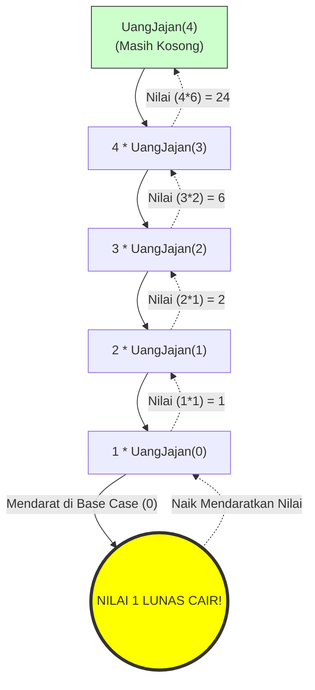

# 5. Rekursi & Call Stack (Ilmu Jajan Berantai)

Selamat datang di "Bos Terakhir" ujian tertulis kodingan OSN-K! Hampir **25% waktu ujianmu** akan terkuras ludes hanya untuk menebak angka *output* dari sebuah kode misterius sepanjang 5 baris yang memanggil namanya sendiri berulang-ulang tiada henti. 
Ini dinamakan **Rekursi (Recursion)**.


---

### 📝 Latihan Soal Tracing
Sudah paham teorinya? Uji ketajaman matamu di sini:
👉 **[Bank Soal Modul 05: Rekursi (300 Soal)](./latihan/README.md)**

---

## 🔁 A. Membedah Paradoks Rekursi (Teka-Teki Minta Uang)

Kodingan rekursi selalu memiliki 2 belahan jiwa:
1. **Base Case (Syarat Pengereman Rem Darurat):** Titik di mana fungsi itu berhenti memanggil dirinya sendiri dan akhirnya membayarkan "Nilai Mentah".
2. **Recursive Case (Siklus Lempar-Lempar Tanggung Jawab):** Titik egois di mana mesin menyuruh kembarannya mengurus sisa masalah.

**Analogi Tugas Rantai Keluarga (Tumpukan Piring/LIFO):**
Budi (Sang Pemanggil `main`) butuh bayar SPP Rp50.000.
- Budi menodong **Kakak** (Eksekusi 1).
- Kakaknya bokek. *"Bentar ya Bud, Kaka nodong ke Ibu dulu."* (**CALL STACK TERCIPTA! Kakak PAUSE berhenti bergerak, menunggu jawaban Ibu.**)
- **Ibu** ditodong (Eksekusi 2). Ibu lagi bokek. *"Bentar ya, Ibu minta Ayah dulu."* (**Ibu Pause!**)
- **Ayah** ditodong (Eksekusi 3). Ayah pergi ke **Mesin ATM** (Eksekusi 4). 
- Mesin ATM mendeteksi Saldo Cukup $\\rightarrow$ **BASE CASE TERCAPAI!** ATM memuntahkan kepingan Rp50.000 murni (Bukan panggilan lagi). Uang ini diberikan ke Ayah.
- Ayah (*Sadar dari Pause*) ngasih uang ke Ibu.
- Ibu (*Sadar dari Pause*) ngasih uang ke Kakak.
- Kakak (*Sadar dari Pause*) nyerahin uang ke Budi. Uang SPP Lunas. `OUTPUT TERCETAK!`

Perhatikan jejak kronologinya: Yang pertama minta uang adalah Budi, **TAPI YANG PERTAMA KALI MENYELESAIKAN PROSES KEHIDUPAN ADALAH MESIN ATM (SI PALING BAWAH!)**. Ini disebut hukum *Stack LIFO (Last In First Out)*: Yang paling buntut diceburkan, dialah yang pertama kali dilayani naik ke atas permukaan.

---

## 🧭 B. Trik Tracing Ranting (Compiler Pohon Kertas)

Jangan pernah meramal kode rekursi di otak kosongan. Gambarlah *Pohon Keluarga* (Recursion Tree) di kertas buram dengan teliti.

```cpp
int UangJajan(int n) {
    if (n == 0) return 1;           // BASE CASE ATM!
    return n * UangJajan(n - 1);    // NYURUH KAKAK JALAN MEREM
}
```

Juri bertanya: Berapa hasil `UangJajan(4)`?
**Cara Menggambar Pohon LIFO di Kertasmu:**


**📖 Cara Membaca Pohon Rekursi (Panah Padat Turun $\rightarrow$ Panah Putus Naik):**
- Komputer akan terjun bebas mengikuti **Panah Turun (Garis Padat)** terus ke bawah. Saat turun, mesin *hanya berhutang* menumpuk fungsi tanpa bisa menghitung hasil akhirnya.
- Setelah kening membentur **Lingkaran Kuning Base Case** (`0` bernilai `1`), hutangnya lunas cair!
- Mesin lalu akan balik arah memanjat menaiki anak tangga ke atas alias **Panah Putus-Putus (Return Phase)** sambil mengalikan bekal nilai dari bawah.
- Hasil berlabuh di pucuk teratas pohon (Kotak Hijau) menghasilkan `24`.

- Mulai *Root* Atas: `UangJajan(4) = 4 * UangJajan(3)` (Nilai belum lunas, ngutang nunggu UangJajan 3).
- Turun Ranting: `UangJajan(3) = 3 * UangJajan(2)` (Ngutang nunggu UangJajan 2).
- Turun Ranting: `UangJajan(2) = 2 * UangJajan(1)` (Ngutang).
- Turun Ranting: `UangJajan(1) = 1 * UangJajan(0)` (Ngutang).
- Mendarat di Dasar Lumpur ATM: `UangJajan(0) = 1`. **LUNAS CAIR!!** Momen Rem Berderit!

**Fase Balik Arah ke Atas Permukaan (The Return Phase):**
- Bawa 1 ke atas: `UangJajan(1) = 1 * 1 = 1`.
- Bawa 1 ke atas: `UangJajan(2) = 2 * 1 = 2`.
- Bawa 2 ke atas: `UangJajan(3) = 3 * 2 = 6`.
- Bawa 6 ke atas pucuk: `UangJajan(4) = 4 * 6 = 24`.

BUM! Output finalnya adalah **24**. Keringat terbayar. *(Fakta Unik Matematika: Algoritma `n * f(n-1)` ini sebenarnya blueprint cermin utuh dari Rumus Faktorial Matematika $N!$. $4! = 4 \times 3 \times 2 \times 1 = 24$).*

---

### Siap Di Uji Tracing Tingkat Provinsi?

Sekarang juri memberi kode jebakan yang memanggil dirinya DUA KALI bersilang!

```cpp
int fungsiBurung(int n) {
    if (n <= 1) return n;
    return fungsiBurung(n - 1) + fungsiBurung(n - 2);
}
```

**Berapakah hasil `fungsiBurung(5)`?**

Bagi yang panikan, liat ada dua `fungsiBurung` sebelah bersebelahan pasti langsung gemetar.
Bagi *Compiler Manusia*: Tunggu sebentar! Ini persis struktur tulang punggung deret ajaib di alam semesta!
Apa bunyinya? `"Hasil hari ini = Kemarin Ditambah Kemarin Lusa."` 
Ah! Ini adalah wujud murni Kodingan **DERET FIBONACCI!**
($n_0, n_1, n_2, n_3, n_4, n_5, \dots$) $\rightarrow$ ($0, 1, 1, 2, 3, 5, \dots$)

Maka nilai `fungsiBurung(5)` sama persis dengan angka Deret Fibonacci ke-5, yaitu angka mutlak **5**! Tidak perlu menggambar pohon capek-capek berjam-jam kalau insting pengenalan Pola Dinamis-mu sudah tajam lewat Part B!

Ini esensi olimpiade rahasia sesungguhnya: **Soal yang terlihat menghabiskan 3 galon tinta pulpen rekursi... nyatanya bisa dijawab dalam 3 Detik berbekal insting Pola Kriptografi Matematika Murni!**

⏩ **Lanjut ke Modul Klimaks Akhir:** [Operasi Bitwise Tingkat Lanjut (Saklar Biner Rahasia)](./06-operasi-bitwise-dasar.md)
