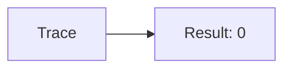
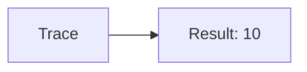
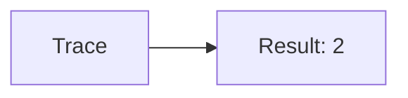
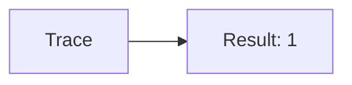
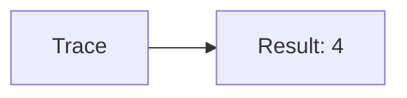
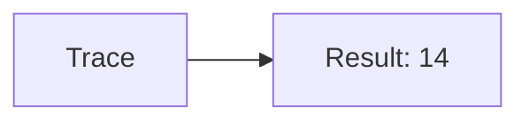

🔙 **[Kembali ke Daftar Soal](./README.md)**

---

# Latihan Soal Part C - Modul 06 - Set 01

### Soal 1
```cpp
// Lampu: AND Mask
int val = 2;
int res = val & 1;
```
**Pertanyaan:**
1. Berapakah hasil akhirnya?
2. Deskripsikan alur pikir 'Compiler Manusia' untuk soal ini!

**Jawaban & Diagnosis:**
1. **0**
2. Mengecek bit terakhir dari 2 (0b10). Hasil: 0.

**Mermaid Flowchart:**


---
### Soal 2
```cpp
// Sensor: XOR Toggle
int val = 8;
int res = val ^ val;
```
**Pertanyaan:**
1. Berapakah hasil akhirnya?
2. Deskripsikan alur pikir 'Compiler Manusia' untuk soal ini!

**Jawaban & Diagnosis:**
1. **0**
2. XOR dengan diri sendiri selalu 0.

**Mermaid Flowchart:**


---
### Soal 3
```cpp
// Flag: Shift Left
int val = 5;
int res = val << 1;
```
**Pertanyaan:**
1. Berapakah hasil akhirnya?
2. Deskripsikan alur pikir 'Compiler Manusia' untuk soal ini!

**Jawaban & Diagnosis:**
1. **10**
2. 5 digeser kiri 1x = dikali 2 = 10.

**Mermaid Flowchart:**


---
### Soal 4
```cpp
// Mask: AND Mask
int val = 10;
int res = val & 1;
```
**Pertanyaan:**
1. Berapakah hasil akhirnya?
2. Deskripsikan alur pikir 'Compiler Manusia' untuk soal ini!

**Jawaban & Diagnosis:**
1. **0**
2. Mengecek bit terakhir dari 10 (0b1010). Hasil: 0.

**Mermaid Flowchart:**


---
### Soal 5
```cpp
// Shift: XOR Toggle
int val = 13;
int res = val ^ val;
```
**Pertanyaan:**
1. Berapakah hasil akhirnya?
2. Deskripsikan alur pikir 'Compiler Manusia' untuk soal ini!

**Jawaban & Diagnosis:**
1. **0**
2. XOR dengan diri sendiri selalu 0.

**Mermaid Flowchart:**


---
### Soal 6
```cpp
// Bit: Shift Left
int val = 1;
int res = val << 1;
```
**Pertanyaan:**
1. Berapakah hasil akhirnya?
2. Deskripsikan alur pikir 'Compiler Manusia' untuk soal ini!

**Jawaban & Diagnosis:**
1. **2**
2. 1 digeser kiri 1x = dikali 2 = 2.

**Mermaid Flowchart:**


---
### Soal 7
```cpp
// Byte: AND Mask
int val = 9;
int res = val & 1;
```
**Pertanyaan:**
1. Berapakah hasil akhirnya?
2. Deskripsikan alur pikir 'Compiler Manusia' untuk soal ini!

**Jawaban & Diagnosis:**
1. **1**
2. Mengecek bit terakhir dari 9 (0b1001). Hasil: 1.

**Mermaid Flowchart:**


---
### Soal 8
```cpp
// Biner: XOR Toggle
int val = 7;
int res = val ^ val;
```
**Pertanyaan:**
1. Berapakah hasil akhirnya?
2. Deskripsikan alur pikir 'Compiler Manusia' untuk soal ini!

**Jawaban & Diagnosis:**
1. **0**
2. XOR dengan diri sendiri selalu 0.

**Mermaid Flowchart:**


---
### Soal 9
```cpp
// Logic: Shift Left
int val = 4;
int res = val << 1;
```
**Pertanyaan:**
1. Berapakah hasil akhirnya?
2. Deskripsikan alur pikir 'Compiler Manusia' untuk soal ini!

**Jawaban & Diagnosis:**
1. **8**
2. 4 digeser kiri 1x = dikali 2 = 8.

**Mermaid Flowchart:**


---
### Soal 10
```cpp
// Gate: AND Mask
int val = 1;
int res = val & 1;
```
**Pertanyaan:**
1. Berapakah hasil akhirnya?
2. Deskripsikan alur pikir 'Compiler Manusia' untuk soal ini!

**Jawaban & Diagnosis:**
1. **1**
2. Mengecek bit terakhir dari 1 (0b1). Hasil: 1.

**Mermaid Flowchart:**


---
### Soal 11
```cpp
// And: XOR Toggle
int val = 11;
int res = val ^ val;
```
**Pertanyaan:**
1. Berapakah hasil akhirnya?
2. Deskripsikan alur pikir 'Compiler Manusia' untuk soal ini!

**Jawaban & Diagnosis:**
1. **0**
2. XOR dengan diri sendiri selalu 0.

**Mermaid Flowchart:**


---
### Soal 12
```cpp
// Or: Shift Left
int val = 2;
int res = val << 1;
```
**Pertanyaan:**
1. Berapakah hasil akhirnya?
2. Deskripsikan alur pikir 'Compiler Manusia' untuk soal ini!

**Jawaban & Diagnosis:**
1. **4**
2. 2 digeser kiri 1x = dikali 2 = 4.

**Mermaid Flowchart:**


---
### Soal 13
```cpp
// Xor: AND Mask
int val = 15;
int res = val & 1;
```
**Pertanyaan:**
1. Berapakah hasil akhirnya?
2. Deskripsikan alur pikir 'Compiler Manusia' untuk soal ini!

**Jawaban & Diagnosis:**
1. **1**
2. Mengecek bit terakhir dari 15 (0b1111). Hasil: 1.

**Mermaid Flowchart:**


---
### Soal 14
```cpp
// Not: XOR Toggle
int val = 10;
int res = val ^ val;
```
**Pertanyaan:**
1. Berapakah hasil akhirnya?
2. Deskripsikan alur pikir 'Compiler Manusia' untuk soal ini!

**Jawaban & Diagnosis:**
1. **0**
2. XOR dengan diri sendiri selalu 0.

**Mermaid Flowchart:**


---
### Soal 15
```cpp
// Nad: Shift Left
int val = 7;
int res = val << 1;
```
**Pertanyaan:**
1. Berapakah hasil akhirnya?
2. Deskripsikan alur pikir 'Compiler Manusia' untuk soal ini!

**Jawaban & Diagnosis:**
1. **14**
2. 7 digeser kiri 1x = dikali 2 = 14.

**Mermaid Flowchart:**


---
### Soal 16
```cpp
// Nor: AND Mask
int val = 9;
int res = val & 1;
```
**Pertanyaan:**
1. Berapakah hasil akhirnya?
2. Deskripsikan alur pikir 'Compiler Manusia' untuk soal ini!

**Jawaban & Diagnosis:**
1. **1**
2. Mengecek bit terakhir dari 9 (0b1001). Hasil: 1.

**Mermaid Flowchart:**


---
### Soal 17
```cpp
// Nxor: XOR Toggle
int val = 7;
int res = val ^ val;
```
**Pertanyaan:**
1. Berapakah hasil akhirnya?
2. Deskripsikan alur pikir 'Compiler Manusia' untuk soal ini!

**Jawaban & Diagnosis:**
1. **0**
2. XOR dengan diri sendiri selalu 0.

**Mermaid Flowchart:**


---
### Soal 18
```cpp
// Mux: Shift Left
int val = 7;
int res = val << 1;
```
**Pertanyaan:**
1. Berapakah hasil akhirnya?
2. Deskripsikan alur pikir 'Compiler Manusia' untuk soal ini!

**Jawaban & Diagnosis:**
1. **14**
2. 7 digeser kiri 1x = dikali 2 = 14.

**Mermaid Flowchart:**


---
### Soal 19
```cpp
// Demux: AND Mask
int val = 5;
int res = val & 1;
```
**Pertanyaan:**
1. Berapakah hasil akhirnya?
2. Deskripsikan alur pikir 'Compiler Manusia' untuk soal ini!

**Jawaban & Diagnosis:**
1. **1**
2. Mengecek bit terakhir dari 5 (0b101). Hasil: 1.

**Mermaid Flowchart:**


---
### Soal 20
```cpp
// FlipFlop: XOR Toggle
int val = 15;
int res = val ^ val;
```
**Pertanyaan:**
1. Berapakah hasil akhirnya?
2. Deskripsikan alur pikir 'Compiler Manusia' untuk soal ini!

**Jawaban & Diagnosis:**
1. **0**
2. XOR dengan diri sendiri selalu 0.

**Mermaid Flowchart:**


---
### Soal 21
```cpp
// Latch: Shift Left
int val = 7;
int res = val << 1;
```
**Pertanyaan:**
1. Berapakah hasil akhirnya?
2. Deskripsikan alur pikir 'Compiler Manusia' untuk soal ini!

**Jawaban & Diagnosis:**
1. **14**
2. 7 digeser kiri 1x = dikali 2 = 14.

**Mermaid Flowchart:**
```mermaid
graph LR
A[Trace] --> B[Result: 14]
```

---
### Soal 22
```cpp
// Register: AND Mask
int val = 13;
int res = val & 1;
```
**Pertanyaan:**
1. Berapakah hasil akhirnya?
2. Deskripsikan alur pikir 'Compiler Manusia' untuk soal ini!

**Jawaban & Diagnosis:**
1. **1**
2. Mengecek bit terakhir dari 13 (0b1101). Hasil: 1.

**Mermaid Flowchart:**
```mermaid
graph LR
A[Trace] --> B[Result: 1]
```

---
### Soal 23
```cpp
// Counter: XOR Toggle
int val = 10;
int res = val ^ val;
```
**Pertanyaan:**
1. Berapakah hasil akhirnya?
2. Deskripsikan alur pikir 'Compiler Manusia' untuk soal ini!

**Jawaban & Diagnosis:**
1. **0**
2. XOR dengan diri sendiri selalu 0.

**Mermaid Flowchart:**
```mermaid
graph LR
A[Trace] --> B[Result: 0]
```

---
### Soal 24
```cpp
// Adder: Shift Left
int val = 6;
int res = val << 1;
```
**Pertanyaan:**
1. Berapakah hasil akhirnya?
2. Deskripsikan alur pikir 'Compiler Manusia' untuk soal ini!

**Jawaban & Diagnosis:**
1. **12**
2. 6 digeser kiri 1x = dikali 2 = 12.

**Mermaid Flowchart:**
```mermaid
graph LR
A[Trace] --> B[Result: 12]
```

---
### Soal 25
```cpp
// Sub: AND Mask
int val = 12;
int res = val & 1;
```
**Pertanyaan:**
1. Berapakah hasil akhirnya?
2. Deskripsikan alur pikir 'Compiler Manusia' untuk soal ini!

**Jawaban & Diagnosis:**
1. **0**
2. Mengecek bit terakhir dari 12 (0b1100). Hasil: 0.

**Mermaid Flowchart:**
```mermaid
graph LR
A[Trace] --> B[Result: 0]
```

---
