🔙 **[Kembali ke Daftar Soal](./README.md)**

---

# Latihan Soal Part C - Modul 06 - Set 01

### Soal 1 (Bitwise XOR Trick)
```cpp
int x = 7;
int res = x ^ x ^ 8;
```
**Pertanyaan:**
1. Berapakah nilai akhir `res`?
2. Apa yang terjadi jika angka yang sama di-XOR (`x ^ x`)?
3. Apa analogi yang cocok untuk XOR?

**Jawaban & Diagnosis:**
1. **8**
2. **Hasilnya menjadi 0 (Saling meniadakan).**
3. **Saklar lampu (Tekan 2x balik ke awal/padam).**

**Mermaid Flowchart:**
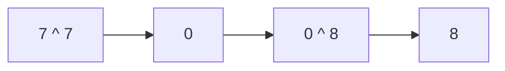

**📖 Cara Membaca Diagram:**
x ^ x = 0. Jadi 0 ^ 8 = 8.

---
### Soal 2 (Bitwise XOR Trick)
```cpp
int x = 54;
int res = x ^ x ^ 55;
```
**Pertanyaan:**
1. Berapakah nilai akhir `res`?
2. Apa yang terjadi jika angka yang sama di-XOR (`x ^ x`)?
3. Apa analogi yang cocok untuk XOR?

**Jawaban & Diagnosis:**
1. **55**
2. **Hasilnya menjadi 0 (Saling meniadakan).**
3. **Saklar lampu (Tekan 2x balik ke awal/padam).**

**Mermaid Flowchart:**


**📖 Cara Membaca Diagram:**
x ^ x = 0. Jadi 0 ^ 55 = 55.

---
### Soal 3 (Right Shift Div)
```cpp
int a = 49;
int res = a >> 1;
```
**Pertanyaan:**
1. Berapakah nilai akhir `res`?
2. Shift kanan sejauh 1 langkah setara dengan membagi `a` dengan angka berapa?
3. Mengapa shift kanan sering dipakai untuk optimasi?

**Jawaban & Diagnosis:**
1. **24**
2. **2**
3. **Karena pembagian oleh pangkat 2 jauh lebih cepat bagi prosesor daripada operator pembagian biasa.**

**Mermaid Flowchart:**
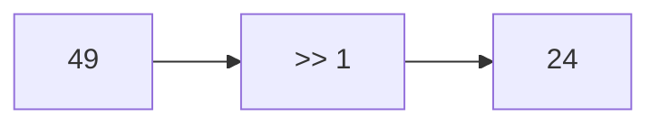

**📖 Cara Membaca Diagram:**
a=49. Shift kanan 1 kali = 49 / 2^1 = 24.

---
### Soal 4 (Bitwise XOR Trick)
```cpp
int x = 29;
int res = x ^ x ^ 30;
```
**Pertanyaan:**
1. Berapakah nilai akhir `res`?
2. Apa yang terjadi jika angka yang sama di-XOR (`x ^ x`)?
3. Apa analogi yang cocok untuk XOR?

**Jawaban & Diagnosis:**
1. **30**
2. **Hasilnya menjadi 0 (Saling meniadakan).**
3. **Saklar lampu (Tekan 2x balik ke awal/padam).**

**Mermaid Flowchart:**
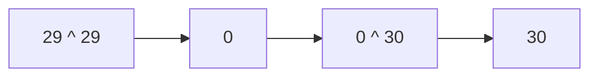

**📖 Cara Membaca Diagram:**
x ^ x = 0. Jadi 0 ^ 30 = 30.

---
### Soal 5 (Bitwise AND/OR)
```cpp
int a = 5;
int b = 6;
int res_and = a & b;
int res_or = a | b;
```
**Pertanyaan:**
1. Berapakah nilai `res_and`?
2. Berapakah nilai `res_or`?
3. Apa guna bitwise AND dalam mengecek angka ganjil?

**Jawaban & Diagnosis:**
1. **4**
2. **7**
3. **Untuk mengecek bit terakhir (x & 1). Jika hasilnya 1, maka ganjil.**

**Mermaid Flowchart:**
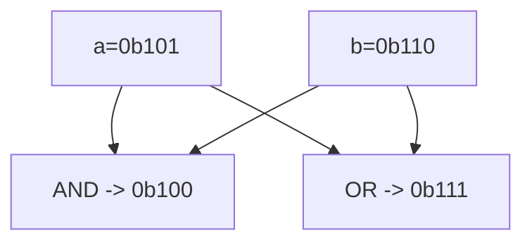

**📖 Cara Membaca Diagram:**
a=5 (0b101), b=6 (0b110). AND cari yang sama-sama 1. OR lumayan rakus ambil semua 1.

---
### Soal 6 (Bitwise AND/OR)
```cpp
int a = 4;
int b = 3;
int res_and = a & b;
int res_or = a | b;
```
**Pertanyaan:**
1. Berapakah nilai `res_and`?
2. Berapakah nilai `res_or`?
3. Apa guna bitwise AND dalam mengecek angka ganjil?

**Jawaban & Diagnosis:**
1. **0**
2. **7**
3. **Untuk mengecek bit terakhir (x & 1). Jika hasilnya 1, maka ganjil.**

**Mermaid Flowchart:**
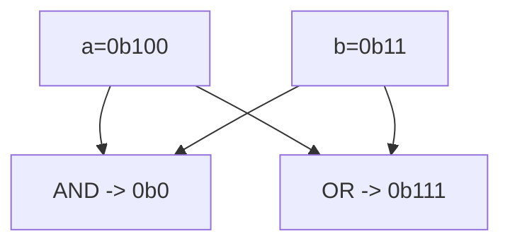

**📖 Cara Membaca Diagram:**
a=4 (0b100), b=3 (0b11). AND cari yang sama-sama 1. OR lumayan rakus ambil semua 1.

---
### Soal 7 (Bitwise XOR Trick)
```cpp
int x = 69;
int res = x ^ x ^ 70;
```
**Pertanyaan:**
1. Berapakah nilai akhir `res`?
2. Apa yang terjadi jika angka yang sama di-XOR (`x ^ x`)?
3. Apa analogi yang cocok untuk XOR?

**Jawaban & Diagnosis:**
1. **70**
2. **Hasilnya menjadi 0 (Saling meniadakan).**
3. **Saklar lampu (Tekan 2x balik ke awal/padam).**

**Mermaid Flowchart:**
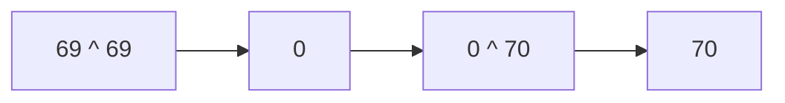

**📖 Cara Membaca Diagram:**
x ^ x = 0. Jadi 0 ^ 70 = 70.

---
### Soal 8 (Bitwise AND/OR)
```cpp
int a = 5;
int b = 6;
int res_and = a & b;
int res_or = a | b;
```
**Pertanyaan:**
1. Berapakah nilai `res_and`?
2. Berapakah nilai `res_or`?
3. Apa guna bitwise AND dalam mengecek angka ganjil?

**Jawaban & Diagnosis:**
1. **4**
2. **7**
3. **Untuk mengecek bit terakhir (x & 1). Jika hasilnya 1, maka ganjil.**

**Mermaid Flowchart:**


**📖 Cara Membaca Diagram:**
a=5 (0b101), b=6 (0b110). AND cari yang sama-sama 1. OR lumayan rakus ambil semua 1.

---
### Soal 9 (Bitwise XOR Trick)
```cpp
int x = 90;
int res = x ^ x ^ 91;
```
**Pertanyaan:**
1. Berapakah nilai akhir `res`?
2. Apa yang terjadi jika angka yang sama di-XOR (`x ^ x`)?
3. Apa analogi yang cocok untuk XOR?

**Jawaban & Diagnosis:**
1. **91**
2. **Hasilnya menjadi 0 (Saling meniadakan).**
3. **Saklar lampu (Tekan 2x balik ke awal/padam).**

**Mermaid Flowchart:**


**📖 Cara Membaca Diagram:**
x ^ x = 0. Jadi 0 ^ 91 = 91.

---
### Soal 10 (Bitwise XOR Trick)
```cpp
int x = 68;
int res = x ^ x ^ 69;
```
**Pertanyaan:**
1. Berapakah nilai akhir `res`?
2. Apa yang terjadi jika angka yang sama di-XOR (`x ^ x`)?
3. Apa analogi yang cocok untuk XOR?

**Jawaban & Diagnosis:**
1. **69**
2. **Hasilnya menjadi 0 (Saling meniadakan).**
3. **Saklar lampu (Tekan 2x balik ke awal/padam).**

**Mermaid Flowchart:**


**📖 Cara Membaca Diagram:**
x ^ x = 0. Jadi 0 ^ 69 = 69.

---
### Soal 11 (Bitwise XOR Trick)
```cpp
int x = 95;
int res = x ^ x ^ 96;
```
**Pertanyaan:**
1. Berapakah nilai akhir `res`?
2. Apa yang terjadi jika angka yang sama di-XOR (`x ^ x`)?
3. Apa analogi yang cocok untuk XOR?

**Jawaban & Diagnosis:**
1. **96**
2. **Hasilnya menjadi 0 (Saling meniadakan).**
3. **Saklar lampu (Tekan 2x balik ke awal/padam).**

**Mermaid Flowchart:**


**📖 Cara Membaca Diagram:**
x ^ x = 0. Jadi 0 ^ 96 = 96.

---
### Soal 12 (Left Shift Power)
```cpp
int a = 9;
int res = a << 1;
```
**Pertanyaan:**
1. Berapakah nilai akhir `res`?
2. Shift kiri sejauh 1 langkah setara dengan mengalikan `a` dengan angka berapa?
3. Apa yang terjadi pada bit-bit angka jika di-shift ke kiri?

**Jawaban & Diagnosis:**
1. **18**
2. **2**
3. **Bit bergeser ke kiri, dan muncul angka 0 di sebelah kanan (seperti nambah digit).**

**Mermaid Flowchart:**
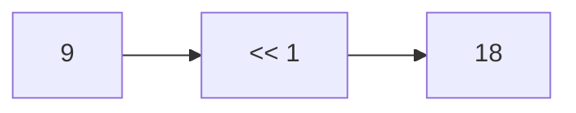

**📖 Cara Membaca Diagram:**
a=9. Shift kiri 1 kali = 9 * 2^1 = 18.

---
### Soal 13 (Bitwise XOR Trick)
```cpp
int x = 37;
int res = x ^ x ^ 38;
```
**Pertanyaan:**
1. Berapakah nilai akhir `res`?
2. Apa yang terjadi jika angka yang sama di-XOR (`x ^ x`)?
3. Apa analogi yang cocok untuk XOR?

**Jawaban & Diagnosis:**
1. **38**
2. **Hasilnya menjadi 0 (Saling meniadakan).**
3. **Saklar lampu (Tekan 2x balik ke awal/padam).**

**Mermaid Flowchart:**
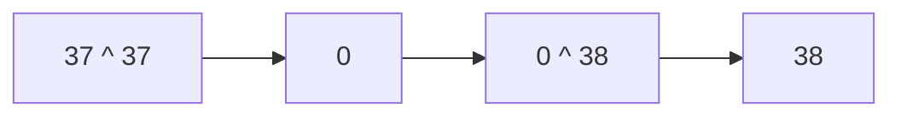

**📖 Cara Membaca Diagram:**
x ^ x = 0. Jadi 0 ^ 38 = 38.

---
### Soal 14 (Left Shift Power)
```cpp
int a = 3;
int res = a << 2;
```
**Pertanyaan:**
1. Berapakah nilai akhir `res`?
2. Shift kiri sejauh 2 langkah setara dengan mengalikan `a` dengan angka berapa?
3. Apa yang terjadi pada bit-bit angka jika di-shift ke kiri?

**Jawaban & Diagnosis:**
1. **12**
2. **4**
3. **Bit bergeser ke kiri, dan muncul angka 0 di sebelah kanan (seperti nambah digit).**

**Mermaid Flowchart:**
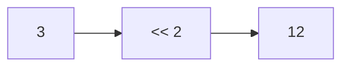

**📖 Cara Membaca Diagram:**
a=3. Shift kiri 2 kali = 3 * 2^2 = 12.

---
### Soal 15 (Bitwise AND/OR)
```cpp
int a = 6;
int b = 4;
int res_and = a & b;
int res_or = a | b;
```
**Pertanyaan:**
1. Berapakah nilai `res_and`?
2. Berapakah nilai `res_or`?
3. Apa guna bitwise AND dalam mengecek angka ganjil?

**Jawaban & Diagnosis:**
1. **4**
2. **6**
3. **Untuk mengecek bit terakhir (x & 1). Jika hasilnya 1, maka ganjil.**

**Mermaid Flowchart:**
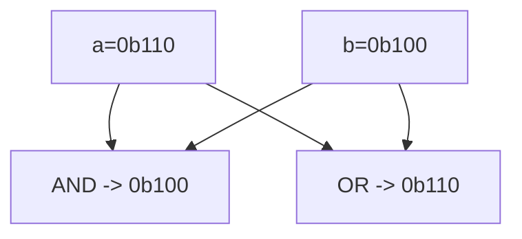

**📖 Cara Membaca Diagram:**
a=6 (0b110), b=4 (0b100). AND cari yang sama-sama 1. OR lumayan rakus ambil semua 1.

---
### Soal 16 (Bitwise XOR Trick)
```cpp
int x = 89;
int res = x ^ x ^ 90;
```
**Pertanyaan:**
1. Berapakah nilai akhir `res`?
2. Apa yang terjadi jika angka yang sama di-XOR (`x ^ x`)?
3. Apa analogi yang cocok untuk XOR?

**Jawaban & Diagnosis:**
1. **90**
2. **Hasilnya menjadi 0 (Saling meniadakan).**
3. **Saklar lampu (Tekan 2x balik ke awal/padam).**

**Mermaid Flowchart:**
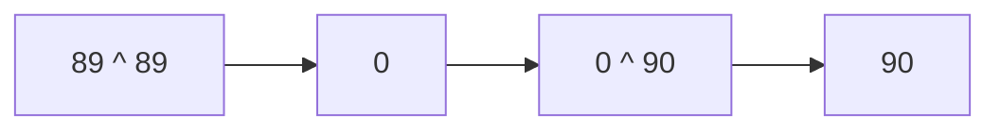

**📖 Cara Membaca Diagram:**
x ^ x = 0. Jadi 0 ^ 90 = 90.

---
### Soal 17 (Right Shift Div)
```cpp
int a = 26;
int res = a >> 1;
```
**Pertanyaan:**
1. Berapakah nilai akhir `res`?
2. Shift kanan sejauh 1 langkah setara dengan membagi `a` dengan angka berapa?
3. Mengapa shift kanan sering dipakai untuk optimasi?

**Jawaban & Diagnosis:**
1. **13**
2. **2**
3. **Karena pembagian oleh pangkat 2 jauh lebih cepat bagi prosesor daripada operator pembagian biasa.**

**Mermaid Flowchart:**
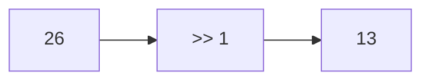

**📖 Cara Membaca Diagram:**
a=26. Shift kanan 1 kali = 26 / 2^1 = 13.

---
### Soal 18 (Bitwise XOR Trick)
```cpp
int x = 59;
int res = x ^ x ^ 60;
```
**Pertanyaan:**
1. Berapakah nilai akhir `res`?
2. Apa yang terjadi jika angka yang sama di-XOR (`x ^ x`)?
3. Apa analogi yang cocok untuk XOR?

**Jawaban & Diagnosis:**
1. **60**
2. **Hasilnya menjadi 0 (Saling meniadakan).**
3. **Saklar lampu (Tekan 2x balik ke awal/padam).**

**Mermaid Flowchart:**
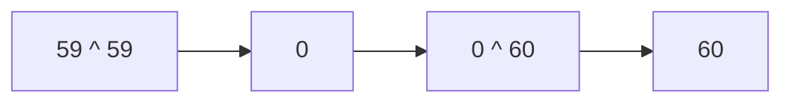

**📖 Cara Membaca Diagram:**
x ^ x = 0. Jadi 0 ^ 60 = 60.

---
### Soal 19 (Bitwise XOR Trick)
```cpp
int x = 72;
int res = x ^ x ^ 73;
```
**Pertanyaan:**
1. Berapakah nilai akhir `res`?
2. Apa yang terjadi jika angka yang sama di-XOR (`x ^ x`)?
3. Apa analogi yang cocok untuk XOR?

**Jawaban & Diagnosis:**
1. **73**
2. **Hasilnya menjadi 0 (Saling meniadakan).**
3. **Saklar lampu (Tekan 2x balik ke awal/padam).**

**Mermaid Flowchart:**
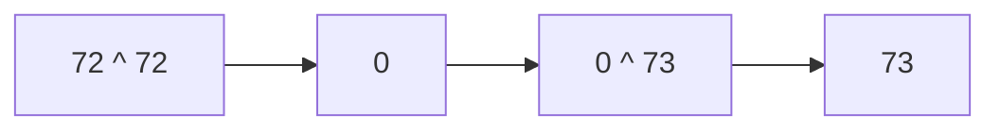

**📖 Cara Membaca Diagram:**
x ^ x = 0. Jadi 0 ^ 73 = 73.

---
### Soal 20 (Left Shift Power)
```cpp
int a = 2;
int res = a << 3;
```
**Pertanyaan:**
1. Berapakah nilai akhir `res`?
2. Shift kiri sejauh 3 langkah setara dengan mengalikan `a` dengan angka berapa?
3. Apa yang terjadi pada bit-bit angka jika di-shift ke kiri?

**Jawaban & Diagnosis:**
1. **16**
2. **8**
3. **Bit bergeser ke kiri, dan muncul angka 0 di sebelah kanan (seperti nambah digit).**

**Mermaid Flowchart:**
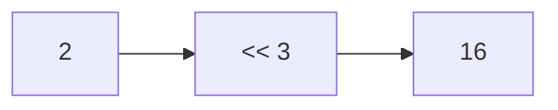

**📖 Cara Membaca Diagram:**
a=2. Shift kiri 3 kali = 2 * 2^3 = 16.

---
### Soal 21 (Right Shift Div)
```cpp
int a = 30;
int res = a >> 2;
```
**Pertanyaan:**
1. Berapakah nilai akhir `res`?
2. Shift kanan sejauh 2 langkah setara dengan membagi `a` dengan angka berapa?
3. Mengapa shift kanan sering dipakai untuk optimasi?

**Jawaban & Diagnosis:**
1. **7**
2. **4**
3. **Karena pembagian oleh pangkat 2 jauh lebih cepat bagi prosesor daripada operator pembagian biasa.**

**Mermaid Flowchart:**
```mermaid
graph LR
    A[30] --> B[">> 2"]
    B --> C[7]
```

**📖 Cara Membaca Diagram:**
a=30. Shift kanan 2 kali = 30 / 2^2 = 7.

---
### Soal 22 (Right Shift Div)
```cpp
int a = 22;
int res = a >> 1;
```
**Pertanyaan:**
1. Berapakah nilai akhir `res`?
2. Shift kanan sejauh 1 langkah setara dengan membagi `a` dengan angka berapa?
3. Mengapa shift kanan sering dipakai untuk optimasi?

**Jawaban & Diagnosis:**
1. **11**
2. **2**
3. **Karena pembagian oleh pangkat 2 jauh lebih cepat bagi prosesor daripada operator pembagian biasa.**

**Mermaid Flowchart:**
```mermaid
graph LR
    A[22] --> B[">> 1"]
    B --> C[11]
```

**📖 Cara Membaca Diagram:**
a=22. Shift kanan 1 kali = 22 / 2^1 = 11.

---
### Soal 23 (Bitwise XOR Trick)
```cpp
int x = 46;
int res = x ^ x ^ 47;
```
**Pertanyaan:**
1. Berapakah nilai akhir `res`?
2. Apa yang terjadi jika angka yang sama di-XOR (`x ^ x`)?
3. Apa analogi yang cocok untuk XOR?

**Jawaban & Diagnosis:**
1. **47**
2. **Hasilnya menjadi 0 (Saling meniadakan).**
3. **Saklar lampu (Tekan 2x balik ke awal/padam).**

**Mermaid Flowchart:**
```mermaid
graph LR
    A["46 ^ 46"] --> B[0]
    B --> C["0 ^ 47"]
    C --> D["47"]
```

**📖 Cara Membaca Diagram:**
x ^ x = 0. Jadi 0 ^ 47 = 47.

---
### Soal 24 (Bitwise AND/OR)
```cpp
int a = 3;
int b = 3;
int res_and = a & b;
int res_or = a | b;
```
**Pertanyaan:**
1. Berapakah nilai `res_and`?
2. Berapakah nilai `res_or`?
3. Apa guna bitwise AND dalam mengecek angka ganjil?

**Jawaban & Diagnosis:**
1. **3**
2. **3**
3. **Untuk mengecek bit terakhir (x & 1). Jika hasilnya 1, maka ganjil.**

**Mermaid Flowchart:**
```mermaid
graph TD
    A["a=0b11"] --> C["AND -> 0b11"]
    B["b=0b11"] --> C
    A --> D["OR  -> 0b11"]
    B --> D
```

**📖 Cara Membaca Diagram:**
a=3 (0b11), b=3 (0b11). AND cari yang sama-sama 1. OR lumayan rakus ambil semua 1.

---
### Soal 25 (Bitwise XOR Trick)
```cpp
int x = 92;
int res = x ^ x ^ 93;
```
**Pertanyaan:**
1. Berapakah nilai akhir `res`?
2. Apa yang terjadi jika angka yang sama di-XOR (`x ^ x`)?
3. Apa analogi yang cocok untuk XOR?

**Jawaban & Diagnosis:**
1. **93**
2. **Hasilnya menjadi 0 (Saling meniadakan).**
3. **Saklar lampu (Tekan 2x balik ke awal/padam).**

**Mermaid Flowchart:**
```mermaid
graph LR
    A["92 ^ 92"] --> B[0]
    B --> C["0 ^ 93"]
    C --> D["93"]
```

**📖 Cara Membaca Diagram:**
x ^ x = 0. Jadi 0 ^ 93 = 93.

---
