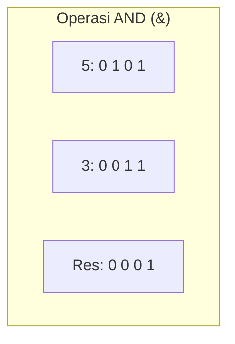
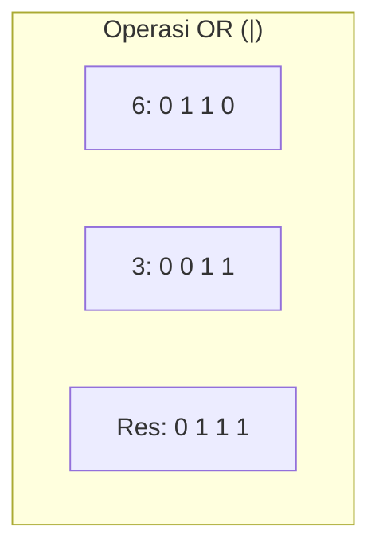
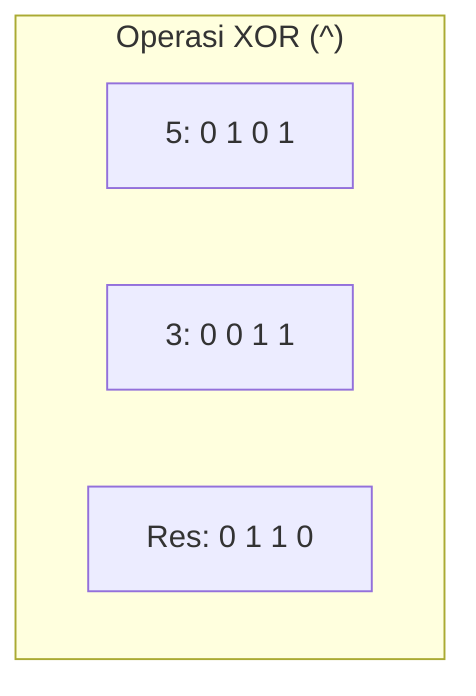
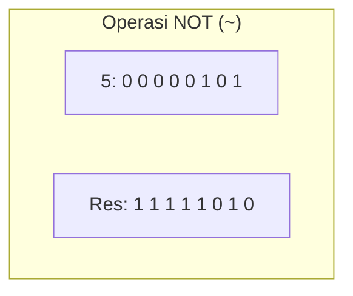
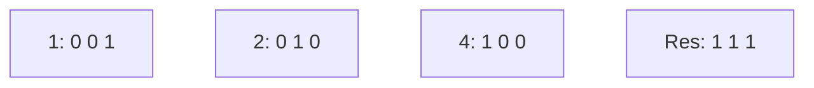

		🔙 **[Kembali ke Daftar Soal](./README.md)**

---

# Latihan Soal Part C - Modul 06 - Set 01 (Premium Edition)

---

### Soal 1: Logika AND Dasar
```cpp
int a = 5;  // 0101 dalam biner
int b = 3;  // 0011 dalam biner
int c = a & b;
```
**Pertanyaan:**
1. Berapakah nilai `c` dalam desimal?
2. Berapa hasil biner dari `5 & 3`?

<details>
<summary><b>Klik untuk Lihat Jawaban & Diagnosis</b></summary>

**Mermaid Bit-Grid:**


**Jawaban:**
1. **1**
2. **0001**
</details>

---

### Soal 2: Logika OR Dasar
```cpp
int a = 6;  // 0110
int b = 3;  // 0011
int c = a | b;
```
**Pertanyaan:**
1. Berapakah nilai `c` dalam desimal?
2. Apa prinsip utama operator `|`?

<details>
<summary><b>Klik untuk Lihat Jawaban & Diagnosis</b></summary>

**Mermaid Bit-Grid:**


**Jawaban:**
1. **7**
2. Jika **salah satu atau kedua** bit bernilai 1, maka hasilnya adalah 1.
</details>

---

### Soal 3: Logika XOR (Eksklusif)
```cpp
int a = 5;  // 0101
int b = 3;  // 0011
int c = a ^ b;
```
**Pertanyaan:**
1. Berapakah nilai `c` dalam desimal?
2. Apa hasil XOR jika kedua bit bernilai sama (misal 1 XOR 1)?

<details>
<summary><b>Klik untuk Lihat Jawaban & Diagnosis</b></summary>

**Mermaid Bit-Grid:**


**Jawaban:**
1. **6**
2. **0.** (XOR hanya menghasilkan 1 jika kedua bit **berbeda**).
</details>

---

### Soal 4: Pembalik Bit (NOT)
```cpp
unsigned char a = 5; // 00000101 (8-bit)
unsigned char b = ~a;
```
**Pertanyaan:**
1. Berapakah nilai `b` dalam desimal?
2. Apa yang dilakukan operator `~` terhadap bit 0?

<details>
<summary><b>Klik untuk Lihat Jawaban & Diagnosis</b></summary>

**Mermaid Bit-Grid:**


**Jawaban:**
1. **250**
2. Mengubah bit 0 menjadi 1, dan bit 1 menjadi 0.
</details>

---

### Soal 5: Gabungan AND-OR
```cpp
int x = (5 & 3) | 4;
```
**Pertanyaan:**
1. Berapakah nilai `x`?
2. Selesaikan operasi di dalam kurung terlebih dahulu!

<details>
<summary><b>Klik untuk Lihat Jawaban & Diagnosis</b></summary>

**Jawaban:**
1. **5**
   - (5 & 3) = 1 (0001)
   - 1 | 4 = (0001 | 0100) = 0101 = **5**.
</details>

---

### Soal 6: XOR dengan Diri Sendiri
```cpp
int n = 123;
int hasil = n ^ n;
```
**Pertanyaan:**
1. Berapakah nilai `hasil`?
2. Mengapa hasilnya selalu angka tersebut untuk bilangan apapun?

<details>
<summary><b>Klik untuk Lihat Jawaban & Diagnosis</b></summary>

**Jawaban:**
1. **0**
2. Karena setiap bit pasti sama dengan pasangannya (1 XOR 1 = 0, 0 XOR 0 = 0). XOR dengan angka yang sama selalu menghasilkan 0.
</details>

---

### Soal 7: Logika Masking Sederhana
```cpp
int n = 7; // 0111
int mask = 1; // 0001
int res = n & mask;
```
**Pertanyaan:**
1. Berapak nilai `res`?
2. Operasi ini biasanya digunakan untuk mengecek apakah angka tersebut adalah?

<details>
<summary><b>Klik untuk Lihat Jawaban & Diagnosis</b></summary>

**Jawaban:**
1. **1**
2. **Ganjil atau Genap.** Jika `n & 1` hasilnya 1, maka angka tersebut ganjil.
</details>

---

### Soal 8: XOR dengan Nol
```cpp
int a = 15;
int c = a ^ 0;
```
**Pertanyaan:**
1. Berapakah nilai `c`?
2. Apa pengaruh angka 0 terhadap XOR?

<details>
<summary><b>Klik untuk Lihat Jawaban & Diagnosis</b></summary>

**Jawaban:**
1. **15**
2. Angka 0 bertindak sebagai **identitas** pada XOR. `n ^ 0` akan selalu menghasilkan `n` kembali.
</details>

---

### Soal 9: Misteri Biner
```cpp
int x = 1 | 2 | 4;
```
**Pertanyaan:**
1. Berapakah nilai `x`?
2. Angka-angka 1, 2, 4 adalah angka "khusus" dalam biner. Sebutkan keunikannya!

<details>
<summary><b>Klik untuk Lihat Jawaban & Diagnosis</b></summary>

**Mermaid Bit-Grid:**


**Jawaban:**
1. **7**
2. Mereka adalah **perpangkatan dari 2** ($2^0, 2^1, 2^2$). Dalam biner, setiap angka tersebut hanya memiliki tepat **satu buah bit 1** di posisi yang berbeda.
</details>

---

### Soal 10: Kebalikan Bit
```cpp
unsigned char n = 255; // 11111111
unsigned char res = ~n;
```
**Pertanyaan:**
1. Berapakah nilai `res`?
2. Apa hasil biner dari `res`?

<details>
<summary><b>Klik untuk Lihat Jawaban & Diagnosis</b></summary>

**Jawaban:**
1. **0**
2. **00000000** (Semua bit 1 dibalik menjadi 0).
</details>
