🔙 **[Kembali ke Daftar Soal](./README.md)**

---

# Latihan Soal Part C - Modul 06 - Set 01

### Soal 1
```cpp
int res = 10 << 1;
```
**Pertanyaan:**
1. Berapakah hasil akhirnya?
2. Mengapa demikian?

**Jawaban & Diagnosis:**
1. **20**
2. Lihat Tracing.

**Mermaid Flowchart:**
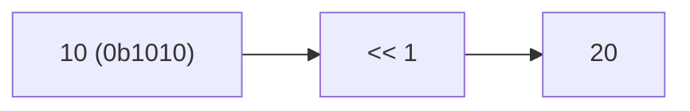

**📖 Penjelasan:**
**Langkah Tracing:**
1. Ubah 10 ke biner (0b1010).
2. Jalankan <<.
3. Hasil: 20.

---
### Soal 2
```cpp
int res = 5 << 2;
```
**Pertanyaan:**
1. Berapakah hasil akhirnya?
2. Mengapa demikian?

**Jawaban & Diagnosis:**
1. **20**
2. Lihat Tracing.

**Mermaid Flowchart:**
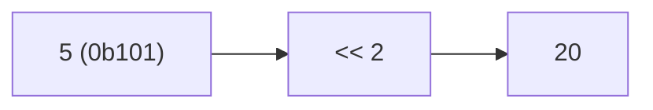

**📖 Penjelasan:**
**Langkah Tracing:**
1. Ubah 5 ke biner (0b101).
2. Jalankan <<.
3. Hasil: 20.

---
### Soal 3
```cpp
int res = 8 | 8;
```
**Pertanyaan:**
1. Berapakah hasil akhirnya?
2. Mengapa demikian?

**Jawaban & Diagnosis:**
1. **8**
2. Lihat Tracing.

**Mermaid Flowchart:**
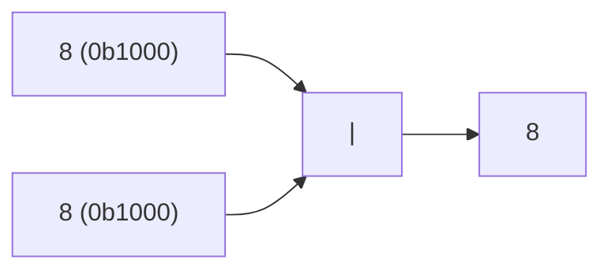

**📖 Penjelasan:**
**Langkah Tracing:**
1. Ubah 8 ke biner (0b1000).
2. Jalankan |.
3. Hasil: 8.

---
### Soal 4
```cpp
int res = 4 & 13;
```
**Pertanyaan:**
1. Berapakah hasil akhirnya?
2. Mengapa demikian?

**Jawaban & Diagnosis:**
1. **4**
2. Lihat Tracing.

**Mermaid Flowchart:**


**📖 Penjelasan:**
**Langkah Tracing:**
1. Ubah 4 ke biner (0b100).
2. Jalankan &.
3. Hasil: 4.

---
### Soal 5
```cpp
int res = 14 ^ 13;
```
**Pertanyaan:**
1. Berapakah hasil akhirnya?
2. Mengapa demikian?

**Jawaban & Diagnosis:**
1. **3**
2. Lihat Tracing.

**Mermaid Flowchart:**


**📖 Penjelasan:**
**Langkah Tracing:**
1. Ubah 14 ke biner (0b1110).
2. Jalankan ^.
3. Hasil: 3.

---
### Soal 6
```cpp
int res = 4 >> 1;
```
**Pertanyaan:**
1. Berapakah hasil akhirnya?
2. Mengapa demikian?

**Jawaban & Diagnosis:**
1. **2**
2. Lihat Tracing.

**Mermaid Flowchart:**
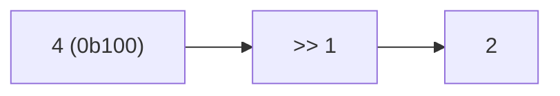

**📖 Penjelasan:**
**Langkah Tracing:**
1. Ubah 4 ke biner (0b100).
2. Jalankan >>.
3. Hasil: 2.

---
### Soal 7
```cpp
int res = 1 << 3;
```
**Pertanyaan:**
1. Berapakah hasil akhirnya?
2. Mengapa demikian?

**Jawaban & Diagnosis:**
1. **8**
2. Lihat Tracing.

**Mermaid Flowchart:**
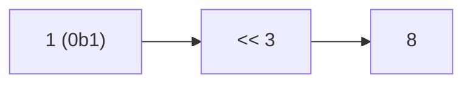

**📖 Penjelasan:**
**Langkah Tracing:**
1. Ubah 1 ke biner (0b1).
2. Jalankan <<.
3. Hasil: 8.

---
### Soal 8
```cpp
int res = 4 & 14;
```
**Pertanyaan:**
1. Berapakah hasil akhirnya?
2. Mengapa demikian?

**Jawaban & Diagnosis:**
1. **4**
2. Lihat Tracing.

**Mermaid Flowchart:**
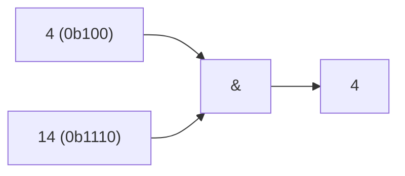

**📖 Penjelasan:**
**Langkah Tracing:**
1. Ubah 4 ke biner (0b100).
2. Jalankan &.
3. Hasil: 4.

---
### Soal 9
```cpp
int res = 9 << 3;
```
**Pertanyaan:**
1. Berapakah hasil akhirnya?
2. Mengapa demikian?

**Jawaban & Diagnosis:**
1. **72**
2. Lihat Tracing.

**Mermaid Flowchart:**
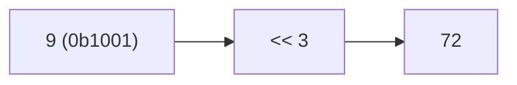

**📖 Penjelasan:**
**Langkah Tracing:**
1. Ubah 9 ke biner (0b1001).
2. Jalankan <<.
3. Hasil: 72.

---
### Soal 10
```cpp
int res = 13 | 2;
```
**Pertanyaan:**
1. Berapakah hasil akhirnya?
2. Mengapa demikian?

**Jawaban & Diagnosis:**
1. **15**
2. Lihat Tracing.

**Mermaid Flowchart:**


**📖 Penjelasan:**
**Langkah Tracing:**
1. Ubah 13 ke biner (0b1101).
2. Jalankan |.
3. Hasil: 15.

---
### Soal 11
```cpp
int res = 12 << 1;
```
**Pertanyaan:**
1. Berapakah hasil akhirnya?
2. Mengapa demikian?

**Jawaban & Diagnosis:**
1. **24**
2. Lihat Tracing.

**Mermaid Flowchart:**
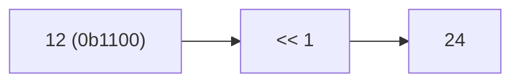

**📖 Penjelasan:**
**Langkah Tracing:**
1. Ubah 12 ke biner (0b1100).
2. Jalankan <<.
3. Hasil: 24.

---
### Soal 12
```cpp
int res = 9 >> 3;
```
**Pertanyaan:**
1. Berapakah hasil akhirnya?
2. Mengapa demikian?

**Jawaban & Diagnosis:**
1. **1**
2. Lihat Tracing.

**Mermaid Flowchart:**
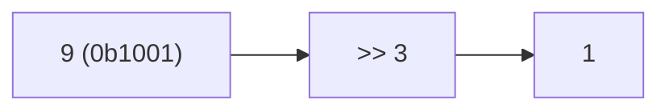

**📖 Penjelasan:**
**Langkah Tracing:**
1. Ubah 9 ke biner (0b1001).
2. Jalankan >>.
3. Hasil: 1.

---
### Soal 13
```cpp
int res = 9 >> 2;
```
**Pertanyaan:**
1. Berapakah hasil akhirnya?
2. Mengapa demikian?

**Jawaban & Diagnosis:**
1. **2**
2. Lihat Tracing.

**Mermaid Flowchart:**
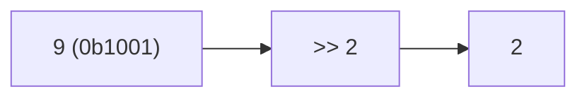

**📖 Penjelasan:**
**Langkah Tracing:**
1. Ubah 9 ke biner (0b1001).
2. Jalankan >>.
3. Hasil: 2.

---
### Soal 14
```cpp
int res = 8 | 14;
```
**Pertanyaan:**
1. Berapakah hasil akhirnya?
2. Mengapa demikian?

**Jawaban & Diagnosis:**
1. **14**
2. Lihat Tracing.

**Mermaid Flowchart:**
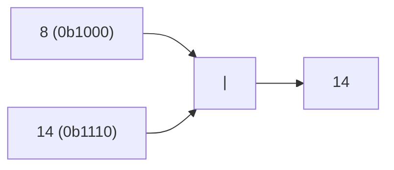

**📖 Penjelasan:**
**Langkah Tracing:**
1. Ubah 8 ke biner (0b1000).
2. Jalankan |.
3. Hasil: 14.

---
### Soal 15
```cpp
int res = 14 | 1;
```
**Pertanyaan:**
1. Berapakah hasil akhirnya?
2. Mengapa demikian?

**Jawaban & Diagnosis:**
1. **15**
2. Lihat Tracing.

**Mermaid Flowchart:**
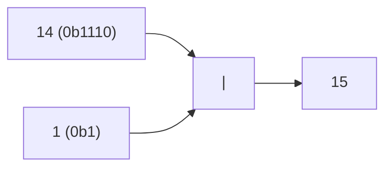

**📖 Penjelasan:**
**Langkah Tracing:**
1. Ubah 14 ke biner (0b1110).
2. Jalankan |.
3. Hasil: 15.

---
### Soal 16
```cpp
int res = 15 & 12;
```
**Pertanyaan:**
1. Berapakah hasil akhirnya?
2. Mengapa demikian?

**Jawaban & Diagnosis:**
1. **12**
2. Lihat Tracing.

**Mermaid Flowchart:**
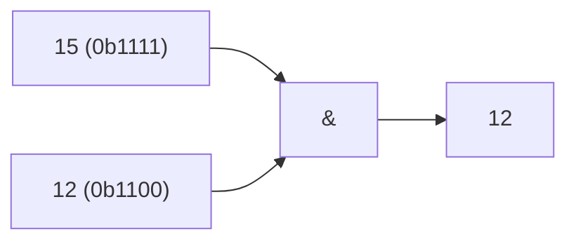

**📖 Penjelasan:**
**Langkah Tracing:**
1. Ubah 15 ke biner (0b1111).
2. Jalankan &.
3. Hasil: 12.

---
### Soal 17
```cpp
int res = 2 << 3;
```
**Pertanyaan:**
1. Berapakah hasil akhirnya?
2. Mengapa demikian?

**Jawaban & Diagnosis:**
1. **16**
2. Lihat Tracing.

**Mermaid Flowchart:**
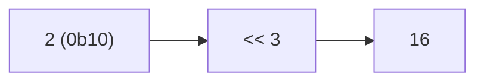

**📖 Penjelasan:**
**Langkah Tracing:**
1. Ubah 2 ke biner (0b10).
2. Jalankan <<.
3. Hasil: 16.

---
### Soal 18
```cpp
int res = 11 ^ 9;
```
**Pertanyaan:**
1. Berapakah hasil akhirnya?
2. Mengapa demikian?

**Jawaban & Diagnosis:**
1. **2**
2. Lihat Tracing.

**Mermaid Flowchart:**
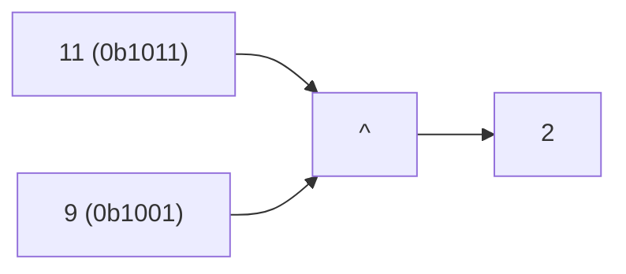

**📖 Penjelasan:**
**Langkah Tracing:**
1. Ubah 11 ke biner (0b1011).
2. Jalankan ^.
3. Hasil: 2.

---
### Soal 19
```cpp
int res = 12 | 10;
```
**Pertanyaan:**
1. Berapakah hasil akhirnya?
2. Mengapa demikian?

**Jawaban & Diagnosis:**
1. **14**
2. Lihat Tracing.

**Mermaid Flowchart:**
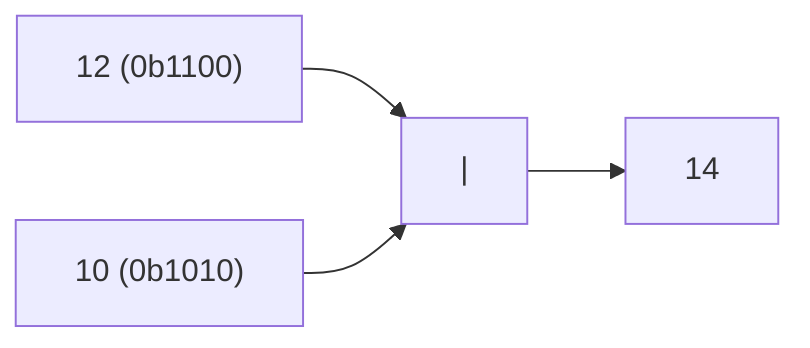

**📖 Penjelasan:**
**Langkah Tracing:**
1. Ubah 12 ke biner (0b1100).
2. Jalankan |.
3. Hasil: 14.

---
### Soal 20
```cpp
int res = 8 << 2;
```
**Pertanyaan:**
1. Berapakah hasil akhirnya?
2. Mengapa demikian?

**Jawaban & Diagnosis:**
1. **32**
2. Lihat Tracing.

**Mermaid Flowchart:**
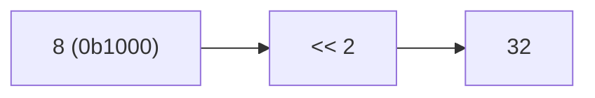

**📖 Penjelasan:**
**Langkah Tracing:**
1. Ubah 8 ke biner (0b1000).
2. Jalankan <<.
3. Hasil: 32.

---
### Soal 21
```cpp
int res = 12 & 9;
```
**Pertanyaan:**
1. Berapakah hasil akhirnya?
2. Mengapa demikian?

**Jawaban & Diagnosis:**
1. **8**
2. Lihat Tracing.

**Mermaid Flowchart:**
```mermaid
graph LR
A["12 (0b1100)"] --> C["&"]
B["9 (0b1001)"] --> C
C --> D["8"]
```

**📖 Penjelasan:**
**Langkah Tracing:**
1. Ubah 12 ke biner (0b1100).
2. Jalankan &.
3. Hasil: 8.

---
### Soal 22
```cpp
int res = 13 | 5;
```
**Pertanyaan:**
1. Berapakah hasil akhirnya?
2. Mengapa demikian?

**Jawaban & Diagnosis:**
1. **13**
2. Lihat Tracing.

**Mermaid Flowchart:**
```mermaid
graph LR
A["13 (0b1101)"] --> C["|"]
B["5 (0b101)"] --> C
C --> D["13"]
```

**📖 Penjelasan:**
**Langkah Tracing:**
1. Ubah 13 ke biner (0b1101).
2. Jalankan |.
3. Hasil: 13.

---
### Soal 23
```cpp
int res = 8 & 4;
```
**Pertanyaan:**
1. Berapakah hasil akhirnya?
2. Mengapa demikian?

**Jawaban & Diagnosis:**
1. **0**
2. Lihat Tracing.

**Mermaid Flowchart:**
```mermaid
graph LR
A["8 (0b1000)"] --> C["&"]
B["4 (0b100)"] --> C
C --> D["0"]
```

**📖 Penjelasan:**
**Langkah Tracing:**
1. Ubah 8 ke biner (0b1000).
2. Jalankan &.
3. Hasil: 0.

---
### Soal 24
```cpp
int res = 8 | 11;
```
**Pertanyaan:**
1. Berapakah hasil akhirnya?
2. Mengapa demikian?

**Jawaban & Diagnosis:**
1. **11**
2. Lihat Tracing.

**Mermaid Flowchart:**
```mermaid
graph LR
A["8 (0b1000)"] --> C["|"]
B["11 (0b1011)"] --> C
C --> D["11"]
```

**📖 Penjelasan:**
**Langkah Tracing:**
1. Ubah 8 ke biner (0b1000).
2. Jalankan |.
3. Hasil: 11.

---
### Soal 25
```cpp
int res = 12 | 4;
```
**Pertanyaan:**
1. Berapakah hasil akhirnya?
2. Mengapa demikian?

**Jawaban & Diagnosis:**
1. **12**
2. Lihat Tracing.

**Mermaid Flowchart:**
```mermaid
graph LR
A["12 (0b1100)"] --> C["|"]
B["4 (0b100)"] --> C
C --> D["12"]
```

**📖 Penjelasan:**
**Langkah Tracing:**
1. Ubah 12 ke biner (0b1100).
2. Jalankan |.
3. Hasil: 12.

---
