# Latihan Soal Part C - Modul 06 - Set 02

### Soal 26 (Bitwise AND/OR)
```cpp
int a = 5;
int b = 6;
int res_and = a & b;
int res_or = a | b;
```
**Pertanyaan:**
1. Berapakah nilai `res_and`?
2. Berapakah nilai `res_or`?
3. Apa guna bitwise AND dalam mengecek angka ganjil?

**Jawaban & Diagnosis:**
1. **4**
2. **7**
3. **Untuk mengecek bit terakhir (x & 1). Jika hasilnya 1, maka ganjil.**

**Mermaid Flowchart:**
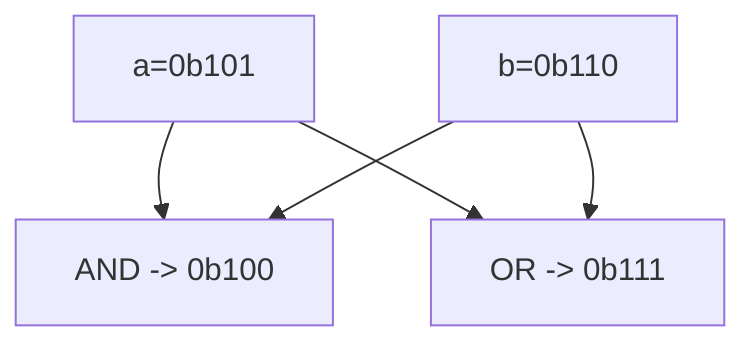

**📖 Cara Membaca Diagram:**
a=5 (0b101), b=6 (0b110). AND cari yang sama-sama 1. OR lumayan rakus ambil semua 1.

---
### Soal 27 (Bitwise AND/OR)
```cpp
int a = 3;
int b = 6;
int res_and = a & b;
int res_or = a | b;
```
**Pertanyaan:**
1. Berapakah nilai `res_and`?
2. Berapakah nilai `res_or`?
3. Apa guna bitwise AND dalam mengecek angka ganjil?

**Jawaban & Diagnosis:**
1. **2**
2. **7**
3. **Untuk mengecek bit terakhir (x & 1). Jika hasilnya 1, maka ganjil.**

**Mermaid Flowchart:**
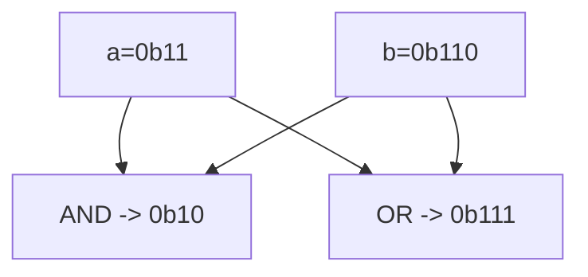

**📖 Cara Membaca Diagram:**
a=3 (0b11), b=6 (0b110). AND cari yang sama-sama 1. OR lumayan rakus ambil semua 1.

---
### Soal 28 (Left Shift Power)
```cpp
int a = 4;
int res = a << 2;
```
**Pertanyaan:**
1. Berapakah nilai akhir `res`?
2. Shift kiri sejauh 2 langkah setara dengan mengalikan `a` dengan angka berapa?
3. Apa yang terjadi pada bit-bit angka jika di-shift ke kiri?

**Jawaban & Diagnosis:**
1. **16**
2. **4**
3. **Bit bergeser ke kiri, dan muncul angka 0 di sebelah kanan (seperti nambah digit).**

**Mermaid Flowchart:**
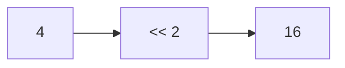

**📖 Cara Membaca Diagram:**
a=4. Shift kiri 2 kali = 4 * 2^2 = 16.

---
### Soal 29 (Bitwise XOR Trick)
```cpp
int x = 19;
int res = x ^ x ^ 20;
```
**Pertanyaan:**
1. Berapakah nilai akhir `res`?
2. Apa yang terjadi jika angka yang sama di-XOR (`x ^ x`)?
3. Apa analogi yang cocok untuk XOR?

**Jawaban & Diagnosis:**
1. **20**
2. **Hasilnya menjadi 0 (Saling meniadakan).**
3. **Saklar lampu (Tekan 2x balik ke awal/padam).**

**Mermaid Flowchart:**
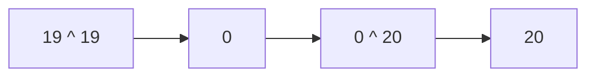

**📖 Cara Membaca Diagram:**
x ^ x = 0. Jadi 0 ^ 20 = 20.

---
### Soal 30 (Bitwise XOR Trick)
```cpp
int x = 7;
int res = x ^ x ^ 8;
```
**Pertanyaan:**
1. Berapakah nilai akhir `res`?
2. Apa yang terjadi jika angka yang sama di-XOR (`x ^ x`)?
3. Apa analogi yang cocok untuk XOR?

**Jawaban & Diagnosis:**
1. **8**
2. **Hasilnya menjadi 0 (Saling meniadakan).**
3. **Saklar lampu (Tekan 2x balik ke awal/padam).**

**Mermaid Flowchart:**
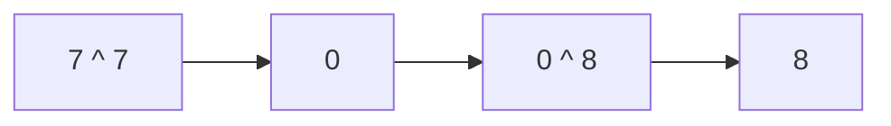

**📖 Cara Membaca Diagram:**
x ^ x = 0. Jadi 0 ^ 8 = 8.

---
### Soal 31 (Bitwise AND/OR)
```cpp
int a = 6;
int b = 4;
int res_and = a & b;
int res_or = a | b;
```
**Pertanyaan:**
1. Berapakah nilai `res_and`?
2. Berapakah nilai `res_or`?
3. Apa guna bitwise AND dalam mengecek angka ganjil?

**Jawaban & Diagnosis:**
1. **4**
2. **6**
3. **Untuk mengecek bit terakhir (x & 1). Jika hasilnya 1, maka ganjil.**

**Mermaid Flowchart:**
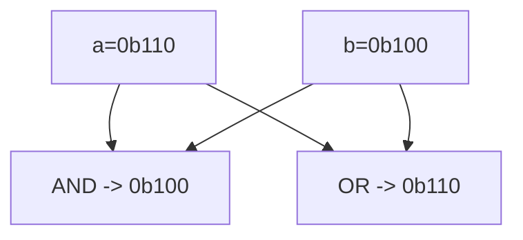

**📖 Cara Membaca Diagram:**
a=6 (0b110), b=4 (0b100). AND cari yang sama-sama 1. OR lumayan rakus ambil semua 1.

---
### Soal 32 (Bitwise XOR Trick)
```cpp
int x = 61;
int res = x ^ x ^ 62;
```
**Pertanyaan:**
1. Berapakah nilai akhir `res`?
2. Apa yang terjadi jika angka yang sama di-XOR (`x ^ x`)?
3. Apa analogi yang cocok untuk XOR?

**Jawaban & Diagnosis:**
1. **62**
2. **Hasilnya menjadi 0 (Saling meniadakan).**
3. **Saklar lampu (Tekan 2x balik ke awal/padam).**

**Mermaid Flowchart:**
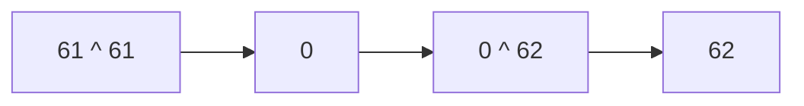

**📖 Cara Membaca Diagram:**
x ^ x = 0. Jadi 0 ^ 62 = 62.

---
### Soal 33 (Bitwise XOR Trick)
```cpp
int x = 98;
int res = x ^ x ^ 99;
```
**Pertanyaan:**
1. Berapakah nilai akhir `res`?
2. Apa yang terjadi jika angka yang sama di-XOR (`x ^ x`)?
3. Apa analogi yang cocok untuk XOR?

**Jawaban & Diagnosis:**
1. **99**
2. **Hasilnya menjadi 0 (Saling meniadakan).**
3. **Saklar lampu (Tekan 2x balik ke awal/padam).**

**Mermaid Flowchart:**
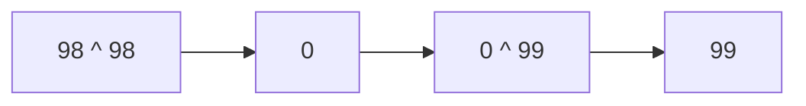

**📖 Cara Membaca Diagram:**
x ^ x = 0. Jadi 0 ^ 99 = 99.

---
### Soal 34 (Bitwise XOR Trick)
```cpp
int x = 76;
int res = x ^ x ^ 77;
```
**Pertanyaan:**
1. Berapakah nilai akhir `res`?
2. Apa yang terjadi jika angka yang sama di-XOR (`x ^ x`)?
3. Apa analogi yang cocok untuk XOR?

**Jawaban & Diagnosis:**
1. **77**
2. **Hasilnya menjadi 0 (Saling meniadakan).**
3. **Saklar lampu (Tekan 2x balik ke awal/padam).**

**Mermaid Flowchart:**
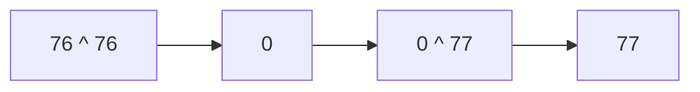

**📖 Cara Membaca Diagram:**
x ^ x = 0. Jadi 0 ^ 77 = 77.

---
### Soal 35 (Right Shift Div)
```cpp
int a = 35;
int res = a >> 1;
```
**Pertanyaan:**
1. Berapakah nilai akhir `res`?
2. Shift kanan sejauh 1 langkah setara dengan membagi `a` dengan angka berapa?
3. Mengapa shift kanan sering dipakai untuk optimasi?

**Jawaban & Diagnosis:**
1. **17**
2. **2**
3. **Karena pembagian oleh pangkat 2 jauh lebih cepat bagi prosesor daripada operator pembagian biasa.**

**Mermaid Flowchart:**
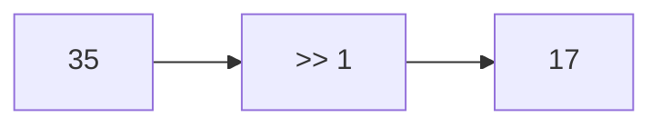

**📖 Cara Membaca Diagram:**
a=35. Shift kanan 1 kali = 35 / 2^1 = 17.

---
### Soal 36 (Left Shift Power)
```cpp
int a = 3;
int res = a << 2;
```
**Pertanyaan:**
1. Berapakah nilai akhir `res`?
2. Shift kiri sejauh 2 langkah setara dengan mengalikan `a` dengan angka berapa?
3. Apa yang terjadi pada bit-bit angka jika di-shift ke kiri?

**Jawaban & Diagnosis:**
1. **12**
2. **4**
3. **Bit bergeser ke kiri, dan muncul angka 0 di sebelah kanan (seperti nambah digit).**

**Mermaid Flowchart:**
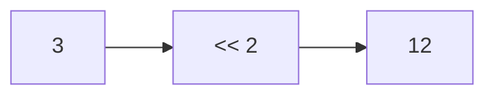

**📖 Cara Membaca Diagram:**
a=3. Shift kiri 2 kali = 3 * 2^2 = 12.

---
### Soal 37 (Right Shift Div)
```cpp
int a = 37;
int res = a >> 1;
```
**Pertanyaan:**
1. Berapakah nilai akhir `res`?
2. Shift kanan sejauh 1 langkah setara dengan membagi `a` dengan angka berapa?
3. Mengapa shift kanan sering dipakai untuk optimasi?

**Jawaban & Diagnosis:**
1. **18**
2. **2**
3. **Karena pembagian oleh pangkat 2 jauh lebih cepat bagi prosesor daripada operator pembagian biasa.**

**Mermaid Flowchart:**
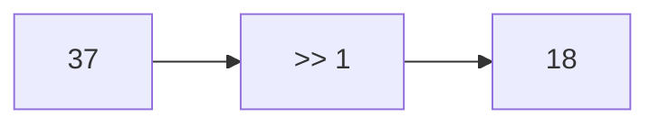

**📖 Cara Membaca Diagram:**
a=37. Shift kanan 1 kali = 37 / 2^1 = 18.

---
### Soal 38 (Right Shift Div)
```cpp
int a = 47;
int res = a >> 1;
```
**Pertanyaan:**
1. Berapakah nilai akhir `res`?
2. Shift kanan sejauh 1 langkah setara dengan membagi `a` dengan angka berapa?
3. Mengapa shift kanan sering dipakai untuk optimasi?

**Jawaban & Diagnosis:**
1. **23**
2. **2**
3. **Karena pembagian oleh pangkat 2 jauh lebih cepat bagi prosesor daripada operator pembagian biasa.**

**Mermaid Flowchart:**
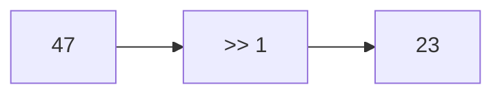

**📖 Cara Membaca Diagram:**
a=47. Shift kanan 1 kali = 47 / 2^1 = 23.

---
### Soal 39 (Bitwise XOR Trick)
```cpp
int x = 56;
int res = x ^ x ^ 57;
```
**Pertanyaan:**
1. Berapakah nilai akhir `res`?
2. Apa yang terjadi jika angka yang sama di-XOR (`x ^ x`)?
3. Apa analogi yang cocok untuk XOR?

**Jawaban & Diagnosis:**
1. **57**
2. **Hasilnya menjadi 0 (Saling meniadakan).**
3. **Saklar lampu (Tekan 2x balik ke awal/padam).**

**Mermaid Flowchart:**


**📖 Cara Membaca Diagram:**
x ^ x = 0. Jadi 0 ^ 57 = 57.

---
### Soal 40 (Bitwise XOR Trick)
```cpp
int x = 70;
int res = x ^ x ^ 71;
```
**Pertanyaan:**
1. Berapakah nilai akhir `res`?
2. Apa yang terjadi jika angka yang sama di-XOR (`x ^ x`)?
3. Apa analogi yang cocok untuk XOR?

**Jawaban & Diagnosis:**
1. **71**
2. **Hasilnya menjadi 0 (Saling meniadakan).**
3. **Saklar lampu (Tekan 2x balik ke awal/padam).**

**Mermaid Flowchart:**
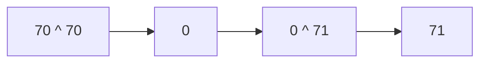

**📖 Cara Membaca Diagram:**
x ^ x = 0. Jadi 0 ^ 71 = 71.

---
### Soal 41 (Bitwise AND/OR)
```cpp
int a = 4;
int b = 6;
int res_and = a & b;
int res_or = a | b;
```
**Pertanyaan:**
1. Berapakah nilai `res_and`?
2. Berapakah nilai `res_or`?
3. Apa guna bitwise AND dalam mengecek angka ganjil?

**Jawaban & Diagnosis:**
1. **4**
2. **6**
3. **Untuk mengecek bit terakhir (x & 1). Jika hasilnya 1, maka ganjil.**

**Mermaid Flowchart:**
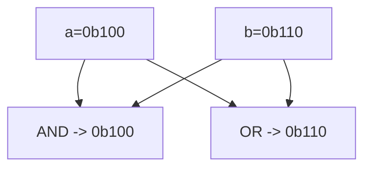

**📖 Cara Membaca Diagram:**
a=4 (0b100), b=6 (0b110). AND cari yang sama-sama 1. OR lumayan rakus ambil semua 1.

---
### Soal 42 (Right Shift Div)
```cpp
int a = 44;
int res = a >> 1;
```
**Pertanyaan:**
1. Berapakah nilai akhir `res`?
2. Shift kanan sejauh 1 langkah setara dengan membagi `a` dengan angka berapa?
3. Mengapa shift kanan sering dipakai untuk optimasi?

**Jawaban & Diagnosis:**
1. **22**
2. **2**
3. **Karena pembagian oleh pangkat 2 jauh lebih cepat bagi prosesor daripada operator pembagian biasa.**

**Mermaid Flowchart:**
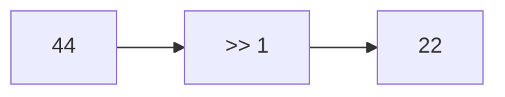

**📖 Cara Membaca Diagram:**
a=44. Shift kanan 1 kali = 44 / 2^1 = 22.

---
### Soal 43 (Bitwise XOR Trick)
```cpp
int x = 44;
int res = x ^ x ^ 45;
```
**Pertanyaan:**
1. Berapakah nilai akhir `res`?
2. Apa yang terjadi jika angka yang sama di-XOR (`x ^ x`)?
3. Apa analogi yang cocok untuk XOR?

**Jawaban & Diagnosis:**
1. **45**
2. **Hasilnya menjadi 0 (Saling meniadakan).**
3. **Saklar lampu (Tekan 2x balik ke awal/padam).**

**Mermaid Flowchart:**
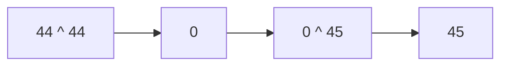

**📖 Cara Membaca Diagram:**
x ^ x = 0. Jadi 0 ^ 45 = 45.

---
### Soal 44 (Right Shift Div)
```cpp
int a = 21;
int res = a >> 1;
```
**Pertanyaan:**
1. Berapakah nilai akhir `res`?
2. Shift kanan sejauh 1 langkah setara dengan membagi `a` dengan angka berapa?
3. Mengapa shift kanan sering dipakai untuk optimasi?

**Jawaban & Diagnosis:**
1. **10**
2. **2**
3. **Karena pembagian oleh pangkat 2 jauh lebih cepat bagi prosesor daripada operator pembagian biasa.**

**Mermaid Flowchart:**
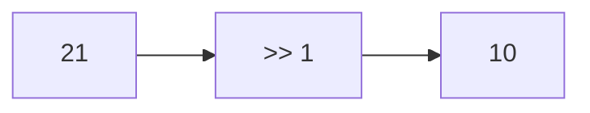

**📖 Cara Membaca Diagram:**
a=21. Shift kanan 1 kali = 21 / 2^1 = 10.

---
### Soal 45 (Left Shift Power)
```cpp
int a = 9;
int res = a << 3;
```
**Pertanyaan:**
1. Berapakah nilai akhir `res`?
2. Shift kiri sejauh 3 langkah setara dengan mengalikan `a` dengan angka berapa?
3. Apa yang terjadi pada bit-bit angka jika di-shift ke kiri?

**Jawaban & Diagnosis:**
1. **72**
2. **8**
3. **Bit bergeser ke kiri, dan muncul angka 0 di sebelah kanan (seperti nambah digit).**

**Mermaid Flowchart:**
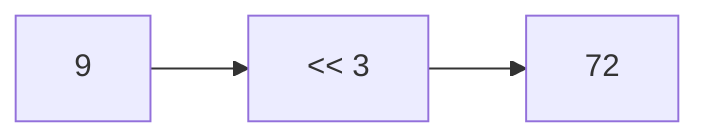

**📖 Cara Membaca Diagram:**
a=9. Shift kiri 3 kali = 9 * 2^3 = 72.

---
### Soal 46 (Bitwise XOR Trick)
```cpp
int x = 20;
int res = x ^ x ^ 21;
```
**Pertanyaan:**
1. Berapakah nilai akhir `res`?
2. Apa yang terjadi jika angka yang sama di-XOR (`x ^ x`)?
3. Apa analogi yang cocok untuk XOR?

**Jawaban & Diagnosis:**
1. **21**
2. **Hasilnya menjadi 0 (Saling meniadakan).**
3. **Saklar lampu (Tekan 2x balik ke awal/padam).**

**Mermaid Flowchart:**
```mermaid
graph LR
    A["20 ^ 20"] --> B[0]
    B --> C["0 ^ 21"]
    C --> D["21"]
```

**📖 Cara Membaca Diagram:**
x ^ x = 0. Jadi 0 ^ 21 = 21.

---
### Soal 47 (Left Shift Power)
```cpp
int a = 1;
int res = a << 3;
```
**Pertanyaan:**
1. Berapakah nilai akhir `res`?
2. Shift kiri sejauh 3 langkah setara dengan mengalikan `a` dengan angka berapa?
3. Apa yang terjadi pada bit-bit angka jika di-shift ke kiri?

**Jawaban & Diagnosis:**
1. **8**
2. **8**
3. **Bit bergeser ke kiri, dan muncul angka 0 di sebelah kanan (seperti nambah digit).**

**Mermaid Flowchart:**
```mermaid
graph LR
    A[1] --> B["<< 3"]
    B --> C[8]
```

**📖 Cara Membaca Diagram:**
a=1. Shift kiri 3 kali = 1 * 2^3 = 8.

---
### Soal 48 (Bitwise XOR Trick)
```cpp
int x = 16;
int res = x ^ x ^ 17;
```
**Pertanyaan:**
1. Berapakah nilai akhir `res`?
2. Apa yang terjadi jika angka yang sama di-XOR (`x ^ x`)?
3. Apa analogi yang cocok untuk XOR?

**Jawaban & Diagnosis:**
1. **17**
2. **Hasilnya menjadi 0 (Saling meniadakan).**
3. **Saklar lampu (Tekan 2x balik ke awal/padam).**

**Mermaid Flowchart:**
```mermaid
graph LR
    A["16 ^ 16"] --> B[0]
    B --> C["0 ^ 17"]
    C --> D["17"]
```

**📖 Cara Membaca Diagram:**
x ^ x = 0. Jadi 0 ^ 17 = 17.

---
### Soal 49 (Right Shift Div)
```cpp
int a = 26;
int res = a >> 1;
```
**Pertanyaan:**
1. Berapakah nilai akhir `res`?
2. Shift kanan sejauh 1 langkah setara dengan membagi `a` dengan angka berapa?
3. Mengapa shift kanan sering dipakai untuk optimasi?

**Jawaban & Diagnosis:**
1. **13**
2. **2**
3. **Karena pembagian oleh pangkat 2 jauh lebih cepat bagi prosesor daripada operator pembagian biasa.**

**Mermaid Flowchart:**
```mermaid
graph LR
    A[26] --> B[">> 1"]
    B --> C[13]
```

**📖 Cara Membaca Diagram:**
a=26. Shift kanan 1 kali = 26 / 2^1 = 13.

---
### Soal 50 (Bitwise AND/OR)
```cpp
int a = 7;
int b = 7;
int res_and = a & b;
int res_or = a | b;
```
**Pertanyaan:**
1. Berapakah nilai `res_and`?
2. Berapakah nilai `res_or`?
3. Apa guna bitwise AND dalam mengecek angka ganjil?

**Jawaban & Diagnosis:**
1. **7**
2. **7**
3. **Untuk mengecek bit terakhir (x & 1). Jika hasilnya 1, maka ganjil.**

**Mermaid Flowchart:**
```mermaid
graph TD
    A["a=0b111"] --> C["AND -> 0b111"]
    B["b=0b111"] --> C
    A --> D["OR  -> 0b111"]
    B --> D
```

**📖 Cara Membaca Diagram:**
a=7 (0b111), b=7 (0b111). AND cari yang sama-sama 1. OR lumayan rakus ambil semua 1.

---
