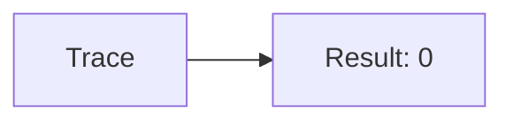
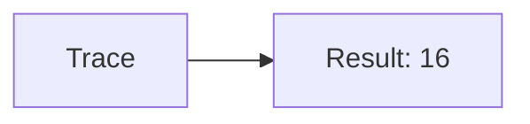
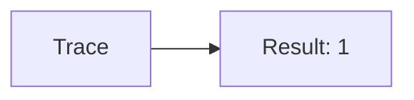
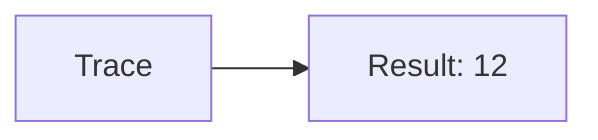
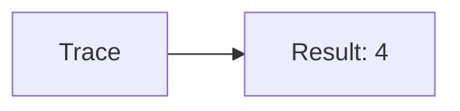

🔙 **[Kembali ke Daftar Soal](./README.md)**

---

# Latihan Soal Part C - Modul 06 - Set 02

### Soal 26
```cpp
// Mult: XOR Toggle
int val = 14;
int res = val ^ val;
```
**Pertanyaan:**
1. Berapakah hasil akhirnya?
2. Deskripsikan alur pikir 'Compiler Manusia' untuk soal ini!

**Jawaban & Diagnosis:**
1. **0**
2. XOR dengan diri sendiri selalu 0.

**Mermaid Flowchart:**


---
### Soal 27
```cpp
// Div: Shift Left
int val = 8;
int res = val << 1;
```
**Pertanyaan:**
1. Berapakah hasil akhirnya?
2. Deskripsikan alur pikir 'Compiler Manusia' untuk soal ini!

**Jawaban & Diagnosis:**
1. **16**
2. 8 digeser kiri 1x = dikali 2 = 16.

**Mermaid Flowchart:**


---
### Soal 28
```cpp
// Alu: AND Mask
int val = 12;
int res = val & 1;
```
**Pertanyaan:**
1. Berapakah hasil akhirnya?
2. Deskripsikan alur pikir 'Compiler Manusia' untuk soal ini!

**Jawaban & Diagnosis:**
1. **0**
2. Mengecek bit terakhir dari 12 (0b1100). Hasil: 0.

**Mermaid Flowchart:**


---
### Soal 29
```cpp
// Cpu: XOR Toggle
int val = 6;
int res = val ^ val;
```
**Pertanyaan:**
1. Berapakah hasil akhirnya?
2. Deskripsikan alur pikir 'Compiler Manusia' untuk soal ini!

**Jawaban & Diagnosis:**
1. **0**
2. XOR dengan diri sendiri selalu 0.

**Mermaid Flowchart:**


---
### Soal 30
```cpp
// Bus: Shift Left
int val = 3;
int res = val << 1;
```
**Pertanyaan:**
1. Berapakah hasil akhirnya?
2. Deskripsikan alur pikir 'Compiler Manusia' untuk soal ini!

**Jawaban & Diagnosis:**
1. **6**
2. 3 digeser kiri 1x = dikali 2 = 6.

**Mermaid Flowchart:**


---
### Soal 31
```cpp
// Line: AND Mask
int val = 3;
int res = val & 1;
```
**Pertanyaan:**
1. Berapakah hasil akhirnya?
2. Deskripsikan alur pikir 'Compiler Manusia' untuk soal ini!

**Jawaban & Diagnosis:**
1. **1**
2. Mengecek bit terakhir dari 3 (0b11). Hasil: 1.

**Mermaid Flowchart:**


---
### Soal 32
```cpp
// Signal: XOR Toggle
int val = 14;
int res = val ^ val;
```
**Pertanyaan:**
1. Berapakah hasil akhirnya?
2. Deskripsikan alur pikir 'Compiler Manusia' untuk soal ini!

**Jawaban & Diagnosis:**
1. **0**
2. XOR dengan diri sendiri selalu 0.

**Mermaid Flowchart:**


---
### Soal 33
```cpp
// Wave: Shift Left
int val = 6;
int res = val << 1;
```
**Pertanyaan:**
1. Berapakah hasil akhirnya?
2. Deskripsikan alur pikir 'Compiler Manusia' untuk soal ini!

**Jawaban & Diagnosis:**
1. **12**
2. 6 digeser kiri 1x = dikali 2 = 12.

**Mermaid Flowchart:**


---
### Soal 34
```cpp
// Freq: AND Mask
int val = 3;
int res = val & 1;
```
**Pertanyaan:**
1. Berapakah hasil akhirnya?
2. Deskripsikan alur pikir 'Compiler Manusia' untuk soal ini!

**Jawaban & Diagnosis:**
1. **1**
2. Mengecek bit terakhir dari 3 (0b11). Hasil: 1.

**Mermaid Flowchart:**


---
### Soal 35
```cpp
// Phase: XOR Toggle
int val = 12;
int res = val ^ val;
```
**Pertanyaan:**
1. Berapakah hasil akhirnya?
2. Deskripsikan alur pikir 'Compiler Manusia' untuk soal ini!

**Jawaban & Diagnosis:**
1. **0**
2. XOR dengan diri sendiri selalu 0.

**Mermaid Flowchart:**


---
### Soal 36
```cpp
// Ampl: Shift Left
int val = 13;
int res = val << 1;
```
**Pertanyaan:**
1. Berapakah hasil akhirnya?
2. Deskripsikan alur pikir 'Compiler Manusia' untuk soal ini!

**Jawaban & Diagnosis:**
1. **26**
2. 13 digeser kiri 1x = dikali 2 = 26.

**Mermaid Flowchart:**


---
### Soal 37
```cpp
// Res: AND Mask
int val = 1;
int res = val & 1;
```
**Pertanyaan:**
1. Berapakah hasil akhirnya?
2. Deskripsikan alur pikir 'Compiler Manusia' untuk soal ini!

**Jawaban & Diagnosis:**
1. **1**
2. Mengecek bit terakhir dari 1 (0b1). Hasil: 1.

**Mermaid Flowchart:**


---
### Soal 38
```cpp
// Cap: XOR Toggle
int val = 14;
int res = val ^ val;
```
**Pertanyaan:**
1. Berapakah hasil akhirnya?
2. Deskripsikan alur pikir 'Compiler Manusia' untuk soal ini!

**Jawaban & Diagnosis:**
1. **0**
2. XOR dengan diri sendiri selalu 0.

**Mermaid Flowchart:**


---
### Soal 39
```cpp
// Ind: Shift Left
int val = 13;
int res = val << 1;
```
**Pertanyaan:**
1. Berapakah hasil akhirnya?
2. Deskripsikan alur pikir 'Compiler Manusia' untuk soal ini!

**Jawaban & Diagnosis:**
1. **26**
2. 13 digeser kiri 1x = dikali 2 = 26.

**Mermaid Flowchart:**


---
### Soal 40
```cpp
// Diode: AND Mask
int val = 10;
int res = val & 1;
```
**Pertanyaan:**
1. Berapakah hasil akhirnya?
2. Deskripsikan alur pikir 'Compiler Manusia' untuk soal ini!

**Jawaban & Diagnosis:**
1. **0**
2. Mengecek bit terakhir dari 10 (0b1010). Hasil: 0.

**Mermaid Flowchart:**


---
### Soal 41
```cpp
// Trans: XOR Toggle
int val = 1;
int res = val ^ val;
```
**Pertanyaan:**
1. Berapakah hasil akhirnya?
2. Deskripsikan alur pikir 'Compiler Manusia' untuk soal ini!

**Jawaban & Diagnosis:**
1. **0**
2. XOR dengan diri sendiri selalu 0.

**Mermaid Flowchart:**


---
### Soal 42
```cpp
// Ic: Shift Left
int val = 2;
int res = val << 1;
```
**Pertanyaan:**
1. Berapakah hasil akhirnya?
2. Deskripsikan alur pikir 'Compiler Manusia' untuk soal ini!

**Jawaban & Diagnosis:**
1. **4**
2. 2 digeser kiri 1x = dikali 2 = 4.

**Mermaid Flowchart:**


---
### Soal 43
```cpp
// Chip: AND Mask
int val = 9;
int res = val & 1;
```
**Pertanyaan:**
1. Berapakah hasil akhirnya?
2. Deskripsikan alur pikir 'Compiler Manusia' untuk soal ini!

**Jawaban & Diagnosis:**
1. **1**
2. Mengecek bit terakhir dari 9 (0b1001). Hasil: 1.

**Mermaid Flowchart:**


---
### Soal 44
```cpp
// Pcb: XOR Toggle
int val = 7;
int res = val ^ val;
```
**Pertanyaan:**
1. Berapakah hasil akhirnya?
2. Deskripsikan alur pikir 'Compiler Manusia' untuk soal ini!

**Jawaban & Diagnosis:**
1. **0**
2. XOR dengan diri sendiri selalu 0.

**Mermaid Flowchart:**


---
### Soal 45
```cpp
// Board: Shift Left
int val = 10;
int res = val << 1;
```
**Pertanyaan:**
1. Berapakah hasil akhirnya?
2. Deskripsikan alur pikir 'Compiler Manusia' untuk soal ini!

**Jawaban & Diagnosis:**
1. **20**
2. 10 digeser kiri 1x = dikali 2 = 20.

**Mermaid Flowchart:**


---
### Soal 46
```cpp
// Schema: AND Mask
int val = 5;
int res = val & 1;
```
**Pertanyaan:**
1. Berapakah hasil akhirnya?
2. Deskripsikan alur pikir 'Compiler Manusia' untuk soal ini!

**Jawaban & Diagnosis:**
1. **1**
2. Mengecek bit terakhir dari 5 (0b101). Hasil: 1.

**Mermaid Flowchart:**
```mermaid
graph LR
A[Trace] --> B[Result: 1]
```

---
### Soal 47
```cpp
// Power: XOR Toggle
int val = 7;
int res = val ^ val;
```
**Pertanyaan:**
1. Berapakah hasil akhirnya?
2. Deskripsikan alur pikir 'Compiler Manusia' untuk soal ini!

**Jawaban & Diagnosis:**
1. **0**
2. XOR dengan diri sendiri selalu 0.

**Mermaid Flowchart:**
```mermaid
graph LR
A[Trace] --> B[Result: 0]
```

---
### Soal 48
```cpp
// Volt: Shift Left
int val = 13;
int res = val << 1;
```
**Pertanyaan:**
1. Berapakah hasil akhirnya?
2. Deskripsikan alur pikir 'Compiler Manusia' untuk soal ini!

**Jawaban & Diagnosis:**
1. **26**
2. 13 digeser kiri 1x = dikali 2 = 26.

**Mermaid Flowchart:**
```mermaid
graph LR
A[Trace] --> B[Result: 26]
```

---
### Soal 49
```cpp
// Amp: AND Mask
int val = 9;
int res = val & 1;
```
**Pertanyaan:**
1. Berapakah hasil akhirnya?
2. Deskripsikan alur pikir 'Compiler Manusia' untuk soal ini!

**Jawaban & Diagnosis:**
1. **1**
2. Mengecek bit terakhir dari 9 (0b1001). Hasil: 1.

**Mermaid Flowchart:**
```mermaid
graph LR
A[Trace] --> B[Result: 1]
```

---
### Soal 50
```cpp
// Watt: XOR Toggle
int val = 3;
int res = val ^ val;
```
**Pertanyaan:**
1. Berapakah hasil akhirnya?
2. Deskripsikan alur pikir 'Compiler Manusia' untuk soal ini!

**Jawaban & Diagnosis:**
1. **0**
2. XOR dengan diri sendiri selalu 0.

**Mermaid Flowchart:**
```mermaid
graph LR
A[Trace] --> B[Result: 0]
```

---
