🔙 **[Kembali ke Daftar Soal](./README.md)**

---

# Latihan Soal Part C - Modul 06 - Set 02

### Soal 26
```cpp
int res = 11 ^ 12;
```
**Pertanyaan:**
1. Berapakah hasil akhirnya?
2. Mengapa demikian?

**Jawaban & Diagnosis:**
1. **7**
2. Lihat Tracing.

**Mermaid Flowchart:**
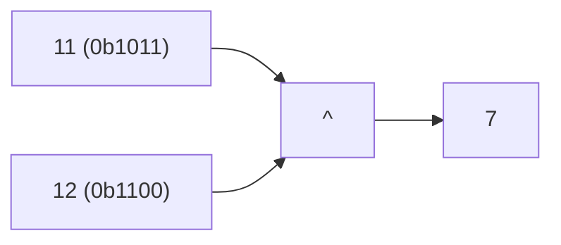

**📖 Penjelasan:**
**Langkah Tracing:**
1. Ubah 11 ke biner (0b1011).
2. Jalankan ^.
3. Hasil: 7.

---
### Soal 27
```cpp
int res = 14 ^ 9;
```
**Pertanyaan:**
1. Berapakah hasil akhirnya?
2. Mengapa demikian?

**Jawaban & Diagnosis:**
1. **7**
2. Lihat Tracing.

**Mermaid Flowchart:**
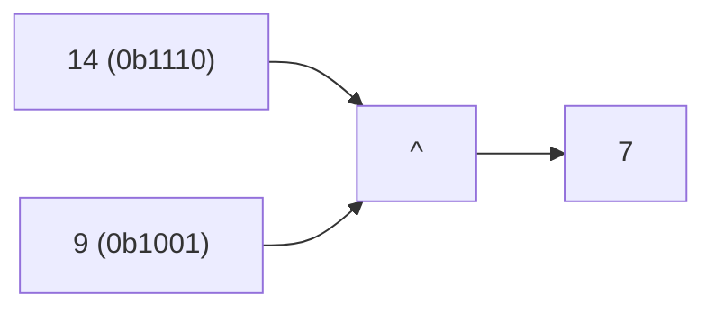

**📖 Penjelasan:**
**Langkah Tracing:**
1. Ubah 14 ke biner (0b1110).
2. Jalankan ^.
3. Hasil: 7.

---
### Soal 28
```cpp
int res = 11 | 8;
```
**Pertanyaan:**
1. Berapakah hasil akhirnya?
2. Mengapa demikian?

**Jawaban & Diagnosis:**
1. **11**
2. Lihat Tracing.

**Mermaid Flowchart:**


**📖 Penjelasan:**
**Langkah Tracing:**
1. Ubah 11 ke biner (0b1011).
2. Jalankan |.
3. Hasil: 11.

---
### Soal 29
```cpp
int res = 14 ^ 14;
```
**Pertanyaan:**
1. Berapakah hasil akhirnya?
2. Mengapa demikian?

**Jawaban & Diagnosis:**
1. **0**
2. Lihat Tracing.

**Mermaid Flowchart:**


**📖 Penjelasan:**
**Langkah Tracing:**
1. Ubah 14 ke biner (0b1110).
2. Jalankan ^.
3. Hasil: 0.

---
### Soal 30
```cpp
int res = 3 & 2;
```
**Pertanyaan:**
1. Berapakah hasil akhirnya?
2. Mengapa demikian?

**Jawaban & Diagnosis:**
1. **2**
2. Lihat Tracing.

**Mermaid Flowchart:**
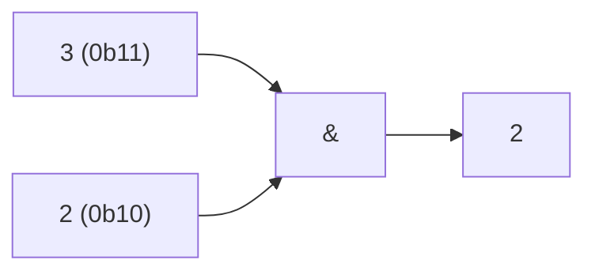

**📖 Penjelasan:**
**Langkah Tracing:**
1. Ubah 3 ke biner (0b11).
2. Jalankan &.
3. Hasil: 2.

---
### Soal 31
```cpp
int res = 2 >> 3;
```
**Pertanyaan:**
1. Berapakah hasil akhirnya?
2. Mengapa demikian?

**Jawaban & Diagnosis:**
1. **0**
2. Lihat Tracing.

**Mermaid Flowchart:**
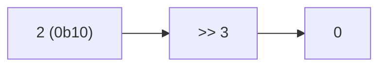

**📖 Penjelasan:**
**Langkah Tracing:**
1. Ubah 2 ke biner (0b10).
2. Jalankan >>.
3. Hasil: 0.

---
### Soal 32
```cpp
int res = 13 | 4;
```
**Pertanyaan:**
1. Berapakah hasil akhirnya?
2. Mengapa demikian?

**Jawaban & Diagnosis:**
1. **13**
2. Lihat Tracing.

**Mermaid Flowchart:**
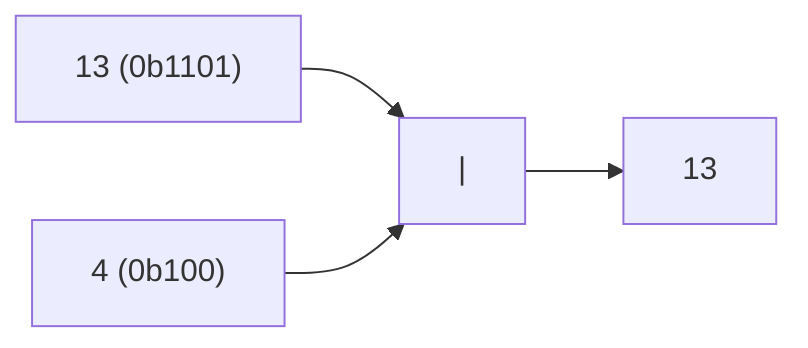

**📖 Penjelasan:**
**Langkah Tracing:**
1. Ubah 13 ke biner (0b1101).
2. Jalankan |.
3. Hasil: 13.

---
### Soal 33
```cpp
int res = 6 & 7;
```
**Pertanyaan:**
1. Berapakah hasil akhirnya?
2. Mengapa demikian?

**Jawaban & Diagnosis:**
1. **6**
2. Lihat Tracing.

**Mermaid Flowchart:**
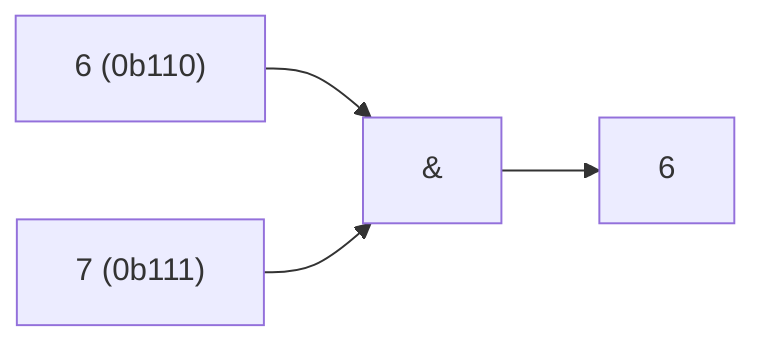

**📖 Penjelasan:**
**Langkah Tracing:**
1. Ubah 6 ke biner (0b110).
2. Jalankan &.
3. Hasil: 6.

---
### Soal 34
```cpp
int res = 10 ^ 10;
```
**Pertanyaan:**
1. Berapakah hasil akhirnya?
2. Mengapa demikian?

**Jawaban & Diagnosis:**
1. **0**
2. Lihat Tracing.

**Mermaid Flowchart:**
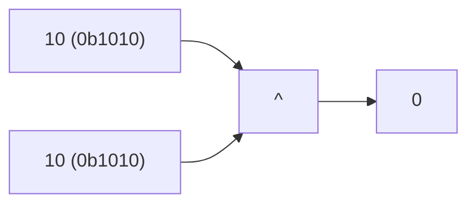

**📖 Penjelasan:**
**Langkah Tracing:**
1. Ubah 10 ke biner (0b1010).
2. Jalankan ^.
3. Hasil: 0.

---
### Soal 35
```cpp
int res = 11 ^ 12;
```
**Pertanyaan:**
1. Berapakah hasil akhirnya?
2. Mengapa demikian?

**Jawaban & Diagnosis:**
1. **7**
2. Lihat Tracing.

**Mermaid Flowchart:**


**📖 Penjelasan:**
**Langkah Tracing:**
1. Ubah 11 ke biner (0b1011).
2. Jalankan ^.
3. Hasil: 7.

---
### Soal 36
```cpp
int res = 4 & 14;
```
**Pertanyaan:**
1. Berapakah hasil akhirnya?
2. Mengapa demikian?

**Jawaban & Diagnosis:**
1. **4**
2. Lihat Tracing.

**Mermaid Flowchart:**
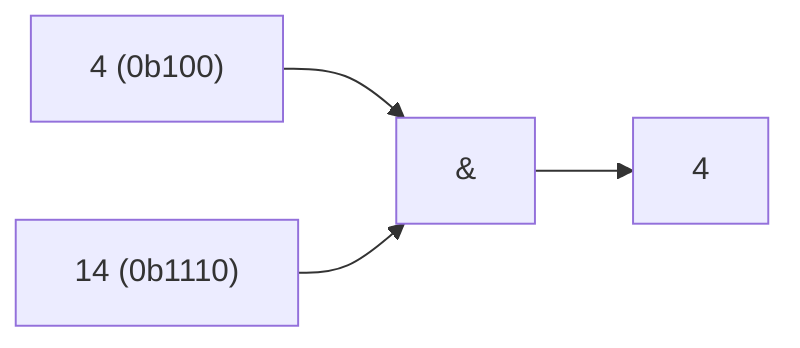

**📖 Penjelasan:**
**Langkah Tracing:**
1. Ubah 4 ke biner (0b100).
2. Jalankan &.
3. Hasil: 4.

---
### Soal 37
```cpp
int res = 15 ^ 11;
```
**Pertanyaan:**
1. Berapakah hasil akhirnya?
2. Mengapa demikian?

**Jawaban & Diagnosis:**
1. **4**
2. Lihat Tracing.

**Mermaid Flowchart:**


**📖 Penjelasan:**
**Langkah Tracing:**
1. Ubah 15 ke biner (0b1111).
2. Jalankan ^.
3. Hasil: 4.

---
### Soal 38
```cpp
int res = 14 << 1;
```
**Pertanyaan:**
1. Berapakah hasil akhirnya?
2. Mengapa demikian?

**Jawaban & Diagnosis:**
1. **28**
2. Lihat Tracing.

**Mermaid Flowchart:**
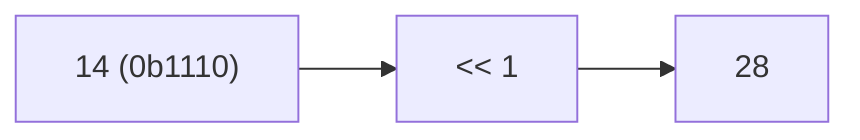

**📖 Penjelasan:**
**Langkah Tracing:**
1. Ubah 14 ke biner (0b1110).
2. Jalankan <<.
3. Hasil: 28.

---
### Soal 39
```cpp
int res = 10 ^ 11;
```
**Pertanyaan:**
1. Berapakah hasil akhirnya?
2. Mengapa demikian?

**Jawaban & Diagnosis:**
1. **1**
2. Lihat Tracing.

**Mermaid Flowchart:**
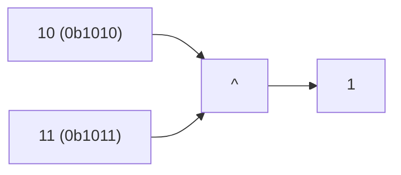

**📖 Penjelasan:**
**Langkah Tracing:**
1. Ubah 10 ke biner (0b1010).
2. Jalankan ^.
3. Hasil: 1.

---
### Soal 40
```cpp
int res = 8 ^ 6;
```
**Pertanyaan:**
1. Berapakah hasil akhirnya?
2. Mengapa demikian?

**Jawaban & Diagnosis:**
1. **14**
2. Lihat Tracing.

**Mermaid Flowchart:**
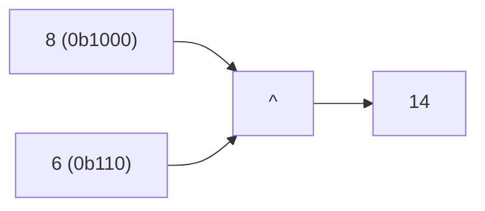

**📖 Penjelasan:**
**Langkah Tracing:**
1. Ubah 8 ke biner (0b1000).
2. Jalankan ^.
3. Hasil: 14.

---
### Soal 41
```cpp
int res = 14 & 13;
```
**Pertanyaan:**
1. Berapakah hasil akhirnya?
2. Mengapa demikian?

**Jawaban & Diagnosis:**
1. **12**
2. Lihat Tracing.

**Mermaid Flowchart:**
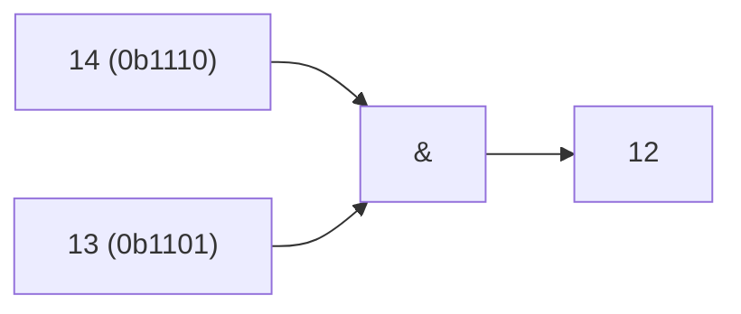

**📖 Penjelasan:**
**Langkah Tracing:**
1. Ubah 14 ke biner (0b1110).
2. Jalankan &.
3. Hasil: 12.

---
### Soal 42
```cpp
int res = 6 >> 2;
```
**Pertanyaan:**
1. Berapakah hasil akhirnya?
2. Mengapa demikian?

**Jawaban & Diagnosis:**
1. **1**
2. Lihat Tracing.

**Mermaid Flowchart:**
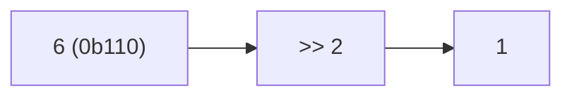

**📖 Penjelasan:**
**Langkah Tracing:**
1. Ubah 6 ke biner (0b110).
2. Jalankan >>.
3. Hasil: 1.

---
### Soal 43
```cpp
int res = 13 << 3;
```
**Pertanyaan:**
1. Berapakah hasil akhirnya?
2. Mengapa demikian?

**Jawaban & Diagnosis:**
1. **104**
2. Lihat Tracing.

**Mermaid Flowchart:**
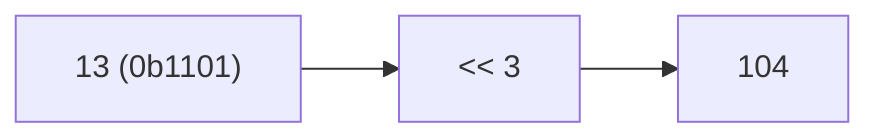

**📖 Penjelasan:**
**Langkah Tracing:**
1. Ubah 13 ke biner (0b1101).
2. Jalankan <<.
3. Hasil: 104.

---
### Soal 44
```cpp
int res = 15 ^ 9;
```
**Pertanyaan:**
1. Berapakah hasil akhirnya?
2. Mengapa demikian?

**Jawaban & Diagnosis:**
1. **6**
2. Lihat Tracing.

**Mermaid Flowchart:**
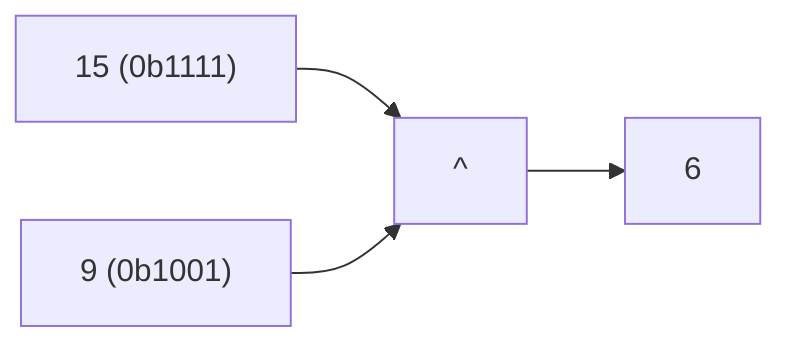

**📖 Penjelasan:**
**Langkah Tracing:**
1. Ubah 15 ke biner (0b1111).
2. Jalankan ^.
3. Hasil: 6.

---
### Soal 45
```cpp
int res = 12 ^ 4;
```
**Pertanyaan:**
1. Berapakah hasil akhirnya?
2. Mengapa demikian?

**Jawaban & Diagnosis:**
1. **8**
2. Lihat Tracing.

**Mermaid Flowchart:**
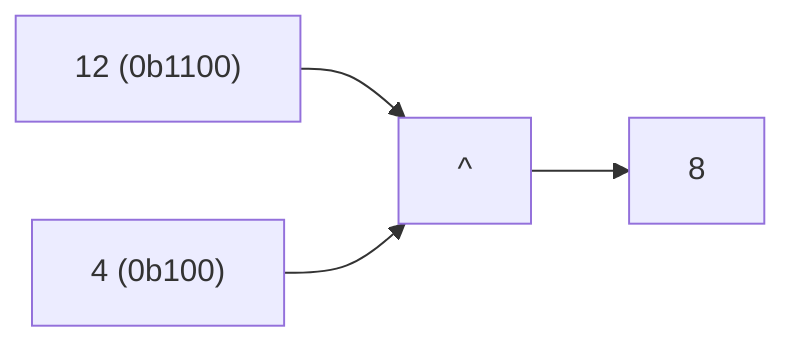

**📖 Penjelasan:**
**Langkah Tracing:**
1. Ubah 12 ke biner (0b1100).
2. Jalankan ^.
3. Hasil: 8.

---
### Soal 46
```cpp
int res = 13 ^ 12;
```
**Pertanyaan:**
1. Berapakah hasil akhirnya?
2. Mengapa demikian?

**Jawaban & Diagnosis:**
1. **1**
2. Lihat Tracing.

**Mermaid Flowchart:**
```mermaid
graph LR
A["13 (0b1101)"] --> C["^"]
B["12 (0b1100)"] --> C
C --> D["1"]
```

**📖 Penjelasan:**
**Langkah Tracing:**
1. Ubah 13 ke biner (0b1101).
2. Jalankan ^.
3. Hasil: 1.

---
### Soal 47
```cpp
int res = 10 ^ 9;
```
**Pertanyaan:**
1. Berapakah hasil akhirnya?
2. Mengapa demikian?

**Jawaban & Diagnosis:**
1. **3**
2. Lihat Tracing.

**Mermaid Flowchart:**
```mermaid
graph LR
A["10 (0b1010)"] --> C["^"]
B["9 (0b1001)"] --> C
C --> D["3"]
```

**📖 Penjelasan:**
**Langkah Tracing:**
1. Ubah 10 ke biner (0b1010).
2. Jalankan ^.
3. Hasil: 3.

---
### Soal 48
```cpp
int res = 2 >> 2;
```
**Pertanyaan:**
1. Berapakah hasil akhirnya?
2. Mengapa demikian?

**Jawaban & Diagnosis:**
1. **0**
2. Lihat Tracing.

**Mermaid Flowchart:**
```mermaid
graph LR
A["2 (0b10)"] --> B[">> 2"]
B --> C["0"]
```

**📖 Penjelasan:**
**Langkah Tracing:**
1. Ubah 2 ke biner (0b10).
2. Jalankan >>.
3. Hasil: 0.

---
### Soal 49
```cpp
int res = 4 & 2;
```
**Pertanyaan:**
1. Berapakah hasil akhirnya?
2. Mengapa demikian?

**Jawaban & Diagnosis:**
1. **0**
2. Lihat Tracing.

**Mermaid Flowchart:**
```mermaid
graph LR
A["4 (0b100)"] --> C["&"]
B["2 (0b10)"] --> C
C --> D["0"]
```

**📖 Penjelasan:**
**Langkah Tracing:**
1. Ubah 4 ke biner (0b100).
2. Jalankan &.
3. Hasil: 0.

---
### Soal 50
```cpp
int res = 11 ^ 6;
```
**Pertanyaan:**
1. Berapakah hasil akhirnya?
2. Mengapa demikian?

**Jawaban & Diagnosis:**
1. **13**
2. Lihat Tracing.

**Mermaid Flowchart:**
```mermaid
graph LR
A["11 (0b1011)"] --> C["^"]
B["6 (0b110)"] --> C
C --> D["13"]
```

**📖 Penjelasan:**
**Langkah Tracing:**
1. Ubah 11 ke biner (0b1011).
2. Jalankan ^.
3. Hasil: 13.

---
