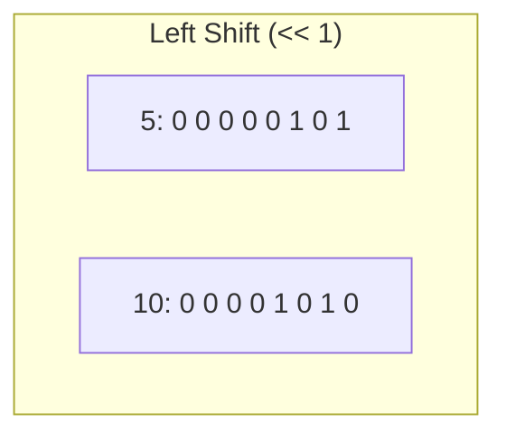
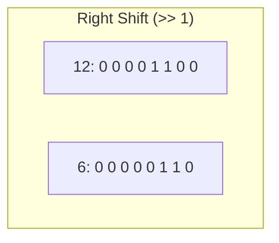
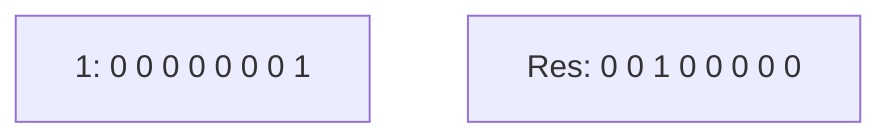
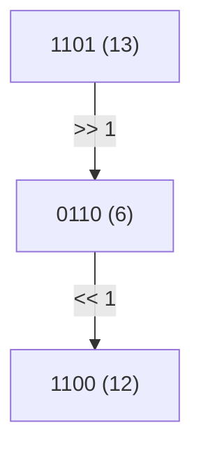

		🔙 **[Kembali ke Daftar Soal](./README.md)**

---

# Latihan Soal Part C - Modul 06 - Set 02 (Premium Edition)

---

### Soal 11: Geser Kiri Dasar (Left Shift)
```cpp
int x = 5; // 00000101
int y = x << 1;
```
**Pertanyaan:**
1. Berapakah nilai `y`?
2. Apa efek matematis dari menggeser bit ke kiri sebanyak 1 kali?

<details>
<summary><b>Klik untuk Lihat Jawaban & Diagnosis</b></summary>

**Mermaid Bit-Grid:**


**Jawaban:**
1. **10**
2. **Perkalian dengan 2.** Menggeser ke kiri 1 bit sama dengan mengalikan angka tersebut dengan $2^1$.
</details>

---

### Soal 12: Geser Kiri Lipat Tiga
```cpp
int x = 3; 
int y = x << 3;
```
**Pertanyaan:**
1. Berapakah nilai `y`?
2. Berapa nilai $2^3$?

<details>
<summary><b>Klik untuk Lihat Jawaban & Diagnosis</b></summary>

**Jawaban:**
1. **24** ($3 \times 2^3 = 3 \times 8 = 24$)
2. **8**
</details>

---

### Soal 13: Geser Kanan Dasar (Right Shift)
```cpp
int x = 12; // 00001100
int y = x >> 1;
```
**Pertanyaan:**
1. Berapakah nilai `y`?
2. Apa efek matematis dari menggeser bit ke kanan sebanyak 1 kali?

<details>
<summary><b>Klik untuk Lihat Jawaban & Diagnosis</b></summary>

**Mermaid Bit-Grid:**


**Jawaban:**
1. **6**
2. **Pembagian dengan 2** (pembulatan ke bawah).
</details>

---

### Soal 14: Kehilangan Presisi (Right Shift Odd)
```cpp
int x = 7; // 0111
int y = x >> 1;
```
**Pertanyaan:**
1. Berapakah nilai `y`?
2. Ke mana perginya bit '1' yang paling kanan (bit 0) setelah digeser?

<details>
<summary><b>Klik untuk Lihat Jawaban & Diagnosis</b></summary>

**Jawaban:**
1. **3** (Karena 7 / 2 = 3.5, dibulatkan ke bawah jadi 3).
2. **Terbuang.** Bit yang digeser keluar dari batas kanan akan hilang selamanya.
</details>

---

### Soal 15: Pangkat Dua Instan
```cpp
int x = 1 << 5;
```
**Pertanyaan:**
1. Berapakah nilai `x` dalam desimal?
2. Berapa hasil dari $2^5$?

<details>
<summary><b>Klik untuk Lihat Jawaban & Diagnosis</b></summary>

**Mermaid Bit-Grid:**


**Jawaban:**
1. **32**
2. **32**
</details>

---

### Soal 16: Kombo Geser dan Set
```cpp
int n = 5; // 101
int res = (n << 1) | 1;
```
**Pertanyaan:**
1. Berapakah nilai `res`?
2. Tunjukkan langkah binernya!

<details>
<summary><b>Klik untuk Lihat Jawaban & Diagnosis</b></summary>

**Jawaban:**
1. **11**
   - 101 << 1 = 1010 (Sepuluh)
   - 1010 | 0001 = **1011** (Sebelas)
</details>

---

### Soal 17: Pembersihan Bit Rendah
```cpp
int n = 13; // 1101
int res = (n >> 1) << 1;
```
**Pertanyaan:**
1. Berapakah nilai `res`?
2. Apa fungsi dari kombinasi `>> 1` diikuti `<< 1`?

<details>
<summary><b>Klik untuk Lihat Jawaban & Diagnosis</b></summary>

**Mermaid Bit-Grid:**


**Jawaban:**
1. **12**
2. **Memaksa angka menjadi Genap.** Ia membuang bit terakhir (bit keberadaan nilai ganjil) dan menggantinya dengan 0.
</details>

---

### Soal 18: Geser Kiri pada Angka Besar
```cpp
unsigned char c = 128; // 10000000
unsigned char res = c << 1;
```
**Pertanyaan:**
1. Berapakah nilai `res`?
2. Apa yang terjadi pada bit '1' yang paling kiri?

<details>
<summary><b>Klik untuk Lihat Jawaban & Diagnosis</b></summary>

**Jawaban:**
1. **0**
2. **Overflow.** Karena ini adalah `unsigned char` (8-bit), menggeser bit '1' di posisi ke-7 ke kiri akan membuatnya keluar dari memori 8-bit, sehingga ia hilang.
</details>

---

### Soal 19: Menyusun Angka dari Bit
```cpp
int x = (1 << 2) | (1 << 0);
```
**Pertanyaan:**
1. Berapakah nilai `x`?
2. Representasi biner dari `x` adalah?

<details>
<summary><b>Klik untuk Lihat Jawaban & Diagnosis</b></summary>

**Jawaban:**
1. **5**
2. **101** (4 + 1)
</details>

---

### Soal 20: Reduksi Total
```cpp
int n = 16;
int res = n >> 4;
```
**Pertanyaan:**
1. Berapakah nilai `res`?
2. Berapa kali angka 16 harus dibagi dua untuk menjadi `res`?

<details>
<summary><b>Klik untuk Lihat Jawaban & Diagnosis</b></summary>

**Jawaban:**
1. **1**
2. **4 kali** (16 -> 8 -> 4 -> 2 -> 1).
</details>
