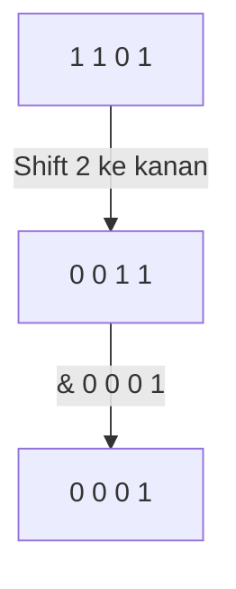
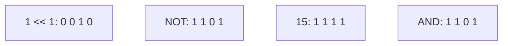

		🔙 **[Kembali ke Daftar Soal](./README.md)**

---

# Latihan Soal Part C - Modul 06 - Set 03 (Premium Edition)

---

### Soal 21: Mengecek Bit ke-n (Bit Checking)
```cpp
int x = 13; // 1101
int n = 2;
int res = (x >> n) & 1;
```
**Pertanyaan:**
1. Berapakah nilai `res`?
2. Bit ke-2 (dari kanan mulai 0) pada angka 13 bernilai berapa?

<details>
<summary><b>Klik untuk Lihat Jawaban & Diagnosis</b></summary>

**Mermaid Bit-Grid:**


**Jawaban:**
1. **1**
2. **1** (Urutannya: bit 0=1, bit 1=0, bit 2=1, bit 3=1).
</details>

---

### Soal 22: Menyalakan Lampu (Set Bit)
```cpp
int x = 8; // 1000
int res = x | (1 << 0);
```
**Pertanyaan:**
1. Berapakah nilai `res`?
2. Bit posisi mana yang dinyalakan?

<details>
<summary><b>Klik untuk Lihat Jawaban & Diagnosis</b></summary>

**Jawaban:**
1. **9** (1001)
2. **Bit ke-0** (paling kanan).
</details>

---

### Soal 23: Matikan Lampu (Clear Bit)
```cpp
int x = 15; // 1111
int res = x & ~(1 << 1);
```
**Pertanyaan:**
1. Berapakah nilai `res`?
2. Apa hasil biner dari `~(1 << 1)`?

<details>
<summary><b>Klik untuk Lihat Jawaban & Diagnosis</b></summary>

**Mermaid Bit-Grid:**


**Jawaban:**
1. **13**
2. **...11111101** (Semua 1 kecuali di posisi bit 1).
</details>

---

### Soal 24: Saklar Rahasia (Toggle Bit)
```cpp
int x = 5; // 0101
int res = x ^ (1 << 2);
```
**Pertanyaan:**
1. Berapakah nilai `res`?
2. Apa yang terjadi jika perintah yang sama dijalankan dua kali?

<details>
<summary><b>Klik untuk Lihat Jawaban & Diagnosis</b></summary>

**Jawaban:**
1. **1** (0101 XOR 0100 = 0001)
2. **Balik ke nilai semula.** XOR adalah operasi *reversible* (bisa dibolak-balik). Jika bit yang sama di-XOR lagi, ia akan kembali ke status asalnya.
</details>

---

### Soal 25: Filter 4-Bit Rendah (Lower Nibble)
```cpp
int x = 255; // 1111 1111
int res = x & 15; // 15 desimal = 1111 biner
```
**Pertanyaan:**
1. Berapakah nilai `res`?
2. Mengapa angka 15 digunakan untuk mengambil 4 bit pertama?

<details>
<summary><b>Klik untuk Lihat Jawaban & Diagnosis</b></summary>

**Jawaban:**
1. **15**
2. Karena 15 dalam biner adalah `0000 1111`. Saat di-AND, semua bit 1 di atas bit ke-3 akan dipaksa menjadi 0, menyisakan hanya 4 bit terbawah.
</details>

---

### Soal 26: Filter 4-Bit Tinggi (Upper Nibble)
```cpp
unsigned char x = 0xAB; // 1010 1011
int res = (x & 0xF0) >> 4;
```
**Pertanyaan:**
1. Berapakah nilai `res`?
2. Apa isi dari `0xF0` dalam biner?

<details>
<summary><b>Klik untuk Lihat Jawaban & Diagnosis</b></summary>

**Jawaban:**
1. **10** (A dalam Hex)
2. **1111 0000**.
</details>

---

### Soal 27: Detektor Bit Spesifik
```cpp
int n = 12; // 1100
bool aktif = (n & (1 << 3));
```
**Pertanyaan:**
1. Berapakah nilai `aktif` (true/false)?
2. Bit ke berapa yang sedang dicek oleh `(1 << 3)`?

<details>
<summary><b>Klik untuk Lihat Jawaban & Diagnosis</b></summary>

**Jawaban:**
1. **true** (Karena bit ke-3 pada 1100 adalah 1. Hasil AND-nya adalah 8, yang dianggap `true` dalam C++).
2. **Bit ke-3** (nilai 8).
</details>

---

### Soal 28: Reset Semua Lampu
```cpp
int x = 12345;
int res = x & 0;
```
**Pertanyaan:**
1. Berapakah nilai `res`?
2. Operator apa lagi yang bisa menghasilkan 0 jika digunakan dengan `x` itu sendiri?

<details>
<summary><b>Klik untuk Lihat Jawaban & Diagnosis</b></summary>

**Jawaban:**
1. **0**
2. **XOR.** `x ^ x` juga menghasilkan 0.
</details>

---

### Soal 29: Nyalakan Semua (8-Bit Max)
```cpp
unsigned char x = 5;
unsigned char res = x | 255;
```
**Pertanyaan:**
1. Berapakah nilai `res`?
2. Apa biner dari 255?

<details>
<summary><b>Klik untuk Lihat Jawaban & Diagnosis</b></summary>

**Jawaban:**
1. **255**
2. **1111 1111**
</details>

---

### Soal 30: Penjumlahan Terisolasi
```cpp
int a = 5, b = 6;
int res = (a & 1) + (b & 1);
```
**Pertanyaan:**
1. Berapakah nilai `res`?
2. Apa yang sedang dihitung oleh kode ini secara harfiah?

<details>
<summary><b>Klik untuk Lihat Jawaban & Diagnosis</b></summary>

**Jawaban:**
1. **1**
   - (5 & 1) = 1 (Ganjil)
   - (6 & 1) = 0 (Genap)
   - 1 + 0 = 1.
2. Menghitung **berapa banyak angka ganjil** di antara variabel `a` dan `b`.
</details>
