🔙 **[Kembali ke Daftar Soal](./README.md)**

---

# Latihan Soal Part C - Modul 06 - Set 03

### Soal 51
```cpp
int res = 3 ^ 1;
```
**Pertanyaan:**
1. Berapakah hasil akhirnya?
2. Mengapa demikian?

**Jawaban & Diagnosis:**
1. **2**
2. Lihat Tracing.

**Mermaid Flowchart:**
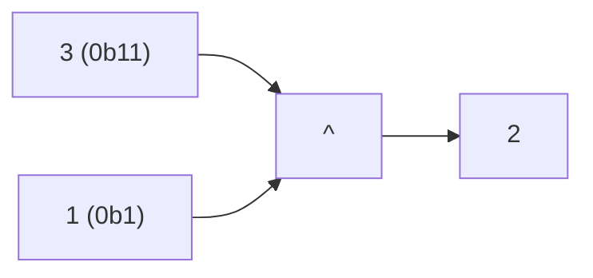

**📖 Penjelasan:**
**Langkah Tracing:**
1. Ubah 3 ke biner (0b11).
2. Jalankan ^.
3. Hasil: 2.

---
### Soal 52
```cpp
int res = 5 >> 3;
```
**Pertanyaan:**
1. Berapakah hasil akhirnya?
2. Mengapa demikian?

**Jawaban & Diagnosis:**
1. **0**
2. Lihat Tracing.

**Mermaid Flowchart:**
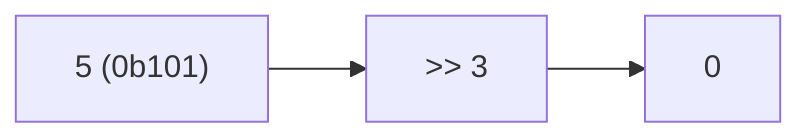

**📖 Penjelasan:**
**Langkah Tracing:**
1. Ubah 5 ke biner (0b101).
2. Jalankan >>.
3. Hasil: 0.

---
### Soal 53
```cpp
int res = 14 & 5;
```
**Pertanyaan:**
1. Berapakah hasil akhirnya?
2. Mengapa demikian?

**Jawaban & Diagnosis:**
1. **4**
2. Lihat Tracing.

**Mermaid Flowchart:**
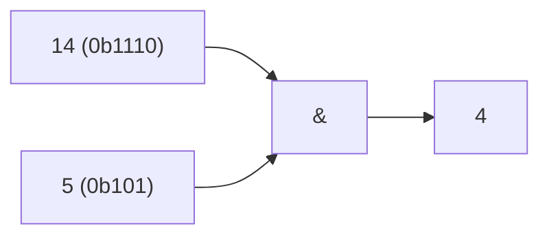

**📖 Penjelasan:**
**Langkah Tracing:**
1. Ubah 14 ke biner (0b1110).
2. Jalankan &.
3. Hasil: 4.

---
### Soal 54
```cpp
int res = 2 << 2;
```
**Pertanyaan:**
1. Berapakah hasil akhirnya?
2. Mengapa demikian?

**Jawaban & Diagnosis:**
1. **8**
2. Lihat Tracing.

**Mermaid Flowchart:**
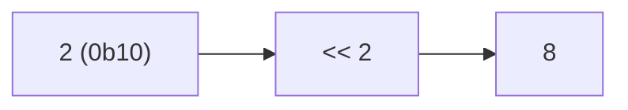

**📖 Penjelasan:**
**Langkah Tracing:**
1. Ubah 2 ke biner (0b10).
2. Jalankan <<.
3. Hasil: 8.

---
### Soal 55
```cpp
int res = 9 | 7;
```
**Pertanyaan:**
1. Berapakah hasil akhirnya?
2. Mengapa demikian?

**Jawaban & Diagnosis:**
1. **15**
2. Lihat Tracing.

**Mermaid Flowchart:**
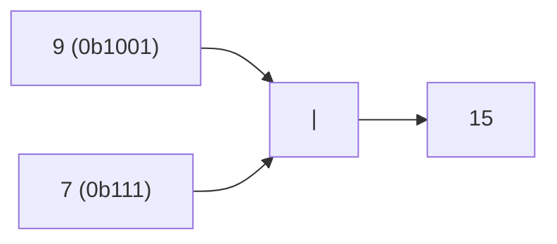

**📖 Penjelasan:**
**Langkah Tracing:**
1. Ubah 9 ke biner (0b1001).
2. Jalankan |.
3. Hasil: 15.

---
### Soal 56
```cpp
int res = 9 >> 3;
```
**Pertanyaan:**
1. Berapakah hasil akhirnya?
2. Mengapa demikian?

**Jawaban & Diagnosis:**
1. **1**
2. Lihat Tracing.

**Mermaid Flowchart:**
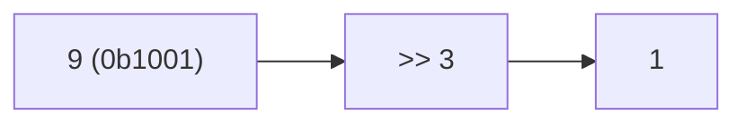

**📖 Penjelasan:**
**Langkah Tracing:**
1. Ubah 9 ke biner (0b1001).
2. Jalankan >>.
3. Hasil: 1.

---
### Soal 57
```cpp
int res = 14 ^ 9;
```
**Pertanyaan:**
1. Berapakah hasil akhirnya?
2. Mengapa demikian?

**Jawaban & Diagnosis:**
1. **7**
2. Lihat Tracing.

**Mermaid Flowchart:**


**📖 Penjelasan:**
**Langkah Tracing:**
1. Ubah 14 ke biner (0b1110).
2. Jalankan ^.
3. Hasil: 7.

---
### Soal 58
```cpp
int res = 7 ^ 8;
```
**Pertanyaan:**
1. Berapakah hasil akhirnya?
2. Mengapa demikian?

**Jawaban & Diagnosis:**
1. **15**
2. Lihat Tracing.

**Mermaid Flowchart:**
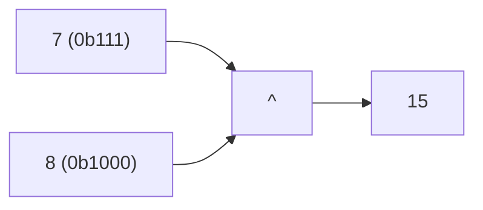

**📖 Penjelasan:**
**Langkah Tracing:**
1. Ubah 7 ke biner (0b111).
2. Jalankan ^.
3. Hasil: 15.

---
### Soal 59
```cpp
int res = 8 ^ 1;
```
**Pertanyaan:**
1. Berapakah hasil akhirnya?
2. Mengapa demikian?

**Jawaban & Diagnosis:**
1. **9**
2. Lihat Tracing.

**Mermaid Flowchart:**
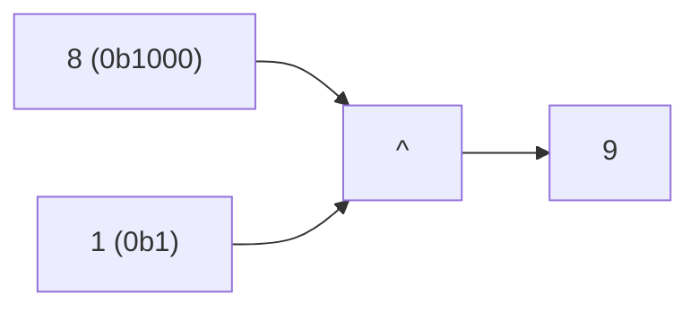

**📖 Penjelasan:**
**Langkah Tracing:**
1. Ubah 8 ke biner (0b1000).
2. Jalankan ^.
3. Hasil: 9.

---
### Soal 60
```cpp
int res = 4 >> 3;
```
**Pertanyaan:**
1. Berapakah hasil akhirnya?
2. Mengapa demikian?

**Jawaban & Diagnosis:**
1. **0**
2. Lihat Tracing.

**Mermaid Flowchart:**
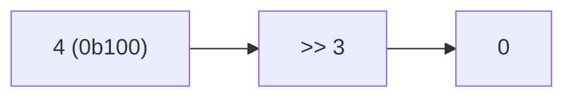

**📖 Penjelasan:**
**Langkah Tracing:**
1. Ubah 4 ke biner (0b100).
2. Jalankan >>.
3. Hasil: 0.

---
### Soal 61
```cpp
int res = 12 >> 2;
```
**Pertanyaan:**
1. Berapakah hasil akhirnya?
2. Mengapa demikian?

**Jawaban & Diagnosis:**
1. **3**
2. Lihat Tracing.

**Mermaid Flowchart:**
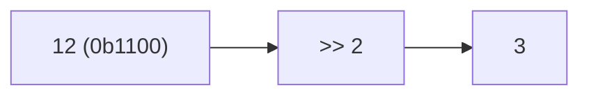

**📖 Penjelasan:**
**Langkah Tracing:**
1. Ubah 12 ke biner (0b1100).
2. Jalankan >>.
3. Hasil: 3.

---
### Soal 62
```cpp
int res = 12 ^ 9;
```
**Pertanyaan:**
1. Berapakah hasil akhirnya?
2. Mengapa demikian?

**Jawaban & Diagnosis:**
1. **5**
2. Lihat Tracing.

**Mermaid Flowchart:**
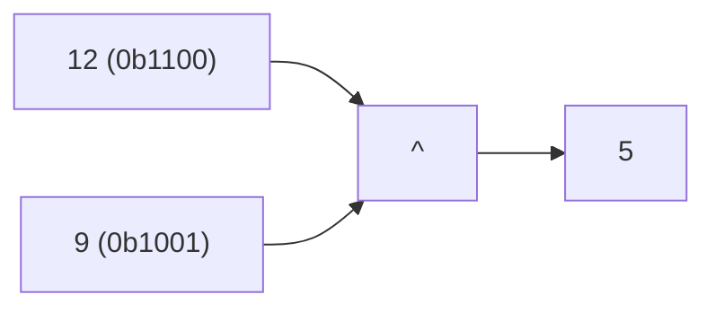

**📖 Penjelasan:**
**Langkah Tracing:**
1. Ubah 12 ke biner (0b1100).
2. Jalankan ^.
3. Hasil: 5.

---
### Soal 63
```cpp
int res = 2 << 3;
```
**Pertanyaan:**
1. Berapakah hasil akhirnya?
2. Mengapa demikian?

**Jawaban & Diagnosis:**
1. **16**
2. Lihat Tracing.

**Mermaid Flowchart:**
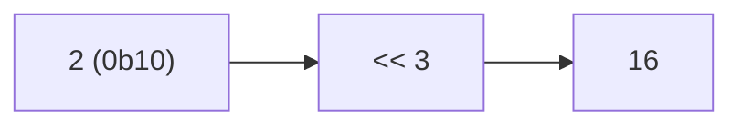

**📖 Penjelasan:**
**Langkah Tracing:**
1. Ubah 2 ke biner (0b10).
2. Jalankan <<.
3. Hasil: 16.

---
### Soal 64
```cpp
int res = 11 | 5;
```
**Pertanyaan:**
1. Berapakah hasil akhirnya?
2. Mengapa demikian?

**Jawaban & Diagnosis:**
1. **15**
2. Lihat Tracing.

**Mermaid Flowchart:**
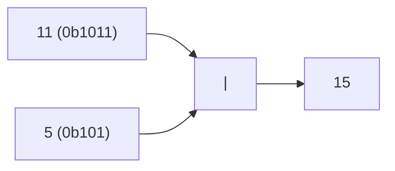

**📖 Penjelasan:**
**Langkah Tracing:**
1. Ubah 11 ke biner (0b1011).
2. Jalankan |.
3. Hasil: 15.

---
### Soal 65
```cpp
int res = 12 & 9;
```
**Pertanyaan:**
1. Berapakah hasil akhirnya?
2. Mengapa demikian?

**Jawaban & Diagnosis:**
1. **8**
2. Lihat Tracing.

**Mermaid Flowchart:**
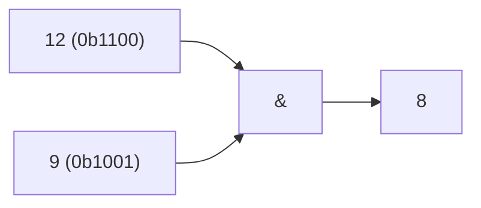

**📖 Penjelasan:**
**Langkah Tracing:**
1. Ubah 12 ke biner (0b1100).
2. Jalankan &.
3. Hasil: 8.

---
### Soal 66
```cpp
int res = 1 ^ 3;
```
**Pertanyaan:**
1. Berapakah hasil akhirnya?
2. Mengapa demikian?

**Jawaban & Diagnosis:**
1. **2**
2. Lihat Tracing.

**Mermaid Flowchart:**
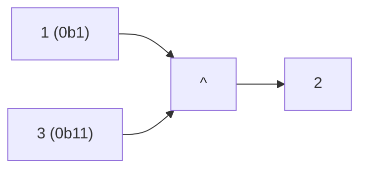

**📖 Penjelasan:**
**Langkah Tracing:**
1. Ubah 1 ke biner (0b1).
2. Jalankan ^.
3. Hasil: 2.

---
### Soal 67
```cpp
int res = 11 | 12;
```
**Pertanyaan:**
1. Berapakah hasil akhirnya?
2. Mengapa demikian?

**Jawaban & Diagnosis:**
1. **15**
2. Lihat Tracing.

**Mermaid Flowchart:**
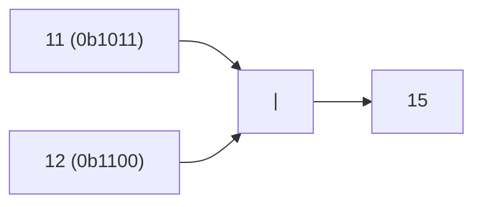

**📖 Penjelasan:**
**Langkah Tracing:**
1. Ubah 11 ke biner (0b1011).
2. Jalankan |.
3. Hasil: 15.

---
### Soal 68
```cpp
int res = 1 ^ 3;
```
**Pertanyaan:**
1. Berapakah hasil akhirnya?
2. Mengapa demikian?

**Jawaban & Diagnosis:**
1. **2**
2. Lihat Tracing.

**Mermaid Flowchart:**


**📖 Penjelasan:**
**Langkah Tracing:**
1. Ubah 1 ke biner (0b1).
2. Jalankan ^.
3. Hasil: 2.

---
### Soal 69
```cpp
int res = 7 | 11;
```
**Pertanyaan:**
1. Berapakah hasil akhirnya?
2. Mengapa demikian?

**Jawaban & Diagnosis:**
1. **15**
2. Lihat Tracing.

**Mermaid Flowchart:**
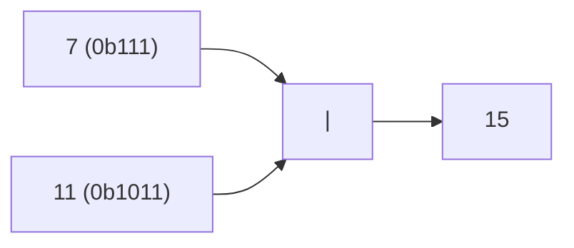

**📖 Penjelasan:**
**Langkah Tracing:**
1. Ubah 7 ke biner (0b111).
2. Jalankan |.
3. Hasil: 15.

---
### Soal 70
```cpp
int res = 8 & 14;
```
**Pertanyaan:**
1. Berapakah hasil akhirnya?
2. Mengapa demikian?

**Jawaban & Diagnosis:**
1. **8**
2. Lihat Tracing.

**Mermaid Flowchart:**
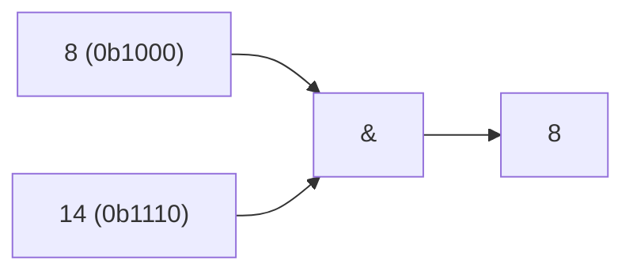

**📖 Penjelasan:**
**Langkah Tracing:**
1. Ubah 8 ke biner (0b1000).
2. Jalankan &.
3. Hasil: 8.

---
### Soal 71
```cpp
int res = 12 | 8;
```
**Pertanyaan:**
1. Berapakah hasil akhirnya?
2. Mengapa demikian?

**Jawaban & Diagnosis:**
1. **12**
2. Lihat Tracing.

**Mermaid Flowchart:**
```mermaid
graph LR
A["12 (0b1100)"] --> C["|"]
B["8 (0b1000)"] --> C
C --> D["12"]
```

**📖 Penjelasan:**
**Langkah Tracing:**
1. Ubah 12 ke biner (0b1100).
2. Jalankan |.
3. Hasil: 12.

---
### Soal 72
```cpp
int res = 10 >> 3;
```
**Pertanyaan:**
1. Berapakah hasil akhirnya?
2. Mengapa demikian?

**Jawaban & Diagnosis:**
1. **1**
2. Lihat Tracing.

**Mermaid Flowchart:**
```mermaid
graph LR
A["10 (0b1010)"] --> B[">> 3"]
B --> C["1"]
```

**📖 Penjelasan:**
**Langkah Tracing:**
1. Ubah 10 ke biner (0b1010).
2. Jalankan >>.
3. Hasil: 1.

---
### Soal 73
```cpp
int res = 11 | 4;
```
**Pertanyaan:**
1. Berapakah hasil akhirnya?
2. Mengapa demikian?

**Jawaban & Diagnosis:**
1. **15**
2. Lihat Tracing.

**Mermaid Flowchart:**
```mermaid
graph LR
A["11 (0b1011)"] --> C["|"]
B["4 (0b100)"] --> C
C --> D["15"]
```

**📖 Penjelasan:**
**Langkah Tracing:**
1. Ubah 11 ke biner (0b1011).
2. Jalankan |.
3. Hasil: 15.

---
### Soal 74
```cpp
int res = 11 | 8;
```
**Pertanyaan:**
1. Berapakah hasil akhirnya?
2. Mengapa demikian?

**Jawaban & Diagnosis:**
1. **11**
2. Lihat Tracing.

**Mermaid Flowchart:**
```mermaid
graph LR
A["11 (0b1011)"] --> C["|"]
B["8 (0b1000)"] --> C
C --> D["11"]
```

**📖 Penjelasan:**
**Langkah Tracing:**
1. Ubah 11 ke biner (0b1011).
2. Jalankan |.
3. Hasil: 11.

---
### Soal 75
```cpp
int res = 13 >> 1;
```
**Pertanyaan:**
1. Berapakah hasil akhirnya?
2. Mengapa demikian?

**Jawaban & Diagnosis:**
1. **6**
2. Lihat Tracing.

**Mermaid Flowchart:**
```mermaid
graph LR
A["13 (0b1101)"] --> B[">> 1"]
B --> C["6"]
```

**📖 Penjelasan:**
**Langkah Tracing:**
1. Ubah 13 ke biner (0b1101).
2. Jalankan >>.
3. Hasil: 6.

---
