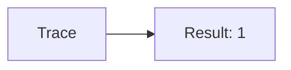
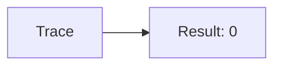
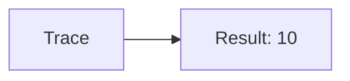
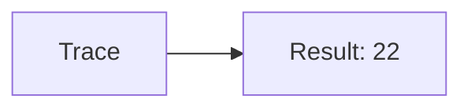
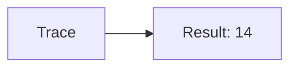

🔙 **[Kembali ke Daftar Soal](./README.md)**

---

# Latihan Soal Part C - Modul 06 - Set 03

### Soal 51
```cpp
// Ohm: Shift Left
int val = 4;
int res = val << 1;
```
**Pertanyaan:**
1. Berapakah hasil akhirnya?
2. Deskripsikan alur pikir 'Compiler Manusia' untuk soal ini!

**Jawaban & Diagnosis:**
1. **8**
2. 4 digeser kiri 1x = dikali 2 = 8.

**Mermaid Flowchart:**


---
### Soal 52
```cpp
// Hz: AND Mask
int val = 5;
int res = val & 1;
```
**Pertanyaan:**
1. Berapakah hasil akhirnya?
2. Deskripsikan alur pikir 'Compiler Manusia' untuk soal ini!

**Jawaban & Diagnosis:**
1. **1**
2. Mengecek bit terakhir dari 5 (0b101). Hasil: 1.

**Mermaid Flowchart:**


---
### Soal 53
```cpp
// Khz: XOR Toggle
int val = 5;
int res = val ^ val;
```
**Pertanyaan:**
1. Berapakah hasil akhirnya?
2. Deskripsikan alur pikir 'Compiler Manusia' untuk soal ini!

**Jawaban & Diagnosis:**
1. **0**
2. XOR dengan diri sendiri selalu 0.

**Mermaid Flowchart:**


---
### Soal 54
```cpp
// Mhz: Shift Left
int val = 12;
int res = val << 1;
```
**Pertanyaan:**
1. Berapakah hasil akhirnya?
2. Deskripsikan alur pikir 'Compiler Manusia' untuk soal ini!

**Jawaban & Diagnosis:**
1. **24**
2. 12 digeser kiri 1x = dikali 2 = 24.

**Mermaid Flowchart:**


---
### Soal 55
```cpp
// Ghz: AND Mask
int val = 3;
int res = val & 1;
```
**Pertanyaan:**
1. Berapakah hasil akhirnya?
2. Deskripsikan alur pikir 'Compiler Manusia' untuk soal ini!

**Jawaban & Diagnosis:**
1. **1**
2. Mengecek bit terakhir dari 3 (0b11). Hasil: 1.

**Mermaid Flowchart:**


---
### Soal 56
```cpp
// Thz: XOR Toggle
int val = 10;
int res = val ^ val;
```
**Pertanyaan:**
1. Berapakah hasil akhirnya?
2. Deskripsikan alur pikir 'Compiler Manusia' untuk soal ini!

**Jawaban & Diagnosis:**
1. **0**
2. XOR dengan diri sendiri selalu 0.

**Mermaid Flowchart:**


---
### Soal 57
```cpp
// Byte: Shift Left
int val = 9;
int res = val << 1;
```
**Pertanyaan:**
1. Berapakah hasil akhirnya?
2. Deskripsikan alur pikir 'Compiler Manusia' untuk soal ini!

**Jawaban & Diagnosis:**
1. **18**
2. 9 digeser kiri 1x = dikali 2 = 18.

**Mermaid Flowchart:**


---
### Soal 58
```cpp
// Kb: AND Mask
int val = 15;
int res = val & 1;
```
**Pertanyaan:**
1. Berapakah hasil akhirnya?
2. Deskripsikan alur pikir 'Compiler Manusia' untuk soal ini!

**Jawaban & Diagnosis:**
1. **1**
2. Mengecek bit terakhir dari 15 (0b1111). Hasil: 1.

**Mermaid Flowchart:**


---
### Soal 59
```cpp
// Mb: XOR Toggle
int val = 2;
int res = val ^ val;
```
**Pertanyaan:**
1. Berapakah hasil akhirnya?
2. Deskripsikan alur pikir 'Compiler Manusia' untuk soal ini!

**Jawaban & Diagnosis:**
1. **0**
2. XOR dengan diri sendiri selalu 0.

**Mermaid Flowchart:**


---
### Soal 60
```cpp
// Gb: Shift Left
int val = 5;
int res = val << 1;
```
**Pertanyaan:**
1. Berapakah hasil akhirnya?
2. Deskripsikan alur pikir 'Compiler Manusia' untuk soal ini!

**Jawaban & Diagnosis:**
1. **10**
2. 5 digeser kiri 1x = dikali 2 = 10.

**Mermaid Flowchart:**


---
### Soal 61
```cpp
// Tb: AND Mask
int val = 15;
int res = val & 1;
```
**Pertanyaan:**
1. Berapakah hasil akhirnya?
2. Deskripsikan alur pikir 'Compiler Manusia' untuk soal ini!

**Jawaban & Diagnosis:**
1. **1**
2. Mengecek bit terakhir dari 15 (0b1111). Hasil: 1.

**Mermaid Flowchart:**


---
### Soal 62
```cpp
// Pb: XOR Toggle
int val = 15;
int res = val ^ val;
```
**Pertanyaan:**
1. Berapakah hasil akhirnya?
2. Deskripsikan alur pikir 'Compiler Manusia' untuk soal ini!

**Jawaban & Diagnosis:**
1. **0**
2. XOR dengan diri sendiri selalu 0.

**Mermaid Flowchart:**


---
### Soal 63
```cpp
// Eb: Shift Left
int val = 12;
int res = val << 1;
```
**Pertanyaan:**
1. Berapakah hasil akhirnya?
2. Deskripsikan alur pikir 'Compiler Manusia' untuk soal ini!

**Jawaban & Diagnosis:**
1. **24**
2. 12 digeser kiri 1x = dikali 2 = 24.

**Mermaid Flowchart:**


---
### Soal 64
```cpp
// Zb: AND Mask
int val = 5;
int res = val & 1;
```
**Pertanyaan:**
1. Berapakah hasil akhirnya?
2. Deskripsikan alur pikir 'Compiler Manusia' untuk soal ini!

**Jawaban & Diagnosis:**
1. **1**
2. Mengecek bit terakhir dari 5 (0b101). Hasil: 1.

**Mermaid Flowchart:**


---
### Soal 65
```cpp
// Yb: XOR Toggle
int val = 12;
int res = val ^ val;
```
**Pertanyaan:**
1. Berapakah hasil akhirnya?
2. Deskripsikan alur pikir 'Compiler Manusia' untuk soal ini!

**Jawaban & Diagnosis:**
1. **0**
2. XOR dengan diri sendiri selalu 0.

**Mermaid Flowchart:**


---
### Soal 66
```cpp
// Bit: Shift Left
int val = 11;
int res = val << 1;
```
**Pertanyaan:**
1. Berapakah hasil akhirnya?
2. Deskripsikan alur pikir 'Compiler Manusia' untuk soal ini!

**Jawaban & Diagnosis:**
1. **22**
2. 11 digeser kiri 1x = dikali 2 = 22.

**Mermaid Flowchart:**


---
### Soal 67
```cpp
// Nibble: AND Mask
int val = 7;
int res = val & 1;
```
**Pertanyaan:**
1. Berapakah hasil akhirnya?
2. Deskripsikan alur pikir 'Compiler Manusia' untuk soal ini!

**Jawaban & Diagnosis:**
1. **1**
2. Mengecek bit terakhir dari 7 (0b111). Hasil: 1.

**Mermaid Flowchart:**


---
### Soal 68
```cpp
// Word: XOR Toggle
int val = 11;
int res = val ^ val;
```
**Pertanyaan:**
1. Berapakah hasil akhirnya?
2. Deskripsikan alur pikir 'Compiler Manusia' untuk soal ini!

**Jawaban & Diagnosis:**
1. **0**
2. XOR dengan diri sendiri selalu 0.

**Mermaid Flowchart:**


---
### Soal 69
```cpp
// Dword: Shift Left
int val = 7;
int res = val << 1;
```
**Pertanyaan:**
1. Berapakah hasil akhirnya?
2. Deskripsikan alur pikir 'Compiler Manusia' untuk soal ini!

**Jawaban & Diagnosis:**
1. **14**
2. 7 digeser kiri 1x = dikali 2 = 14.

**Mermaid Flowchart:**


---
### Soal 70
```cpp
// Qword: AND Mask
int val = 5;
int res = val & 1;
```
**Pertanyaan:**
1. Berapakah hasil akhirnya?
2. Deskripsikan alur pikir 'Compiler Manusia' untuk soal ini!

**Jawaban & Diagnosis:**
1. **1**
2. Mengecek bit terakhir dari 5 (0b101). Hasil: 1.

**Mermaid Flowchart:**


---
### Soal 71
```cpp
// Ptr: XOR Toggle
int val = 1;
int res = val ^ val;
```
**Pertanyaan:**
1. Berapakah hasil akhirnya?
2. Deskripsikan alur pikir 'Compiler Manusia' untuk soal ini!

**Jawaban & Diagnosis:**
1. **0**
2. XOR dengan diri sendiri selalu 0.

**Mermaid Flowchart:**
```mermaid
graph LR
A[Trace] --> B[Result: 0]
```

---
### Soal 72
```cpp
// Ref: Shift Left
int val = 14;
int res = val << 1;
```
**Pertanyaan:**
1. Berapakah hasil akhirnya?
2. Deskripsikan alur pikir 'Compiler Manusia' untuk soal ini!

**Jawaban & Diagnosis:**
1. **28**
2. 14 digeser kiri 1x = dikali 2 = 28.

**Mermaid Flowchart:**
```mermaid
graph LR
A[Trace] --> B[Result: 28]
```

---
### Soal 73
```cpp
// Addr: AND Mask
int val = 4;
int res = val & 1;
```
**Pertanyaan:**
1. Berapakah hasil akhirnya?
2. Deskripsikan alur pikir 'Compiler Manusia' untuk soal ini!

**Jawaban & Diagnosis:**
1. **0**
2. Mengecek bit terakhir dari 4 (0b100). Hasil: 0.

**Mermaid Flowchart:**
```mermaid
graph LR
A[Trace] --> B[Result: 0]
```

---
### Soal 74
```cpp
// Mem: XOR Toggle
int val = 10;
int res = val ^ val;
```
**Pertanyaan:**
1. Berapakah hasil akhirnya?
2. Deskripsikan alur pikir 'Compiler Manusia' untuk soal ini!

**Jawaban & Diagnosis:**
1. **0**
2. XOR dengan diri sendiri selalu 0.

**Mermaid Flowchart:**
```mermaid
graph LR
A[Trace] --> B[Result: 0]
```

---
### Soal 75
```cpp
// Ram: Shift Left
int val = 4;
int res = val << 1;
```
**Pertanyaan:**
1. Berapakah hasil akhirnya?
2. Deskripsikan alur pikir 'Compiler Manusia' untuk soal ini!

**Jawaban & Diagnosis:**
1. **8**
2. 4 digeser kiri 1x = dikali 2 = 8.

**Mermaid Flowchart:**
```mermaid
graph LR
A[Trace] --> B[Result: 8]
```

---
