🔙 **[Kembali ke Daftar Soal](./README.md)**

---

# Latihan Soal Part C - Modul 06 - Set 03

### Soal 51 (Bitwise AND/OR)
```cpp
int a = 7;
int b = 4;
int res_and = a & b;
int res_or = a | b;
```
**Pertanyaan:**
1. Berapakah nilai `res_and`?
2. Berapakah nilai `res_or`?
3. Apa guna bitwise AND dalam mengecek angka ganjil?

**Jawaban & Diagnosis:**
1. **4**
2. **7**
3. **Untuk mengecek bit terakhir (x & 1). Jika hasilnya 1, maka ganjil.**

**Mermaid Flowchart:**
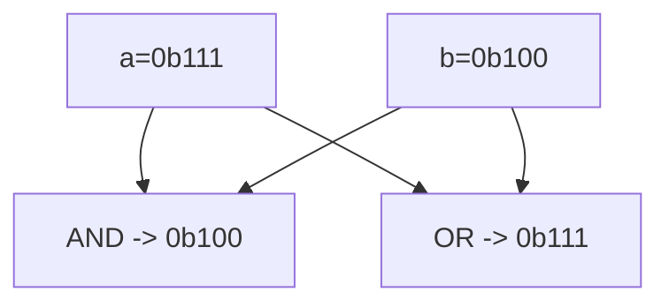

**📖 Cara Membaca Diagram:**
a=7 (0b111), b=4 (0b100). AND cari yang sama-sama 1. OR lumayan rakus ambil semua 1.

---
### Soal 52 (Bitwise AND/OR)
```cpp
int a = 3;
int b = 4;
int res_and = a & b;
int res_or = a | b;
```
**Pertanyaan:**
1. Berapakah nilai `res_and`?
2. Berapakah nilai `res_or`?
3. Apa guna bitwise AND dalam mengecek angka ganjil?

**Jawaban & Diagnosis:**
1. **0**
2. **7**
3. **Untuk mengecek bit terakhir (x & 1). Jika hasilnya 1, maka ganjil.**

**Mermaid Flowchart:**
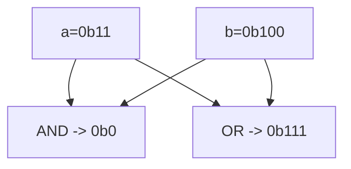

**📖 Cara Membaca Diagram:**
a=3 (0b11), b=4 (0b100). AND cari yang sama-sama 1. OR lumayan rakus ambil semua 1.

---
### Soal 53 (Bitwise AND/OR)
```cpp
int a = 4;
int b = 7;
int res_and = a & b;
int res_or = a | b;
```
**Pertanyaan:**
1. Berapakah nilai `res_and`?
2. Berapakah nilai `res_or`?
3. Apa guna bitwise AND dalam mengecek angka ganjil?

**Jawaban & Diagnosis:**
1. **4**
2. **7**
3. **Untuk mengecek bit terakhir (x & 1). Jika hasilnya 1, maka ganjil.**

**Mermaid Flowchart:**
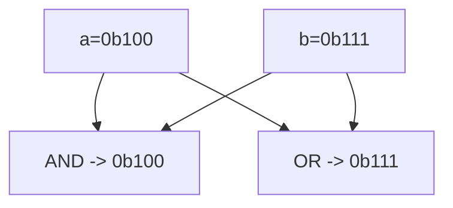

**📖 Cara Membaca Diagram:**
a=4 (0b100), b=7 (0b111). AND cari yang sama-sama 1. OR lumayan rakus ambil semua 1.

---
### Soal 54 (Bitwise AND/OR)
```cpp
int a = 6;
int b = 5;
int res_and = a & b;
int res_or = a | b;
```
**Pertanyaan:**
1. Berapakah nilai `res_and`?
2. Berapakah nilai `res_or`?
3. Apa guna bitwise AND dalam mengecek angka ganjil?

**Jawaban & Diagnosis:**
1. **4**
2. **7**
3. **Untuk mengecek bit terakhir (x & 1). Jika hasilnya 1, maka ganjil.**

**Mermaid Flowchart:**
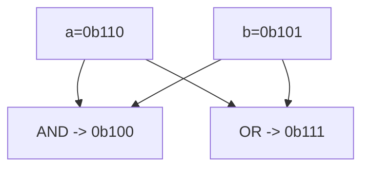

**📖 Cara Membaca Diagram:**
a=6 (0b110), b=5 (0b101). AND cari yang sama-sama 1. OR lumayan rakus ambil semua 1.

---
### Soal 55 (Bitwise AND/OR)
```cpp
int a = 3;
int b = 3;
int res_and = a & b;
int res_or = a | b;
```
**Pertanyaan:**
1. Berapakah nilai `res_and`?
2. Berapakah nilai `res_or`?
3. Apa guna bitwise AND dalam mengecek angka ganjil?

**Jawaban & Diagnosis:**
1. **3**
2. **3**
3. **Untuk mengecek bit terakhir (x & 1). Jika hasilnya 1, maka ganjil.**

**Mermaid Flowchart:**
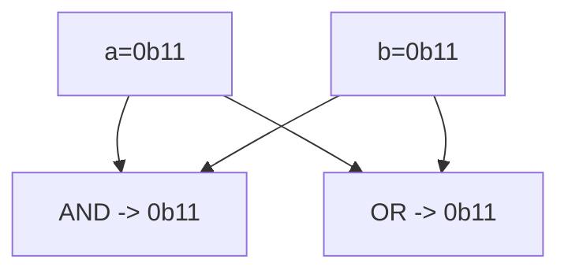

**📖 Cara Membaca Diagram:**
a=3 (0b11), b=3 (0b11). AND cari yang sama-sama 1. OR lumayan rakus ambil semua 1.

---
### Soal 56 (Left Shift Power)
```cpp
int a = 4;
int res = a << 3;
```
**Pertanyaan:**
1. Berapakah nilai akhir `res`?
2. Shift kiri sejauh 3 langkah setara dengan mengalikan `a` dengan angka berapa?
3. Apa yang terjadi pada bit-bit angka jika di-shift ke kiri?

**Jawaban & Diagnosis:**
1. **32**
2. **8**
3. **Bit bergeser ke kiri, dan muncul angka 0 di sebelah kanan (seperti nambah digit).**

**Mermaid Flowchart:**
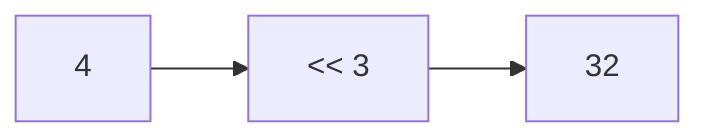

**📖 Cara Membaca Diagram:**
a=4. Shift kiri 3 kali = 4 * 2^3 = 32.

---
### Soal 57 (Bitwise XOR Trick)
```cpp
int x = 25;
int res = x ^ x ^ 26;
```
**Pertanyaan:**
1. Berapakah nilai akhir `res`?
2. Apa yang terjadi jika angka yang sama di-XOR (`x ^ x`)?
3. Apa analogi yang cocok untuk XOR?

**Jawaban & Diagnosis:**
1. **26**
2. **Hasilnya menjadi 0 (Saling meniadakan).**
3. **Saklar lampu (Tekan 2x balik ke awal/padam).**

**Mermaid Flowchart:**
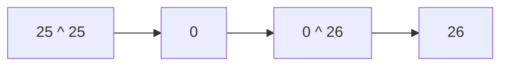

**📖 Cara Membaca Diagram:**
x ^ x = 0. Jadi 0 ^ 26 = 26.

---
### Soal 58 (Right Shift Div)
```cpp
int a = 28;
int res = a >> 1;
```
**Pertanyaan:**
1. Berapakah nilai akhir `res`?
2. Shift kanan sejauh 1 langkah setara dengan membagi `a` dengan angka berapa?
3. Mengapa shift kanan sering dipakai untuk optimasi?

**Jawaban & Diagnosis:**
1. **14**
2. **2**
3. **Karena pembagian oleh pangkat 2 jauh lebih cepat bagi prosesor daripada operator pembagian biasa.**

**Mermaid Flowchart:**
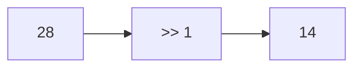

**📖 Cara Membaca Diagram:**
a=28. Shift kanan 1 kali = 28 / 2^1 = 14.

---
### Soal 59 (Bitwise XOR Trick)
```cpp
int x = 11;
int res = x ^ x ^ 12;
```
**Pertanyaan:**
1. Berapakah nilai akhir `res`?
2. Apa yang terjadi jika angka yang sama di-XOR (`x ^ x`)?
3. Apa analogi yang cocok untuk XOR?

**Jawaban & Diagnosis:**
1. **12**
2. **Hasilnya menjadi 0 (Saling meniadakan).**
3. **Saklar lampu (Tekan 2x balik ke awal/padam).**

**Mermaid Flowchart:**
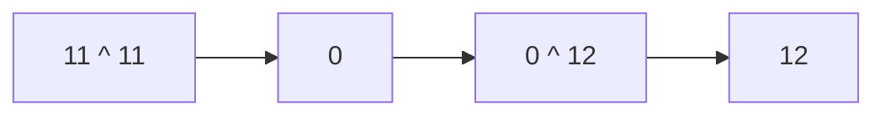

**📖 Cara Membaca Diagram:**
x ^ x = 0. Jadi 0 ^ 12 = 12.

---
### Soal 60 (Left Shift Power)
```cpp
int a = 9;
int res = a << 3;
```
**Pertanyaan:**
1. Berapakah nilai akhir `res`?
2. Shift kiri sejauh 3 langkah setara dengan mengalikan `a` dengan angka berapa?
3. Apa yang terjadi pada bit-bit angka jika di-shift ke kiri?

**Jawaban & Diagnosis:**
1. **72**
2. **8**
3. **Bit bergeser ke kiri, dan muncul angka 0 di sebelah kanan (seperti nambah digit).**

**Mermaid Flowchart:**
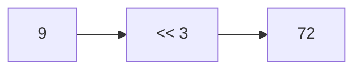

**📖 Cara Membaca Diagram:**
a=9. Shift kiri 3 kali = 9 * 2^3 = 72.

---
### Soal 61 (Bitwise AND/OR)
```cpp
int a = 5;
int b = 3;
int res_and = a & b;
int res_or = a | b;
```
**Pertanyaan:**
1. Berapakah nilai `res_and`?
2. Berapakah nilai `res_or`?
3. Apa guna bitwise AND dalam mengecek angka ganjil?

**Jawaban & Diagnosis:**
1. **1**
2. **7**
3. **Untuk mengecek bit terakhir (x & 1). Jika hasilnya 1, maka ganjil.**

**Mermaid Flowchart:**
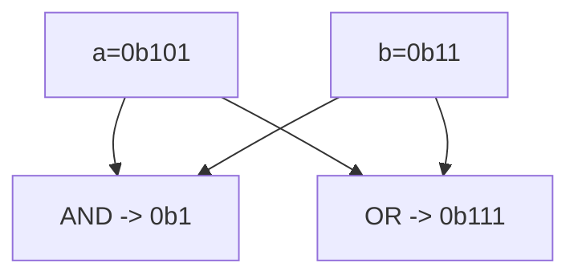

**📖 Cara Membaca Diagram:**
a=5 (0b101), b=3 (0b11). AND cari yang sama-sama 1. OR lumayan rakus ambil semua 1.

---
### Soal 62 (Left Shift Power)
```cpp
int a = 5;
int res = a << 3;
```
**Pertanyaan:**
1. Berapakah nilai akhir `res`?
2. Shift kiri sejauh 3 langkah setara dengan mengalikan `a` dengan angka berapa?
3. Apa yang terjadi pada bit-bit angka jika di-shift ke kiri?

**Jawaban & Diagnosis:**
1. **40**
2. **8**
3. **Bit bergeser ke kiri, dan muncul angka 0 di sebelah kanan (seperti nambah digit).**

**Mermaid Flowchart:**
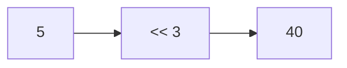

**📖 Cara Membaca Diagram:**
a=5. Shift kiri 3 kali = 5 * 2^3 = 40.

---
### Soal 63 (Left Shift Power)
```cpp
int a = 3;
int res = a << 2;
```
**Pertanyaan:**
1. Berapakah nilai akhir `res`?
2. Shift kiri sejauh 2 langkah setara dengan mengalikan `a` dengan angka berapa?
3. Apa yang terjadi pada bit-bit angka jika di-shift ke kiri?

**Jawaban & Diagnosis:**
1. **12**
2. **4**
3. **Bit bergeser ke kiri, dan muncul angka 0 di sebelah kanan (seperti nambah digit).**

**Mermaid Flowchart:**
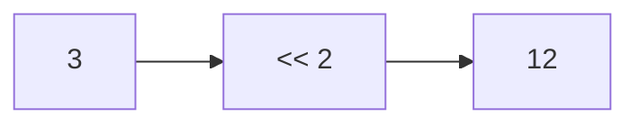

**📖 Cara Membaca Diagram:**
a=3. Shift kiri 2 kali = 3 * 2^2 = 12.

---
### Soal 64 (Bitwise XOR Trick)
```cpp
int x = 76;
int res = x ^ x ^ 77;
```
**Pertanyaan:**
1. Berapakah nilai akhir `res`?
2. Apa yang terjadi jika angka yang sama di-XOR (`x ^ x`)?
3. Apa analogi yang cocok untuk XOR?

**Jawaban & Diagnosis:**
1. **77**
2. **Hasilnya menjadi 0 (Saling meniadakan).**
3. **Saklar lampu (Tekan 2x balik ke awal/padam).**

**Mermaid Flowchart:**
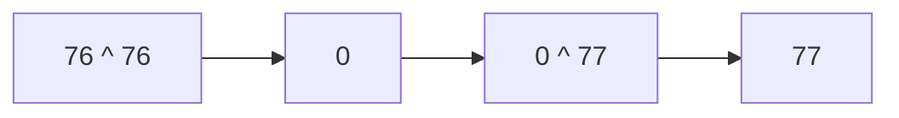

**📖 Cara Membaca Diagram:**
x ^ x = 0. Jadi 0 ^ 77 = 77.

---
### Soal 65 (Bitwise AND/OR)
```cpp
int a = 4;
int b = 6;
int res_and = a & b;
int res_or = a | b;
```
**Pertanyaan:**
1. Berapakah nilai `res_and`?
2. Berapakah nilai `res_or`?
3. Apa guna bitwise AND dalam mengecek angka ganjil?

**Jawaban & Diagnosis:**
1. **4**
2. **6**
3. **Untuk mengecek bit terakhir (x & 1). Jika hasilnya 1, maka ganjil.**

**Mermaid Flowchart:**
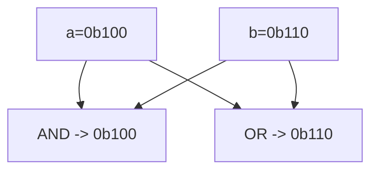

**📖 Cara Membaca Diagram:**
a=4 (0b100), b=6 (0b110). AND cari yang sama-sama 1. OR lumayan rakus ambil semua 1.

---
### Soal 66 (Bitwise AND/OR)
```cpp
int a = 3;
int b = 3;
int res_and = a & b;
int res_or = a | b;
```
**Pertanyaan:**
1. Berapakah nilai `res_and`?
2. Berapakah nilai `res_or`?
3. Apa guna bitwise AND dalam mengecek angka ganjil?

**Jawaban & Diagnosis:**
1. **3**
2. **3**
3. **Untuk mengecek bit terakhir (x & 1). Jika hasilnya 1, maka ganjil.**

**Mermaid Flowchart:**


**📖 Cara Membaca Diagram:**
a=3 (0b11), b=3 (0b11). AND cari yang sama-sama 1. OR lumayan rakus ambil semua 1.

---
### Soal 67 (Right Shift Div)
```cpp
int a = 23;
int res = a >> 2;
```
**Pertanyaan:**
1. Berapakah nilai akhir `res`?
2. Shift kanan sejauh 2 langkah setara dengan membagi `a` dengan angka berapa?
3. Mengapa shift kanan sering dipakai untuk optimasi?

**Jawaban & Diagnosis:**
1. **5**
2. **4**
3. **Karena pembagian oleh pangkat 2 jauh lebih cepat bagi prosesor daripada operator pembagian biasa.**

**Mermaid Flowchart:**
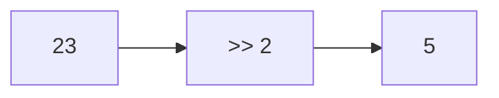

**📖 Cara Membaca Diagram:**
a=23. Shift kanan 2 kali = 23 / 2^2 = 5.

---
### Soal 68 (Left Shift Power)
```cpp
int a = 9;
int res = a << 2;
```
**Pertanyaan:**
1. Berapakah nilai akhir `res`?
2. Shift kiri sejauh 2 langkah setara dengan mengalikan `a` dengan angka berapa?
3. Apa yang terjadi pada bit-bit angka jika di-shift ke kiri?

**Jawaban & Diagnosis:**
1. **36**
2. **4**
3. **Bit bergeser ke kiri, dan muncul angka 0 di sebelah kanan (seperti nambah digit).**

**Mermaid Flowchart:**
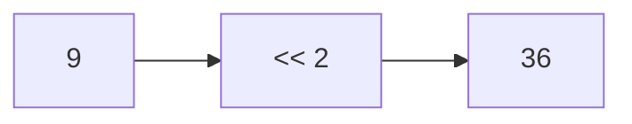

**📖 Cara Membaca Diagram:**
a=9. Shift kiri 2 kali = 9 * 2^2 = 36.

---
### Soal 69 (Left Shift Power)
```cpp
int a = 5;
int res = a << 2;
```
**Pertanyaan:**
1. Berapakah nilai akhir `res`?
2. Shift kiri sejauh 2 langkah setara dengan mengalikan `a` dengan angka berapa?
3. Apa yang terjadi pada bit-bit angka jika di-shift ke kiri?

**Jawaban & Diagnosis:**
1. **20**
2. **4**
3. **Bit bergeser ke kiri, dan muncul angka 0 di sebelah kanan (seperti nambah digit).**

**Mermaid Flowchart:**


**📖 Cara Membaca Diagram:**
a=5. Shift kiri 2 kali = 5 * 2^2 = 20.

---
### Soal 70 (Bitwise XOR Trick)
```cpp
int x = 73;
int res = x ^ x ^ 74;
```
**Pertanyaan:**
1. Berapakah nilai akhir `res`?
2. Apa yang terjadi jika angka yang sama di-XOR (`x ^ x`)?
3. Apa analogi yang cocok untuk XOR?

**Jawaban & Diagnosis:**
1. **74**
2. **Hasilnya menjadi 0 (Saling meniadakan).**
3. **Saklar lampu (Tekan 2x balik ke awal/padam).**

**Mermaid Flowchart:**
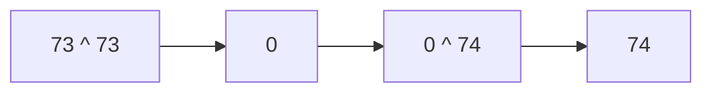

**📖 Cara Membaca Diagram:**
x ^ x = 0. Jadi 0 ^ 74 = 74.

---
### Soal 71 (Right Shift Div)
```cpp
int a = 42;
int res = a >> 1;
```
**Pertanyaan:**
1. Berapakah nilai akhir `res`?
2. Shift kanan sejauh 1 langkah setara dengan membagi `a` dengan angka berapa?
3. Mengapa shift kanan sering dipakai untuk optimasi?

**Jawaban & Diagnosis:**
1. **21**
2. **2**
3. **Karena pembagian oleh pangkat 2 jauh lebih cepat bagi prosesor daripada operator pembagian biasa.**

**Mermaid Flowchart:**
```mermaid
graph LR
    A[42] --> B[">> 1"]
    B --> C[21]
```

**📖 Cara Membaca Diagram:**
a=42. Shift kanan 1 kali = 42 / 2^1 = 21.

---
### Soal 72 (Bitwise XOR Trick)
```cpp
int x = 83;
int res = x ^ x ^ 84;
```
**Pertanyaan:**
1. Berapakah nilai akhir `res`?
2. Apa yang terjadi jika angka yang sama di-XOR (`x ^ x`)?
3. Apa analogi yang cocok untuk XOR?

**Jawaban & Diagnosis:**
1. **84**
2. **Hasilnya menjadi 0 (Saling meniadakan).**
3. **Saklar lampu (Tekan 2x balik ke awal/padam).**

**Mermaid Flowchart:**
```mermaid
graph LR
    A["83 ^ 83"] --> B[0]
    B --> C["0 ^ 84"]
    C --> D["84"]
```

**📖 Cara Membaca Diagram:**
x ^ x = 0. Jadi 0 ^ 84 = 84.

---
### Soal 73 (Right Shift Div)
```cpp
int a = 44;
int res = a >> 1;
```
**Pertanyaan:**
1. Berapakah nilai akhir `res`?
2. Shift kanan sejauh 1 langkah setara dengan membagi `a` dengan angka berapa?
3. Mengapa shift kanan sering dipakai untuk optimasi?

**Jawaban & Diagnosis:**
1. **22**
2. **2**
3. **Karena pembagian oleh pangkat 2 jauh lebih cepat bagi prosesor daripada operator pembagian biasa.**

**Mermaid Flowchart:**
```mermaid
graph LR
    A[44] --> B[">> 1"]
    B --> C[22]
```

**📖 Cara Membaca Diagram:**
a=44. Shift kanan 1 kali = 44 / 2^1 = 22.

---
### Soal 74 (Bitwise AND/OR)
```cpp
int a = 4;
int b = 3;
int res_and = a & b;
int res_or = a | b;
```
**Pertanyaan:**
1. Berapakah nilai `res_and`?
2. Berapakah nilai `res_or`?
3. Apa guna bitwise AND dalam mengecek angka ganjil?

**Jawaban & Diagnosis:**
1. **0**
2. **7**
3. **Untuk mengecek bit terakhir (x & 1). Jika hasilnya 1, maka ganjil.**

**Mermaid Flowchart:**
```mermaid
graph TD
    A["a=0b100"] --> C["AND -> 0b0"]
    B["b=0b11"] --> C
    A --> D["OR  -> 0b111"]
    B --> D
```

**📖 Cara Membaca Diagram:**
a=4 (0b100), b=3 (0b11). AND cari yang sama-sama 1. OR lumayan rakus ambil semua 1.

---
### Soal 75 (Bitwise AND/OR)
```cpp
int a = 6;
int b = 3;
int res_and = a & b;
int res_or = a | b;
```
**Pertanyaan:**
1. Berapakah nilai `res_and`?
2. Berapakah nilai `res_or`?
3. Apa guna bitwise AND dalam mengecek angka ganjil?

**Jawaban & Diagnosis:**
1. **2**
2. **7**
3. **Untuk mengecek bit terakhir (x & 1). Jika hasilnya 1, maka ganjil.**

**Mermaid Flowchart:**
```mermaid
graph TD
    A["a=0b110"] --> C["AND -> 0b10"]
    B["b=0b11"] --> C
    A --> D["OR  -> 0b111"]
    B --> D
```

**📖 Cara Membaca Diagram:**
a=6 (0b110), b=3 (0b11). AND cari yang sama-sama 1. OR lumayan rakus ambil semua 1.

---
