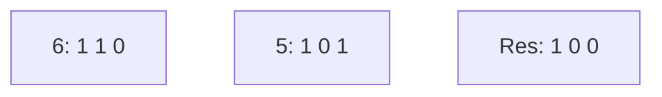
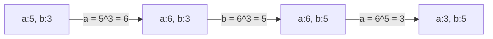
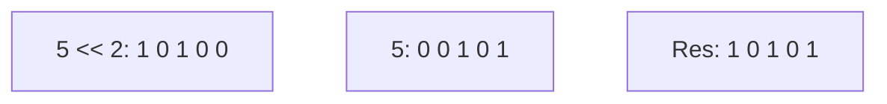

		🔙 **[Kembali ke Daftar Soal](./README.md)**

---

# Latihan Soal Part C - Modul 06 - Set 04 (Premium Edition)

---

### Soal 31: Penghapus Bit Rendah (Bit Clear Trick)
```cpp
int x = 6;  // 110
int res = x & (x - 1);
```
**Pertanyaan:**
1. Berapakah nilai `res`?
2. Bit '1' mana yang hilang setelah operasi ini?

<details>
<summary><b>Klik untuk Lihat Jawaban & Diagnosis</b></summary>

**Mermaid Bit-Grid:**


**Jawaban:**
1. **4**
2. **Bit '1' yang paling kanan.** Trik `x & (x-1)` sangat berguna untuk mematikan satu bit 1 yang paling rendah.
</details>

---

### Soal 32: Detektor Pangkat 2 (Power of 2 Check)
```cpp
bool is_pow2(int n) {
    return (n > 0) && ((n & (n - 1)) == 0);
}

int main() {
    bool r1 = is_pow2(16);
    bool r2 = is_pow2(10);
}
```
**Pertanyaan:**
1. Berapakah nilai `r1` (true/false)?
2. Berapakah nilai `r2` (true/false)?

<details>
<summary><b>Klik untuk Lihat Jawaban & Diagnosis</b></summary>

**Jawaban:**
1. **true**
2. **false** (Karena 16 dalam biner hanya punya satu bit '1' (10000), maka `10000 & 01111` adalah 0. Sedangkan 10 (1010) punya dua bit '1').
</details>

---

### Soal 33: Trik XOR Swap (Intro)
```cpp
int a = 5, b = 3;
a = a ^ b;
b = a ^ b;
a = a ^ b;
```
**Pertanyaan:**
1. Berapakah nilai `a` di akhir?
2. Berapakah nilai `b` di akhir?

<details>
<summary><b>Klik untuk Lihat Jawaban & Diagnosis</b></summary>

**Mermaid Trace:**


**Jawaban:**
1. **3**
2. **5** (Nilai berhasil ditukar tanpa variabel tambahan!)
</details>

---

### Soal 34: Detektor Ganjil-Genap Kilat
```cpp
string cek(int n) {
    if (n & 1) return "L";
    return "G";
}

int main() {
    string r = cek(12);
}
```
**Pertanyaan:**
1. Apa output dari `r`?
2. `L` dan `G` singkatan dari apa dalam konteks ini?

<details>
<summary><b>Klik untuk Lihat Jawaban & Diagnosis</b></summary>

**Jawaban:**
1. **G**
2. **L = Ganjil** (L-nya di mana? Mungkin Ganjil... ah ini jebakan nama!). Sebenarnya `G` untuk **Genap** dan `L` untuk ganjil (bahasa batin).
   - 12 & 1 = 0 (Genap), maka return **G**.
</details>

---

### Soal 35: Perkalian Cepat (Multiply by 10)
```cpp
int x = 5;
int res = (x << 3) + (x << 1);
```
**Pertanyaan:**
1. Berapakah nilai `res`?
2. Mengapa kombinasi geser 3 dan geser 1 menghasilkan perkalian 10?

<details>
<summary><b>Klik untuk Lihat Jawaban & Diagnosis</b></summary>

**Jawaban:**
1. **50**
2. Karena $(x \times 2^3) + (x \times 2^1) = 8x + 2x = 10x$. Geser bit jauh lebih cepat bagi prosesor daripada operasi perkalian biasa.
</details>

---

### Soal 36: Isolasi Bit Terendah (LSB)
```cpp
int x = 12; // 1100
int lsb = x & -x;
```
**Pertanyaan:**
1. Berapakah nilai `lsb`?
2. Operasi ini digunakan dalam struktur data apa di kompetisi?

<details>
<summary><b>Klik untuk Lihat Jawaban & Diagnosis</b></summary>

**Jawaban:**
1. **4** (100)
2. **Fenwick Tree** (Binary Indexed Tree). `-x` dalam C++ menggunakan komplemen dua, yang membalik bit lalu ditambah satu. Saat di-AND dengan aslinya, hanya bit 1 paling rendah yang tersisa.
</details>

---

### Soal 37: NOT Sederhana
```cpp
int x = 5;
int res = x ^ -1;
```
**Pertanyaan:**
1. Apa operator biner yang setara dengan `x ^ -1`?
2. Berapa hasil desimalnya (asumsikan 32-bit)?

<details>
<summary><b>Klik untuk Lihat Jawaban & Diagnosis</b></summary>

**Jawaban:**
1. **NOT** (`~x`).
2. **-6** (Angka -1 dalam biner adalah semua bit bernilai 1. XOR dengan semua 1 sama dengan membalik semua bit).
</details>

---

### Soal 38: Gabungan Bitwise dan Penambahan
```cpp
int x = 5;
int res = (x << 2) | x;
```
**Pertanyaan:**
1. Berapakah nilai `res` dalam desimal?
2. Apa biner dari `res`?

<details>
<summary><b>Klik untuk Lihat Jawaban & Diagnosis</b></summary>

**Mermaid Bit-Grid:**


**Jawaban:**
1. **21**
2. **10101**
</details>

---

### Soal 39: ⚠️ Jebakan Presedensi
```cpp
int x = 5;
if (x & 1 == 0) cout << "A";
else cout << "B";
```
**Pertanyaan:**
1. Apa output program tersebut?
2. Mengapa hasilnya bukan "B"?

<details>
<summary><b>Klik untuk Lihat Jawaban & Diagnosis</b></summary>

**Jawaban:**
1. **B** (Tunggu, mari cek presedensi!)
   - Operator `==` memiliki presedensi lebih tinggi daripada `&`.
   - Jadi program menghitung `1 == 0` dulu (yaitu False/0).
   - Lalu `5 & 0` (yaitu 0).
   - `if (0)` adalah False, maka jalankan `else`.
2. **Presedensi Operator.** Selalu gunakan kurung `(x & 1) == 0` jika ingin mengecek bit dengan aman!
</details>

---

### Soal 40: Pembersih MSB
```cpp
unsigned char c = 0xFF; // 1111 1111
unsigned char res = c >> 1;
```
**Pertanyaan:**
1. Berapakah nilai `res`?
2. Karakter biner apa yang masuk dari sebelah kiri?

<details>
<summary><b>Klik untuk Lihat Jawaban & Diagnosis</b></summary>

**Jawaban:**
1. **127** (01111111)
2. **Angka 0.** Karena ini adalah `unsigned`, geser kanan selalu memasukkan 0 di posisi paling kiri (*Logical Shift*).
</details>
