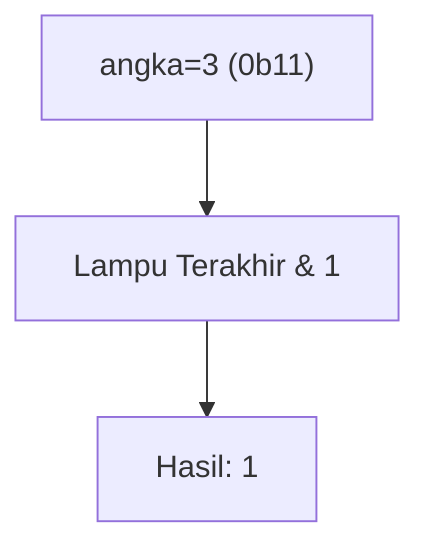
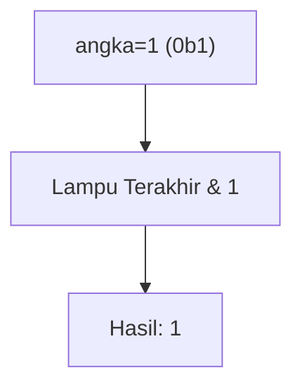
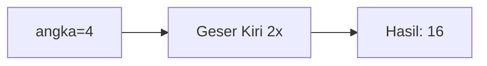
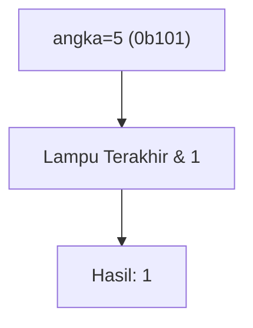
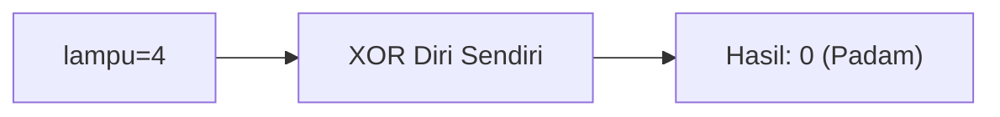
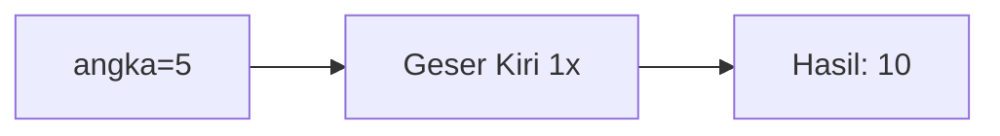
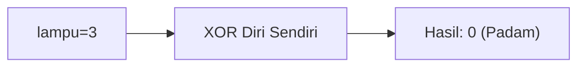
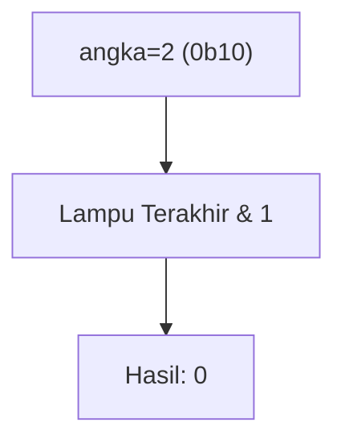

🔙 **[Kembali ke Daftar Soal](./README.md)**

---

# Latihan Soal Part C - Modul 06 - Set 04

### Soal 76
```cpp
int sensor_angka = 3;
int cek_ganjil = sensor_angka & 1;
```
**Pertanyaan:**
1. Berapakah hasil akhirnya?
2. Deskripsikan langkah robot compiler saat memproses kode ini!

**Jawaban & Diagnosis:**
1. **1**
2. Baca bagian 'Analisis Mendalam' di bawah.

**Mermaid Flowchart:**


**📖 Penjelasan Komprehensif:**
**Analisis Mendalam (Compiler Manusia):**
1. **Bit Ganjil**: Bit paling kanan menentukan ganjil atau genap. 
2. **Tracing**: 3 (0b11) di-AND-kan dengan 1 (0b1).
3. **Logika**: Hanya jika bit terakhir 1, hasilnya 1 (Artinya Ganjil).
4. **Hasil**: `cek_ganjil` bernilai **1**.

---
### Soal 77
```cpp
int sensor_angka = 1;
int cek_ganjil = sensor_angka & 1;
```
**Pertanyaan:**
1. Berapakah hasil akhirnya?
2. Deskripsikan langkah robot compiler saat memproses kode ini!

**Jawaban & Diagnosis:**
1. **1**
2. Baca bagian 'Analisis Mendalam' di bawah.

**Mermaid Flowchart:**


**📖 Penjelasan Komprehensif:**
**Analisis Mendalam (Compiler Manusia):**
1. **Bit Ganjil**: Bit paling kanan menentukan ganjil atau genap. 
2. **Tracing**: 1 (0b1) di-AND-kan dengan 1 (0b1).
3. **Logika**: Hanya jika bit terakhir 1, hasilnya 1 (Artinya Ganjil).
4. **Hasil**: `cek_ganjil` bernilai **1**.

---
### Soal 78
```cpp
int power_up = 5;
int hasil_shift = power_up << 2;
```
**Pertanyaan:**
1. Berapakah hasil akhirnya?
2. Deskripsikan langkah robot compiler saat memproses kode ini!

**Jawaban & Diagnosis:**
1. **20**
2. Baca bagian 'Analisis Mendalam' di bawah.

**Mermaid Flowchart:**


**📖 Penjelasan Komprehensif:**
**Analisis Mendalam (Compiler Manusia):**
1. **Shift Kiri**: Menggeser bit ke kiri dan menambah nol di belakang.
2. **Ekuivalen**: Sama dengan mengali 5 dengan 2 pangkat 2.
3. **Hasil**: 5 * 4 = **20**.

---
### Soal 79
```cpp
int power_up = 4;
int hasil_shift = power_up << 2;
```
**Pertanyaan:**
1. Berapakah hasil akhirnya?
2. Deskripsikan langkah robot compiler saat memproses kode ini!

**Jawaban & Diagnosis:**
1. **16**
2. Baca bagian 'Analisis Mendalam' di bawah.

**Mermaid Flowchart:**


**📖 Penjelasan Komprehensif:**
**Analisis Mendalam (Compiler Manusia):**
1. **Shift Kiri**: Menggeser bit ke kiri dan menambah nol di belakang.
2. **Ekuivalen**: Sama dengan mengali 4 dengan 2 pangkat 2.
3. **Hasil**: 4 * 4 = **16**.

---
### Soal 80
```cpp
int sensor_angka = 3;
int cek_ganjil = sensor_angka & 1;
```
**Pertanyaan:**
1. Berapakah hasil akhirnya?
2. Deskripsikan langkah robot compiler saat memproses kode ini!

**Jawaban & Diagnosis:**
1. **1**
2. Baca bagian 'Analisis Mendalam' di bawah.

**Mermaid Flowchart:**


**📖 Penjelasan Komprehensif:**
**Analisis Mendalam (Compiler Manusia):**
1. **Bit Ganjil**: Bit paling kanan menentukan ganjil atau genap. 
2. **Tracing**: 3 (0b11) di-AND-kan dengan 1 (0b1).
3. **Logika**: Hanya jika bit terakhir 1, hasilnya 1 (Artinya Ganjil).
4. **Hasil**: `cek_ganjil` bernilai **1**.

---
### Soal 81
```cpp
int sensor_angka = 5;
int cek_ganjil = sensor_angka & 1;
```
**Pertanyaan:**
1. Berapakah hasil akhirnya?
2. Deskripsikan langkah robot compiler saat memproses kode ini!

**Jawaban & Diagnosis:**
1. **1**
2. Baca bagian 'Analisis Mendalam' di bawah.

**Mermaid Flowchart:**


**📖 Penjelasan Komprehensif:**
**Analisis Mendalam (Compiler Manusia):**
1. **Bit Ganjil**: Bit paling kanan menentukan ganjil atau genap. 
2. **Tracing**: 5 (0b101) di-AND-kan dengan 1 (0b1).
3. **Logika**: Hanya jika bit terakhir 1, hasilnya 1 (Artinya Ganjil).
4. **Hasil**: `cek_ganjil` bernilai **1**.

---
### Soal 82
```cpp
int sensor_angka = 5;
int cek_ganjil = sensor_angka & 1;
```
**Pertanyaan:**
1. Berapakah hasil akhirnya?
2. Deskripsikan langkah robot compiler saat memproses kode ini!

**Jawaban & Diagnosis:**
1. **1**
2. Baca bagian 'Analisis Mendalam' di bawah.

**Mermaid Flowchart:**


**📖 Penjelasan Komprehensif:**
**Analisis Mendalam (Compiler Manusia):**
1. **Bit Ganjil**: Bit paling kanan menentukan ganjil atau genap. 
2. **Tracing**: 5 (0b101) di-AND-kan dengan 1 (0b1).
3. **Logika**: Hanya jika bit terakhir 1, hasilnya 1 (Artinya Ganjil).
4. **Hasil**: `cek_ganjil` bernilai **1**.

---
### Soal 83
```cpp
int status_lampu = 4;
int toggle = status_lampu ^ status_lampu;
```
**Pertanyaan:**
1. Berapakah hasil akhirnya?
2. Deskripsikan langkah robot compiler saat memproses kode ini!

**Jawaban & Diagnosis:**
1. **0**
2. Baca bagian 'Analisis Mendalam' di bawah.

**Mermaid Flowchart:**


**📖 Penjelasan Komprehensif:**
**Analisis Mendalam (Compiler Manusia):**
1. **XOR Self**: Angka apa pun jika di-XOR dengan dirinya sendiri akan saling meniadakan.
2. **Magic Logic**: Bit yang sama menghasilkan 0.
3. **Hasil**: `toggle` mutlak bernilai **0**.

---
### Soal 84
```cpp
int power_up = 5;
int hasil_shift = power_up << 1;
```
**Pertanyaan:**
1. Berapakah hasil akhirnya?
2. Deskripsikan langkah robot compiler saat memproses kode ini!

**Jawaban & Diagnosis:**
1. **10**
2. Baca bagian 'Analisis Mendalam' di bawah.

**Mermaid Flowchart:**


**📖 Penjelasan Komprehensif:**
**Analisis Mendalam (Compiler Manusia):**
1. **Shift Kiri**: Menggeser bit ke kiri dan menambah nol di belakang.
2. **Ekuivalen**: Sama dengan mengali 5 dengan 2 pangkat 1.
3. **Hasil**: 5 * 2 = **10**.

---
### Soal 85
```cpp
int sensor_angka = 1;
int cek_ganjil = sensor_angka & 1;
```
**Pertanyaan:**
1. Berapakah hasil akhirnya?
2. Deskripsikan langkah robot compiler saat memproses kode ini!

**Jawaban & Diagnosis:**
1. **1**
2. Baca bagian 'Analisis Mendalam' di bawah.

**Mermaid Flowchart:**


**📖 Penjelasan Komprehensif:**
**Analisis Mendalam (Compiler Manusia):**
1. **Bit Ganjil**: Bit paling kanan menentukan ganjil atau genap. 
2. **Tracing**: 1 (0b1) di-AND-kan dengan 1 (0b1).
3. **Logika**: Hanya jika bit terakhir 1, hasilnya 1 (Artinya Ganjil).
4. **Hasil**: `cek_ganjil` bernilai **1**.

---
### Soal 86
```cpp
int power_up = 5;
int hasil_shift = power_up << 1;
```
**Pertanyaan:**
1. Berapakah hasil akhirnya?
2. Deskripsikan langkah robot compiler saat memproses kode ini!

**Jawaban & Diagnosis:**
1. **10**
2. Baca bagian 'Analisis Mendalam' di bawah.

**Mermaid Flowchart:**


**📖 Penjelasan Komprehensif:**
**Analisis Mendalam (Compiler Manusia):**
1. **Shift Kiri**: Menggeser bit ke kiri dan menambah nol di belakang.
2. **Ekuivalen**: Sama dengan mengali 5 dengan 2 pangkat 1.
3. **Hasil**: 5 * 2 = **10**.

---
### Soal 87
```cpp
int power_up = 5;
int hasil_shift = power_up << 1;
```
**Pertanyaan:**
1. Berapakah hasil akhirnya?
2. Deskripsikan langkah robot compiler saat memproses kode ini!

**Jawaban & Diagnosis:**
1. **10**
2. Baca bagian 'Analisis Mendalam' di bawah.

**Mermaid Flowchart:**


**📖 Penjelasan Komprehensif:**
**Analisis Mendalam (Compiler Manusia):**
1. **Shift Kiri**: Menggeser bit ke kiri dan menambah nol di belakang.
2. **Ekuivalen**: Sama dengan mengali 5 dengan 2 pangkat 1.
3. **Hasil**: 5 * 2 = **10**.

---
### Soal 88
```cpp
int status_lampu = 2;
int toggle = status_lampu ^ status_lampu;
```
**Pertanyaan:**
1. Berapakah hasil akhirnya?
2. Deskripsikan langkah robot compiler saat memproses kode ini!

**Jawaban & Diagnosis:**
1. **0**
2. Baca bagian 'Analisis Mendalam' di bawah.

**Mermaid Flowchart:**


**📖 Penjelasan Komprehensif:**
**Analisis Mendalam (Compiler Manusia):**
1. **XOR Self**: Angka apa pun jika di-XOR dengan dirinya sendiri akan saling meniadakan.
2. **Magic Logic**: Bit yang sama menghasilkan 0.
3. **Hasil**: `toggle` mutlak bernilai **0**.

---
### Soal 89
```cpp
int sensor_angka = 3;
int cek_ganjil = sensor_angka & 1;
```
**Pertanyaan:**
1. Berapakah hasil akhirnya?
2. Deskripsikan langkah robot compiler saat memproses kode ini!

**Jawaban & Diagnosis:**
1. **1**
2. Baca bagian 'Analisis Mendalam' di bawah.

**Mermaid Flowchart:**


**📖 Penjelasan Komprehensif:**
**Analisis Mendalam (Compiler Manusia):**
1. **Bit Ganjil**: Bit paling kanan menentukan ganjil atau genap. 
2. **Tracing**: 3 (0b11) di-AND-kan dengan 1 (0b1).
3. **Logika**: Hanya jika bit terakhir 1, hasilnya 1 (Artinya Ganjil).
4. **Hasil**: `cek_ganjil` bernilai **1**.

---
### Soal 90
```cpp
int status_lampu = 5;
int toggle = status_lampu ^ status_lampu;
```
**Pertanyaan:**
1. Berapakah hasil akhirnya?
2. Deskripsikan langkah robot compiler saat memproses kode ini!

**Jawaban & Diagnosis:**
1. **0**
2. Baca bagian 'Analisis Mendalam' di bawah.

**Mermaid Flowchart:**


**📖 Penjelasan Komprehensif:**
**Analisis Mendalam (Compiler Manusia):**
1. **XOR Self**: Angka apa pun jika di-XOR dengan dirinya sendiri akan saling meniadakan.
2. **Magic Logic**: Bit yang sama menghasilkan 0.
3. **Hasil**: `toggle` mutlak bernilai **0**.

---
### Soal 91
```cpp
int status_lampu = 3;
int toggle = status_lampu ^ status_lampu;
```
**Pertanyaan:**
1. Berapakah hasil akhirnya?
2. Deskripsikan langkah robot compiler saat memproses kode ini!

**Jawaban & Diagnosis:**
1. **0**
2. Baca bagian 'Analisis Mendalam' di bawah.

**Mermaid Flowchart:**


**📖 Penjelasan Komprehensif:**
**Analisis Mendalam (Compiler Manusia):**
1. **XOR Self**: Angka apa pun jika di-XOR dengan dirinya sendiri akan saling meniadakan.
2. **Magic Logic**: Bit yang sama menghasilkan 0.
3. **Hasil**: `toggle` mutlak bernilai **0**.

---
### Soal 92
```cpp
int sensor_angka = 3;
int cek_ganjil = sensor_angka & 1;
```
**Pertanyaan:**
1. Berapakah hasil akhirnya?
2. Deskripsikan langkah robot compiler saat memproses kode ini!

**Jawaban & Diagnosis:**
1. **1**
2. Baca bagian 'Analisis Mendalam' di bawah.

**Mermaid Flowchart:**


**📖 Penjelasan Komprehensif:**
**Analisis Mendalam (Compiler Manusia):**
1. **Bit Ganjil**: Bit paling kanan menentukan ganjil atau genap. 
2. **Tracing**: 3 (0b11) di-AND-kan dengan 1 (0b1).
3. **Logika**: Hanya jika bit terakhir 1, hasilnya 1 (Artinya Ganjil).
4. **Hasil**: `cek_ganjil` bernilai **1**.

---
### Soal 93
```cpp
int power_up = 4;
int hasil_shift = power_up << 2;
```
**Pertanyaan:**
1. Berapakah hasil akhirnya?
2. Deskripsikan langkah robot compiler saat memproses kode ini!

**Jawaban & Diagnosis:**
1. **16**
2. Baca bagian 'Analisis Mendalam' di bawah.

**Mermaid Flowchart:**


**📖 Penjelasan Komprehensif:**
**Analisis Mendalam (Compiler Manusia):**
1. **Shift Kiri**: Menggeser bit ke kiri dan menambah nol di belakang.
2. **Ekuivalen**: Sama dengan mengali 4 dengan 2 pangkat 2.
3. **Hasil**: 4 * 4 = **16**.

---
### Soal 94
```cpp
int status_lampu = 2;
int toggle = status_lampu ^ status_lampu;
```
**Pertanyaan:**
1. Berapakah hasil akhirnya?
2. Deskripsikan langkah robot compiler saat memproses kode ini!

**Jawaban & Diagnosis:**
1. **0**
2. Baca bagian 'Analisis Mendalam' di bawah.

**Mermaid Flowchart:**


**📖 Penjelasan Komprehensif:**
**Analisis Mendalam (Compiler Manusia):**
1. **XOR Self**: Angka apa pun jika di-XOR dengan dirinya sendiri akan saling meniadakan.
2. **Magic Logic**: Bit yang sama menghasilkan 0.
3. **Hasil**: `toggle` mutlak bernilai **0**.

---
### Soal 95
```cpp
int sensor_angka = 2;
int cek_ganjil = sensor_angka & 1;
```
**Pertanyaan:**
1. Berapakah hasil akhirnya?
2. Deskripsikan langkah robot compiler saat memproses kode ini!

**Jawaban & Diagnosis:**
1. **0**
2. Baca bagian 'Analisis Mendalam' di bawah.

**Mermaid Flowchart:**


**📖 Penjelasan Komprehensif:**
**Analisis Mendalam (Compiler Manusia):**
1. **Bit Ganjil**: Bit paling kanan menentukan ganjil atau genap. 
2. **Tracing**: 2 (0b10) di-AND-kan dengan 1 (0b1).
3. **Logika**: Hanya jika bit terakhir 1, hasilnya 1 (Artinya Ganjil).
4. **Hasil**: `cek_ganjil` bernilai **0**.

---
### Soal 96
```cpp
int power_up = 1;
int hasil_shift = power_up << 2;
```
**Pertanyaan:**
1. Berapakah hasil akhirnya?
2. Deskripsikan langkah robot compiler saat memproses kode ini!

**Jawaban & Diagnosis:**
1. **4**
2. Baca bagian 'Analisis Mendalam' di bawah.

**Mermaid Flowchart:**
```mermaid
graph LR
A["angka=1"] --> B["Geser Kiri 2x"]
B --> C["Hasil: 4"]
```

**📖 Penjelasan Komprehensif:**
**Analisis Mendalam (Compiler Manusia):**
1. **Shift Kiri**: Menggeser bit ke kiri dan menambah nol di belakang.
2. **Ekuivalen**: Sama dengan mengali 1 dengan 2 pangkat 2.
3. **Hasil**: 1 * 4 = **4**.

---
### Soal 97
```cpp
int sensor_angka = 3;
int cek_ganjil = sensor_angka & 1;
```
**Pertanyaan:**
1. Berapakah hasil akhirnya?
2. Deskripsikan langkah robot compiler saat memproses kode ini!

**Jawaban & Diagnosis:**
1. **1**
2. Baca bagian 'Analisis Mendalam' di bawah.

**Mermaid Flowchart:**
```mermaid
graph TD
A["angka=3 (0b11)"] --> B["Lampu Terakhir & 1"]
B --> C["Hasil: 1"]
```

**📖 Penjelasan Komprehensif:**
**Analisis Mendalam (Compiler Manusia):**
1. **Bit Ganjil**: Bit paling kanan menentukan ganjil atau genap. 
2. **Tracing**: 3 (0b11) di-AND-kan dengan 1 (0b1).
3. **Logika**: Hanya jika bit terakhir 1, hasilnya 1 (Artinya Ganjil).
4. **Hasil**: `cek_ganjil` bernilai **1**.

---
### Soal 98
```cpp
int status_lampu = 5;
int toggle = status_lampu ^ status_lampu;
```
**Pertanyaan:**
1. Berapakah hasil akhirnya?
2. Deskripsikan langkah robot compiler saat memproses kode ini!

**Jawaban & Diagnosis:**
1. **0**
2. Baca bagian 'Analisis Mendalam' di bawah.

**Mermaid Flowchart:**
```mermaid
graph LR
A["lampu=5"] --> B["XOR Diri Sendiri"]
B --> C["Hasil: 0 (Padam)"]
```

**📖 Penjelasan Komprehensif:**
**Analisis Mendalam (Compiler Manusia):**
1. **XOR Self**: Angka apa pun jika di-XOR dengan dirinya sendiri akan saling meniadakan.
2. **Magic Logic**: Bit yang sama menghasilkan 0.
3. **Hasil**: `toggle` mutlak bernilai **0**.

---
### Soal 99
```cpp
int power_up = 5;
int hasil_shift = power_up << 1;
```
**Pertanyaan:**
1. Berapakah hasil akhirnya?
2. Deskripsikan langkah robot compiler saat memproses kode ini!

**Jawaban & Diagnosis:**
1. **10**
2. Baca bagian 'Analisis Mendalam' di bawah.

**Mermaid Flowchart:**
```mermaid
graph LR
A["angka=5"] --> B["Geser Kiri 1x"]
B --> C["Hasil: 10"]
```

**📖 Penjelasan Komprehensif:**
**Analisis Mendalam (Compiler Manusia):**
1. **Shift Kiri**: Menggeser bit ke kiri dan menambah nol di belakang.
2. **Ekuivalen**: Sama dengan mengali 5 dengan 2 pangkat 1.
3. **Hasil**: 5 * 2 = **10**.

---
### Soal 100
```cpp
int power_up = 4;
int hasil_shift = power_up << 2;
```
**Pertanyaan:**
1. Berapakah hasil akhirnya?
2. Deskripsikan langkah robot compiler saat memproses kode ini!

**Jawaban & Diagnosis:**
1. **16**
2. Baca bagian 'Analisis Mendalam' di bawah.

**Mermaid Flowchart:**
```mermaid
graph LR
A["angka=4"] --> B["Geser Kiri 2x"]
B --> C["Hasil: 16"]
```

**📖 Penjelasan Komprehensif:**
**Analisis Mendalam (Compiler Manusia):**
1. **Shift Kiri**: Menggeser bit ke kiri dan menambah nol di belakang.
2. **Ekuivalen**: Sama dengan mengali 4 dengan 2 pangkat 2.
3. **Hasil**: 4 * 4 = **16**.

---
