# Latihan Soal Part C - Modul 06 - Set 04

### Soal 76 (Bitwise XOR Trick)
```cpp
int x = 27;
int res = x ^ x ^ 28;
```
**Pertanyaan:**
1. Berapakah nilai akhir `res`?
2. Apa yang terjadi jika angka yang sama di-XOR (`x ^ x`)?
3. Apa analogi yang cocok untuk XOR?

**Jawaban & Diagnosis:**
1. **28**
2. **Hasilnya menjadi 0 (Saling meniadakan).**
3. **Saklar lampu (Tekan 2x balik ke awal/padam).**

**Mermaid Flowchart:**
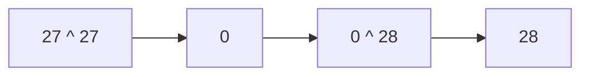

**📖 Cara Membaca Diagram:**
x ^ x = 0. Jadi 0 ^ 28 = 28.

---
### Soal 77 (Bitwise AND/OR)
```cpp
int a = 7;
int b = 4;
int res_and = a & b;
int res_or = a | b;
```
**Pertanyaan:**
1. Berapakah nilai `res_and`?
2. Berapakah nilai `res_or`?
3. Apa guna bitwise AND dalam mengecek angka ganjil?

**Jawaban & Diagnosis:**
1. **4**
2. **7**
3. **Untuk mengecek bit terakhir (x & 1). Jika hasilnya 1, maka ganjil.**

**Mermaid Flowchart:**
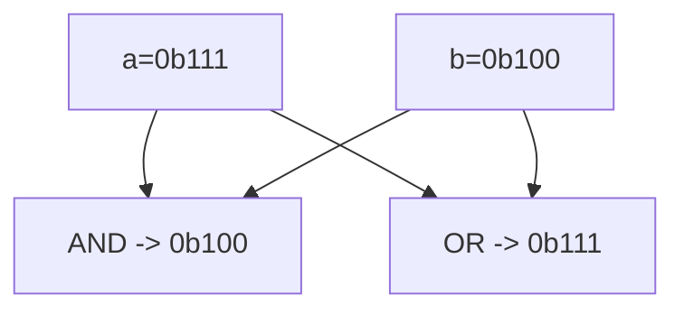

**📖 Cara Membaca Diagram:**
a=7 (0b111), b=4 (0b100). AND cari yang sama-sama 1. OR lumayan rakus ambil semua 1.

---
### Soal 78 (Bitwise XOR Trick)
```cpp
int x = 29;
int res = x ^ x ^ 30;
```
**Pertanyaan:**
1. Berapakah nilai akhir `res`?
2. Apa yang terjadi jika angka yang sama di-XOR (`x ^ x`)?
3. Apa analogi yang cocok untuk XOR?

**Jawaban & Diagnosis:**
1. **30**
2. **Hasilnya menjadi 0 (Saling meniadakan).**
3. **Saklar lampu (Tekan 2x balik ke awal/padam).**

**Mermaid Flowchart:**
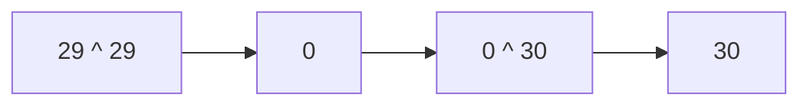

**📖 Cara Membaca Diagram:**
x ^ x = 0. Jadi 0 ^ 30 = 30.

---
### Soal 79 (Bitwise XOR Trick)
```cpp
int x = 44;
int res = x ^ x ^ 45;
```
**Pertanyaan:**
1. Berapakah nilai akhir `res`?
2. Apa yang terjadi jika angka yang sama di-XOR (`x ^ x`)?
3. Apa analogi yang cocok untuk XOR?

**Jawaban & Diagnosis:**
1. **45**
2. **Hasilnya menjadi 0 (Saling meniadakan).**
3. **Saklar lampu (Tekan 2x balik ke awal/padam).**

**Mermaid Flowchart:**
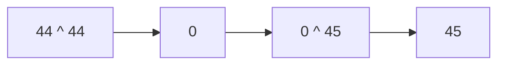

**📖 Cara Membaca Diagram:**
x ^ x = 0. Jadi 0 ^ 45 = 45.

---
### Soal 80 (Bitwise XOR Trick)
```cpp
int x = 40;
int res = x ^ x ^ 41;
```
**Pertanyaan:**
1. Berapakah nilai akhir `res`?
2. Apa yang terjadi jika angka yang sama di-XOR (`x ^ x`)?
3. Apa analogi yang cocok untuk XOR?

**Jawaban & Diagnosis:**
1. **41**
2. **Hasilnya menjadi 0 (Saling meniadakan).**
3. **Saklar lampu (Tekan 2x balik ke awal/padam).**

**Mermaid Flowchart:**
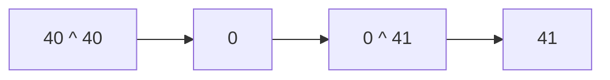

**📖 Cara Membaca Diagram:**
x ^ x = 0. Jadi 0 ^ 41 = 41.

---
### Soal 81 (Right Shift Div)
```cpp
int a = 39;
int res = a >> 1;
```
**Pertanyaan:**
1. Berapakah nilai akhir `res`?
2. Shift kanan sejauh 1 langkah setara dengan membagi `a` dengan angka berapa?
3. Mengapa shift kanan sering dipakai untuk optimasi?

**Jawaban & Diagnosis:**
1. **19**
2. **2**
3. **Karena pembagian oleh pangkat 2 jauh lebih cepat bagi prosesor daripada operator pembagian biasa.**

**Mermaid Flowchart:**
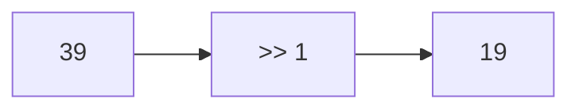

**📖 Cara Membaca Diagram:**
a=39. Shift kanan 1 kali = 39 / 2^1 = 19.

---
### Soal 82 (Bitwise AND/OR)
```cpp
int a = 7;
int b = 4;
int res_and = a & b;
int res_or = a | b;
```
**Pertanyaan:**
1. Berapakah nilai `res_and`?
2. Berapakah nilai `res_or`?
3. Apa guna bitwise AND dalam mengecek angka ganjil?

**Jawaban & Diagnosis:**
1. **4**
2. **7**
3. **Untuk mengecek bit terakhir (x & 1). Jika hasilnya 1, maka ganjil.**

**Mermaid Flowchart:**


**📖 Cara Membaca Diagram:**
a=7 (0b111), b=4 (0b100). AND cari yang sama-sama 1. OR lumayan rakus ambil semua 1.

---
### Soal 83 (Bitwise XOR Trick)
```cpp
int x = 19;
int res = x ^ x ^ 20;
```
**Pertanyaan:**
1. Berapakah nilai akhir `res`?
2. Apa yang terjadi jika angka yang sama di-XOR (`x ^ x`)?
3. Apa analogi yang cocok untuk XOR?

**Jawaban & Diagnosis:**
1. **20**
2. **Hasilnya menjadi 0 (Saling meniadakan).**
3. **Saklar lampu (Tekan 2x balik ke awal/padam).**

**Mermaid Flowchart:**
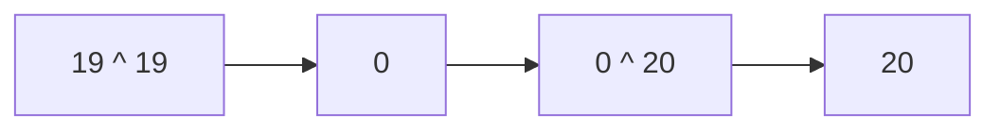

**📖 Cara Membaca Diagram:**
x ^ x = 0. Jadi 0 ^ 20 = 20.

---
### Soal 84 (Bitwise AND/OR)
```cpp
int a = 6;
int b = 3;
int res_and = a & b;
int res_or = a | b;
```
**Pertanyaan:**
1. Berapakah nilai `res_and`?
2. Berapakah nilai `res_or`?
3. Apa guna bitwise AND dalam mengecek angka ganjil?

**Jawaban & Diagnosis:**
1. **2**
2. **7**
3. **Untuk mengecek bit terakhir (x & 1). Jika hasilnya 1, maka ganjil.**

**Mermaid Flowchart:**
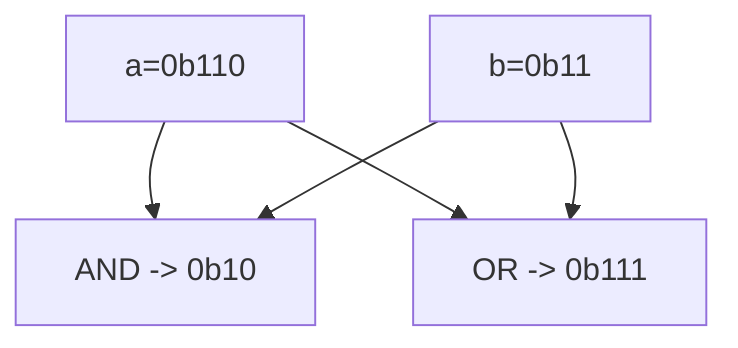

**📖 Cara Membaca Diagram:**
a=6 (0b110), b=3 (0b11). AND cari yang sama-sama 1. OR lumayan rakus ambil semua 1.

---
### Soal 85 (Bitwise AND/OR)
```cpp
int a = 5;
int b = 4;
int res_and = a & b;
int res_or = a | b;
```
**Pertanyaan:**
1. Berapakah nilai `res_and`?
2. Berapakah nilai `res_or`?
3. Apa guna bitwise AND dalam mengecek angka ganjil?

**Jawaban & Diagnosis:**
1. **4**
2. **5**
3. **Untuk mengecek bit terakhir (x & 1). Jika hasilnya 1, maka ganjil.**

**Mermaid Flowchart:**
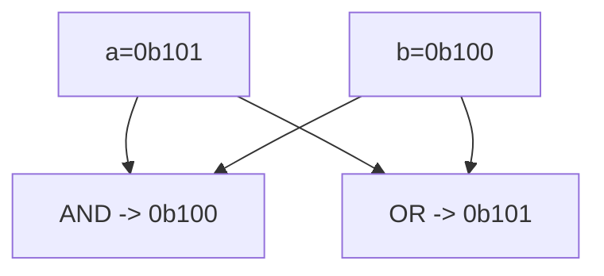

**📖 Cara Membaca Diagram:**
a=5 (0b101), b=4 (0b100). AND cari yang sama-sama 1. OR lumayan rakus ambil semua 1.

---
### Soal 86 (Bitwise AND/OR)
```cpp
int a = 6;
int b = 4;
int res_and = a & b;
int res_or = a | b;
```
**Pertanyaan:**
1. Berapakah nilai `res_and`?
2. Berapakah nilai `res_or`?
3. Apa guna bitwise AND dalam mengecek angka ganjil?

**Jawaban & Diagnosis:**
1. **4**
2. **6**
3. **Untuk mengecek bit terakhir (x & 1). Jika hasilnya 1, maka ganjil.**

**Mermaid Flowchart:**
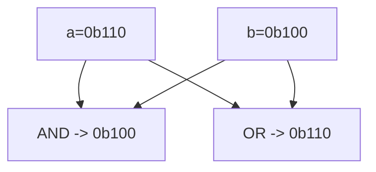

**📖 Cara Membaca Diagram:**
a=6 (0b110), b=4 (0b100). AND cari yang sama-sama 1. OR lumayan rakus ambil semua 1.

---
### Soal 87 (Right Shift Div)
```cpp
int a = 36;
int res = a >> 2;
```
**Pertanyaan:**
1. Berapakah nilai akhir `res`?
2. Shift kanan sejauh 2 langkah setara dengan membagi `a` dengan angka berapa?
3. Mengapa shift kanan sering dipakai untuk optimasi?

**Jawaban & Diagnosis:**
1. **9**
2. **4**
3. **Karena pembagian oleh pangkat 2 jauh lebih cepat bagi prosesor daripada operator pembagian biasa.**

**Mermaid Flowchart:**
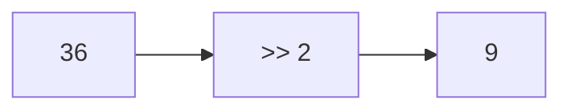

**📖 Cara Membaca Diagram:**
a=36. Shift kanan 2 kali = 36 / 2^2 = 9.

---
### Soal 88 (Bitwise AND/OR)
```cpp
int a = 6;
int b = 5;
int res_and = a & b;
int res_or = a | b;
```
**Pertanyaan:**
1. Berapakah nilai `res_and`?
2. Berapakah nilai `res_or`?
3. Apa guna bitwise AND dalam mengecek angka ganjil?

**Jawaban & Diagnosis:**
1. **4**
2. **7**
3. **Untuk mengecek bit terakhir (x & 1). Jika hasilnya 1, maka ganjil.**

**Mermaid Flowchart:**
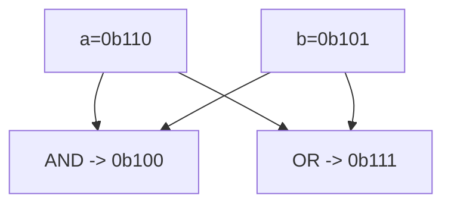

**📖 Cara Membaca Diagram:**
a=6 (0b110), b=5 (0b101). AND cari yang sama-sama 1. OR lumayan rakus ambil semua 1.

---
### Soal 89 (Bitwise AND/OR)
```cpp
int a = 7;
int b = 4;
int res_and = a & b;
int res_or = a | b;
```
**Pertanyaan:**
1. Berapakah nilai `res_and`?
2. Berapakah nilai `res_or`?
3. Apa guna bitwise AND dalam mengecek angka ganjil?

**Jawaban & Diagnosis:**
1. **4**
2. **7**
3. **Untuk mengecek bit terakhir (x & 1). Jika hasilnya 1, maka ganjil.**

**Mermaid Flowchart:**


**📖 Cara Membaca Diagram:**
a=7 (0b111), b=4 (0b100). AND cari yang sama-sama 1. OR lumayan rakus ambil semua 1.

---
### Soal 90 (Right Shift Div)
```cpp
int a = 27;
int res = a >> 2;
```
**Pertanyaan:**
1. Berapakah nilai akhir `res`?
2. Shift kanan sejauh 2 langkah setara dengan membagi `a` dengan angka berapa?
3. Mengapa shift kanan sering dipakai untuk optimasi?

**Jawaban & Diagnosis:**
1. **6**
2. **4**
3. **Karena pembagian oleh pangkat 2 jauh lebih cepat bagi prosesor daripada operator pembagian biasa.**

**Mermaid Flowchart:**
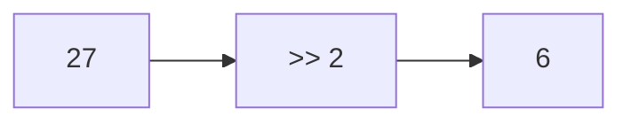

**📖 Cara Membaca Diagram:**
a=27. Shift kanan 2 kali = 27 / 2^2 = 6.

---
### Soal 91 (Left Shift Power)
```cpp
int a = 9;
int res = a << 1;
```
**Pertanyaan:**
1. Berapakah nilai akhir `res`?
2. Shift kiri sejauh 1 langkah setara dengan mengalikan `a` dengan angka berapa?
3. Apa yang terjadi pada bit-bit angka jika di-shift ke kiri?

**Jawaban & Diagnosis:**
1. **18**
2. **2**
3. **Bit bergeser ke kiri, dan muncul angka 0 di sebelah kanan (seperti nambah digit).**

**Mermaid Flowchart:**
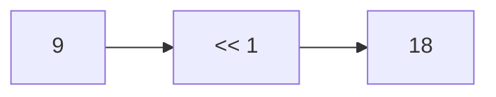

**📖 Cara Membaca Diagram:**
a=9. Shift kiri 1 kali = 9 * 2^1 = 18.

---
### Soal 92 (Bitwise XOR Trick)
```cpp
int x = 38;
int res = x ^ x ^ 39;
```
**Pertanyaan:**
1. Berapakah nilai akhir `res`?
2. Apa yang terjadi jika angka yang sama di-XOR (`x ^ x`)?
3. Apa analogi yang cocok untuk XOR?

**Jawaban & Diagnosis:**
1. **39**
2. **Hasilnya menjadi 0 (Saling meniadakan).**
3. **Saklar lampu (Tekan 2x balik ke awal/padam).**

**Mermaid Flowchart:**
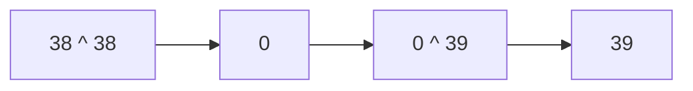

**📖 Cara Membaca Diagram:**
x ^ x = 0. Jadi 0 ^ 39 = 39.

---
### Soal 93 (Bitwise AND/OR)
```cpp
int a = 4;
int b = 4;
int res_and = a & b;
int res_or = a | b;
```
**Pertanyaan:**
1. Berapakah nilai `res_and`?
2. Berapakah nilai `res_or`?
3. Apa guna bitwise AND dalam mengecek angka ganjil?

**Jawaban & Diagnosis:**
1. **4**
2. **4**
3. **Untuk mengecek bit terakhir (x & 1). Jika hasilnya 1, maka ganjil.**

**Mermaid Flowchart:**
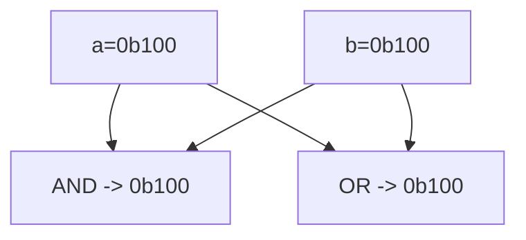

**📖 Cara Membaca Diagram:**
a=4 (0b100), b=4 (0b100). AND cari yang sama-sama 1. OR lumayan rakus ambil semua 1.

---
### Soal 94 (Left Shift Power)
```cpp
int a = 6;
int res = a << 3;
```
**Pertanyaan:**
1. Berapakah nilai akhir `res`?
2. Shift kiri sejauh 3 langkah setara dengan mengalikan `a` dengan angka berapa?
3. Apa yang terjadi pada bit-bit angka jika di-shift ke kiri?

**Jawaban & Diagnosis:**
1. **48**
2. **8**
3. **Bit bergeser ke kiri, dan muncul angka 0 di sebelah kanan (seperti nambah digit).**

**Mermaid Flowchart:**
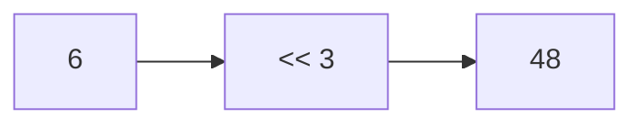

**📖 Cara Membaca Diagram:**
a=6. Shift kiri 3 kali = 6 * 2^3 = 48.

---
### Soal 95 (Bitwise AND/OR)
```cpp
int a = 3;
int b = 5;
int res_and = a & b;
int res_or = a | b;
```
**Pertanyaan:**
1. Berapakah nilai `res_and`?
2. Berapakah nilai `res_or`?
3. Apa guna bitwise AND dalam mengecek angka ganjil?

**Jawaban & Diagnosis:**
1. **1**
2. **7**
3. **Untuk mengecek bit terakhir (x & 1). Jika hasilnya 1, maka ganjil.**

**Mermaid Flowchart:**
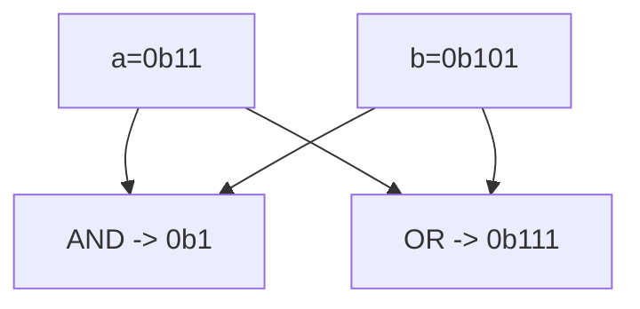

**📖 Cara Membaca Diagram:**
a=3 (0b11), b=5 (0b101). AND cari yang sama-sama 1. OR lumayan rakus ambil semua 1.

---
### Soal 96 (Bitwise XOR Trick)
```cpp
int x = 24;
int res = x ^ x ^ 25;
```
**Pertanyaan:**
1. Berapakah nilai akhir `res`?
2. Apa yang terjadi jika angka yang sama di-XOR (`x ^ x`)?
3. Apa analogi yang cocok untuk XOR?

**Jawaban & Diagnosis:**
1. **25**
2. **Hasilnya menjadi 0 (Saling meniadakan).**
3. **Saklar lampu (Tekan 2x balik ke awal/padam).**

**Mermaid Flowchart:**
```mermaid
graph LR
    A["24 ^ 24"] --> B[0]
    B --> C["0 ^ 25"]
    C --> D["25"]
```

**📖 Cara Membaca Diagram:**
x ^ x = 0. Jadi 0 ^ 25 = 25.

---
### Soal 97 (Right Shift Div)
```cpp
int a = 23;
int res = a >> 2;
```
**Pertanyaan:**
1. Berapakah nilai akhir `res`?
2. Shift kanan sejauh 2 langkah setara dengan membagi `a` dengan angka berapa?
3. Mengapa shift kanan sering dipakai untuk optimasi?

**Jawaban & Diagnosis:**
1. **5**
2. **4**
3. **Karena pembagian oleh pangkat 2 jauh lebih cepat bagi prosesor daripada operator pembagian biasa.**

**Mermaid Flowchart:**
```mermaid
graph LR
    A[23] --> B[">> 2"]
    B --> C[5]
```

**📖 Cara Membaca Diagram:**
a=23. Shift kanan 2 kali = 23 / 2^2 = 5.

---
### Soal 98 (Left Shift Power)
```cpp
int a = 8;
int res = a << 3;
```
**Pertanyaan:**
1. Berapakah nilai akhir `res`?
2. Shift kiri sejauh 3 langkah setara dengan mengalikan `a` dengan angka berapa?
3. Apa yang terjadi pada bit-bit angka jika di-shift ke kiri?

**Jawaban & Diagnosis:**
1. **64**
2. **8**
3. **Bit bergeser ke kiri, dan muncul angka 0 di sebelah kanan (seperti nambah digit).**

**Mermaid Flowchart:**
```mermaid
graph LR
    A[8] --> B["<< 3"]
    B --> C[64]
```

**📖 Cara Membaca Diagram:**
a=8. Shift kiri 3 kali = 8 * 2^3 = 64.

---
### Soal 99 (Right Shift Div)
```cpp
int a = 27;
int res = a >> 2;
```
**Pertanyaan:**
1. Berapakah nilai akhir `res`?
2. Shift kanan sejauh 2 langkah setara dengan membagi `a` dengan angka berapa?
3. Mengapa shift kanan sering dipakai untuk optimasi?

**Jawaban & Diagnosis:**
1. **6**
2. **4**
3. **Karena pembagian oleh pangkat 2 jauh lebih cepat bagi prosesor daripada operator pembagian biasa.**

**Mermaid Flowchart:**
```mermaid
graph LR
    A[27] --> B[">> 2"]
    B --> C[6]
```

**📖 Cara Membaca Diagram:**
a=27. Shift kanan 2 kali = 27 / 2^2 = 6.

---
### Soal 100 (Bitwise XOR Trick)
```cpp
int x = 40;
int res = x ^ x ^ 41;
```
**Pertanyaan:**
1. Berapakah nilai akhir `res`?
2. Apa yang terjadi jika angka yang sama di-XOR (`x ^ x`)?
3. Apa analogi yang cocok untuk XOR?

**Jawaban & Diagnosis:**
1. **41**
2. **Hasilnya menjadi 0 (Saling meniadakan).**
3. **Saklar lampu (Tekan 2x balik ke awal/padam).**

**Mermaid Flowchart:**
```mermaid
graph LR
    A["40 ^ 40"] --> B[0]
    B --> C["0 ^ 41"]
    C --> D["41"]
```

**📖 Cara Membaca Diagram:**
x ^ x = 0. Jadi 0 ^ 41 = 41.

---
