🔙 **[Kembali ke Daftar Soal](./README.md)**

---

# Latihan Soal Part C - Modul 06 - Set 04

### Soal 76
```cpp
int res = 2 | 13;
```
**Pertanyaan:**
1. Berapakah hasil akhirnya?
2. Mengapa demikian?

**Jawaban & Diagnosis:**
1. **15**
2. Lihat Tracing.

**Mermaid Flowchart:**
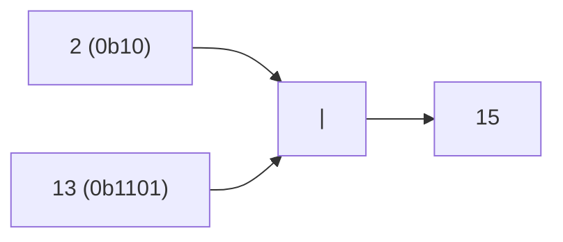

**📖 Penjelasan:**
**Langkah Tracing:**
1. Ubah 2 ke biner (0b10).
2. Jalankan |.
3. Hasil: 15.

---
### Soal 77
```cpp
int res = 4 | 1;
```
**Pertanyaan:**
1. Berapakah hasil akhirnya?
2. Mengapa demikian?

**Jawaban & Diagnosis:**
1. **5**
2. Lihat Tracing.

**Mermaid Flowchart:**
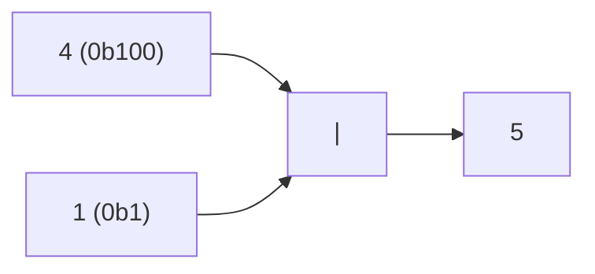

**📖 Penjelasan:**
**Langkah Tracing:**
1. Ubah 4 ke biner (0b100).
2. Jalankan |.
3. Hasil: 5.

---
### Soal 78
```cpp
int res = 5 | 15;
```
**Pertanyaan:**
1. Berapakah hasil akhirnya?
2. Mengapa demikian?

**Jawaban & Diagnosis:**
1. **15**
2. Lihat Tracing.

**Mermaid Flowchart:**


**📖 Penjelasan:**
**Langkah Tracing:**
1. Ubah 5 ke biner (0b101).
2. Jalankan |.
3. Hasil: 15.

---
### Soal 79
```cpp
int res = 4 & 13;
```
**Pertanyaan:**
1. Berapakah hasil akhirnya?
2. Mengapa demikian?

**Jawaban & Diagnosis:**
1. **4**
2. Lihat Tracing.

**Mermaid Flowchart:**
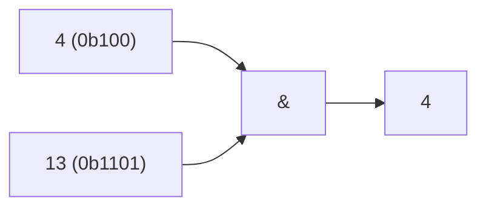

**📖 Penjelasan:**
**Langkah Tracing:**
1. Ubah 4 ke biner (0b100).
2. Jalankan &.
3. Hasil: 4.

---
### Soal 80
```cpp
int res = 12 << 2;
```
**Pertanyaan:**
1. Berapakah hasil akhirnya?
2. Mengapa demikian?

**Jawaban & Diagnosis:**
1. **48**
2. Lihat Tracing.

**Mermaid Flowchart:**
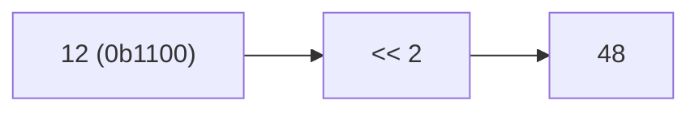

**📖 Penjelasan:**
**Langkah Tracing:**
1. Ubah 12 ke biner (0b1100).
2. Jalankan <<.
3. Hasil: 48.

---
### Soal 81
```cpp
int res = 7 >> 2;
```
**Pertanyaan:**
1. Berapakah hasil akhirnya?
2. Mengapa demikian?

**Jawaban & Diagnosis:**
1. **1**
2. Lihat Tracing.

**Mermaid Flowchart:**
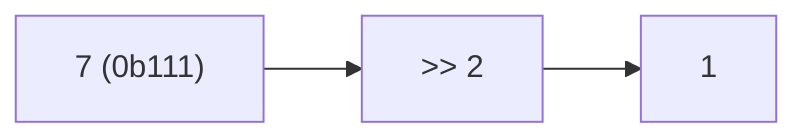

**📖 Penjelasan:**
**Langkah Tracing:**
1. Ubah 7 ke biner (0b111).
2. Jalankan >>.
3. Hasil: 1.

---
### Soal 82
```cpp
int res = 4 | 4;
```
**Pertanyaan:**
1. Berapakah hasil akhirnya?
2. Mengapa demikian?

**Jawaban & Diagnosis:**
1. **4**
2. Lihat Tracing.

**Mermaid Flowchart:**
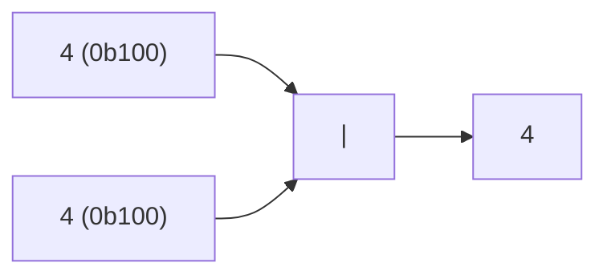

**📖 Penjelasan:**
**Langkah Tracing:**
1. Ubah 4 ke biner (0b100).
2. Jalankan |.
3. Hasil: 4.

---
### Soal 83
```cpp
int res = 1 << 1;
```
**Pertanyaan:**
1. Berapakah hasil akhirnya?
2. Mengapa demikian?

**Jawaban & Diagnosis:**
1. **2**
2. Lihat Tracing.

**Mermaid Flowchart:**
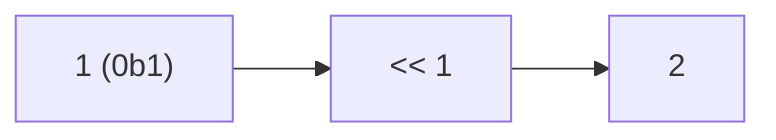

**📖 Penjelasan:**
**Langkah Tracing:**
1. Ubah 1 ke biner (0b1).
2. Jalankan <<.
3. Hasil: 2.

---
### Soal 84
```cpp
int res = 5 << 2;
```
**Pertanyaan:**
1. Berapakah hasil akhirnya?
2. Mengapa demikian?

**Jawaban & Diagnosis:**
1. **20**
2. Lihat Tracing.

**Mermaid Flowchart:**
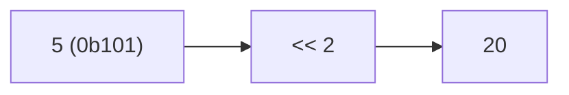

**📖 Penjelasan:**
**Langkah Tracing:**
1. Ubah 5 ke biner (0b101).
2. Jalankan <<.
3. Hasil: 20.

---
### Soal 85
```cpp
int res = 15 >> 1;
```
**Pertanyaan:**
1. Berapakah hasil akhirnya?
2. Mengapa demikian?

**Jawaban & Diagnosis:**
1. **7**
2. Lihat Tracing.

**Mermaid Flowchart:**
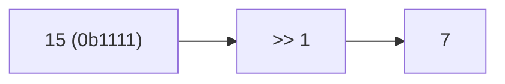

**📖 Penjelasan:**
**Langkah Tracing:**
1. Ubah 15 ke biner (0b1111).
2. Jalankan >>.
3. Hasil: 7.

---
### Soal 86
```cpp
int res = 15 >> 1;
```
**Pertanyaan:**
1. Berapakah hasil akhirnya?
2. Mengapa demikian?

**Jawaban & Diagnosis:**
1. **7**
2. Lihat Tracing.

**Mermaid Flowchart:**


**📖 Penjelasan:**
**Langkah Tracing:**
1. Ubah 15 ke biner (0b1111).
2. Jalankan >>.
3. Hasil: 7.

---
### Soal 87
```cpp
int res = 13 ^ 15;
```
**Pertanyaan:**
1. Berapakah hasil akhirnya?
2. Mengapa demikian?

**Jawaban & Diagnosis:**
1. **2**
2. Lihat Tracing.

**Mermaid Flowchart:**


**📖 Penjelasan:**
**Langkah Tracing:**
1. Ubah 13 ke biner (0b1101).
2. Jalankan ^.
3. Hasil: 2.

---
### Soal 88
```cpp
int res = 15 << 1;
```
**Pertanyaan:**
1. Berapakah hasil akhirnya?
2. Mengapa demikian?

**Jawaban & Diagnosis:**
1. **30**
2. Lihat Tracing.

**Mermaid Flowchart:**
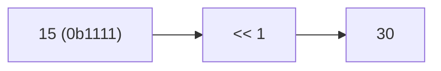

**📖 Penjelasan:**
**Langkah Tracing:**
1. Ubah 15 ke biner (0b1111).
2. Jalankan <<.
3. Hasil: 30.

---
### Soal 89
```cpp
int res = 8 >> 1;
```
**Pertanyaan:**
1. Berapakah hasil akhirnya?
2. Mengapa demikian?

**Jawaban & Diagnosis:**
1. **4**
2. Lihat Tracing.

**Mermaid Flowchart:**
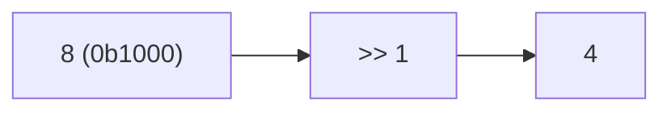

**📖 Penjelasan:**
**Langkah Tracing:**
1. Ubah 8 ke biner (0b1000).
2. Jalankan >>.
3. Hasil: 4.

---
### Soal 90
```cpp
int res = 6 >> 3;
```
**Pertanyaan:**
1. Berapakah hasil akhirnya?
2. Mengapa demikian?

**Jawaban & Diagnosis:**
1. **0**
2. Lihat Tracing.

**Mermaid Flowchart:**
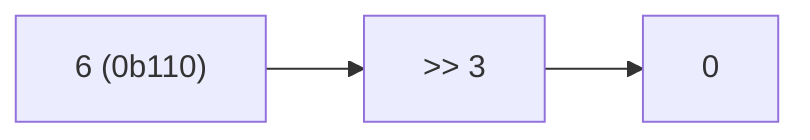

**📖 Penjelasan:**
**Langkah Tracing:**
1. Ubah 6 ke biner (0b110).
2. Jalankan >>.
3. Hasil: 0.

---
### Soal 91
```cpp
int res = 5 >> 1;
```
**Pertanyaan:**
1. Berapakah hasil akhirnya?
2. Mengapa demikian?

**Jawaban & Diagnosis:**
1. **2**
2. Lihat Tracing.

**Mermaid Flowchart:**
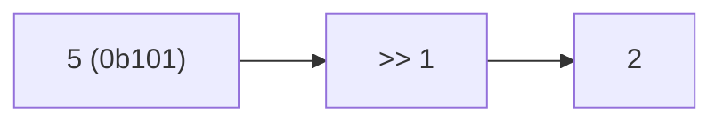

**📖 Penjelasan:**
**Langkah Tracing:**
1. Ubah 5 ke biner (0b101).
2. Jalankan >>.
3. Hasil: 2.

---
### Soal 92
```cpp
int res = 2 >> 1;
```
**Pertanyaan:**
1. Berapakah hasil akhirnya?
2. Mengapa demikian?

**Jawaban & Diagnosis:**
1. **1**
2. Lihat Tracing.

**Mermaid Flowchart:**
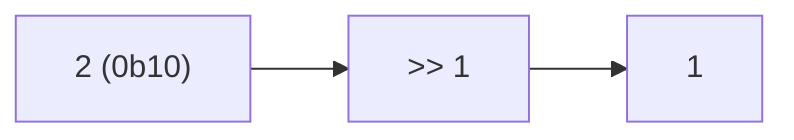

**📖 Penjelasan:**
**Langkah Tracing:**
1. Ubah 2 ke biner (0b10).
2. Jalankan >>.
3. Hasil: 1.

---
### Soal 93
```cpp
int res = 10 & 14;
```
**Pertanyaan:**
1. Berapakah hasil akhirnya?
2. Mengapa demikian?

**Jawaban & Diagnosis:**
1. **10**
2. Lihat Tracing.

**Mermaid Flowchart:**
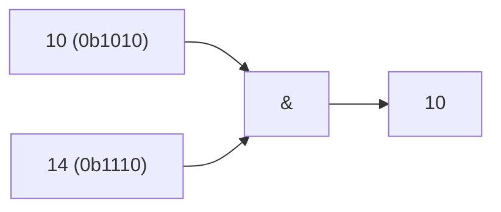

**📖 Penjelasan:**
**Langkah Tracing:**
1. Ubah 10 ke biner (0b1010).
2. Jalankan &.
3. Hasil: 10.

---
### Soal 94
```cpp
int res = 8 ^ 6;
```
**Pertanyaan:**
1. Berapakah hasil akhirnya?
2. Mengapa demikian?

**Jawaban & Diagnosis:**
1. **14**
2. Lihat Tracing.

**Mermaid Flowchart:**
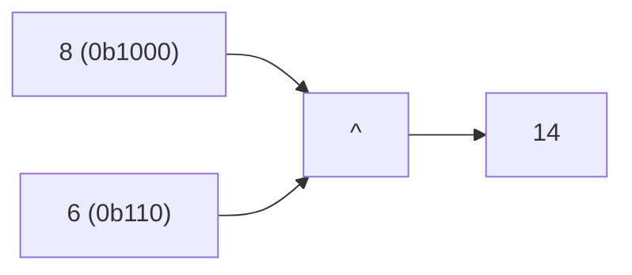

**📖 Penjelasan:**
**Langkah Tracing:**
1. Ubah 8 ke biner (0b1000).
2. Jalankan ^.
3. Hasil: 14.

---
### Soal 95
```cpp
int res = 4 ^ 15;
```
**Pertanyaan:**
1. Berapakah hasil akhirnya?
2. Mengapa demikian?

**Jawaban & Diagnosis:**
1. **11**
2. Lihat Tracing.

**Mermaid Flowchart:**
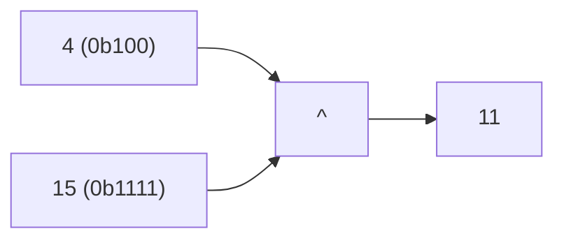

**📖 Penjelasan:**
**Langkah Tracing:**
1. Ubah 4 ke biner (0b100).
2. Jalankan ^.
3. Hasil: 11.

---
### Soal 96
```cpp
int res = 3 ^ 3;
```
**Pertanyaan:**
1. Berapakah hasil akhirnya?
2. Mengapa demikian?

**Jawaban & Diagnosis:**
1. **0**
2. Lihat Tracing.

**Mermaid Flowchart:**
```mermaid
graph LR
A["3 (0b11)"] --> C["^"]
B["3 (0b11)"] --> C
C --> D["0"]
```

**📖 Penjelasan:**
**Langkah Tracing:**
1. Ubah 3 ke biner (0b11).
2. Jalankan ^.
3. Hasil: 0.

---
### Soal 97
```cpp
int res = 8 ^ 15;
```
**Pertanyaan:**
1. Berapakah hasil akhirnya?
2. Mengapa demikian?

**Jawaban & Diagnosis:**
1. **7**
2. Lihat Tracing.

**Mermaid Flowchart:**
```mermaid
graph LR
A["8 (0b1000)"] --> C["^"]
B["15 (0b1111)"] --> C
C --> D["7"]
```

**📖 Penjelasan:**
**Langkah Tracing:**
1. Ubah 8 ke biner (0b1000).
2. Jalankan ^.
3. Hasil: 7.

---
### Soal 98
```cpp
int res = 3 << 1;
```
**Pertanyaan:**
1. Berapakah hasil akhirnya?
2. Mengapa demikian?

**Jawaban & Diagnosis:**
1. **6**
2. Lihat Tracing.

**Mermaid Flowchart:**
```mermaid
graph LR
A["3 (0b11)"] --> B["<< 1"]
B --> C["6"]
```

**📖 Penjelasan:**
**Langkah Tracing:**
1. Ubah 3 ke biner (0b11).
2. Jalankan <<.
3. Hasil: 6.

---
### Soal 99
```cpp
int res = 1 | 3;
```
**Pertanyaan:**
1. Berapakah hasil akhirnya?
2. Mengapa demikian?

**Jawaban & Diagnosis:**
1. **3**
2. Lihat Tracing.

**Mermaid Flowchart:**
```mermaid
graph LR
A["1 (0b1)"] --> C["|"]
B["3 (0b11)"] --> C
C --> D["3"]
```

**📖 Penjelasan:**
**Langkah Tracing:**
1. Ubah 1 ke biner (0b1).
2. Jalankan |.
3. Hasil: 3.

---
### Soal 100
```cpp
int res = 2 ^ 9;
```
**Pertanyaan:**
1. Berapakah hasil akhirnya?
2. Mengapa demikian?

**Jawaban & Diagnosis:**
1. **11**
2. Lihat Tracing.

**Mermaid Flowchart:**
```mermaid
graph LR
A["2 (0b10)"] --> C["^"]
B["9 (0b1001)"] --> C
C --> D["11"]
```

**📖 Penjelasan:**
**Langkah Tracing:**
1. Ubah 2 ke biner (0b10).
2. Jalankan ^.
3. Hasil: 11.

---
