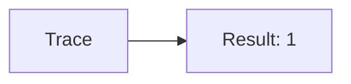
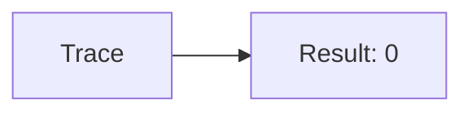
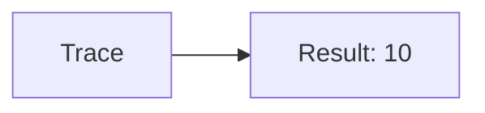
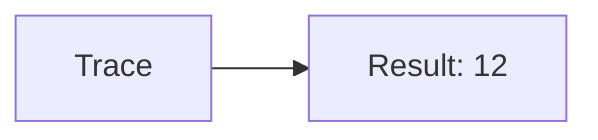
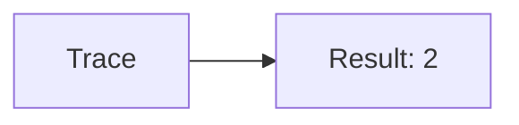

🔙 **[Kembali ke Daftar Soal](./README.md)**

---

# Latihan Soal Part C - Modul 06 - Set 04

### Soal 76
```cpp
// Rom: AND Mask
int val = 7;
int res = val & 1;
```
**Pertanyaan:**
1. Berapakah hasil akhirnya?
2. Deskripsikan alur pikir 'Compiler Manusia' untuk soal ini!

**Jawaban & Diagnosis:**
1. **1**
2. Mengecek bit terakhir dari 7 (0b111). Hasil: 1.

**Mermaid Flowchart:**


---
### Soal 77
```cpp
// Cache: XOR Toggle
int val = 12;
int res = val ^ val;
```
**Pertanyaan:**
1. Berapakah hasil akhirnya?
2. Deskripsikan alur pikir 'Compiler Manusia' untuk soal ini!

**Jawaban & Diagnosis:**
1. **0**
2. XOR dengan diri sendiri selalu 0.

**Mermaid Flowchart:**


---
### Soal 78
```cpp
// Ssd: Shift Left
int val = 5;
int res = val << 1;
```
**Pertanyaan:**
1. Berapakah hasil akhirnya?
2. Deskripsikan alur pikir 'Compiler Manusia' untuk soal ini!

**Jawaban & Diagnosis:**
1. **10**
2. 5 digeser kiri 1x = dikali 2 = 10.

**Mermaid Flowchart:**


---
### Soal 79
```cpp
// Hdd: AND Mask
int val = 4;
int res = val & 1;
```
**Pertanyaan:**
1. Berapakah hasil akhirnya?
2. Deskripsikan alur pikir 'Compiler Manusia' untuk soal ini!

**Jawaban & Diagnosis:**
1. **0**
2. Mengecek bit terakhir dari 4 (0b100). Hasil: 0.

**Mermaid Flowchart:**


---
### Soal 80
```cpp
// Disk: XOR Toggle
int val = 7;
int res = val ^ val;
```
**Pertanyaan:**
1. Berapakah hasil akhirnya?
2. Deskripsikan alur pikir 'Compiler Manusia' untuk soal ini!

**Jawaban & Diagnosis:**
1. **0**
2. XOR dengan diri sendiri selalu 0.

**Mermaid Flowchart:**


---
### Soal 81
```cpp
// Tape: Shift Left
int val = 5;
int res = val << 1;
```
**Pertanyaan:**
1. Berapakah hasil akhirnya?
2. Deskripsikan alur pikir 'Compiler Manusia' untuk soal ini!

**Jawaban & Diagnosis:**
1. **10**
2. 5 digeser kiri 1x = dikali 2 = 10.

**Mermaid Flowchart:**


---
### Soal 82
```cpp
// Cloud: AND Mask
int val = 2;
int res = val & 1;
```
**Pertanyaan:**
1. Berapakah hasil akhirnya?
2. Deskripsikan alur pikir 'Compiler Manusia' untuk soal ini!

**Jawaban & Diagnosis:**
1. **0**
2. Mengecek bit terakhir dari 2 (0b10). Hasil: 0.

**Mermaid Flowchart:**


---
### Soal 83
```cpp
// Net: XOR Toggle
int val = 13;
int res = val ^ val;
```
**Pertanyaan:**
1. Berapakah hasil akhirnya?
2. Deskripsikan alur pikir 'Compiler Manusia' untuk soal ini!

**Jawaban & Diagnosis:**
1. **0**
2. XOR dengan diri sendiri selalu 0.

**Mermaid Flowchart:**


---
### Soal 84
```cpp
// Tcp: Shift Left
int val = 6;
int res = val << 1;
```
**Pertanyaan:**
1. Berapakah hasil akhirnya?
2. Deskripsikan alur pikir 'Compiler Manusia' untuk soal ini!

**Jawaban & Diagnosis:**
1. **12**
2. 6 digeser kiri 1x = dikali 2 = 12.

**Mermaid Flowchart:**


---
### Soal 85
```cpp
// Udp: AND Mask
int val = 13;
int res = val & 1;
```
**Pertanyaan:**
1. Berapakah hasil akhirnya?
2. Deskripsikan alur pikir 'Compiler Manusia' untuk soal ini!

**Jawaban & Diagnosis:**
1. **1**
2. Mengecek bit terakhir dari 13 (0b1101). Hasil: 1.

**Mermaid Flowchart:**


---
### Soal 86
```cpp
// Ip: XOR Toggle
int val = 9;
int res = val ^ val;
```
**Pertanyaan:**
1. Berapakah hasil akhirnya?
2. Deskripsikan alur pikir 'Compiler Manusia' untuk soal ini!

**Jawaban & Diagnosis:**
1. **0**
2. XOR dengan diri sendiri selalu 0.

**Mermaid Flowchart:**


---
### Soal 87
```cpp
// Port: Shift Left
int val = 13;
int res = val << 1;
```
**Pertanyaan:**
1. Berapakah hasil akhirnya?
2. Deskripsikan alur pikir 'Compiler Manusia' untuk soal ini!

**Jawaban & Diagnosis:**
1. **26**
2. 13 digeser kiri 1x = dikali 2 = 26.

**Mermaid Flowchart:**


---
### Soal 88
```cpp
// Url: AND Mask
int val = 3;
int res = val & 1;
```
**Pertanyaan:**
1. Berapakah hasil akhirnya?
2. Deskripsikan alur pikir 'Compiler Manusia' untuk soal ini!

**Jawaban & Diagnosis:**
1. **1**
2. Mengecek bit terakhir dari 3 (0b11). Hasil: 1.

**Mermaid Flowchart:**


---
### Soal 89
```cpp
// Uri: XOR Toggle
int val = 14;
int res = val ^ val;
```
**Pertanyaan:**
1. Berapakah hasil akhirnya?
2. Deskripsikan alur pikir 'Compiler Manusia' untuk soal ini!

**Jawaban & Diagnosis:**
1. **0**
2. XOR dengan diri sendiri selalu 0.

**Mermaid Flowchart:**


---
### Soal 90
```cpp
// Json: Shift Left
int val = 8;
int res = val << 1;
```
**Pertanyaan:**
1. Berapakah hasil akhirnya?
2. Deskripsikan alur pikir 'Compiler Manusia' untuk soal ini!

**Jawaban & Diagnosis:**
1. **16**
2. 8 digeser kiri 1x = dikali 2 = 16.

**Mermaid Flowchart:**


---
### Soal 91
```cpp
// Xml: AND Mask
int val = 7;
int res = val & 1;
```
**Pertanyaan:**
1. Berapakah hasil akhirnya?
2. Deskripsikan alur pikir 'Compiler Manusia' untuk soal ini!

**Jawaban & Diagnosis:**
1. **1**
2. Mengecek bit terakhir dari 7 (0b111). Hasil: 1.

**Mermaid Flowchart:**


---
### Soal 92
```cpp
// Html: XOR Toggle
int val = 6;
int res = val ^ val;
```
**Pertanyaan:**
1. Berapakah hasil akhirnya?
2. Deskripsikan alur pikir 'Compiler Manusia' untuk soal ini!

**Jawaban & Diagnosis:**
1. **0**
2. XOR dengan diri sendiri selalu 0.

**Mermaid Flowchart:**


---
### Soal 93
```cpp
// Css: Shift Left
int val = 1;
int res = val << 1;
```
**Pertanyaan:**
1. Berapakah hasil akhirnya?
2. Deskripsikan alur pikir 'Compiler Manusia' untuk soal ini!

**Jawaban & Diagnosis:**
1. **2**
2. 1 digeser kiri 1x = dikali 2 = 2.

**Mermaid Flowchart:**


---
### Soal 94
```cpp
// Js: AND Mask
int val = 3;
int res = val & 1;
```
**Pertanyaan:**
1. Berapakah hasil akhirnya?
2. Deskripsikan alur pikir 'Compiler Manusia' untuk soal ini!

**Jawaban & Diagnosis:**
1. **1**
2. Mengecek bit terakhir dari 3 (0b11). Hasil: 1.

**Mermaid Flowchart:**


---
### Soal 95
```cpp
// Sql: XOR Toggle
int val = 4;
int res = val ^ val;
```
**Pertanyaan:**
1. Berapakah hasil akhirnya?
2. Deskripsikan alur pikir 'Compiler Manusia' untuk soal ini!

**Jawaban & Diagnosis:**
1. **0**
2. XOR dengan diri sendiri selalu 0.

**Mermaid Flowchart:**


---
### Soal 96
```cpp
// Nosql: Shift Left
int val = 11;
int res = val << 1;
```
**Pertanyaan:**
1. Berapakah hasil akhirnya?
2. Deskripsikan alur pikir 'Compiler Manusia' untuk soal ini!

**Jawaban & Diagnosis:**
1. **22**
2. 11 digeser kiri 1x = dikali 2 = 22.

**Mermaid Flowchart:**
```mermaid
graph LR
A[Trace] --> B[Result: 22]
```

---
### Soal 97
```cpp
// Lampu: AND Mask
int val = 10;
int res = val & 1;
```
**Pertanyaan:**
1. Berapakah hasil akhirnya?
2. Deskripsikan alur pikir 'Compiler Manusia' untuk soal ini!

**Jawaban & Diagnosis:**
1. **0**
2. Mengecek bit terakhir dari 10 (0b1010). Hasil: 0.

**Mermaid Flowchart:**
```mermaid
graph LR
A[Trace] --> B[Result: 0]
```

---
### Soal 98
```cpp
// Sensor: XOR Toggle
int val = 15;
int res = val ^ val;
```
**Pertanyaan:**
1. Berapakah hasil akhirnya?
2. Deskripsikan alur pikir 'Compiler Manusia' untuk soal ini!

**Jawaban & Diagnosis:**
1. **0**
2. XOR dengan diri sendiri selalu 0.

**Mermaid Flowchart:**
```mermaid
graph LR
A[Trace] --> B[Result: 0]
```

---
### Soal 99
```cpp
// Flag: Shift Left
int val = 1;
int res = val << 1;
```
**Pertanyaan:**
1. Berapakah hasil akhirnya?
2. Deskripsikan alur pikir 'Compiler Manusia' untuk soal ini!

**Jawaban & Diagnosis:**
1. **2**
2. 1 digeser kiri 1x = dikali 2 = 2.

**Mermaid Flowchart:**
```mermaid
graph LR
A[Trace] --> B[Result: 2]
```

---
### Soal 100
```cpp
// Mask: AND Mask
int val = 5;
int res = val & 1;
```
**Pertanyaan:**
1. Berapakah hasil akhirnya?
2. Deskripsikan alur pikir 'Compiler Manusia' untuk soal ini!

**Jawaban & Diagnosis:**
1. **1**
2. Mengecek bit terakhir dari 5 (0b101). Hasil: 1.

**Mermaid Flowchart:**
```mermaid
graph LR
A[Trace] --> B[Result: 1]
```

---
