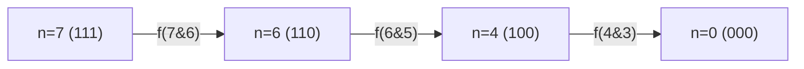
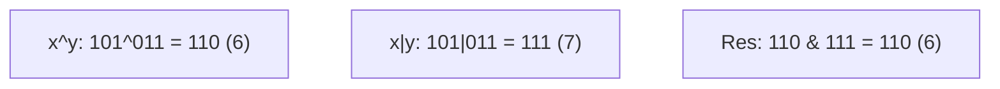
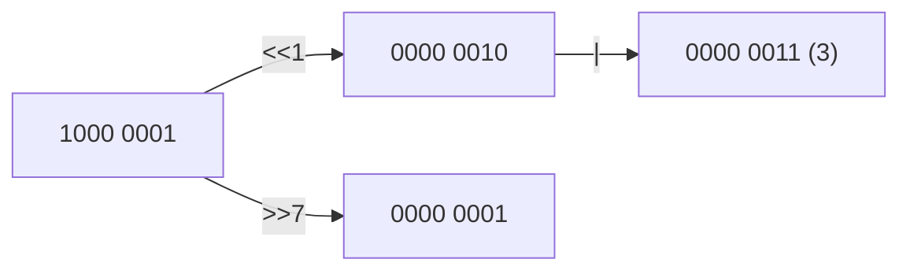
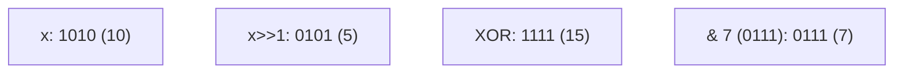

		🔙 **[Kembali ke Daftar Soal](./README.md)**

---

# Latihan Soal Part C - Modul 06 - Set 05 (Premium Edition)

---

### Soal 41: Penghitung Bit Otomatis
```cpp
int n = 7; // 111
int c = 0;
while (n > 0) {
    n = n & (n - 1);
    c++;
}
```
**Pertanyaan:**
1. Berapakah nilai `c`?
2. Secara fungsional, apa yang sedang dihitung oleh loop ini?

<details>
<summary><b>Klik untuk Lihat Jawaban & Diagnosis</b></summary>

**Mermaid Trace:**


**Jawaban:**
1. **3**
2. **Jumlah bit '1'** (Population Count/Hamming Weight). Algoritma ini sangat cepat karena hanya melompat sebanyak jumlah bit 1 yang ada.
</details>

---

### Soal 42: Izin Akses File (Permission Flags)
```cpp
const int READ = 4;    // 100
const int WRITE = 2;   // 010
const int EXEC = 1;    // 001

int user = READ | EXEC; 
bool b1 = user & WRITE;
bool b2 = user & READ;
```
**Pertanyaan:**
1. Berapakah nilai `b1` (true/false)?
2. Berapakah nilai `b2` (true/false)?

<details>
<summary><b>Klik untuk Lihat Jawaban & Diagnosis</b></summary>

**Jawaban:**
1. **false** (0)
2. **true** (4, yang dianggap `true`).
</details>

---

### Soal 43: ⚠️ Pergeseran Negatif (Signed Shift)
```cpp
int x = -1; // Semua bit 1 dalam 2's complement
int y = x >> 1;
```
**Pertanyaan:**
1. Berapakah nilai `y`?
2. Mengapa nilainya tidak berubah?

<details>
<summary><b>Klik untuk Lihat Jawaban & Diagnosis</b></summary>

**Jawaban:**
1. **-1**
2. Karena pada tipe data `signed int`, geser kanan biasanya melakukan **Arithmetic Shift**. Artinya, bit paling kiri (bit tanda) akan dipertahankan atau "diperbanyak" ke kanan untuk menjaga tandanya tetap negatif.
</details>

---

### Soal 44: Komposisi Bit Berlapis
```cpp
int x = 5; // 101
int y = 3; // 011
int res = (x ^ y) & (x | y);
```
**Pertanyaan:**
1. Berapakah nilai `res`?
2. Selesaikan `(x ^ y)` dan `(x | y)` terlebih dahulu!

<details>
<summary><b>Klik untuk Lihat Jawaban & Diagnosis</b></summary>

**Mermaid Bit-Grid:**


**Jawaban:**
1. **6**
</details>

---

### Soal 45: ⚠️ Shortcut Evaluasi Bitwise?
```cpp
int x = 0;
if ((3 | 4) && (x = 5)) {
    x += 10;
}
```
**Pertanyaan:**
1. Berapakah nilai `x` akhir?
2. Apakah `(3 | 4)` dianggap `true` dalam kondisi `if`?

<details>
<summary><b>Klik untuk Lihat Jawaban & Diagnosis</b></summary>

**Jawaban:**
1. **15**
2. **Ya.** Hasil `3 | 4` adalah 7. Dalam C++, angka apapun selain 0 dianggap sebagai `true`.
</details>

---

### Soal 46: Mesin Biner Berputar (Circular Shift-ish)
```cpp
unsigned char n = 0x81; // 1000 0001
unsigned char res = (n << 1) | (n >> 7);
```
**Pertanyaan:**
1. Berapakah nilai `res` dalam desimal?
2. Apa yang terjadi pada bit '1' yang paling kiri?

<details>
<summary><b>Klik untuk Lihat Jawaban & Diagnosis</b></summary>

**Mermaid Bit-Grid:**


**Jawaban:**
1. **3**
2. Ia "berputar" ke posisi paling kanan (bit 0) melalui operasi `(n >> 7)`.
</details>

---

### Soal 47: ⚠️ Jebakan Ukuran Tipe Data
```cpp
long long n = 1;
n = n << 35;
```
**Pertanyaan:**
1. Mengapa kita harus menggunakan `1LL << 35` atau variabel `long long` daripada `1 << 35` langsung?
2. Berapa nilai `n` jika berhasil dieksekusi?

<details>
<summary><b>Klik untuk Lihat Jawaban & Diagnosis</b></summary>

**Jawaban:**
1. Karena `1` adalah konstanta bertipe `int` (32-bit). Menggeser `int` sebanyak 35 kali akan menyebabkan **undefined behavior** atau overflow. Kita butuh `long long` yang berukuran 64-bit.
2. **34.359.738.368** ($2^{35}$).
</details>

---

### Soal 48: Bitwise vs Logical NOT
```cpp
int x = 5;
int r1 = ~x;
int r2 = !x;
```
**Pertanyaan:**
1. Berapakah nilai `r1`?
2. Berapakah nilai `r2`?

<details>
<summary><b>Klik untuk Lihat Jawaban & Diagnosis</b></summary>

**Jawaban:**
1. **-6** (Bitwise NOT membalik semua bit).
2. **0** (Logical NOT menganggap 5 sebagai `true`, lalu membaliknya menjadi `false`/0).
</details>

---

### Soal 49: Pertukaran Kelompok Bit
```cpp
unsigned char n = 0x0F; // 0000 1111
unsigned char res = (n << 4) | (n >> 4);
```
**Pertanyaan:**
1. Berapakah nilai `res` (hex atau desimal)?
2. Apa biner dari `res`?

<details>
<summary><b>Klik untuk Lihat Jawaban & Diagnosis</b></summary>

**Jawaban:**
1. **240** (atau `0xF0`).
2. **1111 0000** (Empat bit bawah bertukar tempat dengan empat bit atas).
</details>

---

### Soal 50: Grand Finale (The Bit Master)
```cpp
int x = 10; // 1010
int res = (x ^ (x >> 1)) & 7;
```
**Pertanyaan:**
1. Berapakah nilai `res`?
2. Operasi ini `(x ^ (x >> 1))` sering digunakan untuk menghasilkan kode apa?

<details>
<summary><b>Klik untuk Lihat Jawaban & Diagnosis</b></summary>

**Mermaid Trace:**


**Jawaban:**
1. **7**
2. **Gray Code.** Konversi biner ke Gray Code menggunakan rumus `x ^ (x >> 1)`.
</details>
