🔙 **[Kembali ke Daftar Soal](./README.md)**

---

# Latihan Soal Part C - Modul 06 - Set 05

### Soal 101
```cpp
int res = 1 & 9;
```
**Pertanyaan:**
1. Berapakah hasil akhirnya?
2. Mengapa demikian?

**Jawaban & Diagnosis:**
1. **1**
2. Lihat Tracing.

**Mermaid Flowchart:**
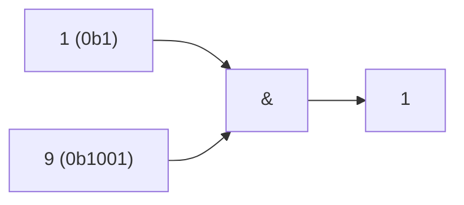

**📖 Penjelasan:**
**Langkah Tracing:**
1. Ubah 1 ke biner (0b1).
2. Jalankan &.
3. Hasil: 1.

---
### Soal 102
```cpp
int res = 9 | 2;
```
**Pertanyaan:**
1. Berapakah hasil akhirnya?
2. Mengapa demikian?

**Jawaban & Diagnosis:**
1. **11**
2. Lihat Tracing.

**Mermaid Flowchart:**
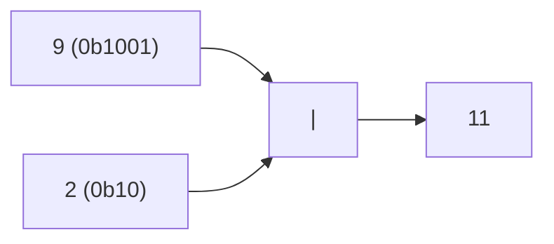

**📖 Penjelasan:**
**Langkah Tracing:**
1. Ubah 9 ke biner (0b1001).
2. Jalankan |.
3. Hasil: 11.

---
### Soal 103
```cpp
int res = 10 | 7;
```
**Pertanyaan:**
1. Berapakah hasil akhirnya?
2. Mengapa demikian?

**Jawaban & Diagnosis:**
1. **15**
2. Lihat Tracing.

**Mermaid Flowchart:**
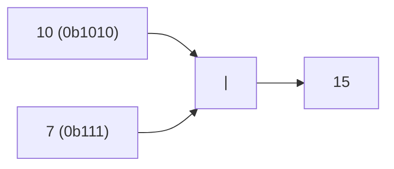

**📖 Penjelasan:**
**Langkah Tracing:**
1. Ubah 10 ke biner (0b1010).
2. Jalankan |.
3. Hasil: 15.

---
### Soal 104
```cpp
int res = 1 ^ 5;
```
**Pertanyaan:**
1. Berapakah hasil akhirnya?
2. Mengapa demikian?

**Jawaban & Diagnosis:**
1. **4**
2. Lihat Tracing.

**Mermaid Flowchart:**


**📖 Penjelasan:**
**Langkah Tracing:**
1. Ubah 1 ke biner (0b1).
2. Jalankan ^.
3. Hasil: 4.

---
### Soal 105
```cpp
int res = 3 & 3;
```
**Pertanyaan:**
1. Berapakah hasil akhirnya?
2. Mengapa demikian?

**Jawaban & Diagnosis:**
1. **3**
2. Lihat Tracing.

**Mermaid Flowchart:**
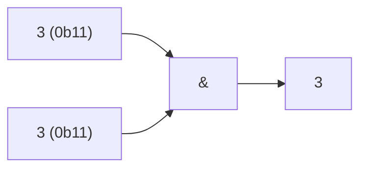

**📖 Penjelasan:**
**Langkah Tracing:**
1. Ubah 3 ke biner (0b11).
2. Jalankan &.
3. Hasil: 3.

---
### Soal 106
```cpp
int res = 4 << 2;
```
**Pertanyaan:**
1. Berapakah hasil akhirnya?
2. Mengapa demikian?

**Jawaban & Diagnosis:**
1. **16**
2. Lihat Tracing.

**Mermaid Flowchart:**
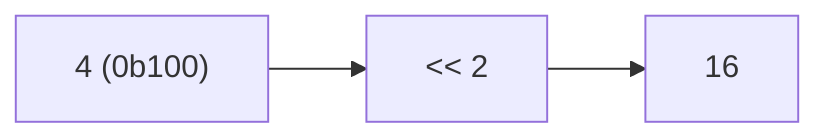

**📖 Penjelasan:**
**Langkah Tracing:**
1. Ubah 4 ke biner (0b100).
2. Jalankan <<.
3. Hasil: 16.

---
### Soal 107
```cpp
int res = 4 & 6;
```
**Pertanyaan:**
1. Berapakah hasil akhirnya?
2. Mengapa demikian?

**Jawaban & Diagnosis:**
1. **4**
2. Lihat Tracing.

**Mermaid Flowchart:**
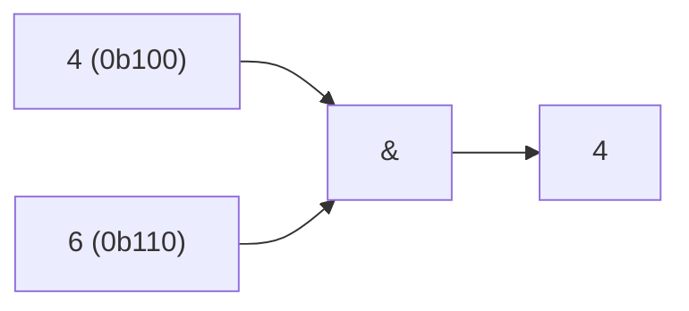

**📖 Penjelasan:**
**Langkah Tracing:**
1. Ubah 4 ke biner (0b100).
2. Jalankan &.
3. Hasil: 4.

---
### Soal 108
```cpp
int res = 4 << 1;
```
**Pertanyaan:**
1. Berapakah hasil akhirnya?
2. Mengapa demikian?

**Jawaban & Diagnosis:**
1. **8**
2. Lihat Tracing.

**Mermaid Flowchart:**
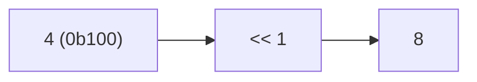

**📖 Penjelasan:**
**Langkah Tracing:**
1. Ubah 4 ke biner (0b100).
2. Jalankan <<.
3. Hasil: 8.

---
### Soal 109
```cpp
int res = 10 & 6;
```
**Pertanyaan:**
1. Berapakah hasil akhirnya?
2. Mengapa demikian?

**Jawaban & Diagnosis:**
1. **2**
2. Lihat Tracing.

**Mermaid Flowchart:**
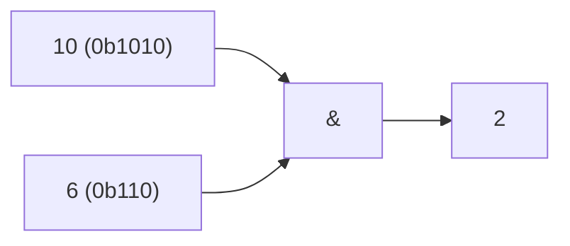

**📖 Penjelasan:**
**Langkah Tracing:**
1. Ubah 10 ke biner (0b1010).
2. Jalankan &.
3. Hasil: 2.

---
### Soal 110
```cpp
int res = 1 ^ 1;
```
**Pertanyaan:**
1. Berapakah hasil akhirnya?
2. Mengapa demikian?

**Jawaban & Diagnosis:**
1. **0**
2. Lihat Tracing.

**Mermaid Flowchart:**
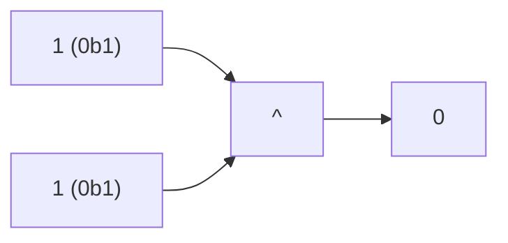

**📖 Penjelasan:**
**Langkah Tracing:**
1. Ubah 1 ke biner (0b1).
2. Jalankan ^.
3. Hasil: 0.

---
### Soal 111
```cpp
int res = 4 & 2;
```
**Pertanyaan:**
1. Berapakah hasil akhirnya?
2. Mengapa demikian?

**Jawaban & Diagnosis:**
1. **0**
2. Lihat Tracing.

**Mermaid Flowchart:**
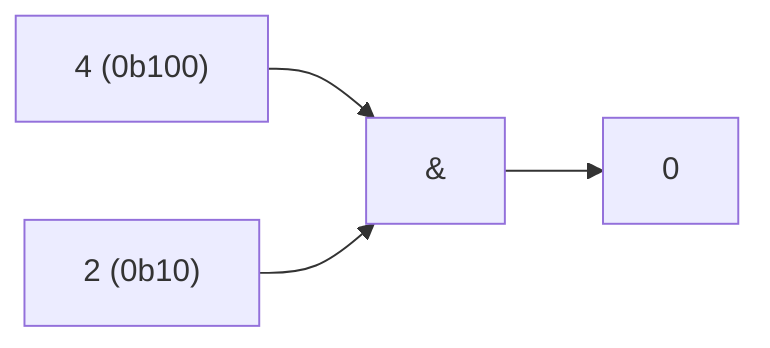

**📖 Penjelasan:**
**Langkah Tracing:**
1. Ubah 4 ke biner (0b100).
2. Jalankan &.
3. Hasil: 0.

---
### Soal 112
```cpp
int res = 3 >> 3;
```
**Pertanyaan:**
1. Berapakah hasil akhirnya?
2. Mengapa demikian?

**Jawaban & Diagnosis:**
1. **0**
2. Lihat Tracing.

**Mermaid Flowchart:**
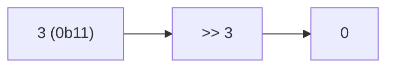

**📖 Penjelasan:**
**Langkah Tracing:**
1. Ubah 3 ke biner (0b11).
2. Jalankan >>.
3. Hasil: 0.

---
### Soal 113
```cpp
int res = 4 >> 1;
```
**Pertanyaan:**
1. Berapakah hasil akhirnya?
2. Mengapa demikian?

**Jawaban & Diagnosis:**
1. **2**
2. Lihat Tracing.

**Mermaid Flowchart:**
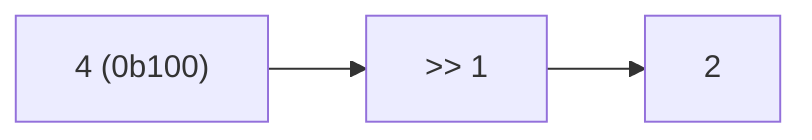

**📖 Penjelasan:**
**Langkah Tracing:**
1. Ubah 4 ke biner (0b100).
2. Jalankan >>.
3. Hasil: 2.

---
### Soal 114
```cpp
int res = 10 & 6;
```
**Pertanyaan:**
1. Berapakah hasil akhirnya?
2. Mengapa demikian?

**Jawaban & Diagnosis:**
1. **2**
2. Lihat Tracing.

**Mermaid Flowchart:**


**📖 Penjelasan:**
**Langkah Tracing:**
1. Ubah 10 ke biner (0b1010).
2. Jalankan &.
3. Hasil: 2.

---
### Soal 115
```cpp
int res = 11 >> 1;
```
**Pertanyaan:**
1. Berapakah hasil akhirnya?
2. Mengapa demikian?

**Jawaban & Diagnosis:**
1. **5**
2. Lihat Tracing.

**Mermaid Flowchart:**
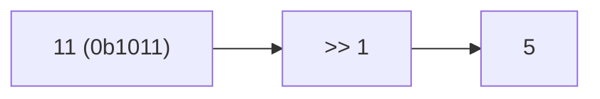

**📖 Penjelasan:**
**Langkah Tracing:**
1. Ubah 11 ke biner (0b1011).
2. Jalankan >>.
3. Hasil: 5.

---
### Soal 116
```cpp
int res = 1 | 15;
```
**Pertanyaan:**
1. Berapakah hasil akhirnya?
2. Mengapa demikian?

**Jawaban & Diagnosis:**
1. **15**
2. Lihat Tracing.

**Mermaid Flowchart:**
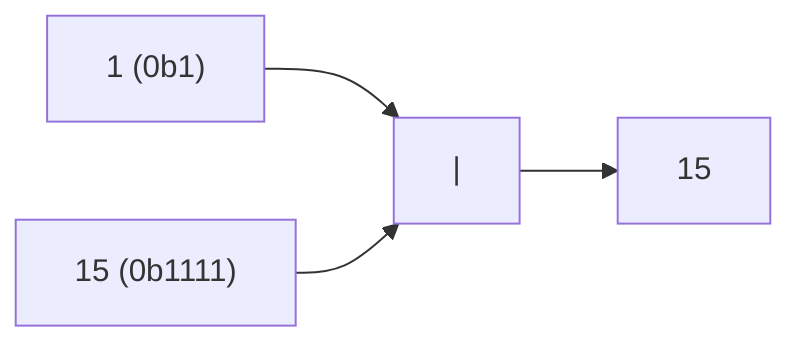

**📖 Penjelasan:**
**Langkah Tracing:**
1. Ubah 1 ke biner (0b1).
2. Jalankan |.
3. Hasil: 15.

---
### Soal 117
```cpp
int res = 4 | 8;
```
**Pertanyaan:**
1. Berapakah hasil akhirnya?
2. Mengapa demikian?

**Jawaban & Diagnosis:**
1. **12**
2. Lihat Tracing.

**Mermaid Flowchart:**
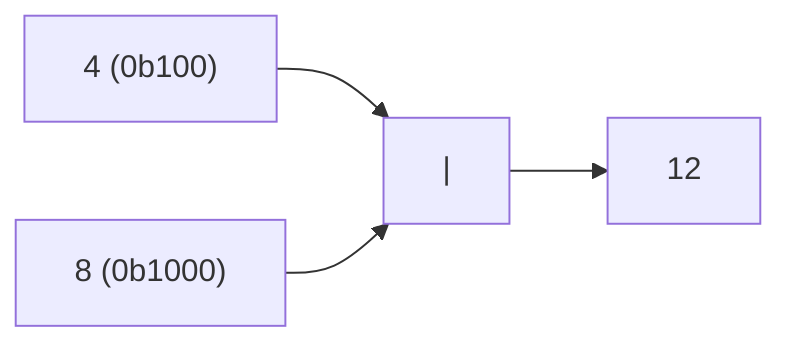

**📖 Penjelasan:**
**Langkah Tracing:**
1. Ubah 4 ke biner (0b100).
2. Jalankan |.
3. Hasil: 12.

---
### Soal 118
```cpp
int res = 14 | 4;
```
**Pertanyaan:**
1. Berapakah hasil akhirnya?
2. Mengapa demikian?

**Jawaban & Diagnosis:**
1. **14**
2. Lihat Tracing.

**Mermaid Flowchart:**
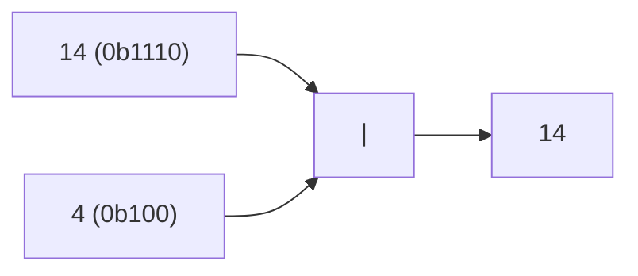

**📖 Penjelasan:**
**Langkah Tracing:**
1. Ubah 14 ke biner (0b1110).
2. Jalankan |.
3. Hasil: 14.

---
### Soal 119
```cpp
int res = 8 | 11;
```
**Pertanyaan:**
1. Berapakah hasil akhirnya?
2. Mengapa demikian?

**Jawaban & Diagnosis:**
1. **11**
2. Lihat Tracing.

**Mermaid Flowchart:**
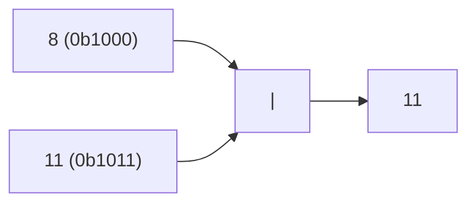

**📖 Penjelasan:**
**Langkah Tracing:**
1. Ubah 8 ke biner (0b1000).
2. Jalankan |.
3. Hasil: 11.

---
### Soal 120
```cpp
int res = 12 >> 1;
```
**Pertanyaan:**
1. Berapakah hasil akhirnya?
2. Mengapa demikian?

**Jawaban & Diagnosis:**
1. **6**
2. Lihat Tracing.

**Mermaid Flowchart:**
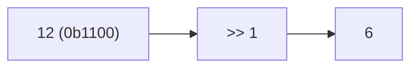

**📖 Penjelasan:**
**Langkah Tracing:**
1. Ubah 12 ke biner (0b1100).
2. Jalankan >>.
3. Hasil: 6.

---
### Soal 121
```cpp
int res = 10 << 1;
```
**Pertanyaan:**
1. Berapakah hasil akhirnya?
2. Mengapa demikian?

**Jawaban & Diagnosis:**
1. **20**
2. Lihat Tracing.

**Mermaid Flowchart:**
```mermaid
graph LR
A["10 (0b1010)"] --> B["<< 1"]
B --> C["20"]
```

**📖 Penjelasan:**
**Langkah Tracing:**
1. Ubah 10 ke biner (0b1010).
2. Jalankan <<.
3. Hasil: 20.

---
### Soal 122
```cpp
int res = 11 & 2;
```
**Pertanyaan:**
1. Berapakah hasil akhirnya?
2. Mengapa demikian?

**Jawaban & Diagnosis:**
1. **2**
2. Lihat Tracing.

**Mermaid Flowchart:**
```mermaid
graph LR
A["11 (0b1011)"] --> C["&"]
B["2 (0b10)"] --> C
C --> D["2"]
```

**📖 Penjelasan:**
**Langkah Tracing:**
1. Ubah 11 ke biner (0b1011).
2. Jalankan &.
3. Hasil: 2.

---
### Soal 123
```cpp
int res = 5 & 6;
```
**Pertanyaan:**
1. Berapakah hasil akhirnya?
2. Mengapa demikian?

**Jawaban & Diagnosis:**
1. **4**
2. Lihat Tracing.

**Mermaid Flowchart:**
```mermaid
graph LR
A["5 (0b101)"] --> C["&"]
B["6 (0b110)"] --> C
C --> D["4"]
```

**📖 Penjelasan:**
**Langkah Tracing:**
1. Ubah 5 ke biner (0b101).
2. Jalankan &.
3. Hasil: 4.

---
### Soal 124
```cpp
int res = 14 & 7;
```
**Pertanyaan:**
1. Berapakah hasil akhirnya?
2. Mengapa demikian?

**Jawaban & Diagnosis:**
1. **6**
2. Lihat Tracing.

**Mermaid Flowchart:**
```mermaid
graph LR
A["14 (0b1110)"] --> C["&"]
B["7 (0b111)"] --> C
C --> D["6"]
```

**📖 Penjelasan:**
**Langkah Tracing:**
1. Ubah 14 ke biner (0b1110).
2. Jalankan &.
3. Hasil: 6.

---
### Soal 125
```cpp
int res = 8 & 9;
```
**Pertanyaan:**
1. Berapakah hasil akhirnya?
2. Mengapa demikian?

**Jawaban & Diagnosis:**
1. **8**
2. Lihat Tracing.

**Mermaid Flowchart:**
```mermaid
graph LR
A["8 (0b1000)"] --> C["&"]
B["9 (0b1001)"] --> C
C --> D["8"]
```

**📖 Penjelasan:**
**Langkah Tracing:**
1. Ubah 8 ke biner (0b1000).
2. Jalankan &.
3. Hasil: 8.

---
