🔙 **[Kembali ke Daftar Soal](./README.md)**

---

# Latihan Soal Part C - Modul 06 - Set 05

### Soal 101 (Bitwise AND/OR)
```cpp
int a = 5;
int b = 7;
int res_and = a & b;
int res_or = a | b;
```
**Pertanyaan:**
1. Berapakah nilai `res_and`?
2. Berapakah nilai `res_or`?
3. Apa guna bitwise AND dalam mengecek angka ganjil?

**Jawaban & Diagnosis:**
1. **5**
2. **7**
3. **Untuk mengecek bit terakhir (x & 1). Jika hasilnya 1, maka ganjil.**

**Mermaid Flowchart:**
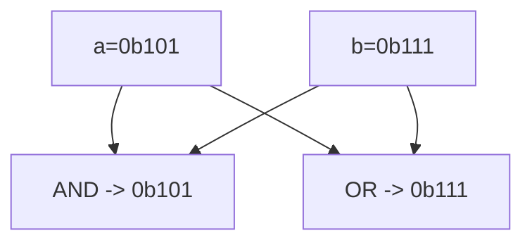

**📖 Cara Membaca Diagram:**
a=5 (0b101), b=7 (0b111). AND cari yang sama-sama 1. OR lumayan rakus ambil semua 1.

---
### Soal 102 (Bitwise AND/OR)
```cpp
int a = 4;
int b = 4;
int res_and = a & b;
int res_or = a | b;
```
**Pertanyaan:**
1. Berapakah nilai `res_and`?
2. Berapakah nilai `res_or`?
3. Apa guna bitwise AND dalam mengecek angka ganjil?

**Jawaban & Diagnosis:**
1. **4**
2. **4**
3. **Untuk mengecek bit terakhir (x & 1). Jika hasilnya 1, maka ganjil.**

**Mermaid Flowchart:**
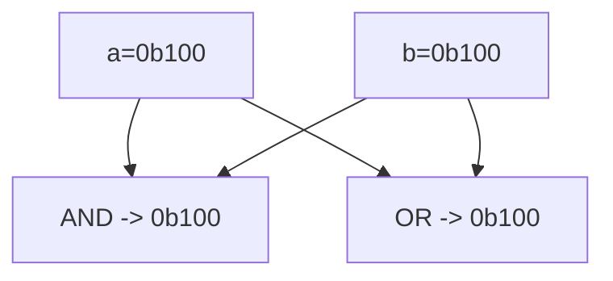

**📖 Cara Membaca Diagram:**
a=4 (0b100), b=4 (0b100). AND cari yang sama-sama 1. OR lumayan rakus ambil semua 1.

---
### Soal 103 (Bitwise AND/OR)
```cpp
int a = 4;
int b = 6;
int res_and = a & b;
int res_or = a | b;
```
**Pertanyaan:**
1. Berapakah nilai `res_and`?
2. Berapakah nilai `res_or`?
3. Apa guna bitwise AND dalam mengecek angka ganjil?

**Jawaban & Diagnosis:**
1. **4**
2. **6**
3. **Untuk mengecek bit terakhir (x & 1). Jika hasilnya 1, maka ganjil.**

**Mermaid Flowchart:**
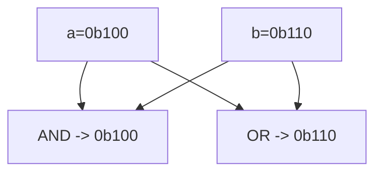

**📖 Cara Membaca Diagram:**
a=4 (0b100), b=6 (0b110). AND cari yang sama-sama 1. OR lumayan rakus ambil semua 1.

---
### Soal 104 (Left Shift Power)
```cpp
int a = 1;
int res = a << 2;
```
**Pertanyaan:**
1. Berapakah nilai akhir `res`?
2. Shift kiri sejauh 2 langkah setara dengan mengalikan `a` dengan angka berapa?
3. Apa yang terjadi pada bit-bit angka jika di-shift ke kiri?

**Jawaban & Diagnosis:**
1. **4**
2. **4**
3. **Bit bergeser ke kiri, dan muncul angka 0 di sebelah kanan (seperti nambah digit).**

**Mermaid Flowchart:**
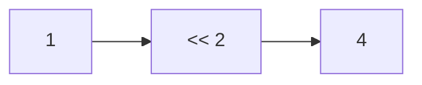

**📖 Cara Membaca Diagram:**
a=1. Shift kiri 2 kali = 1 * 2^2 = 4.

---
### Soal 105 (Right Shift Div)
```cpp
int a = 46;
int res = a >> 1;
```
**Pertanyaan:**
1. Berapakah nilai akhir `res`?
2. Shift kanan sejauh 1 langkah setara dengan membagi `a` dengan angka berapa?
3. Mengapa shift kanan sering dipakai untuk optimasi?

**Jawaban & Diagnosis:**
1. **23**
2. **2**
3. **Karena pembagian oleh pangkat 2 jauh lebih cepat bagi prosesor daripada operator pembagian biasa.**

**Mermaid Flowchart:**


**📖 Cara Membaca Diagram:**
a=46. Shift kanan 1 kali = 46 / 2^1 = 23.

---
### Soal 106 (Bitwise XOR Trick)
```cpp
int x = 77;
int res = x ^ x ^ 78;
```
**Pertanyaan:**
1. Berapakah nilai akhir `res`?
2. Apa yang terjadi jika angka yang sama di-XOR (`x ^ x`)?
3. Apa analogi yang cocok untuk XOR?

**Jawaban & Diagnosis:**
1. **78**
2. **Hasilnya menjadi 0 (Saling meniadakan).**
3. **Saklar lampu (Tekan 2x balik ke awal/padam).**

**Mermaid Flowchart:**
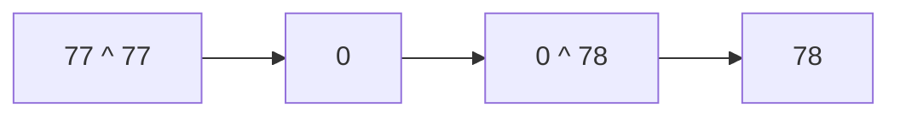

**📖 Cara Membaca Diagram:**
x ^ x = 0. Jadi 0 ^ 78 = 78.

---
### Soal 107 (Left Shift Power)
```cpp
int a = 7;
int res = a << 3;
```
**Pertanyaan:**
1. Berapakah nilai akhir `res`?
2. Shift kiri sejauh 3 langkah setara dengan mengalikan `a` dengan angka berapa?
3. Apa yang terjadi pada bit-bit angka jika di-shift ke kiri?

**Jawaban & Diagnosis:**
1. **56**
2. **8**
3. **Bit bergeser ke kiri, dan muncul angka 0 di sebelah kanan (seperti nambah digit).**

**Mermaid Flowchart:**
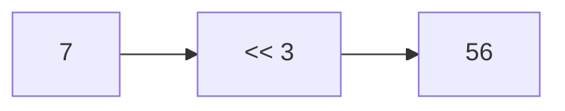

**📖 Cara Membaca Diagram:**
a=7. Shift kiri 3 kali = 7 * 2^3 = 56.

---
### Soal 108 (Left Shift Power)
```cpp
int a = 3;
int res = a << 2;
```
**Pertanyaan:**
1. Berapakah nilai akhir `res`?
2. Shift kiri sejauh 2 langkah setara dengan mengalikan `a` dengan angka berapa?
3. Apa yang terjadi pada bit-bit angka jika di-shift ke kiri?

**Jawaban & Diagnosis:**
1. **12**
2. **4**
3. **Bit bergeser ke kiri, dan muncul angka 0 di sebelah kanan (seperti nambah digit).**

**Mermaid Flowchart:**
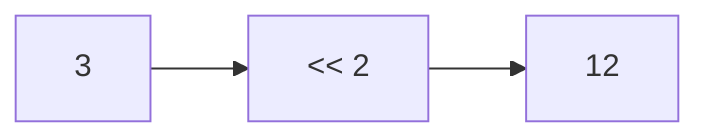

**📖 Cara Membaca Diagram:**
a=3. Shift kiri 2 kali = 3 * 2^2 = 12.

---
### Soal 109 (Right Shift Div)
```cpp
int a = 30;
int res = a >> 1;
```
**Pertanyaan:**
1. Berapakah nilai akhir `res`?
2. Shift kanan sejauh 1 langkah setara dengan membagi `a` dengan angka berapa?
3. Mengapa shift kanan sering dipakai untuk optimasi?

**Jawaban & Diagnosis:**
1. **15**
2. **2**
3. **Karena pembagian oleh pangkat 2 jauh lebih cepat bagi prosesor daripada operator pembagian biasa.**

**Mermaid Flowchart:**
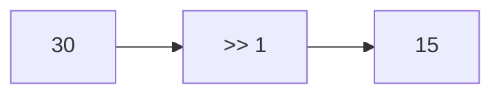

**📖 Cara Membaca Diagram:**
a=30. Shift kanan 1 kali = 30 / 2^1 = 15.

---
### Soal 110 (Bitwise XOR Trick)
```cpp
int x = 62;
int res = x ^ x ^ 63;
```
**Pertanyaan:**
1. Berapakah nilai akhir `res`?
2. Apa yang terjadi jika angka yang sama di-XOR (`x ^ x`)?
3. Apa analogi yang cocok untuk XOR?

**Jawaban & Diagnosis:**
1. **63**
2. **Hasilnya menjadi 0 (Saling meniadakan).**
3. **Saklar lampu (Tekan 2x balik ke awal/padam).**

**Mermaid Flowchart:**
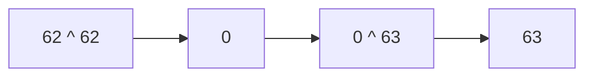

**📖 Cara Membaca Diagram:**
x ^ x = 0. Jadi 0 ^ 63 = 63.

---
### Soal 111 (Bitwise XOR Trick)
```cpp
int x = 18;
int res = x ^ x ^ 19;
```
**Pertanyaan:**
1. Berapakah nilai akhir `res`?
2. Apa yang terjadi jika angka yang sama di-XOR (`x ^ x`)?
3. Apa analogi yang cocok untuk XOR?

**Jawaban & Diagnosis:**
1. **19**
2. **Hasilnya menjadi 0 (Saling meniadakan).**
3. **Saklar lampu (Tekan 2x balik ke awal/padam).**

**Mermaid Flowchart:**
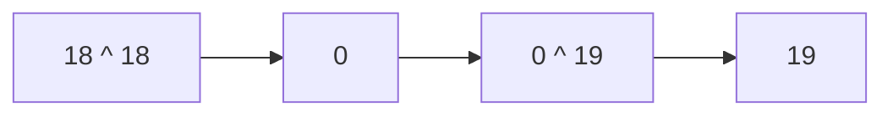

**📖 Cara Membaca Diagram:**
x ^ x = 0. Jadi 0 ^ 19 = 19.

---
### Soal 112 (Bitwise AND/OR)
```cpp
int a = 6;
int b = 5;
int res_and = a & b;
int res_or = a | b;
```
**Pertanyaan:**
1. Berapakah nilai `res_and`?
2. Berapakah nilai `res_or`?
3. Apa guna bitwise AND dalam mengecek angka ganjil?

**Jawaban & Diagnosis:**
1. **4**
2. **7**
3. **Untuk mengecek bit terakhir (x & 1). Jika hasilnya 1, maka ganjil.**

**Mermaid Flowchart:**
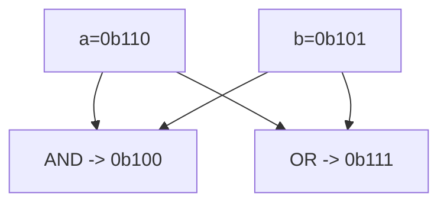

**📖 Cara Membaca Diagram:**
a=6 (0b110), b=5 (0b101). AND cari yang sama-sama 1. OR lumayan rakus ambil semua 1.

---
### Soal 113 (Bitwise AND/OR)
```cpp
int a = 3;
int b = 3;
int res_and = a & b;
int res_or = a | b;
```
**Pertanyaan:**
1. Berapakah nilai `res_and`?
2. Berapakah nilai `res_or`?
3. Apa guna bitwise AND dalam mengecek angka ganjil?

**Jawaban & Diagnosis:**
1. **3**
2. **3**
3. **Untuk mengecek bit terakhir (x & 1). Jika hasilnya 1, maka ganjil.**

**Mermaid Flowchart:**
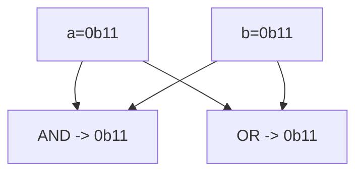

**📖 Cara Membaca Diagram:**
a=3 (0b11), b=3 (0b11). AND cari yang sama-sama 1. OR lumayan rakus ambil semua 1.

---
### Soal 114 (Bitwise AND/OR)
```cpp
int a = 6;
int b = 3;
int res_and = a & b;
int res_or = a | b;
```
**Pertanyaan:**
1. Berapakah nilai `res_and`?
2. Berapakah nilai `res_or`?
3. Apa guna bitwise AND dalam mengecek angka ganjil?

**Jawaban & Diagnosis:**
1. **2**
2. **7**
3. **Untuk mengecek bit terakhir (x & 1). Jika hasilnya 1, maka ganjil.**

**Mermaid Flowchart:**
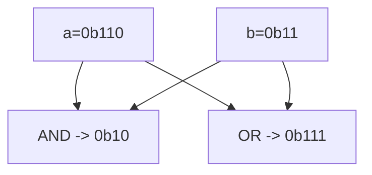

**📖 Cara Membaca Diagram:**
a=6 (0b110), b=3 (0b11). AND cari yang sama-sama 1. OR lumayan rakus ambil semua 1.

---
### Soal 115 (Right Shift Div)
```cpp
int a = 41;
int res = a >> 2;
```
**Pertanyaan:**
1. Berapakah nilai akhir `res`?
2. Shift kanan sejauh 2 langkah setara dengan membagi `a` dengan angka berapa?
3. Mengapa shift kanan sering dipakai untuk optimasi?

**Jawaban & Diagnosis:**
1. **10**
2. **4**
3. **Karena pembagian oleh pangkat 2 jauh lebih cepat bagi prosesor daripada operator pembagian biasa.**

**Mermaid Flowchart:**
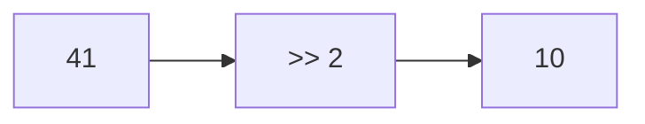

**📖 Cara Membaca Diagram:**
a=41. Shift kanan 2 kali = 41 / 2^2 = 10.

---
### Soal 116 (Bitwise AND/OR)
```cpp
int a = 6;
int b = 4;
int res_and = a & b;
int res_or = a | b;
```
**Pertanyaan:**
1. Berapakah nilai `res_and`?
2. Berapakah nilai `res_or`?
3. Apa guna bitwise AND dalam mengecek angka ganjil?

**Jawaban & Diagnosis:**
1. **4**
2. **6**
3. **Untuk mengecek bit terakhir (x & 1). Jika hasilnya 1, maka ganjil.**

**Mermaid Flowchart:**
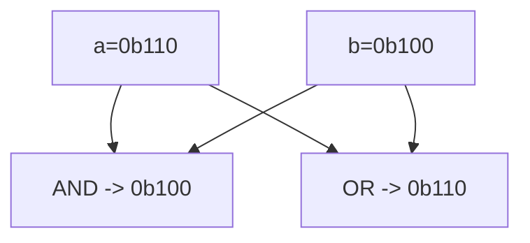

**📖 Cara Membaca Diagram:**
a=6 (0b110), b=4 (0b100). AND cari yang sama-sama 1. OR lumayan rakus ambil semua 1.

---
### Soal 117 (Bitwise AND/OR)
```cpp
int a = 7;
int b = 5;
int res_and = a & b;
int res_or = a | b;
```
**Pertanyaan:**
1. Berapakah nilai `res_and`?
2. Berapakah nilai `res_or`?
3. Apa guna bitwise AND dalam mengecek angka ganjil?

**Jawaban & Diagnosis:**
1. **5**
2. **7**
3. **Untuk mengecek bit terakhir (x & 1). Jika hasilnya 1, maka ganjil.**

**Mermaid Flowchart:**
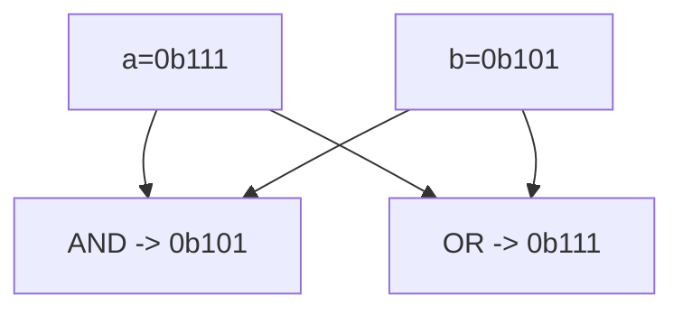

**📖 Cara Membaca Diagram:**
a=7 (0b111), b=5 (0b101). AND cari yang sama-sama 1. OR lumayan rakus ambil semua 1.

---
### Soal 118 (Bitwise XOR Trick)
```cpp
int x = 86;
int res = x ^ x ^ 87;
```
**Pertanyaan:**
1. Berapakah nilai akhir `res`?
2. Apa yang terjadi jika angka yang sama di-XOR (`x ^ x`)?
3. Apa analogi yang cocok untuk XOR?

**Jawaban & Diagnosis:**
1. **87**
2. **Hasilnya menjadi 0 (Saling meniadakan).**
3. **Saklar lampu (Tekan 2x balik ke awal/padam).**

**Mermaid Flowchart:**
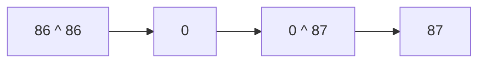

**📖 Cara Membaca Diagram:**
x ^ x = 0. Jadi 0 ^ 87 = 87.

---
### Soal 119 (Bitwise XOR Trick)
```cpp
int x = 29;
int res = x ^ x ^ 30;
```
**Pertanyaan:**
1. Berapakah nilai akhir `res`?
2. Apa yang terjadi jika angka yang sama di-XOR (`x ^ x`)?
3. Apa analogi yang cocok untuk XOR?

**Jawaban & Diagnosis:**
1. **30**
2. **Hasilnya menjadi 0 (Saling meniadakan).**
3. **Saklar lampu (Tekan 2x balik ke awal/padam).**

**Mermaid Flowchart:**


**📖 Cara Membaca Diagram:**
x ^ x = 0. Jadi 0 ^ 30 = 30.

---
### Soal 120 (Bitwise AND/OR)
```cpp
int a = 3;
int b = 7;
int res_and = a & b;
int res_or = a | b;
```
**Pertanyaan:**
1. Berapakah nilai `res_and`?
2. Berapakah nilai `res_or`?
3. Apa guna bitwise AND dalam mengecek angka ganjil?

**Jawaban & Diagnosis:**
1. **3**
2. **7**
3. **Untuk mengecek bit terakhir (x & 1). Jika hasilnya 1, maka ganjil.**

**Mermaid Flowchart:**
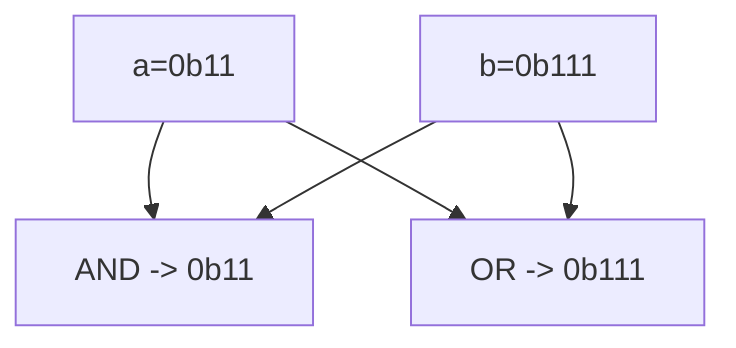

**📖 Cara Membaca Diagram:**
a=3 (0b11), b=7 (0b111). AND cari yang sama-sama 1. OR lumayan rakus ambil semua 1.

---
### Soal 121 (Left Shift Power)
```cpp
int a = 2;
int res = a << 2;
```
**Pertanyaan:**
1. Berapakah nilai akhir `res`?
2. Shift kiri sejauh 2 langkah setara dengan mengalikan `a` dengan angka berapa?
3. Apa yang terjadi pada bit-bit angka jika di-shift ke kiri?

**Jawaban & Diagnosis:**
1. **8**
2. **4**
3. **Bit bergeser ke kiri, dan muncul angka 0 di sebelah kanan (seperti nambah digit).**

**Mermaid Flowchart:**
```mermaid
graph LR
    A[2] --> B["<< 2"]
    B --> C[8]
```

**📖 Cara Membaca Diagram:**
a=2. Shift kiri 2 kali = 2 * 2^2 = 8.

---
### Soal 122 (Right Shift Div)
```cpp
int a = 33;
int res = a >> 2;
```
**Pertanyaan:**
1. Berapakah nilai akhir `res`?
2. Shift kanan sejauh 2 langkah setara dengan membagi `a` dengan angka berapa?
3. Mengapa shift kanan sering dipakai untuk optimasi?

**Jawaban & Diagnosis:**
1. **8**
2. **4**
3. **Karena pembagian oleh pangkat 2 jauh lebih cepat bagi prosesor daripada operator pembagian biasa.**

**Mermaid Flowchart:**
```mermaid
graph LR
    A[33] --> B[">> 2"]
    B --> C[8]
```

**📖 Cara Membaca Diagram:**
a=33. Shift kanan 2 kali = 33 / 2^2 = 8.

---
### Soal 123 (Bitwise XOR Trick)
```cpp
int x = 100;
int res = x ^ x ^ 101;
```
**Pertanyaan:**
1. Berapakah nilai akhir `res`?
2. Apa yang terjadi jika angka yang sama di-XOR (`x ^ x`)?
3. Apa analogi yang cocok untuk XOR?

**Jawaban & Diagnosis:**
1. **101**
2. **Hasilnya menjadi 0 (Saling meniadakan).**
3. **Saklar lampu (Tekan 2x balik ke awal/padam).**

**Mermaid Flowchart:**
```mermaid
graph LR
    A["100 ^ 100"] --> B[0]
    B --> C["0 ^ 101"]
    C --> D["101"]
```

**📖 Cara Membaca Diagram:**
x ^ x = 0. Jadi 0 ^ 101 = 101.

---
### Soal 124 (Right Shift Div)
```cpp
int a = 31;
int res = a >> 1;
```
**Pertanyaan:**
1. Berapakah nilai akhir `res`?
2. Shift kanan sejauh 1 langkah setara dengan membagi `a` dengan angka berapa?
3. Mengapa shift kanan sering dipakai untuk optimasi?

**Jawaban & Diagnosis:**
1. **15**
2. **2**
3. **Karena pembagian oleh pangkat 2 jauh lebih cepat bagi prosesor daripada operator pembagian biasa.**

**Mermaid Flowchart:**
```mermaid
graph LR
    A[31] --> B[">> 1"]
    B --> C[15]
```

**📖 Cara Membaca Diagram:**
a=31. Shift kanan 1 kali = 31 / 2^1 = 15.

---
### Soal 125 (Bitwise XOR Trick)
```cpp
int x = 51;
int res = x ^ x ^ 52;
```
**Pertanyaan:**
1. Berapakah nilai akhir `res`?
2. Apa yang terjadi jika angka yang sama di-XOR (`x ^ x`)?
3. Apa analogi yang cocok untuk XOR?

**Jawaban & Diagnosis:**
1. **52**
2. **Hasilnya menjadi 0 (Saling meniadakan).**
3. **Saklar lampu (Tekan 2x balik ke awal/padam).**

**Mermaid Flowchart:**
```mermaid
graph LR
    A["51 ^ 51"] --> B[0]
    B --> C["0 ^ 52"]
    C --> D["52"]
```

**📖 Cara Membaca Diagram:**
x ^ x = 0. Jadi 0 ^ 52 = 52.

---
