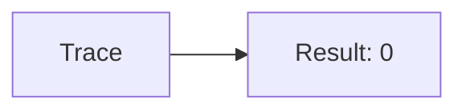
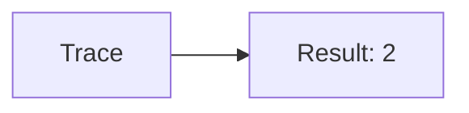
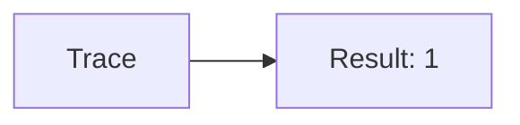
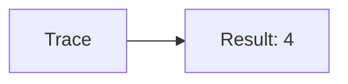
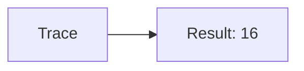
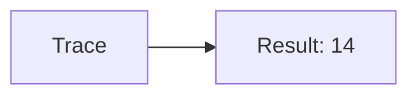

🔙 **[Kembali ke Daftar Soal](./README.md)**

---

# Latihan Soal Part C - Modul 06 - Set 05

### Soal 101
```cpp
// Lampu: AND Mask
int val = 14;
int res = val & 1;
```
**Pertanyaan:**
1. Berapakah hasil akhirnya?
2. Deskripsikan alur pikir 'Compiler Manusia' untuk soal ini!

**Jawaban & Diagnosis:**
1. **0**
2. Mengecek bit terakhir dari 14 (0b1110). Hasil: 0.

**Mermaid Flowchart:**


---
### Soal 102
```cpp
// Sensor: XOR Toggle
int val = 2;
int res = val ^ val;
```
**Pertanyaan:**
1. Berapakah hasil akhirnya?
2. Deskripsikan alur pikir 'Compiler Manusia' untuk soal ini!

**Jawaban & Diagnosis:**
1. **0**
2. XOR dengan diri sendiri selalu 0.

**Mermaid Flowchart:**


---
### Soal 103
```cpp
// Flag: Shift Left
int val = 1;
int res = val << 1;
```
**Pertanyaan:**
1. Berapakah hasil akhirnya?
2. Deskripsikan alur pikir 'Compiler Manusia' untuk soal ini!

**Jawaban & Diagnosis:**
1. **2**
2. 1 digeser kiri 1x = dikali 2 = 2.

**Mermaid Flowchart:**


---
### Soal 104
```cpp
// Mask: AND Mask
int val = 7;
int res = val & 1;
```
**Pertanyaan:**
1. Berapakah hasil akhirnya?
2. Deskripsikan alur pikir 'Compiler Manusia' untuk soal ini!

**Jawaban & Diagnosis:**
1. **1**
2. Mengecek bit terakhir dari 7 (0b111). Hasil: 1.

**Mermaid Flowchart:**


---
### Soal 105
```cpp
// Shift: XOR Toggle
int val = 7;
int res = val ^ val;
```
**Pertanyaan:**
1. Berapakah hasil akhirnya?
2. Deskripsikan alur pikir 'Compiler Manusia' untuk soal ini!

**Jawaban & Diagnosis:**
1. **0**
2. XOR dengan diri sendiri selalu 0.

**Mermaid Flowchart:**


---
### Soal 106
```cpp
// Bit: Shift Left
int val = 2;
int res = val << 1;
```
**Pertanyaan:**
1. Berapakah hasil akhirnya?
2. Deskripsikan alur pikir 'Compiler Manusia' untuk soal ini!

**Jawaban & Diagnosis:**
1. **4**
2. 2 digeser kiri 1x = dikali 2 = 4.

**Mermaid Flowchart:**


---
### Soal 107
```cpp
// Byte: AND Mask
int val = 3;
int res = val & 1;
```
**Pertanyaan:**
1. Berapakah hasil akhirnya?
2. Deskripsikan alur pikir 'Compiler Manusia' untuk soal ini!

**Jawaban & Diagnosis:**
1. **1**
2. Mengecek bit terakhir dari 3 (0b11). Hasil: 1.

**Mermaid Flowchart:**


---
### Soal 108
```cpp
// Biner: XOR Toggle
int val = 5;
int res = val ^ val;
```
**Pertanyaan:**
1. Berapakah hasil akhirnya?
2. Deskripsikan alur pikir 'Compiler Manusia' untuk soal ini!

**Jawaban & Diagnosis:**
1. **0**
2. XOR dengan diri sendiri selalu 0.

**Mermaid Flowchart:**


---
### Soal 109
```cpp
// Logic: Shift Left
int val = 8;
int res = val << 1;
```
**Pertanyaan:**
1. Berapakah hasil akhirnya?
2. Deskripsikan alur pikir 'Compiler Manusia' untuk soal ini!

**Jawaban & Diagnosis:**
1. **16**
2. 8 digeser kiri 1x = dikali 2 = 16.

**Mermaid Flowchart:**


---
### Soal 110
```cpp
// Gate: AND Mask
int val = 8;
int res = val & 1;
```
**Pertanyaan:**
1. Berapakah hasil akhirnya?
2. Deskripsikan alur pikir 'Compiler Manusia' untuk soal ini!

**Jawaban & Diagnosis:**
1. **0**
2. Mengecek bit terakhir dari 8 (0b1000). Hasil: 0.

**Mermaid Flowchart:**


---
### Soal 111
```cpp
// And: XOR Toggle
int val = 4;
int res = val ^ val;
```
**Pertanyaan:**
1. Berapakah hasil akhirnya?
2. Deskripsikan alur pikir 'Compiler Manusia' untuk soal ini!

**Jawaban & Diagnosis:**
1. **0**
2. XOR dengan diri sendiri selalu 0.

**Mermaid Flowchart:**


---
### Soal 112
```cpp
// Or: Shift Left
int val = 1;
int res = val << 1;
```
**Pertanyaan:**
1. Berapakah hasil akhirnya?
2. Deskripsikan alur pikir 'Compiler Manusia' untuk soal ini!

**Jawaban & Diagnosis:**
1. **2**
2. 1 digeser kiri 1x = dikali 2 = 2.

**Mermaid Flowchart:**


---
### Soal 113
```cpp
// Xor: AND Mask
int val = 10;
int res = val & 1;
```
**Pertanyaan:**
1. Berapakah hasil akhirnya?
2. Deskripsikan alur pikir 'Compiler Manusia' untuk soal ini!

**Jawaban & Diagnosis:**
1. **0**
2. Mengecek bit terakhir dari 10 (0b1010). Hasil: 0.

**Mermaid Flowchart:**


---
### Soal 114
```cpp
// Not: XOR Toggle
int val = 4;
int res = val ^ val;
```
**Pertanyaan:**
1. Berapakah hasil akhirnya?
2. Deskripsikan alur pikir 'Compiler Manusia' untuk soal ini!

**Jawaban & Diagnosis:**
1. **0**
2. XOR dengan diri sendiri selalu 0.

**Mermaid Flowchart:**


---
### Soal 115
```cpp
// Nad: Shift Left
int val = 4;
int res = val << 1;
```
**Pertanyaan:**
1. Berapakah hasil akhirnya?
2. Deskripsikan alur pikir 'Compiler Manusia' untuk soal ini!

**Jawaban & Diagnosis:**
1. **8**
2. 4 digeser kiri 1x = dikali 2 = 8.

**Mermaid Flowchart:**


---
### Soal 116
```cpp
// Nor: AND Mask
int val = 11;
int res = val & 1;
```
**Pertanyaan:**
1. Berapakah hasil akhirnya?
2. Deskripsikan alur pikir 'Compiler Manusia' untuk soal ini!

**Jawaban & Diagnosis:**
1. **1**
2. Mengecek bit terakhir dari 11 (0b1011). Hasil: 1.

**Mermaid Flowchart:**


---
### Soal 117
```cpp
// Nxor: XOR Toggle
int val = 9;
int res = val ^ val;
```
**Pertanyaan:**
1. Berapakah hasil akhirnya?
2. Deskripsikan alur pikir 'Compiler Manusia' untuk soal ini!

**Jawaban & Diagnosis:**
1. **0**
2. XOR dengan diri sendiri selalu 0.

**Mermaid Flowchart:**


---
### Soal 118
```cpp
// Mux: Shift Left
int val = 7;
int res = val << 1;
```
**Pertanyaan:**
1. Berapakah hasil akhirnya?
2. Deskripsikan alur pikir 'Compiler Manusia' untuk soal ini!

**Jawaban & Diagnosis:**
1. **14**
2. 7 digeser kiri 1x = dikali 2 = 14.

**Mermaid Flowchart:**


---
### Soal 119
```cpp
// Demux: AND Mask
int val = 9;
int res = val & 1;
```
**Pertanyaan:**
1. Berapakah hasil akhirnya?
2. Deskripsikan alur pikir 'Compiler Manusia' untuk soal ini!

**Jawaban & Diagnosis:**
1. **1**
2. Mengecek bit terakhir dari 9 (0b1001). Hasil: 1.

**Mermaid Flowchart:**


---
### Soal 120
```cpp
// FlipFlop: XOR Toggle
int val = 13;
int res = val ^ val;
```
**Pertanyaan:**
1. Berapakah hasil akhirnya?
2. Deskripsikan alur pikir 'Compiler Manusia' untuk soal ini!

**Jawaban & Diagnosis:**
1. **0**
2. XOR dengan diri sendiri selalu 0.

**Mermaid Flowchart:**


---
### Soal 121
```cpp
// Latch: Shift Left
int val = 5;
int res = val << 1;
```
**Pertanyaan:**
1. Berapakah hasil akhirnya?
2. Deskripsikan alur pikir 'Compiler Manusia' untuk soal ini!

**Jawaban & Diagnosis:**
1. **10**
2. 5 digeser kiri 1x = dikali 2 = 10.

**Mermaid Flowchart:**
```mermaid
graph LR
A[Trace] --> B[Result: 10]
```

---
### Soal 122
```cpp
// Register: AND Mask
int val = 10;
int res = val & 1;
```
**Pertanyaan:**
1. Berapakah hasil akhirnya?
2. Deskripsikan alur pikir 'Compiler Manusia' untuk soal ini!

**Jawaban & Diagnosis:**
1. **0**
2. Mengecek bit terakhir dari 10 (0b1010). Hasil: 0.

**Mermaid Flowchart:**
```mermaid
graph LR
A[Trace] --> B[Result: 0]
```

---
### Soal 123
```cpp
// Counter: XOR Toggle
int val = 8;
int res = val ^ val;
```
**Pertanyaan:**
1. Berapakah hasil akhirnya?
2. Deskripsikan alur pikir 'Compiler Manusia' untuk soal ini!

**Jawaban & Diagnosis:**
1. **0**
2. XOR dengan diri sendiri selalu 0.

**Mermaid Flowchart:**
```mermaid
graph LR
A[Trace] --> B[Result: 0]
```

---
### Soal 124
```cpp
// Adder: Shift Left
int val = 11;
int res = val << 1;
```
**Pertanyaan:**
1. Berapakah hasil akhirnya?
2. Deskripsikan alur pikir 'Compiler Manusia' untuk soal ini!

**Jawaban & Diagnosis:**
1. **22**
2. 11 digeser kiri 1x = dikali 2 = 22.

**Mermaid Flowchart:**
```mermaid
graph LR
A[Trace] --> B[Result: 22]
```

---
### Soal 125
```cpp
// Sub: AND Mask
int val = 11;
int res = val & 1;
```
**Pertanyaan:**
1. Berapakah hasil akhirnya?
2. Deskripsikan alur pikir 'Compiler Manusia' untuk soal ini!

**Jawaban & Diagnosis:**
1. **1**
2. Mengecek bit terakhir dari 11 (0b1011). Hasil: 1.

**Mermaid Flowchart:**
```mermaid
graph LR
A[Trace] --> B[Result: 1]
```

---
