🔙 **[Kembali ke Daftar Soal](./README.md)**

---

# Latihan Soal Part C - Modul 06 - Set 06

### Soal 126
```cpp
int res = 2 << 1;
```
**Pertanyaan:**
1. Berapakah hasil akhirnya?
2. Mengapa demikian?

**Jawaban & Diagnosis:**
1. **4**
2. Lihat Tracing.

**Mermaid Flowchart:**
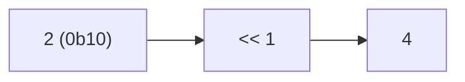

**📖 Penjelasan:**
**Langkah Tracing:**
1. Ubah 2 ke biner (0b10).
2. Jalankan <<.
3. Hasil: 4.

---
### Soal 127
```cpp
int res = 2 | 13;
```
**Pertanyaan:**
1. Berapakah hasil akhirnya?
2. Mengapa demikian?

**Jawaban & Diagnosis:**
1. **15**
2. Lihat Tracing.

**Mermaid Flowchart:**
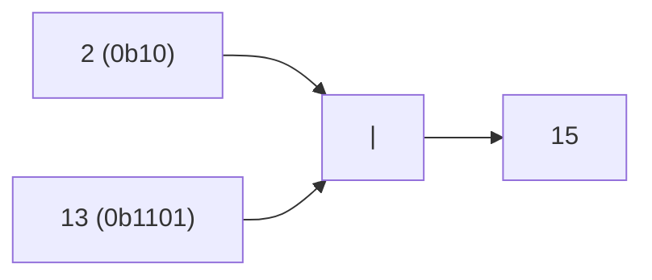

**📖 Penjelasan:**
**Langkah Tracing:**
1. Ubah 2 ke biner (0b10).
2. Jalankan |.
3. Hasil: 15.

---
### Soal 128
```cpp
int res = 9 | 11;
```
**Pertanyaan:**
1. Berapakah hasil akhirnya?
2. Mengapa demikian?

**Jawaban & Diagnosis:**
1. **11**
2. Lihat Tracing.

**Mermaid Flowchart:**
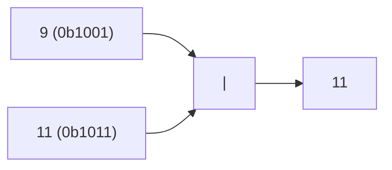

**📖 Penjelasan:**
**Langkah Tracing:**
1. Ubah 9 ke biner (0b1001).
2. Jalankan |.
3. Hasil: 11.

---
### Soal 129
```cpp
int res = 10 ^ 12;
```
**Pertanyaan:**
1. Berapakah hasil akhirnya?
2. Mengapa demikian?

**Jawaban & Diagnosis:**
1. **6**
2. Lihat Tracing.

**Mermaid Flowchart:**
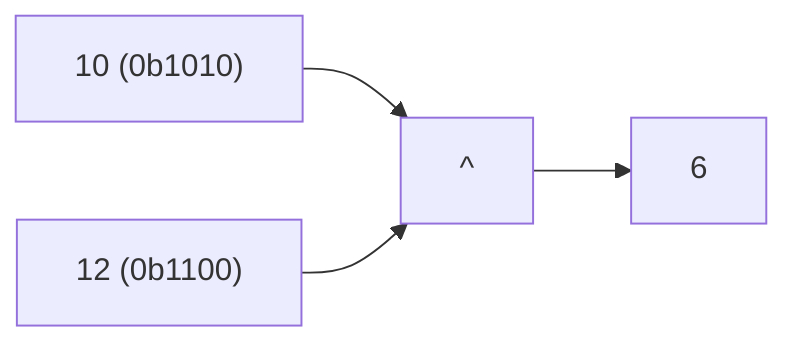

**📖 Penjelasan:**
**Langkah Tracing:**
1. Ubah 10 ke biner (0b1010).
2. Jalankan ^.
3. Hasil: 6.

---
### Soal 130
```cpp
int res = 14 | 6;
```
**Pertanyaan:**
1. Berapakah hasil akhirnya?
2. Mengapa demikian?

**Jawaban & Diagnosis:**
1. **14**
2. Lihat Tracing.

**Mermaid Flowchart:**
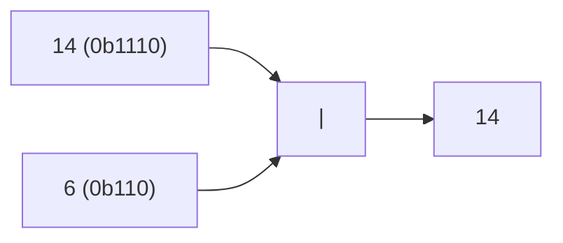

**📖 Penjelasan:**
**Langkah Tracing:**
1. Ubah 14 ke biner (0b1110).
2. Jalankan |.
3. Hasil: 14.

---
### Soal 131
```cpp
int res = 15 & 10;
```
**Pertanyaan:**
1. Berapakah hasil akhirnya?
2. Mengapa demikian?

**Jawaban & Diagnosis:**
1. **10**
2. Lihat Tracing.

**Mermaid Flowchart:**
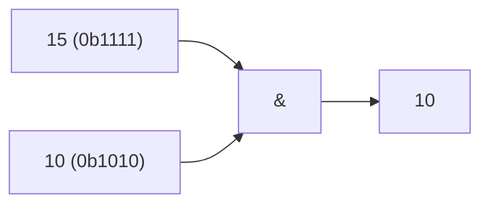

**📖 Penjelasan:**
**Langkah Tracing:**
1. Ubah 15 ke biner (0b1111).
2. Jalankan &.
3. Hasil: 10.

---
### Soal 132
```cpp
int res = 10 >> 2;
```
**Pertanyaan:**
1. Berapakah hasil akhirnya?
2. Mengapa demikian?

**Jawaban & Diagnosis:**
1. **2**
2. Lihat Tracing.

**Mermaid Flowchart:**
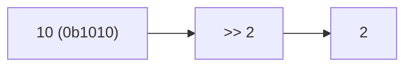

**📖 Penjelasan:**
**Langkah Tracing:**
1. Ubah 10 ke biner (0b1010).
2. Jalankan >>.
3. Hasil: 2.

---
### Soal 133
```cpp
int res = 13 << 2;
```
**Pertanyaan:**
1. Berapakah hasil akhirnya?
2. Mengapa demikian?

**Jawaban & Diagnosis:**
1. **52**
2. Lihat Tracing.

**Mermaid Flowchart:**
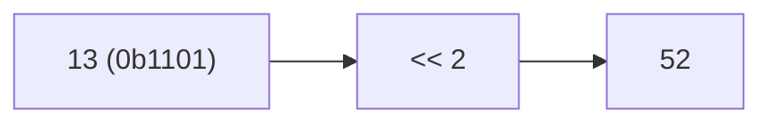

**📖 Penjelasan:**
**Langkah Tracing:**
1. Ubah 13 ke biner (0b1101).
2. Jalankan <<.
3. Hasil: 52.

---
### Soal 134
```cpp
int res = 5 | 11;
```
**Pertanyaan:**
1. Berapakah hasil akhirnya?
2. Mengapa demikian?

**Jawaban & Diagnosis:**
1. **15**
2. Lihat Tracing.

**Mermaid Flowchart:**
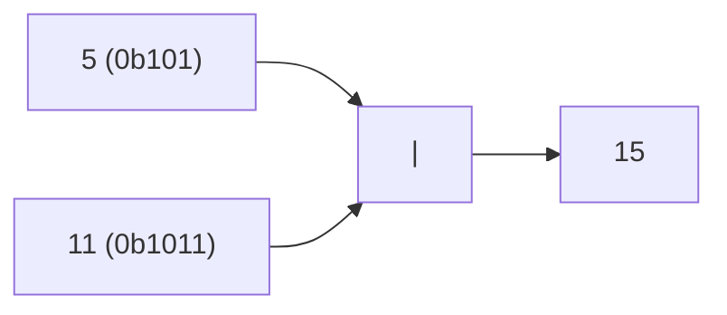

**📖 Penjelasan:**
**Langkah Tracing:**
1. Ubah 5 ke biner (0b101).
2. Jalankan |.
3. Hasil: 15.

---
### Soal 135
```cpp
int res = 7 << 3;
```
**Pertanyaan:**
1. Berapakah hasil akhirnya?
2. Mengapa demikian?

**Jawaban & Diagnosis:**
1. **56**
2. Lihat Tracing.

**Mermaid Flowchart:**
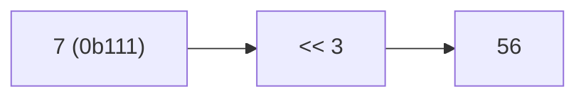

**📖 Penjelasan:**
**Langkah Tracing:**
1. Ubah 7 ke biner (0b111).
2. Jalankan <<.
3. Hasil: 56.

---
### Soal 136
```cpp
int res = 7 | 7;
```
**Pertanyaan:**
1. Berapakah hasil akhirnya?
2. Mengapa demikian?

**Jawaban & Diagnosis:**
1. **7**
2. Lihat Tracing.

**Mermaid Flowchart:**
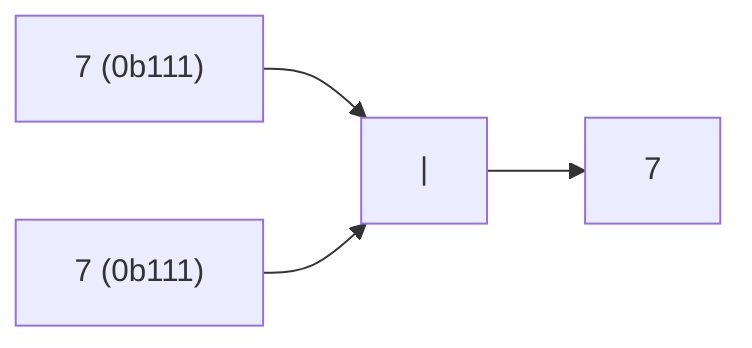

**📖 Penjelasan:**
**Langkah Tracing:**
1. Ubah 7 ke biner (0b111).
2. Jalankan |.
3. Hasil: 7.

---
### Soal 137
```cpp
int res = 6 & 14;
```
**Pertanyaan:**
1. Berapakah hasil akhirnya?
2. Mengapa demikian?

**Jawaban & Diagnosis:**
1. **6**
2. Lihat Tracing.

**Mermaid Flowchart:**
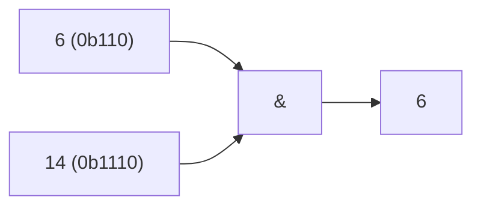

**📖 Penjelasan:**
**Langkah Tracing:**
1. Ubah 6 ke biner (0b110).
2. Jalankan &.
3. Hasil: 6.

---
### Soal 138
```cpp
int res = 13 >> 1;
```
**Pertanyaan:**
1. Berapakah hasil akhirnya?
2. Mengapa demikian?

**Jawaban & Diagnosis:**
1. **6**
2. Lihat Tracing.

**Mermaid Flowchart:**
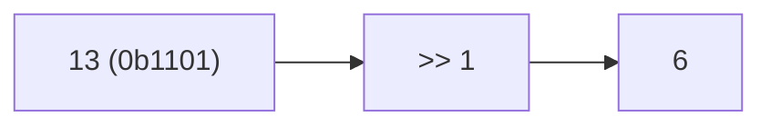

**📖 Penjelasan:**
**Langkah Tracing:**
1. Ubah 13 ke biner (0b1101).
2. Jalankan >>.
3. Hasil: 6.

---
### Soal 139
```cpp
int res = 1 << 3;
```
**Pertanyaan:**
1. Berapakah hasil akhirnya?
2. Mengapa demikian?

**Jawaban & Diagnosis:**
1. **8**
2. Lihat Tracing.

**Mermaid Flowchart:**
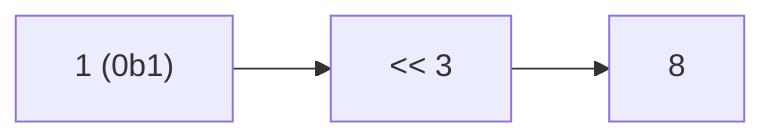

**📖 Penjelasan:**
**Langkah Tracing:**
1. Ubah 1 ke biner (0b1).
2. Jalankan <<.
3. Hasil: 8.

---
### Soal 140
```cpp
int res = 3 & 14;
```
**Pertanyaan:**
1. Berapakah hasil akhirnya?
2. Mengapa demikian?

**Jawaban & Diagnosis:**
1. **2**
2. Lihat Tracing.

**Mermaid Flowchart:**
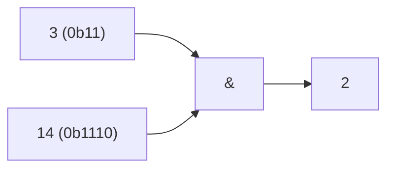

**📖 Penjelasan:**
**Langkah Tracing:**
1. Ubah 3 ke biner (0b11).
2. Jalankan &.
3. Hasil: 2.

---
### Soal 141
```cpp
int res = 2 << 3;
```
**Pertanyaan:**
1. Berapakah hasil akhirnya?
2. Mengapa demikian?

**Jawaban & Diagnosis:**
1. **16**
2. Lihat Tracing.

**Mermaid Flowchart:**
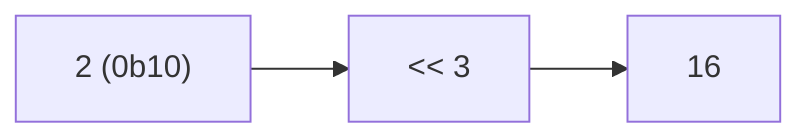

**📖 Penjelasan:**
**Langkah Tracing:**
1. Ubah 2 ke biner (0b10).
2. Jalankan <<.
3. Hasil: 16.

---
### Soal 142
```cpp
int res = 13 & 14;
```
**Pertanyaan:**
1. Berapakah hasil akhirnya?
2. Mengapa demikian?

**Jawaban & Diagnosis:**
1. **12**
2. Lihat Tracing.

**Mermaid Flowchart:**
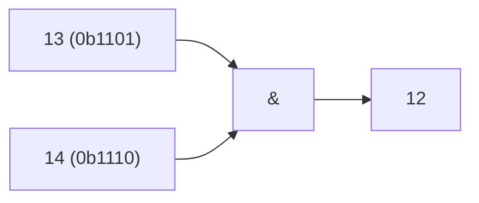

**📖 Penjelasan:**
**Langkah Tracing:**
1. Ubah 13 ke biner (0b1101).
2. Jalankan &.
3. Hasil: 12.

---
### Soal 143
```cpp
int res = 6 << 2;
```
**Pertanyaan:**
1. Berapakah hasil akhirnya?
2. Mengapa demikian?

**Jawaban & Diagnosis:**
1. **24**
2. Lihat Tracing.

**Mermaid Flowchart:**
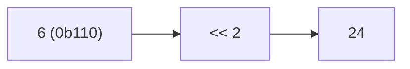

**📖 Penjelasan:**
**Langkah Tracing:**
1. Ubah 6 ke biner (0b110).
2. Jalankan <<.
3. Hasil: 24.

---
### Soal 144
```cpp
int res = 15 ^ 10;
```
**Pertanyaan:**
1. Berapakah hasil akhirnya?
2. Mengapa demikian?

**Jawaban & Diagnosis:**
1. **5**
2. Lihat Tracing.

**Mermaid Flowchart:**
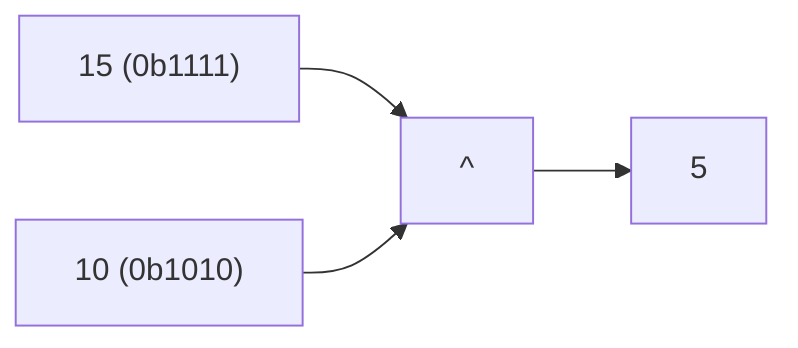

**📖 Penjelasan:**
**Langkah Tracing:**
1. Ubah 15 ke biner (0b1111).
2. Jalankan ^.
3. Hasil: 5.

---
### Soal 145
```cpp
int res = 11 >> 2;
```
**Pertanyaan:**
1. Berapakah hasil akhirnya?
2. Mengapa demikian?

**Jawaban & Diagnosis:**
1. **2**
2. Lihat Tracing.

**Mermaid Flowchart:**
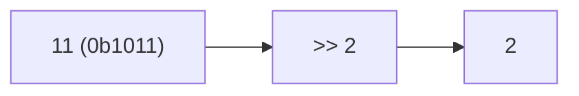

**📖 Penjelasan:**
**Langkah Tracing:**
1. Ubah 11 ke biner (0b1011).
2. Jalankan >>.
3. Hasil: 2.

---
### Soal 146
```cpp
int res = 13 & 14;
```
**Pertanyaan:**
1. Berapakah hasil akhirnya?
2. Mengapa demikian?

**Jawaban & Diagnosis:**
1. **12**
2. Lihat Tracing.

**Mermaid Flowchart:**
```mermaid
graph LR
A["13 (0b1101)"] --> C["&"]
B["14 (0b1110)"] --> C
C --> D["12"]
```

**📖 Penjelasan:**
**Langkah Tracing:**
1. Ubah 13 ke biner (0b1101).
2. Jalankan &.
3. Hasil: 12.

---
### Soal 147
```cpp
int res = 13 ^ 15;
```
**Pertanyaan:**
1. Berapakah hasil akhirnya?
2. Mengapa demikian?

**Jawaban & Diagnosis:**
1. **2**
2. Lihat Tracing.

**Mermaid Flowchart:**
```mermaid
graph LR
A["13 (0b1101)"] --> C["^"]
B["15 (0b1111)"] --> C
C --> D["2"]
```

**📖 Penjelasan:**
**Langkah Tracing:**
1. Ubah 13 ke biner (0b1101).
2. Jalankan ^.
3. Hasil: 2.

---
### Soal 148
```cpp
int res = 8 ^ 14;
```
**Pertanyaan:**
1. Berapakah hasil akhirnya?
2. Mengapa demikian?

**Jawaban & Diagnosis:**
1. **6**
2. Lihat Tracing.

**Mermaid Flowchart:**
```mermaid
graph LR
A["8 (0b1000)"] --> C["^"]
B["14 (0b1110)"] --> C
C --> D["6"]
```

**📖 Penjelasan:**
**Langkah Tracing:**
1. Ubah 8 ke biner (0b1000).
2. Jalankan ^.
3. Hasil: 6.

---
### Soal 149
```cpp
int res = 12 ^ 7;
```
**Pertanyaan:**
1. Berapakah hasil akhirnya?
2. Mengapa demikian?

**Jawaban & Diagnosis:**
1. **11**
2. Lihat Tracing.

**Mermaid Flowchart:**
```mermaid
graph LR
A["12 (0b1100)"] --> C["^"]
B["7 (0b111)"] --> C
C --> D["11"]
```

**📖 Penjelasan:**
**Langkah Tracing:**
1. Ubah 12 ke biner (0b1100).
2. Jalankan ^.
3. Hasil: 11.

---
### Soal 150
```cpp
int res = 8 << 3;
```
**Pertanyaan:**
1. Berapakah hasil akhirnya?
2. Mengapa demikian?

**Jawaban & Diagnosis:**
1. **64**
2. Lihat Tracing.

**Mermaid Flowchart:**
```mermaid
graph LR
A["8 (0b1000)"] --> B["<< 3"]
B --> C["64"]
```

**📖 Penjelasan:**
**Langkah Tracing:**
1. Ubah 8 ke biner (0b1000).
2. Jalankan <<.
3. Hasil: 64.

---
