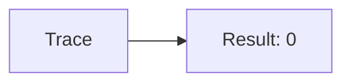
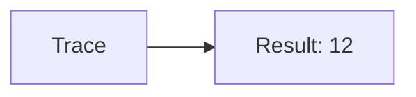
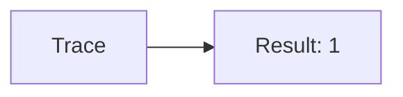
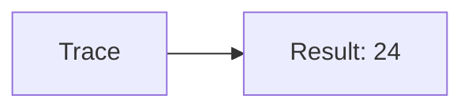

🔙 **[Kembali ke Daftar Soal](./README.md)**

---

# Latihan Soal Part C - Modul 06 - Set 07

### Soal 151
```cpp
// Ohm: Shift Left
int val = 3;
int res = val << 1;
```
**Pertanyaan:**
1. Berapakah hasil akhirnya?
2. Deskripsikan alur pikir 'Compiler Manusia' untuk soal ini!

**Jawaban & Diagnosis:**
1. **6**
2. 3 digeser kiri 1x = dikali 2 = 6.

**Mermaid Flowchart:**


---
### Soal 152
```cpp
// Hz: AND Mask
int val = 8;
int res = val & 1;
```
**Pertanyaan:**
1. Berapakah hasil akhirnya?
2. Deskripsikan alur pikir 'Compiler Manusia' untuk soal ini!

**Jawaban & Diagnosis:**
1. **0**
2. Mengecek bit terakhir dari 8 (0b1000). Hasil: 0.

**Mermaid Flowchart:**


---
### Soal 153
```cpp
// Khz: XOR Toggle
int val = 6;
int res = val ^ val;
```
**Pertanyaan:**
1. Berapakah hasil akhirnya?
2. Deskripsikan alur pikir 'Compiler Manusia' untuk soal ini!

**Jawaban & Diagnosis:**
1. **0**
2. XOR dengan diri sendiri selalu 0.

**Mermaid Flowchart:**


---
### Soal 154
```cpp
// Mhz: Shift Left
int val = 4;
int res = val << 1;
```
**Pertanyaan:**
1. Berapakah hasil akhirnya?
2. Deskripsikan alur pikir 'Compiler Manusia' untuk soal ini!

**Jawaban & Diagnosis:**
1. **8**
2. 4 digeser kiri 1x = dikali 2 = 8.

**Mermaid Flowchart:**


---
### Soal 155
```cpp
// Ghz: AND Mask
int val = 10;
int res = val & 1;
```
**Pertanyaan:**
1. Berapakah hasil akhirnya?
2. Deskripsikan alur pikir 'Compiler Manusia' untuk soal ini!

**Jawaban & Diagnosis:**
1. **0**
2. Mengecek bit terakhir dari 10 (0b1010). Hasil: 0.

**Mermaid Flowchart:**


---
### Soal 156
```cpp
// Thz: XOR Toggle
int val = 15;
int res = val ^ val;
```
**Pertanyaan:**
1. Berapakah hasil akhirnya?
2. Deskripsikan alur pikir 'Compiler Manusia' untuk soal ini!

**Jawaban & Diagnosis:**
1. **0**
2. XOR dengan diri sendiri selalu 0.

**Mermaid Flowchart:**


---
### Soal 157
```cpp
// Byte: Shift Left
int val = 6;
int res = val << 1;
```
**Pertanyaan:**
1. Berapakah hasil akhirnya?
2. Deskripsikan alur pikir 'Compiler Manusia' untuk soal ini!

**Jawaban & Diagnosis:**
1. **12**
2. 6 digeser kiri 1x = dikali 2 = 12.

**Mermaid Flowchart:**


---
### Soal 158
```cpp
// Kb: AND Mask
int val = 11;
int res = val & 1;
```
**Pertanyaan:**
1. Berapakah hasil akhirnya?
2. Deskripsikan alur pikir 'Compiler Manusia' untuk soal ini!

**Jawaban & Diagnosis:**
1. **1**
2. Mengecek bit terakhir dari 11 (0b1011). Hasil: 1.

**Mermaid Flowchart:**


---
### Soal 159
```cpp
// Mb: XOR Toggle
int val = 5;
int res = val ^ val;
```
**Pertanyaan:**
1. Berapakah hasil akhirnya?
2. Deskripsikan alur pikir 'Compiler Manusia' untuk soal ini!

**Jawaban & Diagnosis:**
1. **0**
2. XOR dengan diri sendiri selalu 0.

**Mermaid Flowchart:**


---
### Soal 160
```cpp
// Gb: Shift Left
int val = 9;
int res = val << 1;
```
**Pertanyaan:**
1. Berapakah hasil akhirnya?
2. Deskripsikan alur pikir 'Compiler Manusia' untuk soal ini!

**Jawaban & Diagnosis:**
1. **18**
2. 9 digeser kiri 1x = dikali 2 = 18.

**Mermaid Flowchart:**


---
### Soal 161
```cpp
// Tb: AND Mask
int val = 6;
int res = val & 1;
```
**Pertanyaan:**
1. Berapakah hasil akhirnya?
2. Deskripsikan alur pikir 'Compiler Manusia' untuk soal ini!

**Jawaban & Diagnosis:**
1. **0**
2. Mengecek bit terakhir dari 6 (0b110). Hasil: 0.

**Mermaid Flowchart:**


---
### Soal 162
```cpp
// Pb: XOR Toggle
int val = 4;
int res = val ^ val;
```
**Pertanyaan:**
1. Berapakah hasil akhirnya?
2. Deskripsikan alur pikir 'Compiler Manusia' untuk soal ini!

**Jawaban & Diagnosis:**
1. **0**
2. XOR dengan diri sendiri selalu 0.

**Mermaid Flowchart:**


---
### Soal 163
```cpp
// Eb: Shift Left
int val = 4;
int res = val << 1;
```
**Pertanyaan:**
1. Berapakah hasil akhirnya?
2. Deskripsikan alur pikir 'Compiler Manusia' untuk soal ini!

**Jawaban & Diagnosis:**
1. **8**
2. 4 digeser kiri 1x = dikali 2 = 8.

**Mermaid Flowchart:**


---
### Soal 164
```cpp
// Zb: AND Mask
int val = 2;
int res = val & 1;
```
**Pertanyaan:**
1. Berapakah hasil akhirnya?
2. Deskripsikan alur pikir 'Compiler Manusia' untuk soal ini!

**Jawaban & Diagnosis:**
1. **0**
2. Mengecek bit terakhir dari 2 (0b10). Hasil: 0.

**Mermaid Flowchart:**


---
### Soal 165
```cpp
// Yb: XOR Toggle
int val = 3;
int res = val ^ val;
```
**Pertanyaan:**
1. Berapakah hasil akhirnya?
2. Deskripsikan alur pikir 'Compiler Manusia' untuk soal ini!

**Jawaban & Diagnosis:**
1. **0**
2. XOR dengan diri sendiri selalu 0.

**Mermaid Flowchart:**


---
### Soal 166
```cpp
// Bit: Shift Left
int val = 12;
int res = val << 1;
```
**Pertanyaan:**
1. Berapakah hasil akhirnya?
2. Deskripsikan alur pikir 'Compiler Manusia' untuk soal ini!

**Jawaban & Diagnosis:**
1. **24**
2. 12 digeser kiri 1x = dikali 2 = 24.

**Mermaid Flowchart:**


---
### Soal 167
```cpp
// Nibble: AND Mask
int val = 10;
int res = val & 1;
```
**Pertanyaan:**
1. Berapakah hasil akhirnya?
2. Deskripsikan alur pikir 'Compiler Manusia' untuk soal ini!

**Jawaban & Diagnosis:**
1. **0**
2. Mengecek bit terakhir dari 10 (0b1010). Hasil: 0.

**Mermaid Flowchart:**


---
### Soal 168
```cpp
// Word: XOR Toggle
int val = 5;
int res = val ^ val;
```
**Pertanyaan:**
1. Berapakah hasil akhirnya?
2. Deskripsikan alur pikir 'Compiler Manusia' untuk soal ini!

**Jawaban & Diagnosis:**
1. **0**
2. XOR dengan diri sendiri selalu 0.

**Mermaid Flowchart:**


---
### Soal 169
```cpp
// Dword: Shift Left
int val = 10;
int res = val << 1;
```
**Pertanyaan:**
1. Berapakah hasil akhirnya?
2. Deskripsikan alur pikir 'Compiler Manusia' untuk soal ini!

**Jawaban & Diagnosis:**
1. **20**
2. 10 digeser kiri 1x = dikali 2 = 20.

**Mermaid Flowchart:**


---
### Soal 170
```cpp
// Qword: AND Mask
int val = 7;
int res = val & 1;
```
**Pertanyaan:**
1. Berapakah hasil akhirnya?
2. Deskripsikan alur pikir 'Compiler Manusia' untuk soal ini!

**Jawaban & Diagnosis:**
1. **1**
2. Mengecek bit terakhir dari 7 (0b111). Hasil: 1.

**Mermaid Flowchart:**


---
### Soal 171
```cpp
// Ptr: XOR Toggle
int val = 9;
int res = val ^ val;
```
**Pertanyaan:**
1. Berapakah hasil akhirnya?
2. Deskripsikan alur pikir 'Compiler Manusia' untuk soal ini!

**Jawaban & Diagnosis:**
1. **0**
2. XOR dengan diri sendiri selalu 0.

**Mermaid Flowchart:**
```mermaid
graph LR
A[Trace] --> B[Result: 0]
```

---
### Soal 172
```cpp
// Ref: Shift Left
int val = 9;
int res = val << 1;
```
**Pertanyaan:**
1. Berapakah hasil akhirnya?
2. Deskripsikan alur pikir 'Compiler Manusia' untuk soal ini!

**Jawaban & Diagnosis:**
1. **18**
2. 9 digeser kiri 1x = dikali 2 = 18.

**Mermaid Flowchart:**
```mermaid
graph LR
A[Trace] --> B[Result: 18]
```

---
### Soal 173
```cpp
// Addr: AND Mask
int val = 10;
int res = val & 1;
```
**Pertanyaan:**
1. Berapakah hasil akhirnya?
2. Deskripsikan alur pikir 'Compiler Manusia' untuk soal ini!

**Jawaban & Diagnosis:**
1. **0**
2. Mengecek bit terakhir dari 10 (0b1010). Hasil: 0.

**Mermaid Flowchart:**
```mermaid
graph LR
A[Trace] --> B[Result: 0]
```

---
### Soal 174
```cpp
// Mem: XOR Toggle
int val = 4;
int res = val ^ val;
```
**Pertanyaan:**
1. Berapakah hasil akhirnya?
2. Deskripsikan alur pikir 'Compiler Manusia' untuk soal ini!

**Jawaban & Diagnosis:**
1. **0**
2. XOR dengan diri sendiri selalu 0.

**Mermaid Flowchart:**
```mermaid
graph LR
A[Trace] --> B[Result: 0]
```

---
### Soal 175
```cpp
// Ram: Shift Left
int val = 10;
int res = val << 1;
```
**Pertanyaan:**
1. Berapakah hasil akhirnya?
2. Deskripsikan alur pikir 'Compiler Manusia' untuk soal ini!

**Jawaban & Diagnosis:**
1. **20**
2. 10 digeser kiri 1x = dikali 2 = 20.

**Mermaid Flowchart:**
```mermaid
graph LR
A[Trace] --> B[Result: 20]
```

---
