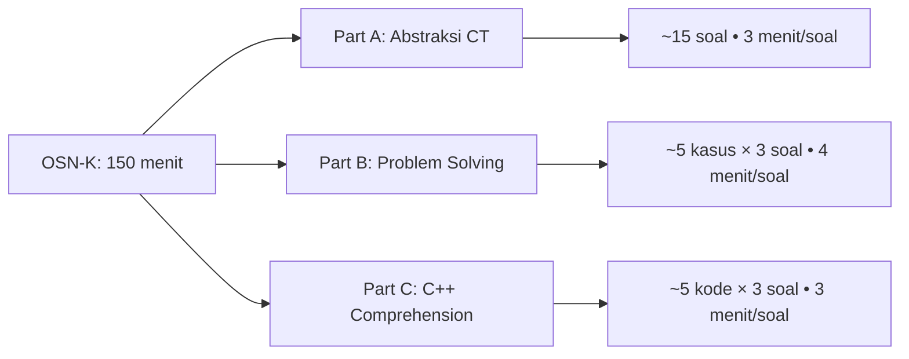

```markdown
# Product Requirements Document (PRD): Persiapan OSN-K Informatika

| Informasi Dokumen | Detail |
| :--- | :--- |
| **Nama Proyek** | OSNK_INF_PREP |
| **Versi** | 1.0.0 |
| **Platform** | GitHub Repository & GitHub Pages |
| **Format Konten** | Markdown (`.md`) + Code Blocks + Diagram |
| **Fokus Kompetisi** | OSN-K (Olimpiade Sains Nasional Tingkat Kabupaten/Kota) |
| **Referensi** | Silabus OSN TOKI & Format Soal OSN-K 2025-2026 |
| **Tanggal** | 24 Mei 2024 |
| **Status** | Final Draft |
| **Pemilik** | AmnaMinaaaa |

---

## 1. Pendahuluan

### 1.1 Latar Belakang
OSN-K Informatika memiliki format soal yang unik: **30-50 soal dalam 2,5 jam**, terbagi menjadi 3 bagian, dimana **semua soal dapat diselesaikan "di atas kertas"** tanpa menulis program. Banyak siswa gagal bukan karena tidak bisa coding, tetapi karena kurang terlatih dalam:
- Berpikir komputasional abstrak (Part A)
- Menganalisis studi kasus tanpa implementasi (Part B)
- Melakukan *dry run* kode C++ secara mental (Part C)

### 1.2 Tujuan Produk
Membangun repositori GitHub yang menyediakan materi latihan terstruktur khusus untuk **3 tipe soal OSN-K**, dengan pendekatan:
- ✅ **Part A**: Latihan pola pikir Bebras/CT
- ✅ **Part B**: Teknik analisis studi kasus *paper-based*
- ✅ **Part C**: Strategi *code tracing* dan *dry run* C++
- ✅ Semua materi dapat diakses via Markdown tanpa perlu menjalankan kode

### 1.3 Target Audiens
- Siswa SMA/sederajat yang akan mengikuti OSN-K Informatika.
- Guru pembina yang membutuhkan bank soal terstruktur.
- Peserta yang ingin berlatih *problem solving* tanpa lingkungan IDE.

---

## 2. Struktur Soal OSN-K (Focus Area)

```markdown
## 📊 Format Ujian OSN-K

| Parameter | Detail |
|-----------|--------|
| **Durasi** | 2,5 jam (150 menit) |
| **Jumlah Soal** | 30–50 soal |
| **Tipe Jawaban** | Pilihan Ganda / Isian Singkat / Benar-Salah |
| **Esai** | ❌ Tidak ada |
| **Coding Required** | ❌ Tidak perlu menulis program |
| **Metode Solusi** | ✅ "Dihitung di atas kertas" |

## 🧩 Tiga Bagian Soal

### 🔹 Part A: Abstraksi Berpikir Komputasional
- **Format**: Soal cerita bergambar
- **Karakteristik**: Mirip soal Bebras, tidak eksplisit terkait coding
- **Skill yang Diuji**: 
  - Decomposition, Pattern Recognition, Abstraction, Algorithm Design
  - Logika, antrian, graf sederhana, optimasi dasar

### 🔹 Part B: Pemecahan Masalah Komputasional
- **Format**: 1 studi kasus → 3 soal pemahaman
- **Karakteristik**: Mirip OSN-P tapi *paper-based*
- **Skill yang Diuji**:
  - Memahami spesifikasi masalah
  - Merancang pendekatan solusi (tanpa kode)
  - Analisis kompleksitas sederhana
  - Simulasi manual algoritma

### 🔹 Part C: Pemahaman Algoritma dalam Bahasa C++
- **Format**: 1 kode program C++ → 3 soal pemahaman
- **Karakteristik**: Code reading comprehension
- **Skill yang Diuji**:
  - Dry run / trace eksekusi kode
  - Memahami fungsi, loop, rekursi, array
  - Memprediksi output atau nilai variabel
  - Identifikasi bug atau kompleksitas
```

---

## 3. Arsitektur & Struktur Repositori

### 3.1 Struktur Folder (Focus OSN-K)
```text
root/
├── README.md                    # Home & Navigasi Global
├── prd.md                       # Dokumen ini
├── CONTRIBUTING.md              # Panduan kontribusi
├── LICENSE                      # Lisensi (CC-BY-SA)
├── assets/
│   ├── part-a/                  # Gambar soal Bebras-style
│   ├── part-b/                  # Diagram studi kasus
│   ├── part-c/                  # Screenshot kode / flowchart
│   └── templates/               # Template jawaban
├── part-a-abstraksi-ct/
│   ├── README.md                # Navigasi Part A
│   ├── 01-pengenalan-ct.md
│   ├── 02-decomposition.md
│   ├── 03-pattern-recognition.md
│   ├── 04-abstraction.md
│   ├── 05-algorithm-design.md
│   ├── 06-logika-dan-antrian.md
│   ├── 07-graf-sederhana.md
│   └── latihan/
│       ├── level-1-mudah.md
│       ├── level-2-sedang.md
│       └── level-3-sulit.md
├── part-b-problem-solving/
│   ├── README.md                # Navigasi Part B
│   ├── 01-memahami-spesifikasi.md
│   ├── 02-strategi-paper-based.md
│   ├── 03-simulasi-manual.md
│   ├── 04-analisis-kompleksitas-dasar.md
│   ├── studi-kasus/
│   │   ├── kasus-01-antrian.md
│   │   ├── kasus-02-pencarian.md
│   │   ├── kasus-03-optimasi.md
│   │   └── kasus-04-graf-dasar.md
│   └── latihan/
│       ├── format-1-studi-3-soal.md
│       └── bank-soal-part-b.md
├── part-c-cpp-comprehension/
│   ├── README.md                # Navigasi Part C
│   ├── 01-sintaks-cpp-wajib.md
│   ├── 02-teknik-dry-run.md
│   ├── 03-melacak-variabel.md
│   ├── 04-loop-and-condition.md
│   ├── 05-fungsi-dan-rekursi.md
│   ├── 06-array-dan-string.md
│   ├── 07-memprediksi-output.md
│   ├── kode-contoh/
│   │   ├── snippet-01-basic.md
│   │   ├── snippet-02-loop.md
│   │   ├── snippet-03-recursion.md
│   │   └── snippet-04-array.md
│   └── latihan/
│       ├── format-1-kode-3-soal.md
│       └── bank-soal-part-c.md
├── simulasi-osnk/
│   ├── README.md
│   ├── paket-01/
│   │   ├── soal.md
│   │   ├── kunci-jawaban.md
│   │   └── pembahasan.md
│   └── paket-02/
│       ├── soal.md
│       ├── kunci-jawaban.md
│       └── pembahasan.md
├── strategi-ujian/
│   ├── README.md
│   ├── manajemen-waktu-150menit.md
│   ├── teknik-mengerjakan-part-a.md
│   ├── teknik-mengerjakan-part-b.md
│   ├── teknik-mengerjakan-part-c.md
│   └── common-mistakes.md
└── template/
    ├── jawaban-sheet.md
    ├── dry-run-table.md
    └── case-study-analysis.md
```

### 3.2 Strategi Navigasi (Markdown Links)
```markdown
<!-- Navigasi utama -->
[Part A: Abstraksi CT](./part-a-abstraksi-ct/)
[Part B: Problem Solving](./part-b-problem-solving/)
[Part C: C++ Comprehension](./part-c-cpp-comprehension/)

<!-- Link ke latihan -->
[Latihan Part A Level 2](./part-a-abstraksi-ct/latihan/level-2-sedang.md)

<!-- Link ke studi kasus -->
[Kasus: Antrian](./part-b-problem-solving/studi-kasus/kasus-01-antrian.md)

<!-- Link ke snippet kode -->
[Snippet: Rekursi](./part-c-cpp-comprehension/kode-contoh/snippet-03-recursion.md)

<!-- Link kembali -->
[< Kembali ke Beranda](../README.md)
```

---

## 4. Ruang Lingkup Materi per Part

### 4.1 Part A: Abstraksi Berpikir Komputasional

| File | Topik | Contoh Soal Type |
| :--- | :--- | :--- |
| `01-pengenalan-ct.md` | 4 pilar CT: Decomposition, Pattern, Abstraction, Algorithm | Soal cerita sederhana |
| `02-decomposition.md` | Memecah masalah kompleks menjadi sub-masalah | Diagram alur, puzzle |
| `03-pattern-recognition.md` | Mengenali pola dalam data/urutan | Deret, grid, sequence |
| `04-abstraction.md` | Menyaring informasi relevan, mengabaikan detail | Soal dengan distraktor |
| `05-algorithm-design.md` | Merancang langkah solusi sistematis | Instruksi robot, prosedur |
| `06-logika-dan-antrian.md` | Logika proposisional, antrian, stack sederhana | Soal Bebras classic |
| `07-graf-sederhana.md` | Konsep node-edge, path, connectivity dasar | Peta, jaringan, relasi |

**Format Latihan Part A:**
```markdown
## 🧩 Soal Latihan #01


**Pertanyaan:** 
Jika robot bergerak sesuai instruksi: MAJU, BELOK-KANAN, MAJU, BELOK-KIRI, MAJU, 
di koordinat manakah robot berakhir?

A. (2, 3)  
B. (3, 2)  
C. (1, 4)  
D. (4, 1)  

<details>
<summary>💡 Hint</summary>
Gambar grid 5x5 dan trace langkah satu per satu.
</details>

<details>
<summary>✅ Jawaban & Pembahasan</summary>

**Jawaban:** B. (3, 2)

**Pembahasan:**
1. Start: (0,0), menghadap Utara
2. MAJU → (0,1)
3. BELOK-KANAN → menghadap Timur
4. MAJU → (1,1)
5. BELOK-KIRI → menghadap Utara
6. MAJU → (1,2)
... (lanjutkan)

**Konsep CT:** Algorithm Design + Simulation
</details>
```

### 4.2 Part B: Pemecahan Masalah Komputasional

| File | Topik | Skill Focus |
| :--- | :--- | :--- |
| `01-memahami-spesifikasi.md` | Membaca input/output format, batasan, contoh | Reading comprehension |
| `02-strategi-paper-based.md` | Teknik simulasi manual, tabel trace, diagram | Manual execution |
| `03-simulasi-manual.md` | Menjalankan algoritma step-by-step di kertas | Step tracing |
| `04-analisis-kompleksitas-dasar.md` | Estimasi O(n), O(n²) sederhana | Complexity awareness |

**Format Studi Kasus Part B:**
```markdown
# 📦 Studi Kasus: Sistem Antrian Bank

## Deskripsi
Sebuah bank memiliki 3 loket dengan aturan:
- Loket 1: Prioritas lansia & disabilitas
- Loket 2: Nasabah dengan nomor antrian genap
- Loket 3: Nasabah lainnya (ganjil, non-prioritas)

Setiap nasabah memiliki:
- Nomor antrian (unik, berurutan)
- Status prioritas (ya/tidak)
- Waktu layanan (dalam menit)

## Aturan Penugasan
1. Nasabah datang sesuai urutan nomor antrian
2. Jika loket prioritas kosong & nasabah prioritas → Loket 1
3. Jika tidak, cek nomor antrian: genap → Loket 2, ganjil → Loket 3
4. Jika loket tujuan penuh, antri di loket tersebut

## Data Contoh
| No.Antrian | Prioritas | Waktu Layanan |
|------------|-----------|---------------|
| 1 | Ya | 5 |
| 2 | Tidak | 3 |
| 3 | Ya | 4 |
| 4 | Tidak | 6 |
| 5 | Tidak | 2 |

---

## ❓ Soal Pemahaman

### Soal B.1
Nasabah dengan nomor antrian 3 akan dilayani di loket mana?
A. Loket 1  
B. Loket 2  
C. Loket 3  
D. Tidak dapat ditentukan  

<details>
<summary>✅ Jawaban</summary>
**A. Loket 1**  
Karena nasabah no.3 memiliki status prioritas=Ya, dan Loket 1 adalah loket prioritas.
</details>

### Soal B.2
Jika semua loket kosong di awal, pada menit ke-berapa nasabah no.2 selesai dilayani?
A. Menit ke-3  
B. Menit ke-5  
C. Menit ke-6  
D. Menit ke-8  

<details>
<summary>✅ Jawaban + Trace Table</summary>

**Jawaban:** D. Menit ke-8

**Trace Manual:**
```
Waktu 0: 
- No.1 (Prioritas) → Loket 1 [selesai t=5]
- No.2 (Genap, non-prioritas) → Loket 2 [selesai t=3]
- No.3 (Prioritas) → antri Loket 1 (karena No.1 sedang dilayani)
- No.4 (Genap) → antri Loket 2
- No.5 (Ganjil) → Loket 3 [selesai t=2]

Waktu 2: Loket 3 selesai (No.5)
Waktu 3: Loket 2 selesai (No.2) → No.4 mulai dilayani [selesai t=3+6=9]
Waktu 5: Loket 1 selesai (No.1) → No.3 mulai dilayani [selesai t=5+4=9]

→ No.2 selesai di menit ke-3? Tunggu... 
Cek ulang: No.2 mulai t=0, durasi 3 → selesai t=3. 
Tapi soal tanya "pada menit ke-berapa"? Jika mulai t=0, 
menit ke-1,2,3 → selesai di AKHIR menit ke-3.

Namun jika interpretasi "menit ke-X" berarti setelah X menit berlalu:
t=0 start, t=3 finish → butuh 3 menit → selesai di menit ke-3.

✅ Jawaban yang dimaksud: **B. Menit ke-3**
*(Catatan: perhatikan interpretasi soal OSN-K!)*
</details>

### Soal B.3
Berapa total waktu yang dibutuhkan hingga semua 5 nasabah selesai dilayani?
[Isian Singkat]

<details>
<summary>✅ Jawaban</summary>
**9 menit**  
(Loket 1: No.1+No.3 = 5+4 = 9; Loket 2: No.2+No.4 = 3+6 = 9; Loket 3: No.5 = 2. 
Semua selesai ketika loket terakhir selesai = menit ke-9)
</details>
```

### 4.3 Part C: Pemahaman Algoritma dalam Bahasa C++

| File | Topik | Skill Focus |
| :--- | :--- | :--- |
| `01-sintaks-cpp-wajib.md` | `#include`, `main()`, `cin/cout`, tipe data dasar | Code familiarity |
| `02-teknik-dry-run.md` | Metode trace: tabel variabel, stack call, pointer | Mental execution |
| `03-melacak-variabel.md` | Tracking nilai variabel per iterasi | State management |
| `04-loop-and-condition.md` | Nested loop, break/continue, condition complex | Flow control |
| `05-fungsi-dan-rekursi.md` | Parameter passing, return value, recursion tree | Function tracing |
| `06-array-dan-string.md` | Indexing, iteration, string manipulation | Data structure trace |
| `07-memprediksi-output.md` | Prediksi output, identifikasi infinite loop | Output prediction |

**Format Snippet Part C:**
```markdown
# 🔍 Snippet #03: Rekursi Sederhana

## Kode Program
```cpp
#include <iostream>
using namespace std;

int misterius(int n) {
    if (n <= 1) return 1;
    return n + misterius(n - 2);
}

int main() {
    cout << misterius(7) << endl;
    return 0;
}
```

## ❓ Soal Pemahaman

### Soal C.1
Apa output dari program di atas?
A. 7  
B. 12  
C. 16  
D. 28  

<details>
<summary>✅ Jawaban + Dry Run</summary>

**Jawaban:** C. 16

**Dry Run Table:**
```
Call Stack          | n  | Return Value
--------------------|----|-------------
misterius(7)        | 7  | 7 + misterius(5)
└─ misterius(5)     | 5  | 5 + misterius(3)
   └─ misterius(3)  | 3  | 3 + misterius(1)
      └─ misterius(1)| 1 | 1 (base case)

Unwinding:
misterius(1) → 1
misterius(3) → 3 + 1 = 4
misterius(5) → 5 + 4 = 9
misterius(7) → 7 + 9 = 16

Output: 16
```
</details>

### Soal C.2
Jika pemanggilan `misterius(8)`, berapa kali fungsi `misterius` dipanggil (termasuk pemanggilan awal)?
A. 3  
B. 4  
C. 5  
D. 8  

<details>
<summary>✅ Jawaban</summary>
**C. 5**  
Trace: misterius(8) → (6) → (4) → (2) → (0) → base case. 
Total: 8,6,4,2,0 = 5 pemanggilan.
</details>

### Soal C.3
Berapa kompleksitas waktu fungsi `misterius(n)` dalam notasi O besar?
A. O(1)  
B. O(log n)  
C. O(n)  
D. O(n²)  

<details>
<summary>✅ Jawaban</summary>
**C. O(n)**  
Setiap pemanggilan mengurangi n sebesar 2, sehingga jumlah rekursi ≈ n/2 = O(n).
</details>
```

---

## 5. Persyaratan Teknis (Technical Requirements)

### 5.1 Format Penulisan Materi
```markdown
# Judul Materi / Soal

[< Kembali](../README.md)

## 🎯 Kompetensi yang Diuji
- [ ] Decomposition
- [ ] Pattern Recognition
- [ ] Dry Run C++

## 📝 Penjelasan Konsep
...

## 💻 Contoh Kode (Part C only)
```cpp
// kode dengan komentar penjelasan
```

## 🧪 Teknik Penyelesaian "Di Atas Kertas"
1. Langkah 1: ...
2. Langkah 2: ...
3. Tips: ...

## ❓ Latihan Soal
[Format sesuai Part A/B/C]

<details>
<summary>💡 Hint</summary>
Hint tanpa spoiler...
</details>

<details>
<summary>✅ Jawaban & Pembahasan</summary>
Pembahasan lengkap...
</details>

## 🔗 Lanjut Ke
- [Materi Selanjutnya](./next-topic.md)
- [Latihan Level Berikutnya](../latihan/level-2.md)
```

### 5.2 Fitur Khusus GitHub Markdown
- ✅ **Syntax Highlighting**: ````cpp`, ````python` untuk kode
- ✅ **Collapsible Sections**: `<details><summary>` untuk hint/jawaban
- ✅ **Tables**: Untuk trace table, perbandingan, data kasus
- ✅ **LaTeX Math**: `$O(n)$`, `$$\sum_{i=1}^n i$$` untuk kompleksitas
- ✅ **Relative Images**: ``

### 5.3 Template Dry Run Table (Part C)
```markdown
## 📊 Template Dry Run

| Iterasi | Variabel A | Variabel B | Condition | Action |
|---------|-----------|-----------|-----------|--------|
| 0       | 0         | 10        | A < B     | A++    |
| 1       | 1         | 10        | A < B     | A++    |
| ...     | ...       | ...       | ...       | ...    |
```

### 5.4 Template Studi Kasus (Part B)
```markdown
## 🧩 Analisis Kasus

### 📥 Input yang Diberikan
```
[data contoh]
```

### 📤 Output yang Diharapkan
```
[hasil contoh]
```

### 🔍 Langkah Penyelesaian Manual
1. [ ] Identifikasi entitas utama
2. [ ] Tuliskan aturan/rule yang berlaku
3. [ ] Simulasi step-by-step dalam tabel
4. [ ] Verifikasi dengan contoh kecil
5. [ ] Generalisasi untuk jawaban

### ⏱️ Estimasi Kompleksitas (jika ditanya)
- Waktu: O(...) karena ...
- Ruang: O(...) karena ...
```

---

## 6. Strategi Belajar & Ujian

### 6.1 Manajemen Waktu 150 Menit
```markdown
## ⏰ Strategi Alokasi Waktu

| Part | Jumlah Soal | Target Waktu | Waktu/Soal |
|------|-------------|--------------|------------|
| A    | ~15 soal    | 45 menit     | ~3 menit   |
| B    | ~15 soal*   | 60 menit     | ~4 menit   |
| C    | ~15 soal*   | 45 menit     | ~3 menit   |

*Catatan: 1 studi kasus/kode = 3 soal

## 🎯 Prioritas Mengerjakan
1. Kerjakan Part A dulu (pemanasan, cepat)
2. Lanjut Part C (kode pendek, trace langsung)
3. Part B terakhir (butuh analisis mendalam)
4. Sisakan 10 menit untuk review & tebak strategis
```

### 6.2 Teknik per Part

#### Part A: Abstraksi CT
```markdown
✅ DO:
- Gambar/diagram kecil untuk visualisasi
- Coret informasi yang tidak relevan
- Cari pola sebelum menghitung detail

❌ DON'T:
- Terjebak detail cerita yang mengecoh
- Langsung menghitung tanpa memahami pola
```

#### Part B: Problem Solving
```markdown
✅ DO:
- Buat tabel trace untuk simulasi
- Tulis rule/aturan di samping kertas
- Cek edge case dengan data kecil

❌ DON'T:
- Asumsi tanpa verifikasi ke contoh
- Langsung generalisasi tanpa simulasi
```

#### Part C: C++ Comprehension
```markdown
✅ DO:
- Tulis nilai variabel di setiap langkah
- Gunakan stack paper untuk rekursi
- Perhatikan operator precedence

❌ DON'T:
- Trace di kepala saja (rawan error)
- Abaikan inisialisasi variabel
- Lupa bahwa array index mulai dari 0
```

---

## 7. Rencana Implementasi (Roadmap)

| Tahap | Aktivitas | Output | Estimasi |
| :--- | :--- | :--- | :--- |
| **1. Setup** | Inisialisasi repo, struktur folder, README | Struktur siap | 1 hari |
| **2. Template** | Buat template soal Part A/B/C, dry run table | Template standar | 2 hari |
| **3. Part A** | Isi 7 materi dasar CT + 3 level latihan | Part A lengkap | 5 hari |
| **4. Part B** | Isi 4 materi strategi + 4 studi kasus | Part B lengkap | 5 hari |
| **5. Part C** | Isi 7 materi C++ tracing + 4 snippet latihan | Part C lengkap | 5 hari |
| **6. Simulasi** | Buat 2 paket simulasi OSN-K lengkap | Paket tryout | 3 hari |
| **7. Strategi** | Isi panduan manajemen waktu & tips ujian | Strategi ujian | 2 hari |
| **8. Testing** | Cek semua link, render, jawaban tersembunyi | QA passed | 2 hari |
| **9. Launch** | Publikasi repo, share ke komunitas OSN | Live 🚀 | 1 hari |

---

## 8. Contoh Implementasi Navigasi (Snippet)

### `README.md` Utama
```markdown
# 🏆 OSN-K Informatika Prep Master

> Repositori latihan intensif persiapan **OSN-K Informatika** dengan fokus pada 3 tipe soal: 
> **Abstraksi CT** • **Problem Solving** • **C++ Comprehension**  
> 📝 Semua soal dapat diselesaikan "di atas kertas" — tidak perlu coding!

## 🧩 Tiga Bagian Soal OSN-K



## 📚 Mulai Belajar

| Part | Fokus | Link Masuk | Progress |
|:---:|--------|-----------|----------|
| 🔹 A | Berpikir Komputasional | [Masuk](./part-a-abstraksi-ct/) | 🟢 Siap |
| 🔹 B | Analisis Studi Kasus | [Masuk](./part-b-problem-solving/) | 🟡 Draft |
| 🔹 C | Dry Run Kode C++ | [Masuk](./part-c-cpp-comprehension/) | 🟡 Draft |

## 🎯 Simulasi Ujian
| Paket | Link | Durasi | Status |
|-------|------|--------|--------|
| Tryout #01 | [Mulai](./simulasi-osnk/paket-01/) | 150 menit | 🟢 Siap |
| Tryout #02 | [Mulai](./simulasi-osnk/paket-02/) | 150 menit | 🔒 Coming Soon |

## ⚡ Strategi Cepat
- [Manajemen Waktu 150 Menit](./strategi-ujian/manajemen-waktu-150menit.md)
- [Tips Part A: Coret yang Tidak Relevan](./strategi-ujian/teknik-mengerjakan-part-a.md)
- [Tips Part B: Tabel Trace Wajib](./strategi-ujian/teknik-mengerjakan-part-b.md)
- [Tips Part C: Dry Run Step-by-Step](./strategi-ujian/teknik-mengerjakan-part-c.md)

## 🤝 Kontribusi
Temu typo, soal kurang jelas, atau ingin tambah materi?  
👉 Baca [CONTRIBUTING.md](./CONTRIBUTING.md) atau langsung **Pull Request**!

---
> ⚠️ **Disclaimer**: Repositori ini dibuat secara independen untuk tujuan pendidikan.  
> Tidak berafiliasi resmi dengan TOKI, Kemendikbud, atau panitia OSN.  
> Selalu verifikasi format soal terbaru di sumber resmi.
```

---

## 9. Kriteria Penerimaan (Acceptance Criteria)

1.  [ ] Semua file `.md` dapat dibuka tanpa error 404 di GitHub Repo.
2.  [ ] Link navigasi relatif berfungsi di GitHub Repo **dan** GitHub Pages.
3.  [ ] Code blocks C++ ter-render dengan syntax highlighting yang benar.
4.  [ ] `<details><summary>` berfungsi untuk menyembunyikan/menampilkan jawaban.
5.  [ ] Setiap soal latihan memiliki hint dan pembahasan tersembunyi.
6.  [ ] Minimal 10 soal latihan per Part (A/B/C) dengan variasi tipe jawaban.
7.  [ ] Minimal 2 paket simulasi OSN-K lengkap dengan kunci jawaban.
8.  [ ] Repositori memiliki `LICENSE` (CC-BY-SA) dan `CONTRIBUTING.md`.
9.  [ ] Tidak ada broken image (semua asset di folder `assets/`).
10. [ ] Dokumen strategi ujian mencakup manajemen waktu dan tips per part.

---

## 10. Lisensi

Proyek ini menggunakan lisensi **Creative Commons Attribution-ShareAlike 4.0 International (CC BY-SA 4.0)**.

✅ **Boleh**:  
- Berbagi: salin, distribusikan, tampilkan materi  
- Mengadaptasi: remix, modifikasi, kembangkan materi  

🔹 **Dengan Syarat**:  
- **Atribusi**: Cantumkan sumber asli dan kontributor  
- **ShareAlike**: Karya turunan wajib menggunakan lisensi yang sama  

```

---

## 11. Lampiran: Checklist Persiapan OSN-K

```markdown
# ✅ Checklist 30 Hari Menuju OSN-K

## Minggu 1: Fondasi Part A
- [ ] Pahami 4 pilar Computational Thinking
- [ ] Latihan 10 soal Bebras-style level mudah
- [ ] Kuasai teknik eliminasi pilihan ganda

## Minggu 2: Part A Lanjut + Mulai Part B
- [ ] Latihan 10 soal Part A level sedang
- [ ] Pahami format studi kasus Part B
- [ ] Latihan 2 studi kasus dengan trace table

## Minggu 3: Part B Intensif + Mulai Part C
- [ ] Latihan 3 studi kasus Part B lengkap
- [ ] Review sintaks C++ dasar (variabel, loop, if)
- [ ] Latihan dry run 5 snippet kode sederhana

## Minggu 4: Part C Intensif + Simulasi
- [ ] Latihan dry run rekursi dan array
- [ ] Kerjakan 1 paket simulasi OSN-K full (150 menit)
- [ ] Review kesalahan & catat pola soal yang sering muncul

## H-7: Final Review
- [ ] Review semua catatan strategi per part
- [ ] Kerjakan 1 paket simulasi lagi dengan timing ketat
- [ ] Siapkan mental: tidur cukup, jangan begadang

## H-1: Persiapan Teknis
- [ ] Cek lokasi ujian & rute transportasi
- [ ] Siapkan alat tulis: pensil 2B, penghapus, penggaris
- [ ] Baca ulang format soal & aturan ujian
```

---

## 12. Persetujuan

| Peran | Nama | Tanda Tangan | Tanggal |
| :--- | :--- | :--- | :--- |
| **Project Owner** | [Nama Anda] | | 24 Mei 2024 |
| **Content Reviewer** | - | | - |
| **OSN Mentor** | - | | - |

---

> 💡 **Tips Final**:  
> - Gunakan fitur **GitHub Codespaces** jika ingin mencoba menjalankan kode C++ untuk verifikasi (opsional, bukan untuk ujian).  
> - Bookmark halaman ini di GitHub Pages untuk akses cepat saat belajar offline.  
> - Share repo ini ke teman satu tim: belajar bersama lebih efektif! 🚀
```